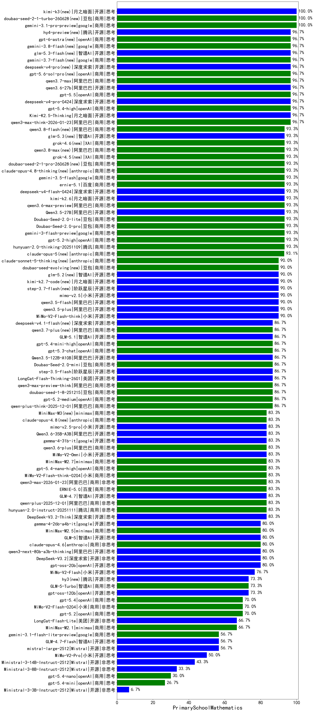

|类别|机构|大模型|【PrimarySchoolMathematics】准确率|平均耗时|平均消耗token|花费/千次（元）|排名（准确率）|
|---|---|-----|-------------------|-------|-----------|-----------|-----------|
|商用|豆包|doubao-seed-2-1-turbo-260628|100.0%|372s|19026|284.1|1|
|商用|google|gemini-3.1-pro-preview|100.0%|75s|5394|454.5|2|
|开源|月之暗面|kimi-k3(new)|100.0%|142s|3909|379.3|3|
|开源|阿里巴巴|qwen3.6-27b|96.7%|309s|22357|401.4|4|
|商用|openAI|gpt-5.5|96.7%|39s|1339|267.1|5|
|商用|openAI|gpt-5.6-sol-pro|96.7%|38s|6700|688.6|6|
|开源|深度求索|deepseek-v4-pro(new)|96.7%|228s|11186|299.4|7|
|商用|openAI|gpt-5.4-high|96.7%|37s|2061|209.3|8|
|商用|google|gemini-3.7-flash(new)|96.7%|26s|1838|46.8|9|
|商用|阿里巴巴|qwen3.7-max|96.7%|106s|6482|231.6|10|
|开源|智谱AI|glm-5.3-flash(new)|96.7%|173s|5233|14.5|11|
|商用|google|gemini-3.8-flash(new)|96.7%|20s|3076|158.5|12|
|开源|月之暗面|Kimi-K2.5-Thinking|96.7%|567s|7589|158.2|13|
|商用|阿里巴巴|qwen3-max-think-2026-01-23|96.7%|230s|8421|83.6|14|
|商用|openAI|gpt-6-astra(new)|96.7%|25s|606|189.5|15|
|开源|腾讯|hy4-preview(new)|96.7%|97s|6534|116.6|16|
|开源|深度求索|deepseek-v4-pro-0424|96.7%|180s|6004|143.3|17|
|商用|openAI|gpt-6-sol(new)|96.7%|264s|628|39.4|18|
|商用|anthropic|claude-opus-4.8-thinking|93.3%|33s|2408|407.0|19|
|商用|百度|ernie-5.1|93.3%|110s|5057|90.0|20|
|商用|google|gemini-3.5-flash|93.3%|21s|4704|292.6|21|
|开源|月之暗面|kimi-k2.6|93.3%|316s|9878|265.3|22|
|商用|阿里巴巴|qwen3.8-max(new)|93.3%|199s|8414|300.3|23|
|商用|豆包|doubao-seed-2-1-pro-260628|93.3%|415s|22092|660.1|24|
|商用|XAI|grok-4.5|93.3%|165s|7819|320.8|25|
|商用|阿里巴巴|qwen3.6-max-preview|93.3%|128s|4716|251.4|26|
|商用|XAI|grok-4.6(new)|93.3%|156s|5205|211.0|27|
|开源|智谱AI|glm-5.3(new)|93.3%|427s|5503|152.6|28|
|商用|阿里巴巴|qwen3.8-flash(new)|93.3%|156s|10324|27.6|29|
|商用|openAI|gpt-6-luna(new)|93.3%|361s|1243|4.1|30|
|开源|深度求索|deepseek-v4-flash-0424|93.3%|81s|5727|11.4|31|
|商用|XAI|grok-4.7(new)|93.3%|135s|11092|429.2|32|
|商用|豆包|Doubao-Seed-2.0-pro|93.3%|501s|2255|34.6|33|
|商用|豆包|Doubao-Seed-2.0-lite|93.3%|659s|2983|10.4|34|
|开源|阿里巴巴|Qwen3.5-27B|93.3%|666s|11840|56.5|35|
|商用|anthropic|claude-opus-5(new)|93.1%|44s|1183|193.1|36|
|开源|智谱AI|glm-5.2|90.0%|230s|8343|232.1|37|
|开源|月之暗面|kimi-k2.7-code|90.0%|143s|4823|128.9|38|
|开源|阶跃星辰|step-3.7-flash|90.0%|108s|11632|93.7|39|
|商用|豆包|doubao-seed-evolving|90.0%|378s|20975|626.6|40|
|商用|anthropic|claude-sonnet-5-thinking|90.0%|59s|5478|377.7|41|
|开源|阿里巴巴|qwen3.5-plus|90.0%|118s|10155|48.5|42|
|开源|阿里巴巴|qwen3.5-flash|90.0%|111s|12676|25.2|43|
|开源|小米|mimo-v2.5|90.0%|60s|6091|81.8|44|
|开源|阶跃星辰|step-3.5-flash|86.7%|66s|9261|19.3|45|
|开源|深度求索|deepseek-v4.1-flash(new)|86.7%|34s|4368|34.4|46|
|商用|豆包|Doubao-Seed-2.0-mini|86.7%|738s|6948|13.7|47|
|商用|openAI|gpt-5.3-chat|86.7%|75s|1219|112.5|48|
|开源|智谱AI|GLM-5.1|86.7%|161s|7134|170.0|49|
|开源|小米|mimo-v2.6-pro(new)|86.7%|271s|10049|60.1|50|
|商用|阿里巴巴|qwen3.7-plus|86.7%|180s|9466|75.3|51|
|开源|阿里巴巴|Qwen3.5-122B-A10B|86.7%|675s|12768|81.3|52|
|商用|openAI|gpt-5.4-mini-high|86.7%|177s|4232|131.2|53|
|商用|小米|MiMo-V2-Flash-think-0204|83.3%|233s|8251|17.2|54|
|商用|阿里巴巴|qwen3-max-2026-01-23|83.3%|345s|3047|29.9|55|
|商用|百度|ERNIE-5.0|83.3%|552s|8543|204.0|56|
|开源|小米|mimo-v2.6-flash(new)|83.3%|295s|13398|26.7|57|
|开源|深度求索|DeepSeek-V3.2-Think|83.3%|320s|5210|15.6|58|
|商用|minimax|MiniMax-M2.7|83.3%|198s|8873|73.9|59|
|商用|anthropic|claude-opus-4.8|83.3%|24s|1918|321.2|60|
|开源|小米|MiMo-V2-Omni|83.3%|522s|7048|95.1|61|
|商用|阿里巴巴|qwen3.6-plus|83.3%|183s|9366|111.7|62|
|开源|google|gemma-4-31b-it|83.3%|105s|1056|2.8|63|
|开源|阿里巴巴|Qwen3.6-35B-A3B|83.3%|79s|17334|186.6|64|
|开源|小米|mimo-v2.5-pro|83.3%|93s|5534|111.8|65|
|商用|openAI|gpt-5.4-nano-high|83.3%|156s|2905|24.8|66|
|商用|minimax|MiniMax-M3|83.3%|172s|4220|68.0|67|
|商用|minimax|MiniMax-M2.5|80.0%|93s|6345|52.7|68|
|商用|anthropic|claude-opus-4.6|80.0%|34s|1028|165.3|69|
|开源|深度求索|DeepSeek-V3.2|80.0%|68s|2186|6.5|70|
|开源|google|gemma-4-26b-a4b-it|80.0%|43s|2061|5.6|71|
|开源|openAI|gpt-oss-20b|80.0%|105s|2770|3.1|72|
|开源|智谱AI|GLM-5|80.0%|324s|7982|142.8|73|
|开源|openAI|gpt-oss-120b|73.3%|244s|1598|4.9|74|
|商用|智谱AI|GLM-5-Turbo|73.3%|103s|10483|229.5|75|
|开源|腾讯|hy3|73.3%|88s|861|3.2|76|
|商用|小米|MiMo-V2-Flash-0204|70.0%|692s|2933|6.0|77|
|商用|openAI|gpt-5.4|70.0%|43s|810|78.1|78|
|开源|美团|LongCat-Flash-Lite|66.7%|319s|2681|0.0|79|
|商用|google|gemini-3.1-flash-lite-preview|56.7%|4s|884|8.7|80|
|开源|小米|MiMo-V2-Pro|50.0%|686s|3340|65.7|81|
|商用|openAI|gpt-5.4-nano|30.0%|97s|717|5.7|82|
|商用|openAI|gpt-5.4-mini|26.7%|30s|643|18.1|83|

