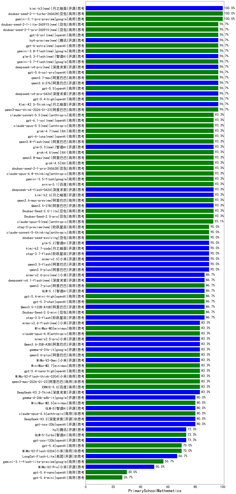

|类别|机构|大模型|【PrimarySchoolMathematics】准确率|平均耗时|平均消耗token|花费/千次（元）|排名（准确率）|
|---|---|-----|-------------------|-------|-----------|-----------|-----------|
|商用|豆包|doubao-seed-2-1-turbo-260628|100.0%|372s|19026|284.1|1|
|商用|google|gemini-4-argon(new)|100.0%|24s|1115|145.1|2|
|商用|google|gemini-3.1-pro-preview|100.0%|75s|5394|454.5|3|
|开源|月之暗面|kimi-k3|100.0%|142s|3909|379.3|4|
|开源|智谱AI|glm-5.3-flash(new)|96.7%|173s|5233|14.5|5|
|开源|阿里巴巴|qwen3.6-27b|96.7%|309s|22357|401.4|6|
|商用|阿里巴巴|qwen3.7-max|96.7%|106s|6482|231.6|7|
|商用|openAI|gpt-5.6-sol-pro|96.7%|38s|6700|688.6|8|
|开源|深度求索|deepseek-v4-pro|96.7%|228s|11186|299.4|9|
|商用|google|gemini-3.7-flash|96.7%|26s|1838|46.8|10|
|商用|google|gemini-3.8-flash(new)|96.7%|20s|3076|158.5|11|
|开源|深度求索|deepseek-v4-pro-0424|96.7%|180s|6004|143.3|12|
|商用|openAI|gpt-6-astra(new)|96.7%|25s|606|189.5|13|
|开源|腾讯|hy4-preview(new)|96.7%|97s|6534|116.6|14|
|商用|openAI|gpt-6-sol(new)|96.7%|264s|628|39.4|15|
|商用|豆包|doubao-seed-2-1-pro-260915(new)|96.7%|144s|4888|144.0|16|
|商用|豆包|doubao-seed-2-1-lite-260915(new)|96.7%|81s|4130|11.0|17|
|商用|openAI|gpt-5.5|96.7%|39s|1339|267.1|18|
|开源|月之暗面|kimi-k3.1-pro(new)|96.7%|207s|6395|426.9|19|
|开源|深度求索|deepseek-v4-flash-0424|93.3%|81s|5727|11.4|20|
|商用|豆包|doubao-seed-2-1-pro-260628|93.3%|415s|22092|660.1|21|
|商用|anthropic|claude-opus-5.5(new)|93.3%|21s|982|125.8|22|
|商用|XAI|grok-4.7(new)|93.3%|135s|11092|429.2|23|
|开源|阿里巴巴|Qwen3.5-27B|93.3%|666s|11840|56.5|24|
|商用|openAI|gpt-6-luna(new)|93.3%|361s|1243|4.1|25|
|商用|阿里巴巴|qwen3.8-flash(new)|93.3%|156s|10324|27.6|26|
|开源|智谱AI|glm-5.3(new)|93.3%|427s|5503|152.6|27|
|商用|XAI|grok-4.6|93.3%|156s|5205|211.0|28|
|商用|阿里巴巴|qwen3.8-max|93.3%|199s|8414|300.3|29|
|商用|anthropic|claude-sonnet-5.5(new)|93.3%|10s|918|58.4|30|
|商用|XAI|grok-4.5|93.3%|165s|7819|320.8|31|
|商用|minimax|MiniMax-M3.1-Flash(new)|93.3%|62s|4321|16.5|32|
|商用|openAI|gpt-6.1-sol(new)|93.3%|71s|564|34.9|33|
|商用|阿里巴巴|qwen3.6-max-preview|93.3%|128s|4716|251.4|34|
|开源|月之暗面|kimi-k2.6|93.3%|316s|9878|265.3|35|
|商用|anthropic|claude-opus-4.8-thinking|93.3%|33s|2408|407.0|36|
|商用|百度|ernie-5.1|93.3%|110s|5057|90.0|37|
|商用|google|gemini-3.5-flash|93.3%|21s|4704|292.6|38|
|商用|anthropic|claude-opus-5|93.1%|44s|1183|193.1|39|
|商用|阶跃星辰|step-5-preview(new)|90.0%|51s|4325|85.6|40|
|开源|小米|mimo-v2.5|90.0%|60s|6091|81.8|41|
|开源|月之暗面|kimi-k2.7-code|90.0%|143s|4823|128.9|42|
|开源|智谱AI|glm-5.2|90.0%|230s|8343|232.1|43|
|商用|豆包|doubao-seed-evolving|90.0%|378s|20975|626.6|44|
|开源|阶跃星辰|step-3.7-flash|90.0%|108s|11632|93.7|45|
|商用|anthropic|claude-sonnet-5-thinking|90.0%|59s|5478|377.7|46|
|开源|小米|mimo-v2.6-pro(new)|86.7%|271s|10049|60.1|47|
|开源|智谱AI|GLM-5.1|86.7%|161s|7134|170.0|48|
|商用|阿里巴巴|qwen3.7-plus|86.7%|180s|9466|75.3|49|
|开源|深度求索|deepseek-v4.1-flash(new)|86.7%|34s|4368|34.4|50|
|开源|阿里巴巴|Qwen3.5-122B-A10B|86.7%|675s|12768|81.3|51|
|开源|深度求索|DeepSeek-V3.2-Think|83.3%|320s|5210|15.6|52|
|商用|百度|ERNIE-5.0|83.3%|552s|8543|204.0|53|
|商用|anthropic|claude-haiku-5.5(new)|83.3%|13s|2287|7.7|54|
|开源|阿里巴巴|Qwen3.6-35B-A3B|83.3%|79s|17334|186.6|55|
|开源|小米|mimo-v2.5-pro|83.3%|93s|5534|111.8|56|
|开源|小米|mimo-v2.6-flash(new)|83.3%|295s|13398|26.7|57|
|商用|minimax|MiniMax-M3|83.3%|172s|4220|68.0|58|
|商用|minimax|MiniMax-M2.7|83.3%|198s|8873|73.9|59|
|商用|anthropic|claude-opus-4.8|83.3%|24s|1918|321.2|60|
|开源|google|gemma-4-31b-it|83.3%|105s|1056|2.8|61|
|商用|阿里巴巴|qwen3.6-plus|83.3%|183s|9366|111.7|62|
|开源|深度求索|DeepSeek-V3.2|80.0%|68s|2186|6.5|63|
|开源|google|gemma-4-26b-a4b-it|80.0%|43s|2061|5.6|64|
|开源|openAI|gpt-oss-20b|80.0%|105s|2770|3.1|65|
|开源|腾讯|hy3|73.3%|88s|861|3.2|66|
|开源|openAI|gpt-oss-120b|73.3%|244s|1598|4.9|67|
|商用|google|gemini-3.1-flash-lite-preview|56.7%|4s|884|8.7|68|

