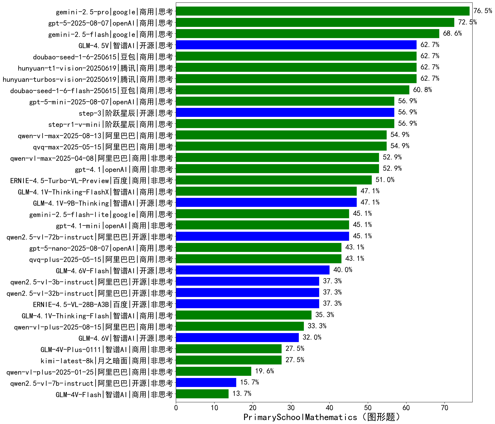

|类别|机构|大模型|【PrimarySchoolMathematics（图形题）】准确率|平均耗时|平均消耗token|花费/千次（元）|排名（准确率）|
|---|---|-----|-------------------|-------|-----------|-----------|-----------|
|商用|腾讯|hunyuan-turbos-vision-20250619|62.7%|27s|856|5.4|1|
|商用|豆包|doubao-seed-1-6-250615|62.7%|/|818|5.6|2|
|开源|智谱AI|GLM-4.5V|62.7%|39s|1750|10.1|3|
|商用|腾讯|hunyuan-t1-vision-20250619|62.7%|55s|2440|19.3|4|
|商用|豆包|doubao-seed-1-6-flash-250615|60.8%|/|1916|2.7|5|
|商用|阶跃星辰|step-r1-v-mini|56.9%|86s|4666|34.8|6|
|开源|阶跃星辰|step-3|56.9%|1452s|5194|20.2|7|
|商用|阿里巴巴|qvq-max-2025-05-15|54.9%|79s|1984|60.9|8|
|商用|阿里巴巴|qwen-vl-max-2025-04-08|52.9%|44s|596|4.7|9|
|商用|openAI|gpt-4.1|52.9%|24s|608|22.5|10|
|商用|百度|ERNIE-4.5-Turbo-VL-Preview|51.0%|40s|2336|12.1|11|
|商用|智谱AI|GLM-4.1V-Thinking-FlashX|47.1%|34s|1361|2.7|12|
|开源|智谱AI|GLM-4.1V-9B-Thinking|47.1%|69s|2354|2.3|13|
|开源|阿里巴巴|qwen2.5-vl-72b-instruct|45.1%|23s|238|1.0|14|
|商用|openAI|gpt-4.1-mini|45.1%|33s|515|5.0|15|
|商用|阿里巴巴|qvq-plus-2025-05-15|43.1%|227s|4520|22.3|16|
|开源|百度|ERNIE-4.5-VL-28B-A3B|37.3%|26s|1220|4.5|17|
|开源|阿里巴巴|qwen2.5-vl-32b-instruct|37.3%|45s|736|1.4|18|
|开源|阿里巴巴|qwen2.5-vl-3b-instruct|37.3%|19s|346|1.0|19|
|商用|智谱AI|GLM-4.1V-Thinking-Flash|35.3%|19s|1218|0.0|20|
|商用|月之暗面|kimi-latest-8k|27.5%|31s|1361|16.3|21|
|商用|智谱AI|GLM-4V-Plus-0111|27.5%|30s|380|1.5|22|
|商用|阿里巴巴|qwen-vl-plus-2025-01-25|19.6%|21s|301|1.0|23|
|开源|阿里巴巴|qwen2.5-vl-7b-instruct|15.7%|7s|330|0.1|24|
|商用|智谱AI|GLM-4V-Flash|13.7%|10s|343|0.0|25|

