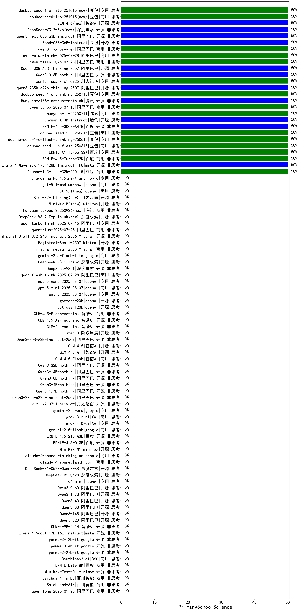

|类别|机构|大模型|【PrimarySchoolScience】准确率|平均耗时|平均消耗token|花费/千次（元）|排名（准确率）|
|---|---|-----|-------------------|-------|-----------|-----------|-----------|
|商用|腾讯|hunyuan-2.0-thinking-20251109(new)|50.0%|64s|366|1.3|1|
|商用|豆包|doubao-seed-1-6-thinking-250715|50.0%|12s|639|4.7|2|
|商用|豆包|doubao-seed-1-6-flash-thinking-250615|50.0%|4s|427|0.5|3|
|商用|豆包|doubao-seed-1-6-250615|50.0%|23s|293|1.7|4|
|商用|阿里巴巴|qwen-flash-2025-07-28|50.0%|4s|256|0.3|5|
|开源|腾讯|Hunyuan-A13B-Instruct|50.0%|16s|531|2.0|6|
|商用|豆包|doubao-seed-1-6-lite-251015(new)|50.0%|24s|354|0.7|7|
|商用|腾讯|hunyuan-t1-20250711|50.0%|11s|658|2.4|8|
|商用|阿里巴巴|qwen-turbo-2025-07-15|50.0%|6s|218|0.1|9|
|开源|腾讯|Hunyuan-A13B-Instruct-nothink|50.0%|12s|332|1.2|10|
|商用|豆包|doubao-seed-1-6-251015(new)|50.0%|4s|378|2.5|11|
|开源|阿里巴巴|qwen3-235b-a22b-thinking-2507|50.0%|105s|1170|22.4|12|
|商用|google|gemini-3-pro-preview(new)|50.0%|26s|869|70.6|13|
|商用|科大讯飞|xunfei-spark-x1-0725|50.0%|/|668|8.0|14|
|开源|阿里巴巴|Qwen3-0.6B-nothink|50.0%|9s|100|0.1|15|
|开源|智谱AI|GLM-4.6(new)|50.0%|44s|1694|23.2|16|
|开源|深度求索|DeepSeek-V3.2-Exp(new)|50.0%|83s|180|0.5|17|
|开源|阿里巴巴|qwen3-next-80b-a3b-instruct|50.0%|8s|322|1.1|18|
|开源|豆包|Seed-OSS-36B-Instruct|50.0%|47s|879|3.4|19|
|商用|阿里巴巴|qwen3-max-preview|50.0%|7s|286|5.8|20|
|商用|阿里巴巴|qwen-plus-think-2025-07-28|50.0%|/|1097|8.4|21|
|开源|阿里巴巴|Qwen3-30B-A3B-Thinking-2507|50.0%|48s|1306|3.5|22|
|商用|豆包|doubao-seed-1-6-flash-250615|50.0%|3s|245|0.3|23|
|开源|百度|ERNIE-4.5-300B-A47B|50.0%|15s|213|1.4|24|
|开源|meta|Llama-4-Maverick-17B-128E-Instruct-FP8|50.0%|6s|389|1.5|25|
|商用|anthropic|claude-sonnet-4.5-thinking(new)|50.0%|16s|962|95.8|26|
|开源|深度求索|DeepSeek-V3.2(new)|50.0%|180s|204|0.6|27|
|商用|豆包|Doubao-1.5-lite-32k-250115|50.0%|3s|167|0.1|28|
|商用|阿里巴巴|qwen3-max-2025-09-23(new)|50.0%|243s|233|4.6|29|
|商用|anthropic|claude-opus-4.5(new)|50.0%|13s|372|55.9|30|
|商用|腾讯|hunyuan-2.0-instruct-20251111(new)|50.0%|2s|223|0.3|31|
|开源|阿里巴巴|qwen3-next-80b-a3b-thinking(new)|50.0%|181s|2314|9.1|32|
|商用|百度|ERNIE-X1-Turbo-32K|50.0%|24s|603|2.3|33|
|商用|百度|ERNIE-4.5-Turbo-32K|50.0%|18s|407|1.2|34|
|开源|深度求索|DeepSeek-V3.1-Think|/%|29s|551|6.2|35|
|开源|深度求索|DeepSeek-V3.2-Exp-Think(new)|/%|85s|521|1.5|36|
|开源|Mistral|mistral-large-2512(new)|/%|4s|152|1.2|37|
|开源|Mistral|Ministral-3-14B-Instruct-2512(new)|/%|13s|161|0.2|38|
|开源|深度求索|DeepSeek-V3.1|/%|12s|183|1.8|39|
|商用|Mistral|mistral-medium-2508|/%|16s|241|2.8|40|
|开源|Mistral|Magistral-Small-2507|/%|41s|3160|33.9|41|
|商用|阿里巴巴|qwen-turbo-think-2025-07-15|/%|/|1218|3.5|42|
|开源|Mistral|Ministral-3-3B-Instruct-2512(new)|/%|12s|158|0.1|43|
|商用|腾讯|hunyuan-turbos-20250926(new)|/%|7s|339|0.6|44|
|商用|阿里巴巴|qwen-plus-2025-07-28|/%|6s|265|0.5|45|
|开源|Mistral|Mistral-Small-3.2-24B-Instruct-2506|/%|24s|244|0.4|46|
|商用|google|gemini-2.5-flash-lite|/%|2s|230|0.6|47|
|开源|Mistral|Ministral-3-8B-Instruct-2512(new)|/%|7s|104|0.1|48|
|开源|月之暗面|kimi-k2-0905(new)|/%|149s|159|1.8|49|
|开源|深度求索|DeepSeek-V3.2-Think(new)|/%|216s|529|1.5|50|
|商用|XAI|grok-4-1-fast-non-reasoning(new)|/%|110s|338|0.7|51|
|商用|openAI|gpt-5-nano-high(new)|/%|316s|700|1.9|52|
|商用|openAI|gpt-5-mini-high(new)|/%|109s|279|3.4|53|
|商用|百度|ERNIE-5.0-Thinking-Preview(new)|/%|208s|528|11.9|54|
|商用|百度|ERNIE-X1.1-Preview(new)|/%|63s|484|1.8|55|
|开源|minimax|MiniMax-M2(new)|/%|73s|557|4.2|56|
|开源|月之暗面|Kimi-K2-Thinking(new)|/%|44s|650|9.9|57|
|商用|openAI|gpt-5.1(new)|/%|178s|69|1.8|58|
|商用|openAI|gpt-5.1-medium(new)|/%|81s|132|6.2|59|
|商用|anthropic|claude-sonnet-4.5(new)|/%|7s|323|28.8|60|
|商用|anthropic|claude-haiku-4.5(new)|/%|9s|376|11.1|61|
|商用|anthropic|claude-haiku-4.5-thinking(new)|/%|55s|3151|110.8|62|
|商用|XAI|grok-4-1-fast-reasoning(new)|/%|3s|429|1.1|63|
|商用|openAI|gpt-5.1-high(new)|/%|155s|146|7.3|64|
|商用|阿里巴巴|qwen-flash-think-2025-07-28|/%|16s|1621|2.4|65|
|商用|阿里巴巴|qwen-long-2025-01-25|/%|5s|233|0.4|66|
|商用|openAI|gpt-5-nano-2025-08-07|/%|13s|908|2.5|67|
|商用|openAI|gpt-5-mini-2025-08-07|/%|89s|375|4.7|68|
|开源|minimax|MiniMax-M1|/%|41s|1035|5.1|69|
|商用|anthropic|claude-4-sonnet-thinking|/%|53s|734|73.0|70|
|商用|anthropic|claude-4-sonnet|/%|42s|369|33.3|71|
|开源|深度求索|DeepSeek-R1-0528-Qwen3-8B|/%|346s|1540|0.0|72|
|开源|深度求索|DeepSeek-R1-0528|/%|135s|781|11.9|73|
|商用|openAI|o4-mini|/%|38s|406|11.6|74|
|开源|阿里巴巴|Qwen3-0.6B|/%|5s|1035|2.9|75|
|开源|阿里巴巴|Qwen3-1.7B|/%|40s|1107|3.2|76|
|开源|阿里巴巴|Qwen3-4B|/%|9s|853|2.4|77|
|开源|阿里巴巴|Qwen3-8B|/%|14s|908|0.0|78|
|开源|阿里巴巴|Qwen3-14B|/%|13s|868|1.6|79|
|开源|阿里巴巴|Qwen3-32B|/%|23s|1023|3.9|80|
|开源|智谱AI|GLM-4-9B-0414|/%|4s|215|0.0|81|
|开源|meta|Llama-4-Scout-17B-16E-Instruct|/%|11s|439|0.9|82|
|开源|google|gemma-3-12b-it|/%|/|/|/|83|
|开源|google|gemma-3-4b-it|/%|/|/|/|84|
|开源|google|gemma-3-27b-it|/%|/|/|/|85|
|商用|360|360zhinao2-o1|/%|/|/|/|86|
|商用|百度|ERNIE-Lite-8K|/%|/|/|/|87|
|开源|minimax|MiniMax-Text-01|/%|7s|818|6.6|88|
|商用|百川智能|Baichuan4-Turbo|/%|/|/|/|89|
|开源|百度|ERNIE-4.5-0.3B|/%|15s|307|0.0|90|
|开源|百度|ERNIE-4.5-21B-A3B|/%|7s|228|0.0|91|
|商用|google|gemini-2.5-flash|/%|7s|794|13.5|92|
|开源|智谱AI|GLM-4.5-Air|/%|35s|1207|7.0|93|
|商用|openAI|gpt-5-2025-08-07|/%|18s|217|12.5|94|
|开源|openAI|gpt-oss-20b|/%|2s|385|0.4|95|
|开源|openAI|gpt-oss-120b|/%|3s|372|0.9|96|
|商用|智谱AI|GLM-4.5-Flash-nothink|/%|12s|539|0.0|97|
|开源|智谱AI|GLM-4.5-Air-nothink|/%|6s|486|2.6|98|
|开源|智谱AI|GLM-4.5-nothink|/%|12s|404|5.0|99|
|商用|百川智能|Baichuan4-Air|/%|/|/|/|100|
|开源|阿里巴巴|Qwen3-30B-A3B-Instruct-2507|/%|2s|253|0.6|101|
|开源|智谱AI|GLM-4.5|/%|24s|994|13.4|102|
|商用|智谱AI|GLM-4.5-Flash|/%|21s|1045|0.0|103|
|商用|XAI|grok-4-0709|/%|125s|518|51.5|104|
|开源|阿里巴巴|Qwen3-32B-nothink|/%|18s|319|1.1|105|
|开源|阿里巴巴|Qwen3-14B-nothink|/%|15s|322|0.6|106|
|开源|阿里巴巴|Qwen3-8B-nothink|/%|14s|286|0.0|107|
|开源|阿里巴巴|Qwen3-4B-nothink|/%|17s|261|0.6|108|
|开源|阿里巴巴|Qwen3-1.7B-nothink|/%|7s|238|0.5|109|
|开源|阿里巴巴|qwen3-235b-a22b-instruct-2507|/%|5s|236|1.5|110|
|开源|月之暗面|kimi-k2-0711-preview|/%|20s|282|3.9|111|
|商用|google|gemini-2.5-pro|/%|13s|1161|80.8|112|
|商用|XAI|grok-3-mini|/%|114s|647|2.3|113|
|开源|阶跃星辰|step-3|/%|51s|987|3.8|114|

