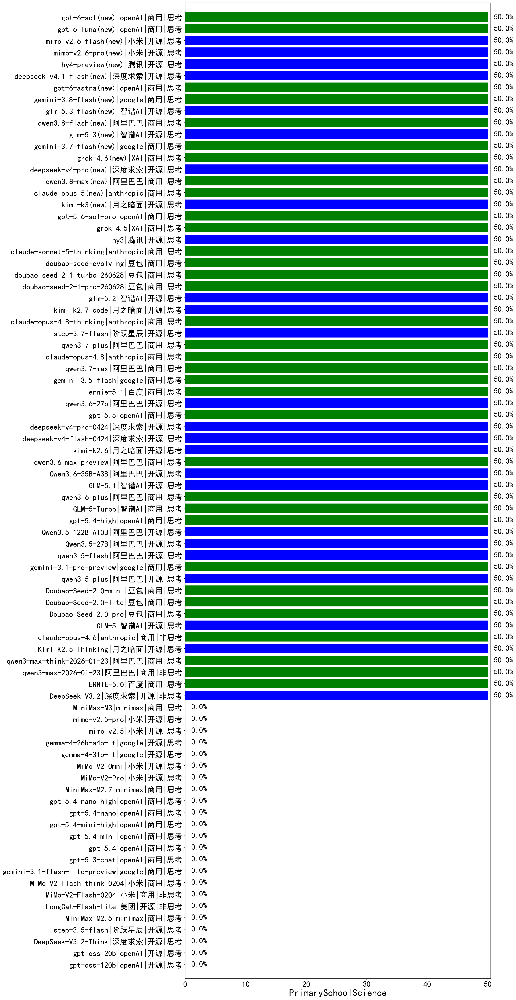

|类别|机构|大模型|【PrimarySchoolScience】准确率|平均耗时|平均消耗token|花费/千次（元）|排名（准确率）|
|---|---|-----|-------------------|-------|-----------|-----------|-----------|
|开源|月之暗面|kimi-k2.6|50.0%|75s|1485|39.2|1|
|开源|阶跃星辰|step-3.7-flash|50.0%|15s|529|3.9|2|
|商用|anthropic|claude-sonnet-5-thinking|50.0%|20s|997|65.9|3|
|商用|豆包|doubao-seed-evolving|50.0%|151s|4774|141.2|4|
|商用|豆包|doubao-seed-2-1-turbo-260628|50.0%|103s|4116|60.7|5|
|商用|豆包|doubao-seed-2-1-pro-260628|50.0%|256s|4787|141.6|6|
|开源|智谱AI|glm-5.2|50.0%|23s|1090|29.4|7|
|开源|月之暗面|kimi-k2.7-code|50.0%|15s|460|11.5|8|
|商用|anthropic|claude-opus-4.8-thinking|50.0%|6s|424|64.3|9|
|商用|阿里巴巴|qwen3.7-plus|50.0%|17s|763|5.8|10|
|商用|XAI|grok-4.5|50.0%|48s|1818|69.3|11|
|商用|anthropic|claude-opus-4.8|50.0%|5s|309|44.2|12|
|商用|阿里巴巴|qwen3.7-max|50.0%|10s|409|13.6|13|
|商用|google|gemini-3.5-flash|50.0%|12s|857|51.5|14|
|商用|百度|ernie-5.1|50.0%|39s|342|5.5|15|
|开源|阿里巴巴|qwen3.6-27b|50.0%|17s|1028|17.8|16|
|商用|openAI|gpt-5.5|50.0%|7s|278|49.5|17|
|开源|深度求索|deepseek-v4-pro-0424|50.0%|7s|153|3.1|18|
|开源|腾讯|hy3|50.0%|5s|122|0.3|19|
|商用|openAI|gpt-5.6-sol-pro|50.0%|10s|2417|160.1|20|
|商用|阿里巴巴|qwen3.6-max-preview|50.0%|29s|866|44.6|21|
|商用|google|gemini-3.8-flash(new)|50.0%|5s|341|15.8|22|
|商用|openAI|gpt-6-sol(new)|50.0%|257s|145|7.4|23|
|商用|openAI|gpt-6-luna(new)|50.0%|583s|313|1.0|24|
|开源|小米|mimo-v2.6-flash(new)|50.0%|32s|506|1.0|25|
|开源|小米|mimo-v2.6-pro(new)|50.0%|149s|2002|11.9|26|
|开源|腾讯|hy4-preview(new)|50.0%|73s|4966|88.7|27|
|开源|深度求索|deepseek-v4.1-flash(new)|50.0%|5s|369|2.5|28|
|商用|openAI|gpt-6-astra(new)|50.0%|6s|115|26.3|29|
|开源|智谱AI|glm-5.3-flash(new)|50.0%|70s|2221|6.1|30|
|开源|月之暗面|kimi-k3(new)|50.0%|35s|394|29.6|31|
|商用|阿里巴巴|qwen3.8-flash(new)|50.0%|22s|254|0.5|32|
|开源|智谱AI|glm-5.3(new)|50.0%|296s|13048|364.3|33|
|商用|google|gemini-3.7-flash(new)|50.0%|7s|343|8.0|34|
|商用|XAI|grok-4.6(new)|50.0%|36s|1420|52.6|35|
|开源|深度求索|deepseek-v4-pro(new)|50.0%|41s|1111|27.8|36|
|商用|阿里巴巴|qwen3.8-max(new)|50.0%|18s|714|23.6|37|
|商用|anthropic|claude-opus-5(new)|50.0%|8s|419|63.5|38|
|开源|深度求索|deepseek-v4-flash-0424|50.0%|30s|1317|2.6|39|
|商用|XAI|grok-4.7(new)|50.0%|40s|1978|47.0|40|
|开源|阿里巴巴|Qwen3.6-35B-A3B|50.0%|7s|1259|13.2|41|
|商用|openAI|gpt-5.4-high|50.0%|10s|361|33.5|42|
|开源|深度求索|DeepSeek-V3.2|50.0%|180s|204|0.6|43|
|商用|百度|ERNIE-5.0|50.0%|167s|1231|28.8|44|
|商用|阿里巴巴|qwen3-max-2026-01-23|50.0%|95s|220|1.8|45|
|商用|阿里巴巴|qwen3-max-think-2026-01-23|50.0%|74s|1586|15.4|46|
|开源|月之暗面|Kimi-K2.5-Thinking|50.0%|178s|1296|26.5|47|
|商用|anthropic|claude-opus-4.6|50.0%|9s|332|48.0|48|
|开源|智谱AI|GLM-5|50.0%|38s|1610|28.3|49|
|商用|豆包|Doubao-Seed-2.0-pro|50.0%|147s|605|8.6|50|
|商用|豆包|Doubao-Seed-2.0-lite|50.0%|59s|355|1.0|51|
|商用|豆包|Doubao-Seed-2.0-mini|50.0%|465s|2159|4.2|52|
|开源|阿里巴巴|qwen3.5-plus|50.0%|16s|1455|6.8|53|
|商用|google|gemini-3.1-pro-preview|50.0%|15s|843|68.4|54|
|开源|阿里巴巴|qwen3.5-flash|50.0%|268s|1629|3.2|55|
|开源|阿里巴巴|Qwen3.5-27B|50.0%|260s|1145|5.3|56|
|开源|阿里巴巴|Qwen3.5-122B-A10B|50.0%|154s|1980|12.4|57|
|商用|智谱AI|GLM-5-Turbo|50.0%|26s|504|10.3|58|
|开源|智谱AI|GLM-5.1|50.0%|119s|773|17.7|59|
|商用|阿里巴巴|qwen3.6-plus|50.0%|21s|1078|12.5|60|
|商用|openAI|gpt-5.4|0.0%|4s|89|4.9|61|
|开源|小米|mimo-v2.5|0.0%|53s|715|6.7|62|
|开源|深度求索|DeepSeek-V3.2-Think|0.0%|216s|529|1.5|63|
|开源|小米|mimo-v2.5-pro|0.0%|13s|628|9.0|64|
|开源|google|gemma-4-26b-a4b-it|0.0%|19s|201|0.4|65|
|开源|google|gemma-4-31b-it|0.0%|41s|222|0.5|66|
|开源|阶跃星辰|step-3.5-flash|0.0%|9s|273|0.5|67|
|开源|小米|MiMo-V2-Omni|0.0%|84s|540|4.2|68|
|商用|minimax|MiniMax-M2.5|0.0%|11s|496|3.7|69|
|开源|美团|LongCat-Flash-Lite|0.0%|35s|137|0.0|70|
|商用|小米|MiMo-V2-Flash-0204|0.0%|102s|215|0.4|71|
|商用|小米|MiMo-V2-Flash-think-0204|0.0%|53s|647|1.3|72|
|开源|小米|MiMo-V2-Pro|0.0%|957s|694|10.5|73|
|商用|minimax|MiniMax-M2.7|0.0%|6s|306|2.1|74|
|商用|openAI|gpt-5.4-nano-high|0.0%|5s|98|0.5|75|
|商用|minimax|MiniMax-M3|0.0%|17s|492|5.6|76|
|商用|openAI|gpt-5.4-nano|0.0%|2s|79|0.3|77|
|商用|openAI|gpt-5.4-mini-high|0.0%|125s|148|3.4|78|
|商用|openAI|gpt-5.4-mini|0.0%|7s|89|1.5|79|
|开源|openAI|gpt-oss-20b|0.0%|2s|385|0.4|80|
|商用|google|gemini-3.1-flash-lite-preview|0.0%|57s|170|1.4|81|
|商用|openAI|gpt-5.3-chat|0.0%|3s|123|7.8|82|
|开源|openAI|gpt-oss-120b|0.0%|3s|372|0.9|83|

