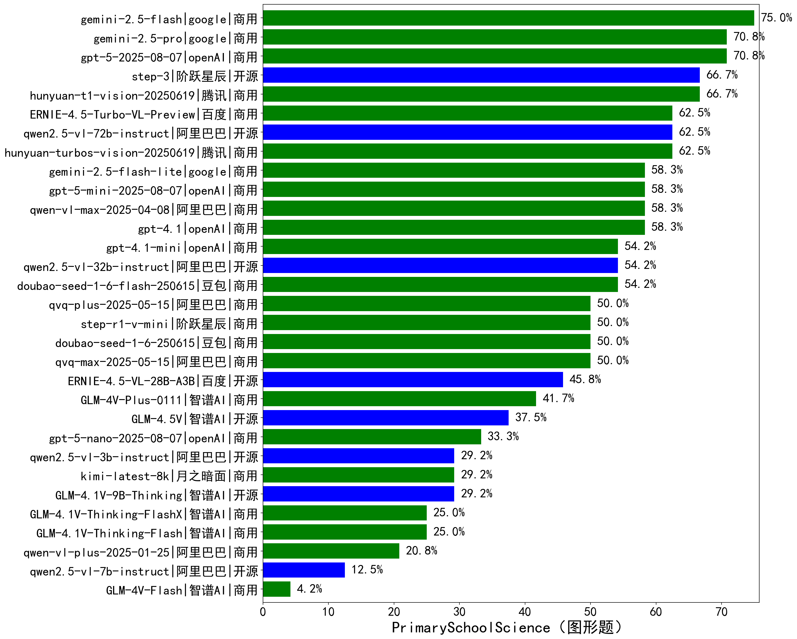

|类别|机构|大模型|【PrimarySchoolScience（图形题）】准确率|平均耗时|平均消耗token|花费/千次（元）|排名（准确率）|
|---|---|-----|-------------------|-------|-----------|-----------|-----------|
|商用|google|gemini-2.5-flash|75.0%|125s|1834|28.1|1|
|商用|openAI|gpt-5-2025-08-07|70.8%|210s|1214|68.9|2|
|商用|google|gemini-2.5-pro|70.8%|144s|2784|181.5|3|
|开源|阶跃星辰|step-3|66.7%|139s|2124|7.9|4|
|商用|腾讯|hunyuan-t1-vision-20250619|66.7%|41s|1425|10.3|5|
|开源|阿里巴巴|qwen2.5-vl-72b-instruct|62.5%|36s|204|0.8|6|
|商用|腾讯|hunyuan-turbos-vision-20250619|62.5%|18s|623|3.5|7|
|商用|百度|ERNIE-4.5-Turbo-VL-Preview|62.5%|29s|1719|6.8|8|
|商用|google|gemini-2.5-flash-lite|58.3%|137s|814|1.7|9|
|商用|阿里巴巴|qwen-vl-max-2025-04-08|58.3%|41s|404|3.1|10|
|商用|openAI|gpt-5-mini-2025-08-07|58.3%|147s|899|11.8|11|
|商用|openAI|gpt-4.1|58.3%|23s|441|13.2|12|
|开源|阿里巴巴|qwen2.5-vl-32b-instruct|54.2%|56s|510|1.0|13|
|商用|豆包|doubao-seed-1-6-flash-250615|54.2%|/|399|0.5|14|
|商用|openAI|gpt-4.1-mini|54.2%|22s|232|1.9|15|
|商用|阿里巴巴|qvq-max-2025-05-15|50.0%|73s|1176|35.4|16|
|商用|阶跃星辰|step-r1-v-mini|50.0%|73s|2695|19.6|17|
|商用|阿里巴巴|qvq-plus-2025-05-15|50.0%|153s|2233|10.9|18|
|商用|豆包|doubao-seed-1-6-250615|50.0%|/|382|2.2|19|
|开源|百度|ERNIE-4.5-VL-28B-A3B|45.8%|23s|333|1.0|20|
|商用|智谱AI|GLM-4V-Plus-0111|41.7%|40s|322|1.3|21|
|开源|智谱AI|GLM-4.5V|37.5%|47s|891|5.0|22|
|商用|openAI|gpt-5-nano-2025-08-07|33.3%|132s|2166|6.0|23|
|开源|智谱AI|GLM-4.1V-9B-Thinking|29.2%|55s|1247|1.2|24|
|开源|阿里巴巴|qwen2.5-vl-3b-instruct|29.2%|17s|167|0.3|25|
|商用|月之暗面|kimi-latest-8k|29.2%|64s|1202|14.4|26|
|商用|智谱AI|GLM-4.1V-Thinking-FlashX|25.0%|42s|949|1.9|27|
|商用|智谱AI|GLM-4.1V-Thinking-Flash|25.0%|9s|724|0.0|28|
|商用|阿里巴巴|qwen-vl-plus-2025-01-25|20.8%|26s|179|0.5|29|
|开源|阿里巴巴|qwen2.5-vl-7b-instruct|12.5%|4s|189|0.1|30|
|商用|智谱AI|GLM-4V-Flash|4.2%|6s|275|0.0|31|

