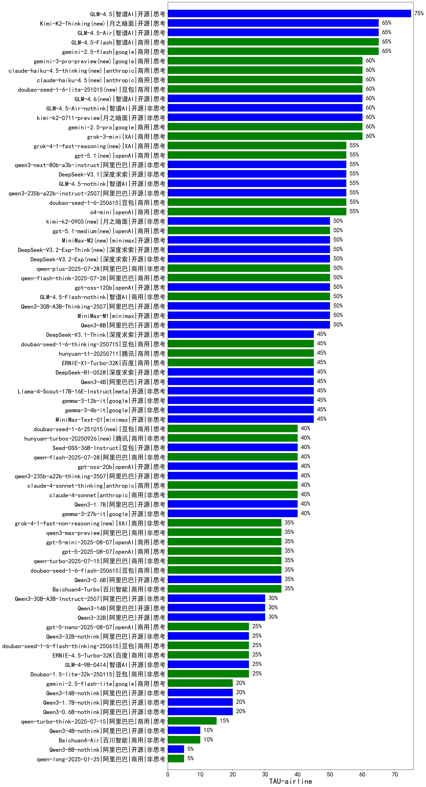

|类别|机构|大模型|【TAU-airline】准确率|平均耗时|平均消耗token|花费/千次（元）|排名（准确率）|
|---|---|-----|-------------------|-------|-----------|-----------|-----------|
|商用|腾讯|hunyuan-turbos-20250716|80.0%|/|/|/|1|
|开源|智谱AI|GLM-4.5|75.0%|/|/|/|2|
|商用|google|gemini-2.5-flash|65.0%|/|/|/|3|
|商用|智谱AI|GLM-4.5-Flash|65.0%|/|/|/|4|
|开源|智谱AI|GLM-4.5-Air|65.0%|/|/|/|5|
|开源|月之暗面|kimi-k2-0711-preview|60.0%|/|/|/|6|
|商用|google|gemini-2.5-pro|60.0%|/|/|/|7|
|商用|XAI|grok-3-mini|60.0%|/|/|/|8|
|开源|智谱AI|GLM-4.5-Air-nothink|60.0%|/|/|/|9|
|开源|智谱AI|GLM-4.6(new)|60.0%|/|/|/|10|
|开源|智谱AI|GLM-4.5-nothink|55.0%|/|/|/|11|
|开源|深度求索|DeepSeek-V3.1|55.0%|/|/|/|12|
|商用|豆包|doubao-seed-1-6-250615|55.0%|/|/|/|13|
|开源|阿里巴巴|qwen3-235b-a22b-instruct-2507|55.0%|/|/|/|14|
|开源|阿里巴巴|qwen3-next-80b-a3b-instruct(new)|55.0%|/|/|/|15|
|商用|openAI|o4-mini|55.0%|/|/|/|16|
|开源|minimax|MiniMax-M1|50.0%|/|/|/|17|
|开源|openAI|gpt-oss-120b(new)|50.0%|/|/|/|18|
|开源|深度求索|DeepSeek-V3.2-Exp-Think(new)|50.0%|/|/|/|19|
|商用|阿里巴巴|qwen-plus-2025-07-28|50.0%|/|/|/|20|
|商用|阿里巴巴|qwen-flash-think-2025-07-28|50.0%|/|/|/|21|
|开源|深度求索|DeepSeek-V3.2-Exp(new)|50.0%|/|/|/|22|
|商用|智谱AI|GLM-4.5-Flash-nothink|50.0%|/|/|/|23|
|开源|阿里巴巴|Qwen3-8B|50.0%|/|/|/|24|
|开源|阿里巴巴|Qwen3-30B-A3B-Thinking-2507|50.0%|/|/|/|25|
|开源|深度求索|DeepSeek-R1-0528|45.0%|/|/|/|26|
|商用|豆包|doubao-seed-1-6-thinking-250715|45.0%|/|/|/|27|
|开源|深度求索|DeepSeek-V3.1-Think|45.0%|/|/|/|28|
|开源|阿里巴巴|Qwen3-4B|45.0%|/|/|/|29|
|开源|google|gemma-3-12b-it|45.0%|/|/|/|30|
|开源|google|gemma-3-4b-it|45.0%|/|/|/|31|
|开源|meta|Llama-4-Scout-17B-16E-Instruct|45.0%|/|/|/|32|
|开源|深度求索|deepseek-chat-v3-0324|45.0%|/|/|/|33|
|商用|豆包|Doubao-1.5-pro-32k-250115|45.0%|/|/|/|34|
|开源|minimax|MiniMax-Text-01|45.0%|/|/|/|35|
|商用|腾讯|hunyuan-t1-20250711|45.0%|/|/|/|36|
|商用|百度|ERNIE-X1-Turbo-32K|45.0%|/|/|/|37|
|开源|openAI|gpt-oss-20b(new)|40.0%|/|/|/|38|
|开源|阿里巴巴|qwen3-235b-a22b-thinking-2507|40.0%|/|/|/|39|
|商用|anthropic|claude-4-sonnet-thinking|40.0%|/|/|/|40|
|开源|智谱AI|GLM-4-32B-0414|40.0%|/|/|/|41|
|开源|深度求索|DeepSeek-R1-Distill-Qwen-32B|40.0%|/|/|/|42|
|开源|google|gemma-3-27b-it|40.0%|/|/|/|43|
|开源|阿里巴巴|Qwen3-1.7B|40.0%|/|/|/|44|
|开源|豆包|Seed-OSS-36B-Instruct(new)|40.0%|/|/|/|45|
|商用|阿里巴巴|qwen-flash-2025-07-28|40.0%|/|/|/|46|
|商用|腾讯|hunyuan-turbos-20250926(new)|40.0%|/|/|/|47|
|商用|anthropic|claude-4-sonnet|40.0%|/|/|/|48|
|商用|openAI|gpt-5-2025-08-07(new)|35.0%|/|/|/|49|
|商用|阿里巴巴|qwen-turbo-2025-07-15|35.0%|/|/|/|50|
|商用|豆包|doubao-seed-1-6-flash-250615|35.0%|/|/|/|51|
|商用|百川智能|Baichuan4-Turbo|35.0%|/|/|/|52|
|商用|阿里巴巴|qwen3-max-preview(new)|35.0%|/|/|/|53|
|开源|智谱AI|GLM-Z1-9B-0414|35.0%|/|/|/|54|
|开源|阿里巴巴|Qwen3-0.6B|35.0%|/|/|/|55|
|商用|openAI|gpt-5-mini-2025-08-07(new)|35.0%|/|/|/|56|
|开源|阿里巴巴|Qwen3-32B|30.0%|/|/|/|57|
|开源|阿里巴巴|Qwen3-14B|30.0%|/|/|/|58|
|开源|阿里巴巴|Qwen3-30B-A3B-Instruct-2507|30.0%|/|/|/|59|
|商用|openAI|gpt-5-nano-2025-08-07(new)|25.0%|/|/|/|60|
|商用|豆包|doubao-seed-1-6-flash-thinking-250615|25.0%|/|/|/|61|
|开源|阿里巴巴|Qwen3-32B-nothink|25.0%|/|/|/|62|
|开源|智谱AI|GLM-4-9B-0414|25.0%|/|/|/|63|
|商用|豆包|Doubao-1.5-lite-32k-250115|25.0%|/|/|/|64|
|商用|阶跃星辰|step-2-mini|25.0%|/|/|/|65|
|商用|百度|ERNIE-4.5-Turbo-32K|25.0%|/|/|/|66|
|商用|google|gemini-2.5-flash-lite|20.0%|/|/|/|67|
|开源|阿里巴巴|Qwen3-1.7B-nothink|20.0%|/|/|/|68|
|开源|阿里巴巴|Qwen3-14B-nothink|20.0%|/|/|/|69|
|开源|阿里巴巴|Qwen3-0.6B-nothink|20.0%|/|/|/|70|
|开源|深度求索|DeepSeek-R1-Distill-Qwen-14B|15.0%|/|/|/|71|
|商用|阿里巴巴|qwen-turbo-think-2025-07-15|15.0%|/|/|/|72|
|开源|阿里巴巴|Qwen3-4B-nothink|10.0%|/|/|/|73|
|商用|月之暗面|kimi-latest-8k|10.0%|/|/|/|74|
|商用|百川智能|Baichuan4-Air|10.0%|/|/|/|75|
|商用|阿里巴巴|qwen-long-2025-01-25|5.0%|/|/|/|76|
|开源|阿里巴巴|Qwen3-8B-nothink|5.0%|/|/|/|77|
|商用|360|360zhinao2-o1|/%|/|/|/|78|
|商用|Mistral|ministral-3b|/%|/|/|/|79|
|商用|百度|ERNIE-Lite-8K|/%|/|/|/|80|
|商用|Mistral|ministral-8b|/%|/|/|/|81|
|商用|科大讯飞|xunfei-spark-lite|/%|/|/|/|82|
|商用|百度|ERNIE-Speed-8K|/%|/|/|/|83|
|开源|meta|Llama-4-Maverick-17B-128E-Instruct-FP8|/%|/|/|/|84|
|开源|智谱AI|GLM-Z1-32B-0414|/%|/|/|/|85|
|商用|科大讯飞|xunfei-spark-x1-0725|/%|/|/|/|86|
|开源|百度|ERNIE-4.5-0.3B|/%|/|/|/|87|
|开源|腾讯|Hunyuan-A13B-Instruct|/%|/|/|/|88|
|开源|百度|ERNIE-4.5-300B-A47B|/%|/|/|/|89|
|开源|百度|ERNIE-4.5-21B-A3B|/%|/|/|/|90|
|商用|XAI|grok-4-0709|/%|/|/|/|91|
|开源|深度求索|DeepSeek-R1-0528-Qwen3-8B|/%|/|/|/|92|
|开源|腾讯|Hunyuan-A13B-Instruct-nothink|/%|/|/|/|93|
|开源|华为|pangu-pro-moe|/%|/|/|/|94|
|开源|阶跃星辰|step-3|/%|/|/|/|95|
|商用|阿里巴巴|qwen-plus-think-2025-07-28|/%|/|/|/|96|
|开源|Mistral|Mistral-Small-3.2-24B-Instruct-2506|/%|/|/|/|97|
|开源|Mistral|Magistral-Small-2507|/%|/|/|/|98|
|商用|Mistral|mistral-medium-2508(new)|/%|/|/|/|99|

