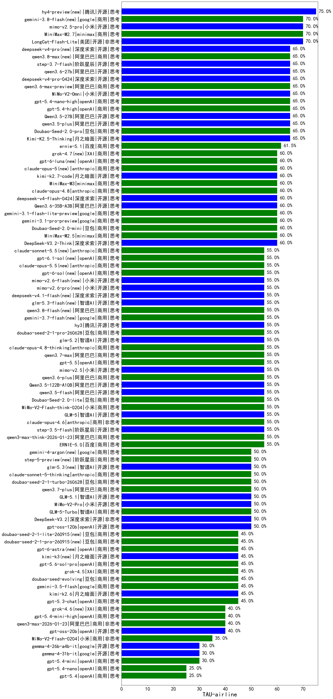

|类别|机构|大模型|【TAU-airline】准确率|平均耗时|平均消耗token|花费/千次（元）|排名（准确率）|
|---|---|-----|-------------------|-------|-----------|-----------|-----------|
|开源|腾讯|hy4-preview(new)|75.0%|/|/|/|1|
|商用|google|gemini-3.8-flash(new)|70.0%|/|/|/|2|
|开源|小米|mimo-v2.5-pro|70.0%|/|/|/|3|
|商用|minimax|MiniMax-M2.7|70.0%|/|/|/|4|
|开源|深度求索|deepseek-v4-pro|65.0%|/|/|/|5|
|开源|阶跃星辰|step-3.7-flash|65.0%|/|/|/|6|
|开源|阿里巴巴|qwen3.6-27b|65.0%|/|/|/|7|
|开源|深度求索|deepseek-v4-pro-0424|65.0%|/|/|/|8|
|商用|阿里巴巴|qwen3.6-max-preview|65.0%|/|/|/|9|
|商用|阿里巴巴|qwen3.8-max|65.0%|/|/|/|10|
|开源|月之暗面|kimi-k3.1-pro(new)|65.0%|/|/|/|11|
|开源|阿里巴巴|Qwen3.5-27B|65.0%|/|/|/|12|
|商用|百度|ernie-5.1|61.5%|/|/|/|13|
|开源|月之暗面|kimi-k2.7-code|60.0%|/|/|/|14|
|商用|anthropic|claude-opus-4.8|60.0%|/|/|/|15|
|商用|anthropic|claude-opus-5|60.0%|/|/|/|16|
|开源|阿里巴巴|Qwen3.6-35B-A3B|60.0%|/|/|/|17|
|商用|XAI|grok-4.7(new)|60.0%|/|/|/|18|
|商用|minimax|MiniMax-M3.1-Flash(new)|60.0%|/|/|/|19|
|开源|深度求索|deepseek-v4-flash-0424|60.0%|/|/|/|20|
|商用|google|gemini-3.1-pro-preview|60.0%|/|/|/|21|
|商用|google|gemini-3.1-flash-lite-preview|60.0%|/|/|/|22|
|开源|深度求索|DeepSeek-V3.2-Think|60.0%|/|/|/|23|
|商用|minimax|MiniMax-M3|60.0%|/|/|/|24|
|商用|openAI|gpt-6-luna(new)|60.0%|/|/|/|25|
|商用|openAI|gpt-6-sol(new)|55.0%|/|/|/|26|
|开源|深度求索|deepseek-v4.1-flash(new)|55.0%|/|/|/|27|
|开源|腾讯|hy3|55.0%|/|/|/|28|
|开源|小米|mimo-v2.6-pro(new)|55.0%|/|/|/|29|
|商用|豆包|doubao-seed-2-1-pro-260628|55.0%|/|/|/|30|
|商用|google|gemini-3.7-flash|55.0%|/|/|/|31|
|开源|小米|mimo-v2.6-flash(new)|55.0%|/|/|/|32|
|商用|阿里巴巴|qwen3.8-flash(new)|55.0%|/|/|/|33|
|开源|智谱AI|glm-5.2|55.0%|/|/|/|34|
|商用|anthropic|claude-opus-4.8-thinking|55.0%|/|/|/|35|
|商用|anthropic|claude-opus-5.5(new)|55.0%|/|/|/|36|
|商用|阿里巴巴|qwen3.7-max|55.0%|/|/|/|37|
|开源|智谱AI|glm-5.3-flash(new)|55.0%|/|/|/|38|
|商用|openAI|gpt-5.5|55.0%|/|/|/|39|
|开源|小米|mimo-v2.5|55.0%|/|/|/|40|
|商用|openAI|gpt-6.1-sol(new)|55.0%|/|/|/|41|
|商用|anthropic|claude-sonnet-5.5(new)|55.0%|/|/|/|42|
|商用|阿里巴巴|qwen3.6-plus|55.0%|/|/|/|43|
|开源|阿里巴巴|Qwen3.5-122B-A10B|55.0%|/|/|/|44|
|商用|百度|ERNIE-5.0|55.0%|/|/|/|45|
|商用|google|gemini-4-argon(new)|50.0%|/|/|/|46|
|商用|anthropic|claude-haiku-5.5(new)|50.0%|/|/|/|47|
|商用|阶跃星辰|step-5-preview(new)|50.0%|/|/|/|48|
|开源|openAI|gpt-oss-120b|50.0%|/|/|/|49|
|开源|智谱AI|glm-5.3(new)|50.0%|/|/|/|50|
|商用|anthropic|claude-sonnet-5-thinking|50.0%|/|/|/|51|
|开源|深度求索|DeepSeek-V3.2|50.0%|/|/|/|52|
|开源|智谱AI|GLM-5.1|50.0%|/|/|/|53|
|商用|阿里巴巴|qwen3.7-plus|50.0%|/|/|/|54|
|商用|豆包|doubao-seed-2-1-turbo-260628|50.0%|/|/|/|55|
|商用|XAI|grok-4.5|45.0%|/|/|/|56|
|商用|openAI|gpt-5.6-sol-pro|45.0%|/|/|/|57|
|商用|豆包|doubao-seed-evolving|45.0%|/|/|/|58|
|商用|openAI|gpt-6-astra(new)|45.0%|/|/|/|59|
|商用|豆包|doubao-seed-2-1-pro-260915(new)|45.0%|/|/|/|60|
|商用|豆包|doubao-seed-2-1-lite-260915(new)|45.0%|/|/|/|61|
|商用|google|gemini-3.5-flash|45.0%|/|/|/|62|
|开源|月之暗面|kimi-k2.6|45.0%|/|/|/|63|
|开源|月之暗面|kimi-k3|45.0%|/|/|/|64|
|开源|openAI|gpt-oss-20b|40.0%|/|/|/|65|
|商用|XAI|grok-4.6|40.0%|/|/|/|66|
|开源|google|gemma-4-26b-a4b-it|30.0%|/|/|/|67|
|开源|google|gemma-4-31b-it|30.0%|/|/|/|68|

