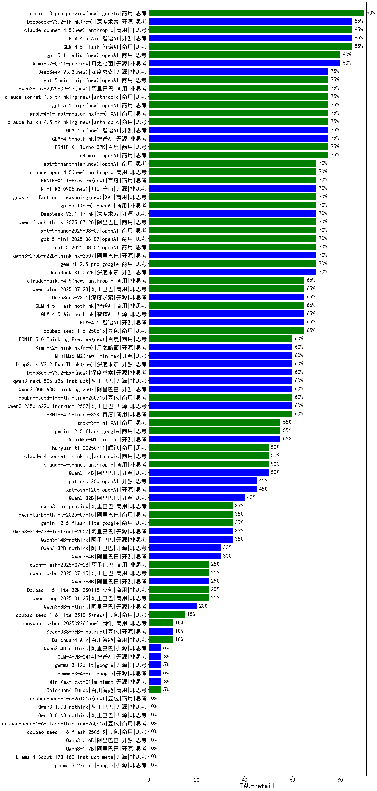

|类别|机构|大模型|【TAU-retail】准确率|平均耗时|平均消耗token|花费/千次（元）|排名（准确率）|
|---|---|-----|-------------------|-------|-----------|-----------|-----------|
|商用|google|gemini-3-pro-preview(new)|90.0%|/|/|/|1|
|开源|智谱AI|GLM-4.5-Air|85.0%|/|/|/|2|
|商用|智谱AI|GLM-4.5-Flash|85.0%|/|/|/|3|
|开源|深度求索|DeepSeek-V3.2-Think(new)|85.0%|/|/|/|4|
|商用|anthropic|claude-sonnet-4.5(new)|85.0%|/|/|/|5|
|开源|月之暗面|kimi-k2-0711-preview|80.0%|/|/|/|6|
|商用|openAI|gpt-5.1-medium(new)|80.0%|/|/|/|7|
|开源|智谱AI|GLM-4.5-nothink|75.0%|/|/|/|8|
|商用|anthropic|claude-sonnet-4.5-thinking(new)|75.0%|/|/|/|9|
|商用|百度|ERNIE-X1-Turbo-32K|75.0%|/|/|/|10|
|商用|openAI|o4-mini|75.0%|/|/|/|11|
|商用|XAI|grok-4-1-fast-reasoning(new)|75.0%|/|/|/|12|
|商用|anthropic|claude-haiku-4.5-thinking(new)|75.0%|/|/|/|13|
|商用|阿里巴巴|qwen3-max-2025-09-23(new)|75.0%|/|/|/|14|
|商用|openAI|gpt-5-mini-high(new)|75.0%|/|/|/|15|
|开源|深度求索|DeepSeek-V3.2(new)|75.0%|/|/|/|16|
|开源|智谱AI|GLM-4.6(new)|75.0%|/|/|/|17|
|商用|openAI|gpt-5.1-high(new)|75.0%|/|/|/|18|
|商用|google|gemini-2.5-pro|70.0%|/|/|/|19|
|开源|阿里巴巴|qwen3-235b-a22b-thinking-2507|70.0%|/|/|/|20|
|商用|openAI|gpt-5.1(new)|70.0%|/|/|/|21|
|商用|openAI|gpt-5-mini-2025-08-07|70.0%|/|/|/|22|
|开源|深度求索|DeepSeek-V3.1-Think|70.0%|/|/|/|23|
|商用|阿里巴巴|qwen-flash-think-2025-07-28|70.0%|/|/|/|24|
|商用|openAI|gpt-5-nano-2025-08-07|70.0%|/|/|/|25|
|开源|月之暗面|kimi-k2-0905(new)|70.0%|/|/|/|26|
|商用|XAI|grok-4-1-fast-non-reasoning(new)|70.0%|/|/|/|27|
|商用|openAI|gpt-5-2025-08-07|70.0%|/|/|/|28|
|商用|百度|ERNIE-X1.1-Preview(new)|70.0%|/|/|/|29|
|开源|阿里巴巴|qwen3-next-80b-a3b-thinking(new)|70.0%|/|/|/|30|
|商用|openAI|gpt-5-nano-high(new)|70.0%|/|/|/|31|
|商用|openAI|gpt-5.2(new)|70.0%|/|/|/|32|
|商用|anthropic|claude-opus-4.5(new)|70.0%|/|/|/|33|
|商用|腾讯|hunyuan-2.0-thinking-20251109(new)|70.0%|/|/|/|34|
|开源|深度求索|DeepSeek-R1-0528|70.0%|/|/|/|35|
|商用|阿里巴巴|qwen-plus-2025-07-28|65.0%|/|/|/|36|
|商用|智谱AI|GLM-4.5-Flash-nothink|65.0%|/|/|/|37|
|商用|anthropic|claude-haiku-4.5(new)|65.0%|/|/|/|38|
|开源|智谱AI|GLM-4.5|65.0%|/|/|/|39|
|开源|深度求索|DeepSeek-V3.1|65.0%|/|/|/|40|
|开源|智谱AI|GLM-4.5-Air-nothink|65.0%|/|/|/|41|
|商用|豆包|doubao-seed-1-6-250615|65.0%|/|/|/|42|
|开源|月之暗面|Kimi-K2-Thinking(new)|60.0%|/|/|/|43|
|开源|深度求索|DeepSeek-V3.2-Exp-Think(new)|60.0%|/|/|/|44|
|开源|阿里巴巴|Qwen3-30B-A3B-Thinking-2507|60.0%|/|/|/|45|
|开源|阿里巴巴|qwen3-next-80b-a3b-instruct|60.0%|/|/|/|46|
|开源|深度求索|DeepSeek-V3.2-Exp(new)|60.0%|/|/|/|47|
|开源|阿里巴巴|qwen3-235b-a22b-instruct-2507|60.0%|/|/|/|48|
|开源|minimax|MiniMax-M2(new)|60.0%|/|/|/|49|
|商用|百度|ERNIE-5.0-Thinking-Preview(new)|60.0%|/|/|/|50|
|商用|豆包|doubao-seed-1-6-thinking-250715|60.0%|/|/|/|51|
|商用|百度|ERNIE-4.5-Turbo-32K|60.0%|/|/|/|52|
|开源|Mistral|Ministral-3-14B-Instruct-2512(new)|55.0%|/|/|/|53|
|开源|minimax|MiniMax-M1|55.0%|/|/|/|54|
|商用|腾讯|hunyuan-2.0-instruct-20251111(new)|55.0%|/|/|/|55|
|商用|XAI|grok-3-mini|55.0%|/|/|/|56|
|商用|google|gemini-2.5-flash|55.0%|/|/|/|57|
|商用|阿里巴巴|qwen-plus-2025-12-01(new)|50.0%|/|/|/|58|
|商用|anthropic|claude-4-sonnet-thinking|50.0%|/|/|/|59|
|开源|Mistral|Ministral-3-8B-Instruct-2512(new)|50.0%|/|/|/|60|
|商用|腾讯|hunyuan-t1-20250711|50.0%|/|/|/|61|
|开源|阿里巴巴|Qwen3-14B|50.0%|/|/|/|62|
|商用|anthropic|claude-4-sonnet|50.0%|/|/|/|63|
|开源|Mistral|mistral-large-2512(new)|50.0%|/|/|/|64|
|商用|阿里巴巴|qwen-plus-think-2025-12-01(new)|45.0%|/|/|/|65|
|开源|openAI|gpt-oss-20b|45.0%|/|/|/|66|
|开源|openAI|gpt-oss-120b|45.0%|/|/|/|67|
|开源|Mistral|Ministral-3-3B-Instruct-2512(new)|40.0%|/|/|/|68|
|开源|阿里巴巴|Qwen3-32B|40.0%|/|/|/|69|
|开源|阿里巴巴|Qwen3-14B-nothink|35.0%|/|/|/|70|
|商用|google|gemini-2.5-flash-lite|35.0%|/|/|/|71|
|开源|阿里巴巴|Qwen3-30B-A3B-Instruct-2507|35.0%|/|/|/|72|
|商用|阿里巴巴|qwen-turbo-think-2025-07-15|35.0%|/|/|/|73|
|商用|阿里巴巴|qwen3-max-preview|35.0%|/|/|/|74|
|开源|阿里巴巴|Qwen3-4B|30.0%|/|/|/|75|
|开源|阿里巴巴|Qwen3-32B-nothink|30.0%|/|/|/|76|
|商用|豆包|Doubao-1.5-lite-32k-250115|25.0%|/|/|/|77|
|开源|阿里巴巴|Qwen3-8B|25.0%|/|/|/|78|
|商用|阿里巴巴|qwen-flash-2025-07-28|25.0%|/|/|/|79|
|商用|阿里巴巴|qwen-turbo-2025-07-15|25.0%|/|/|/|80|
|商用|阿里巴巴|qwen-long-2025-01-25|25.0%|/|/|/|81|
|开源|阿里巴巴|Qwen3-8B-nothink|20.0%|/|/|/|82|
|商用|豆包|doubao-seed-1-6-lite-251015(new)|15.0%|/|/|/|83|
|商用|腾讯|hunyuan-turbos-20250926(new)|10.0%|/|/|/|84|
|商用|百川智能|Baichuan4-Air|10.0%|/|/|/|85|
|开源|豆包|Seed-OSS-36B-Instruct|10.0%|/|/|/|86|
|开源|阿里巴巴|Qwen3-4B-nothink|5.0%|/|/|/|87|
|商用|百川智能|Baichuan4-Turbo|5.0%|/|/|/|88|
|开源|minimax|MiniMax-Text-01|5.0%|/|/|/|89|
|开源|智谱AI|GLM-4-9B-0414|5.0%|/|/|/|90|
|开源|google|gemma-3-4b-it|5.0%|/|/|/|91|
|开源|google|gemma-3-12b-it|5.0%|/|/|/|92|
|开源|meta|Llama-4-Scout-17B-16E-Instruct|/%|/|/|/|93|
|商用|Mistral|mistral-medium-2508|/%|/|/|/|94|
|开源|meta|Llama-4-Maverick-17B-128E-Instruct-FP8|/%|/|/|/|95|
|商用|360|360zhinao2-o1|/%|/|/|/|96|
|开源|google|gemma-3-27b-it|/%|/|/|/|97|
|开源|Mistral|Mistral-Small-3.2-24B-Instruct-2506|/%|/|/|/|98|
|开源|阶跃星辰|step-3|/%|/|/|/|99|
|商用|百度|ERNIE-Lite-8K|/%|/|/|/|100|
|开源|Mistral|Magistral-Small-2507|/%|/|/|/|101|
|开源|阿里巴巴|Qwen3-0.6B|/%|/|/|/|102|
|开源|阿里巴巴|Qwen3-1.7B|/%|/|/|/|103|
|开源|深度求索|DeepSeek-R1-0528-Qwen3-8B|/%|/|/|/|104|
|商用|豆包|doubao-seed-1-6-flash-250615|/%|/|/|/|105|
|商用|豆包|doubao-seed-1-6-flash-thinking-250615|/%|/|/|/|106|
|开源|百度|ERNIE-4.5-0.3B|/%|/|/|/|107|
|开源|百度|ERNIE-4.5-21B-A3B|/%|/|/|/|108|
|开源|百度|ERNIE-4.5-300B-A47B|/%|/|/|/|109|
|开源|腾讯|Hunyuan-A13B-Instruct|/%|/|/|/|110|
|商用|阿里巴巴|qwen-plus-think-2025-07-28|/%|/|/|/|111|
|开源|腾讯|Hunyuan-A13B-Instruct-nothink|/%|/|/|/|112|
|商用|科大讯飞|xunfei-spark-x1-0725|/%|/|/|/|113|
|开源|阿里巴巴|Qwen3-0.6B-nothink|/%|/|/|/|114|
|开源|阿里巴巴|Qwen3-1.7B-nothink|/%|/|/|/|115|
|商用|豆包|doubao-seed-1-6-251015(new)|/%|/|/|/|116|
|商用|XAI|grok-4-0709|/%|/|/|/|117|

