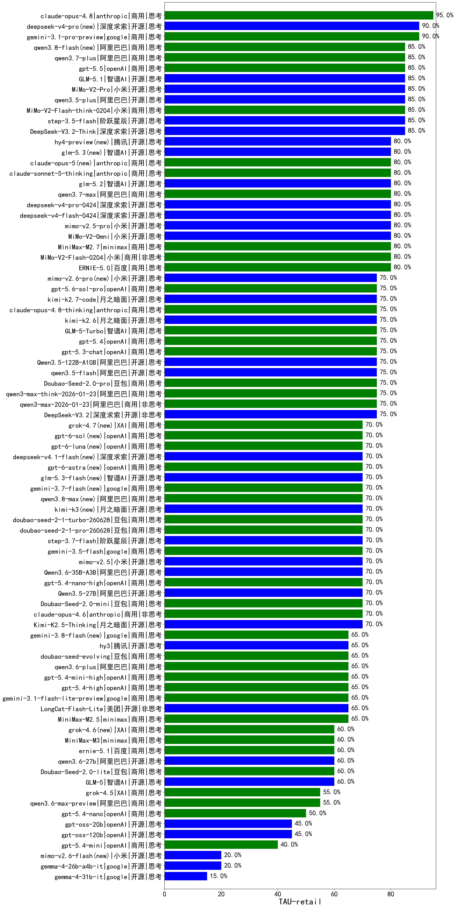

|类别|机构|大模型|【TAU-retail】准确率|平均耗时|平均消耗token|花费/千次（元）|排名（准确率）|
|---|---|-----|-------------------|-------|-----------|-----------|-----------|
|商用|anthropic|claude-opus-4.8(new)|95.0%|/|/|/|1|
|商用|google|gemini-3.1-pro-preview|90.0%|/|/|/|2|
|开源|深度求索|deepseek-v4-pro(new)|90.0%|/|/|/|3|
|商用|openAI|gpt-5.5|85.0%|/|/|/|4|
|开源|小米|MiMo-V2-Pro|85.0%|/|/|/|5|
|开源|深度求索|DeepSeek-V3.2-Think|85.0%|/|/|/|6|
|商用|阿里巴巴|qwen3.8-flash(new)|85.0%|/|/|/|7|
|开源|智谱AI|GLM-5.1|85.0%|/|/|/|8|
|开源|阿里巴巴|qwen3.5-plus|85.0%|/|/|/|9|
|商用|阿里巴巴|qwen3.7-plus(new)|85.0%|/|/|/|10|
|商用|小米|MiMo-V2-Flash-think-0204|85.0%|/|/|/|11|
|开源|阶跃星辰|step-3.5-flash|85.0%|/|/|/|12|
|商用|百度|ERNIE-5.0|80.0%|/|/|/|13|
|开源|美团|LongCat-Flash-Thinking-2601|80.0%|/|/|/|14|
|商用|阿里巴巴|qwen3.7-max|80.0%|/|/|/|15|
|开源|小米|mimo-v2.5-pro|80.0%|/|/|/|16|
|开源|深度求索|deepseek-v4-pro-0424|80.0%|/|/|/|17|
|开源|深度求索|deepseek-v4-flash-0424|80.0%|/|/|/|18|
|商用|小米|MiMo-V2-Flash-0204|80.0%|/|/|/|19|
|开源|小米|MiMo-V2-Omni|80.0%|/|/|/|20|
|商用|阿里巴巴|qwen3-max-preview-think|80.0%|/|/|/|21|
|商用|minimax|MiniMax-M2.7|80.0%|/|/|/|22|
|开源|智谱AI|GLM-4.7|80.0%|/|/|/|23|
|开源|智谱AI|glm-5.3(new)|80.0%|/|/|/|24|
|开源|智谱AI|glm-5.2(new)|80.0%|/|/|/|25|
|商用|anthropic|claude-opus-5(new)|80.0%|/|/|/|26|
|商用|anthropic|claude-sonnet-5-thinking(new)|80.0%|/|/|/|27|
|商用|openAI|gpt-5.6-sol-pro(new)|75.0%|/|/|/|28|
|开源|深度求索|DeepSeek-V3.2|75.0%|/|/|/|29|
|商用|openAI|gpt-5.4|75.0%|/|/|/|30|
|商用|openAI|gpt-5.3-chat|75.0%|/|/|/|31|
|开源|阿里巴巴|Qwen3.5-122B-A10B|75.0%|/|/|/|32|
|开源|月之暗面|kimi-k2.6|75.0%|/|/|/|33|
|开源|阿里巴巴|qwen3.5-flash|75.0%|/|/|/|34|
|商用|豆包|Doubao-Seed-2.0-pro|75.0%|/|/|/|35|
|开源|月之暗面|kimi-k2.7-code(new)|75.0%|/|/|/|36|
|商用|阿里巴巴|qwen3-max-think-2026-01-23|75.0%|/|/|/|37|
|商用|阿里巴巴|qwen3-max-2026-01-23|75.0%|/|/|/|38|
|商用|anthropic|claude-opus-4.8-thinking(new)|75.0%|/|/|/|39|
|商用|智谱AI|GLM-5-Turbo|75.0%|/|/|/|40|
|开源|月之暗面|kimi-k3(new)|70.0%|/|/|/|41|
|开源|阶跃星辰|step-3.7-flash(new)|70.0%|/|/|/|42|
|商用|豆包|doubao-seed-2-1-turbo-260628(new)|70.0%|/|/|/|43|
|开源|小米|mimo-v2.5|70.0%|/|/|/|44|
|商用|阿里巴巴|qwen3.8-max(new)|70.0%|/|/|/|45|
|商用|google|gemini-3.7-flash(new)|70.0%|/|/|/|46|
|商用|豆包|doubao-seed-2-1-pro-260628(new)|70.0%|/|/|/|47|
|商用|google|gemini-3.5-flash|70.0%|/|/|/|48|
|开源|阿里巴巴|Qwen3.6-35B-A3B|70.0%|/|/|/|49|
|商用|openAI|gpt-5.4-nano-high|70.0%|/|/|/|50|
|开源|智谱AI|glm-5.3-flash(new)|70.0%|/|/|/|51|
|商用|openAI|gpt-6-astra(new)|70.0%|/|/|/|52|
|商用|anthropic|claude-opus-4.6|70.0%|/|/|/|53|
|开源|阿里巴巴|Qwen3.5-27B|70.0%|/|/|/|54|
|商用|openAI|gpt-5.2|70.0%|/|/|/|55|
|商用|openAI|gpt-5.2-high|70.0%|/|/|/|56|
|开源|小米|MiMo-V2-Flash-think|70.0%|/|/|/|57|
|开源|月之暗面|Kimi-K2.5-Thinking|70.0%|/|/|/|58|
|商用|豆包|Doubao-Seed-2.0-mini|70.0%|/|/|/|59|
|商用|腾讯|hunyuan-2.0-thinking-20251109|70.0%|/|/|/|60|
|开源|阿里巴巴|qwen3-next-80b-a3b-thinking|70.0%|/|/|/|61|
|商用|google|gemini-3.1-flash-lite-preview|65.0%|/|/|/|62|
|开源|智谱AI|GLM-4.7-Flash|65.0%|/|/|/|63|
|商用|google|gemini-3.8-flash(new)|65.0%|/|/|/|64|
|开源|腾讯|hy3(new)|65.0%|/|/|/|65|
|商用|豆包|doubao-seed-evolving(new)|65.0%|/|/|/|66|
|商用|google|gemini-3-flash-preview|65.0%|/|/|/|67|
|商用|豆包|doubao-seed-1-8-251215|65.0%|/|/|/|68|
|开源|小米|MiMo-V2-Flash|65.0%|/|/|/|69|
|商用|阿里巴巴|qwen3.6-plus|65.0%|/|/|/|70|
|商用|openAI|gpt-5.4-mini-high|65.0%|/|/|/|71|
|商用|openAI|gpt-5.4-high|65.0%|/|/|/|72|
|商用|minimax|MiniMax-M2.5|65.0%|/|/|/|73|
|开源|美团|LongCat-Flash-Lite|65.0%|/|/|/|74|
|商用|openAI|gpt-5.2-medium|60.0%|/|/|/|75|
|商用|minimax|MiniMax-M3(new)|60.0%|/|/|/|76|
|商用|百度|ernie-5.1|60.0%|/|/|/|77|
|开源|阿里巴巴|qwen3.6-27b|60.0%|/|/|/|78|
|开源|智谱AI|GLM-5|60.0%|/|/|/|79|
|商用|XAI|grok-4.6(new)|60.0%|/|/|/|80|
|商用|豆包|Doubao-Seed-2.0-lite|60.0%|/|/|/|81|
|开源|Mistral|Ministral-3-14B-Instruct-2512|55.0%|/|/|/|82|
|商用|XAI|grok-4.5(new)|55.0%|/|/|/|83|
|商用|minimax|MiniMax-M2.1|55.0%|/|/|/|84|
|商用|腾讯|hunyuan-2.0-instruct-20251111|55.0%|/|/|/|85|
|商用|阿里巴巴|qwen3.6-max-preview|55.0%|/|/|/|86|
|开源|Mistral|Ministral-3-8B-Instruct-2512|50.0%|/|/|/|87|
|开源|Mistral|mistral-large-2512|50.0%|/|/|/|88|
|商用|openAI|gpt-5.4-nano|50.0%|/|/|/|89|
|商用|阿里巴巴|qwen-plus-2025-12-01|50.0%|/|/|/|90|
|商用|阿里巴巴|qwen-plus-think-2025-12-01|45.0%|/|/|/|91|
|开源|openAI|gpt-oss-20b|45.0%|/|/|/|92|
|开源|openAI|gpt-oss-120b|45.0%|/|/|/|93|
|开源|Mistral|Ministral-3-3B-Instruct-2512|40.0%|/|/|/|94|
|商用|openAI|gpt-5.4-mini|40.0%|/|/|/|95|
|开源|google|gemma-4-26b-a4b-it|20.0%|/|/|/|96|
|开源|google|gemma-4-31b-it|15.0%|/|/|/|97|

