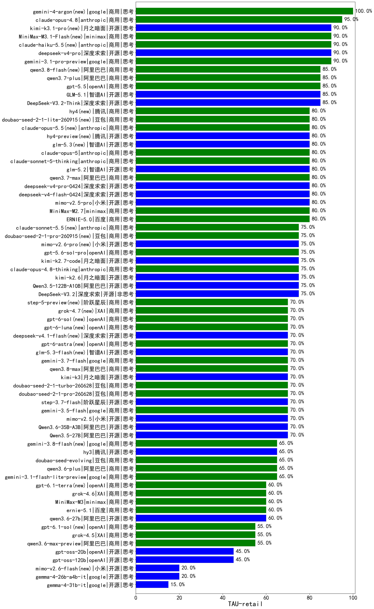

|类别|机构|大模型|【TAU-retail】准确率|平均耗时|平均消耗token|花费/千次（元）|排名（准确率）|
|---|---|-----|-------------------|-------|-----------|-----------|-----------|
|商用|google|gemini-4-argon(new)|100.0%|/|/|/|1|
|商用|openAI|gpt-6.2-astra(new)|95.0%|/|/|/|2|
|商用|google|gemini-4-carbon(new)|95.0%|/|/|/|3|
|商用|anthropic|claude-opus-4.8|95.0%|/|/|/|4|
|商用|openAI|gpt-6.2-sol(new)|90.0%|/|/|/|5|
|商用|minimax|MiniMax-M3.1-Flash(new)|90.0%|/|/|/|6|
|商用|anthropic|claude-haiku-5.5(new)|90.0%|/|/|/|7|
|商用|anthropic|claude-fable-5.2(new)|90.0%|/|/|/|8|
|开源|深度求索|deepseek-v4-pro|90.0%|/|/|/|9|
|商用|阿里巴巴|qwen4-max(new)|90.0%|/|/|/|10|
|开源|月之暗面|kimi-k3.1-pro(new)|90.0%|/|/|/|11|
|商用|google|gemini-3.1-pro-preview|90.0%|/|/|/|12|
|商用|阿里巴巴|qwen3.8-flash|85.0%|/|/|/|13|
|开源|智谱AI|GLM-5.1|85.0%|/|/|/|14|
|商用|阿里巴巴|qwen3.7-plus|85.0%|/|/|/|15|
|开源|深度求索|DeepSeek-V3.2-Think|85.0%|/|/|/|16|
|商用|openAI|gpt-5.5|85.0%|/|/|/|17|
|商用|anthropic|claude-opus-5|80.0%|/|/|/|18|
|商用|anthropic|claude-sonnet-5-thinking|80.0%|/|/|/|19|
|商用|minimax|MiniMax-M2.7|80.0%|/|/|/|20|
|商用|豆包|doubao-seed-2-1-lite-260915(new)|80.0%|/|/|/|21|
|商用|阿里巴巴|qwen3.7-max|80.0%|/|/|/|22|
|商用|腾讯|hy4(new)|80.0%|/|/|/|23|
|商用|百度|ERNIE-5.0|80.0%|/|/|/|24|
|商用|anthropic|claude-opus-5.5(new)|80.0%|/|/|/|25|
|开源|深度求索|deepseek-v4-pro-0424|80.0%|/|/|/|26|
|开源|深度求索|deepseek-v4-flash-0424|80.0%|/|/|/|27|
|开源|小米|mimo-v2.5-pro|80.0%|/|/|/|28|
|开源|腾讯|hy4-preview|80.0%|/|/|/|29|
|开源|智谱AI|glm-5.3|80.0%|/|/|/|30|
|开源|智谱AI|glm-5.2|80.0%|/|/|/|31|
|开源|小米|mimo-v2.6-pro|75.0%|/|/|/|32|
|开源|阿里巴巴|Qwen3.5-122B-A10B|75.0%|/|/|/|33|
|商用|openAI|gpt-5.6-sol-pro|75.0%|/|/|/|34|
|开源|月之暗面|kimi-k2.7-code|75.0%|/|/|/|35|
|商用|anthropic|claude-opus-4.8-thinking|75.0%|/|/|/|36|
|商用|anthropic|claude-sonnet-5.5(new)|75.0%|/|/|/|37|
|开源|月之暗面|kimi-k2.6|75.0%|/|/|/|38|
|商用|腾讯|hy4-flash(new)|75.0%|/|/|/|39|
|开源|深度求索|DeepSeek-V3.2|75.0%|/|/|/|40|
|商用|豆包|doubao-seed-2-1-pro-260915(new)|75.0%|/|/|/|41|
|商用|XAI|grok-4.7|70.0%|/|/|/|42|
|商用|openAI|gpt-6-sol|70.0%|/|/|/|43|
|商用|openAI|gpt-6-luna|70.0%|/|/|/|44|
|开源|智谱AI|glm-5.3-flash|70.0%|/|/|/|45|
|商用|阶跃星辰|step-5-preview(new)|70.0%|/|/|/|46|
|开源|深度求索|deepseek-v4.1-flash|70.0%|/|/|/|47|
|商用|openAI|gpt-6-astra|70.0%|/|/|/|48|
|商用|豆包|doubao-seed-2-1-turbo-260628|70.0%|/|/|/|49|
|商用|豆包|doubao-seed-2-1-pro-260628|70.0%|/|/|/|50|
|开源|阶跃星辰|step-3.7-flash|70.0%|/|/|/|51|
|开源|阿里巴巴|Qwen3.6-35B-A3B|70.0%|/|/|/|52|
|开源|阿里巴巴|Qwen3.5-27B|70.0%|/|/|/|53|
|商用|阿里巴巴|qwen3.8-max|70.0%|/|/|/|54|
|开源|月之暗面|kimi-k3|70.0%|/|/|/|55|
|开源|小米|mimo-v2.5|70.0%|/|/|/|56|
|商用|google|gemini-3.5-flash|70.0%|/|/|/|57|
|商用|google|gemini-3.7-flash|70.0%|/|/|/|58|
|商用|google|gemini-3.1-flash-lite-preview|65.0%|/|/|/|59|
|商用|google|gemini-3.8-flash|65.0%|/|/|/|60|
|商用|豆包|doubao-seed-evolving|65.0%|/|/|/|61|
|开源|腾讯|hy3|65.0%|/|/|/|62|
|商用|阿里巴巴|qwen3.6-plus|65.0%|/|/|/|63|
|商用|minimax|MiniMax-M3|60.0%|/|/|/|64|
|商用|openAI|gpt-6.1-terra(new)|60.0%|/|/|/|65|
|商用|百度|ernie-5.1|60.0%|/|/|/|66|
|开源|阿里巴巴|qwen3.6-27b|60.0%|/|/|/|67|
|商用|XAI|grok-4.6|60.0%|/|/|/|68|
|商用|XAI|grok-4.5|55.0%|/|/|/|69|
|商用|openAI|gpt-6.1-sol(new)|55.0%|/|/|/|70|
|商用|阿里巴巴|qwen3.6-max-preview|55.0%|/|/|/|71|
|开源|openAI|gpt-oss-20b|45.0%|/|/|/|72|
|开源|openAI|gpt-oss-120b|45.0%|/|/|/|73|
|开源|小米|mimo-v2.6-flash|20.0%|/|/|/|74|
|开源|google|gemma-4-26b-a4b-it|20.0%|/|/|/|75|
|开源|google|gemma-4-31b-it|15.0%|/|/|/|76|

