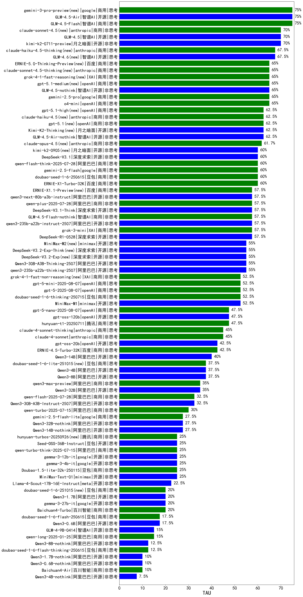

|类别|机构|大模型|【TAU】准确率|平均耗时|平均消耗token|花费/千次（元）|排名（准确率）|
|---|---|-----|-------------------|-------|-----------|-----------|-----------|
|开源|智谱AI|GLM-4.5-Air|75.0%|/|/|/|1|
|商用|智谱AI|GLM-4.5-Flash|75.0%|/|/|/|2|
|商用|google|gemini-3-pro-preview(new)|75.0%|/|/|/|3|
|开源|深度求索|DeepSeek-V3.2-Think(new)|72.5%|/|/|/|4|
|开源|智谱AI|GLM-4.5|70.0%|/|/|/|5|
|开源|月之暗面|kimi-k2-0711-preview|70.0%|/|/|/|6|
|商用|anthropic|claude-sonnet-4.5(new)|70.0%|/|/|/|7|
|开源|智谱AI|GLM-4.6(new)|67.5%|/|/|/|8|
|商用|anthropic|claude-haiku-4.5-thinking(new)|67.5%|/|/|/|9|
|商用|阿里巴巴|qwen3-max-2025-09-23(new)|67.5%|/|/|/|10|
|商用|anthropic|claude-sonnet-4.5-thinking(new)|65.0%|/|/|/|11|
|开源|智谱AI|GLM-4.5-nothink|65.0%|/|/|/|12|
|商用|google|gemini-2.5-pro|65.0%|/|/|/|13|
|商用|openAI|gpt-5.1-medium(new)|65.0%|/|/|/|14|
|商用|openAI|o4-mini|65.0%|/|/|/|15|
|商用|XAI|grok-4-1-fast-reasoning(new)|65.0%|/|/|/|16|
|开源|阿里巴巴|qwen3-next-80b-a3b-thinking(new)|65.0%|/|/|/|17|
|商用|百度|ERNIE-5.0-Thinking-Preview(new)|65.0%|/|/|/|18|
|商用|openAI|gpt-5-mini-high(new)|65.0%|/|/|/|19|
|开源|深度求索|DeepSeek-V3.2(new)|62.5%|/|/|/|20|
|商用|腾讯|hunyuan-2.0-thinking-20251109(new)|62.5%|/|/|/|21|
|商用|openAI|gpt-5.2(new)|62.5%|/|/|/|22|
|商用|openAI|gpt-5.1-high(new)|62.5%|/|/|/|23|
|开源|月之暗面|Kimi-K2-Thinking(new)|62.5%|/|/|/|24|
|开源|智谱AI|GLM-4.5-Air-nothink|62.5%|/|/|/|25|
|商用|openAI|gpt-5.1(new)|62.5%|/|/|/|26|
|商用|anthropic|claude-haiku-4.5(new)|62.5%|/|/|/|27|
|商用|anthropic|claude-opus-4.5(new)|61.7%|/|/|/|28|
|商用|google|gemini-3-flash-preview(new)|60.0%|/|/|/|29|
|商用|豆包|doubao-seed-1-6-250615|60.0%|/|/|/|30|
|商用|百度|ERNIE-X1-Turbo-32K|60.0%|/|/|/|31|
|开源|月之暗面|kimi-k2-0905(new)|60.0%|/|/|/|32|
|开源|深度求索|DeepSeek-V3.1|60.0%|/|/|/|33|
|商用|google|gemini-2.5-flash|60.0%|/|/|/|34|
|商用|阿里巴巴|qwen-flash-think-2025-07-28|60.0%|/|/|/|35|
|商用|openAI|gpt-5.2-high(new)|57.5%|/|/|/|36|
|商用|百度|ERNIE-X1.1-Preview(new)|57.5%|/|/|/|37|
|开源|深度求索|DeepSeek-V3.1-Think|57.5%|/|/|/|38|
|商用|阿里巴巴|qwen-plus-2025-07-28|57.5%|/|/|/|39|
|开源|阿里巴巴|qwen3-next-80b-a3b-instruct|57.5%|/|/|/|40|
|商用|openAI|gpt-5-nano-high(new)|57.5%|/|/|/|41|
|商用|智谱AI|GLM-4.5-Flash-nothink|57.5%|/|/|/|42|
|商用|豆包|doubao-seed-1-8-251215(new)|57.5%|/|/|/|43|
|开源|深度求索|DeepSeek-R1-0528|57.5%|/|/|/|44|
|开源|阿里巴巴|qwen3-235b-a22b-instruct-2507|57.5%|/|/|/|45|
|商用|XAI|grok-3-mini|57.5%|/|/|/|46|
|开源|minimax|MiniMax-M2(new)|55.0%|/|/|/|47|
|开源|阿里巴巴|Qwen3-30B-A3B-Thinking-2507|55.0%|/|/|/|48|
|开源|阿里巴巴|qwen3-235b-a22b-thinking-2507|55.0%|/|/|/|49|
|开源|深度求索|DeepSeek-V3.2-Exp-Think(new)|55.0%|/|/|/|50|
|开源|深度求索|DeepSeek-V3.2-Exp(new)|55.0%|/|/|/|51|
|开源|minimax|MiniMax-M1|52.5%|/|/|/|52|
|商用|XAI|grok-4-1-fast-non-reasoning(new)|52.5%|/|/|/|53|
|商用|openAI|gpt-5-mini-2025-08-07|52.5%|/|/|/|54|
|商用|openAI|gpt-5-2025-08-07|52.5%|/|/|/|55|
|商用|豆包|doubao-seed-1-6-thinking-250715|52.5%|/|/|/|56|
|商用|腾讯|hunyuan-2.0-instruct-20251111(new)|52.5%|/|/|/|57|
|商用|openAI|gpt-5.2-medium(new)|50.0%|/|/|/|58|
|开源|openAI|gpt-oss-120b|47.5%|/|/|/|59|
|商用|阿里巴巴|qwen-plus-think-2025-12-01(new)|47.5%|/|/|/|60|
|商用|openAI|gpt-5-nano-2025-08-07|47.5%|/|/|/|61|
|商用|腾讯|hunyuan-t1-20250711|47.5%|/|/|/|62|
|商用|anthropic|claude-4-sonnet|45.0%|/|/|/|63|
|商用|anthropic|claude-4-sonnet-thinking|45.0%|/|/|/|64|
|开源|Mistral|Ministral-3-14B-Instruct-2512(new)|45.0%|/|/|/|65|
|开源|Mistral|mistral-large-2512(new)|45.0%|/|/|/|66|
|商用|阿里巴巴|qwen-plus-2025-12-01(new)|45.0%|/|/|/|67|
|开源|openAI|gpt-oss-20b|42.5%|/|/|/|68|
|商用|百度|ERNIE-4.5-Turbo-32K|42.5%|/|/|/|69|
|开源|阿里巴巴|Qwen3-14B|40.0%|/|/|/|70|
|开源|Mistral|Ministral-3-8B-Instruct-2512(new)|37.5%|/|/|/|71|
|商用|豆包|doubao-seed-1-6-lite-251015(new)|37.5%|/|/|/|72|
|开源|阿里巴巴|Qwen3-8B|37.5%|/|/|/|73|
|开源|阿里巴巴|Qwen3-4B|37.5%|/|/|/|74|
|商用|阿里巴巴|qwen3-max-preview|35.0%|/|/|/|75|
|开源|阿里巴巴|Qwen3-32B|35.0%|/|/|/|76|
|开源|阿里巴巴|Qwen3-30B-A3B-Instruct-2507|32.5%|/|/|/|77|
|开源|Mistral|Ministral-3-3B-Instruct-2512(new)|32.5%|/|/|/|78|
|商用|阿里巴巴|qwen-flash-2025-07-28|32.5%|/|/|/|79|
|商用|阿里巴巴|qwen-turbo-2025-07-15|30.0%|/|/|/|80|
|开源|阿里巴巴|Qwen3-14B-nothink|27.5%|/|/|/|81|
|商用|google|gemini-2.5-flash-lite|27.5%|/|/|/|82|
|开源|阿里巴巴|Qwen3-32B-nothink|27.5%|/|/|/|83|
|商用|豆包|Doubao-1.5-lite-32k-250115|25.0%|/|/|/|84|
|开源|google|gemma-3-4b-it|25.0%|/|/|/|85|
|开源|minimax|MiniMax-Text-01|25.0%|/|/|/|86|
|开源|google|gemma-3-12b-it|25.0%|/|/|/|87|
|商用|腾讯|hunyuan-turbos-20250926(new)|25.0%|/|/|/|88|
|开源|豆包|Seed-OSS-36B-Instruct|25.0%|/|/|/|89|
|商用|阿里巴巴|qwen-turbo-think-2025-07-15|25.0%|/|/|/|90|
|开源|meta|Llama-4-Scout-17B-16E-Instruct|22.5%|/|/|/|91|
|商用|豆包|doubao-seed-1-6-251015(new)|20.0%|/|/|/|92|
|商用|百川智能|Baichuan4-Turbo|20.0%|/|/|/|93|
|开源|google|gemma-3-27b-it|20.0%|/|/|/|94|
|开源|阿里巴巴|Qwen3-1.7B|20.0%|/|/|/|95|
|商用|豆包|doubao-seed-1-6-flash-250615|17.5%|/|/|/|96|
|开源|阿里巴巴|Qwen3-0.6B|17.5%|/|/|/|97|
|开源|智谱AI|GLM-4-9B-0414|15.0%|/|/|/|98|
|商用|阿里巴巴|qwen-long-2025-01-25|15.0%|/|/|/|99|
|商用|豆包|doubao-seed-1-6-flash-thinking-250615|12.5%|/|/|/|100|
|开源|阿里巴巴|Qwen3-8B-nothink|12.5%|/|/|/|101|
|商用|百川智能|Baichuan4-Air|10.0%|/|/|/|102|
|开源|阿里巴巴|Qwen3-0.6B-nothink|10.0%|/|/|/|103|
|开源|阿里巴巴|Qwen3-1.7B-nothink|10.0%|/|/|/|104|
|开源|阿里巴巴|Qwen3-4B-nothink|7.5%|/|/|/|105|
|开源|阶跃星辰|step-3|/%|/|/|/|106|
|开源|深度求索|DeepSeek-R1-0528-Qwen3-8B|/%|/|/|/|107|
|商用|科大讯飞|xunfei-spark-x1-0725|/%|/|/|/|108|
|商用|百度|ERNIE-Lite-8K|/%|/|/|/|109|
|开源|腾讯|Hunyuan-A13B-Instruct-nothink|/%|/|/|/|110|
|开源|Mistral|Mistral-Small-3.2-24B-Instruct-2506|/%|/|/|/|111|
|开源|Mistral|Magistral-Small-2507|/%|/|/|/|112|
|商用|XAI|grok-4-0709|/%|/|/|/|113|
|开源|腾讯|Hunyuan-A13B-Instruct|/%|/|/|/|114|
|商用|360|360zhinao2-o1|/%|/|/|/|115|
|开源|百度|ERNIE-4.5-0.3B|/%|/|/|/|116|
|开源|百度|ERNIE-4.5-300B-A47B|/%|/|/|/|117|
|商用|阿里巴巴|qwen-plus-think-2025-07-28|/%|/|/|/|118|
|开源|meta|Llama-4-Maverick-17B-128E-Instruct-FP8|/%|/|/|/|119|
|开源|百度|ERNIE-4.5-21B-A3B|/%|/|/|/|120|
|商用|Mistral|mistral-medium-2508|/%|/|/|/|121|

