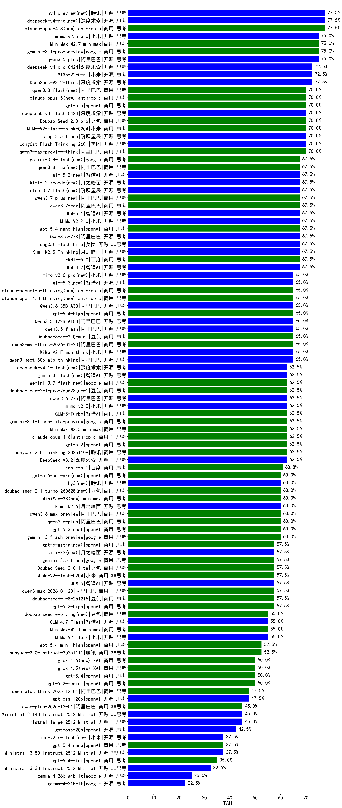

|类别|机构|大模型|【TAU】准确率|平均耗时|平均消耗token|花费/千次（元）|排名（准确率）|
|---|---|-----|-------------------|-------|-----------|-----------|-----------|
|商用|anthropic|claude-opus-4.8|77.5%|/|/|/|1|
|开源|深度求索|deepseek-v4-pro(new)|77.5%|/|/|/|2|
|开源|腾讯|hy4-preview(new)|77.5%|/|/|/|3|
|商用|minimax|MiniMax-M2.7|75.0%|/|/|/|4|
|商用|google|gemini-3.1-pro-preview|75.0%|/|/|/|5|
|开源|阿里巴巴|qwen3.5-plus|75.0%|/|/|/|6|
|开源|小米|mimo-v2.5-pro|75.0%|/|/|/|7|
|开源|深度求索|DeepSeek-V3.2-Think|72.5%|/|/|/|8|
|开源|小米|MiMo-V2-Omni|72.5%|/|/|/|9|
|开源|深度求索|deepseek-v4-pro-0424|72.5%|/|/|/|10|
|商用|阿里巴巴|qwen3.8-flash(new)|70.0%|/|/|/|11|
|商用|豆包|Doubao-Seed-2.0-pro|70.0%|/|/|/|12|
|商用|小米|MiMo-V2-Flash-think-0204|70.0%|/|/|/|13|
|商用|openAI|gpt-5.5|70.0%|/|/|/|14|
|开源|深度求索|deepseek-v4-flash-0424|70.0%|/|/|/|15|
|商用|anthropic|claude-opus-5(new)|70.0%|/|/|/|16|
|开源|阶跃星辰|step-3.5-flash|70.0%|/|/|/|17|
|开源|智谱AI|GLM-5.1|67.5%|/|/|/|18|
|商用|阿里巴巴|qwen3.8-max(new)|67.5%|/|/|/|19|
|商用|openAI|gpt-5.4-nano-high|67.5%|/|/|/|20|
|商用|google|gemini-3.8-flash(new)|67.5%|/|/|/|21|
|商用|阿里巴巴|qwen3.7-max|67.5%|/|/|/|22|
|开源|阿里巴巴|Qwen3.5-27B|67.5%|/|/|/|23|
|开源|美团|LongCat-Flash-Lite|67.5%|/|/|/|24|
|商用|阿里巴巴|qwen3.7-plus|67.5%|/|/|/|25|
|开源|阶跃星辰|step-3.7-flash|67.5%|/|/|/|26|
|开源|月之暗面|Kimi-K2.5-Thinking|67.5%|/|/|/|27|
|开源|月之暗面|kimi-k2.7-code|67.5%|/|/|/|28|
|商用|百度|ERNIE-5.0|67.5%|/|/|/|29|
|开源|智谱AI|glm-5.2|67.5%|/|/|/|30|
|开源|小米|MiMo-V2-Pro|67.5%|/|/|/|31|
|商用|anthropic|claude-sonnet-5-thinking|65.0%|/|/|/|32|
|开源|阿里巴巴|Qwen3.6-35B-A3B|65.0%|/|/|/|33|
|商用|anthropic|claude-opus-4.8-thinking|65.0%|/|/|/|34|
|商用|XAI|grok-4.7(new)|65.0%|/|/|/|35|
|商用|豆包|Doubao-Seed-2.0-mini|65.0%|/|/|/|36|
|商用|阿里巴巴|qwen3-max-think-2026-01-23|65.0%|/|/|/|37|
|商用|openAI|gpt-5.4-high|65.0%|/|/|/|38|
|商用|openAI|gpt-6-luna(new)|65.0%|/|/|/|39|
|开源|小米|mimo-v2.6-pro(new)|65.0%|/|/|/|40|
|开源|阿里巴巴|Qwen3.5-122B-A10B|65.0%|/|/|/|41|
|开源|阿里巴巴|qwen3.5-flash|65.0%|/|/|/|42|
|开源|智谱AI|glm-5.3(new)|65.0%|/|/|/|43|
|商用|google|gemini-3.7-flash(new)|62.5%|/|/|/|44|
|开源|深度求索|DeepSeek-V3.2|62.5%|/|/|/|45|
|商用|openAI|gpt-6-sol(new)|62.5%|/|/|/|46|
|商用|anthropic|claude-opus-4.6|62.5%|/|/|/|47|
|商用|minimax|MiniMax-M2.5|62.5%|/|/|/|48|
|开源|阿里巴巴|qwen3.6-27b|62.5%|/|/|/|49|
|商用|google|gemini-3.1-flash-lite-preview|62.5%|/|/|/|50|
|开源|深度求索|deepseek-v4.1-flash(new)|62.5%|/|/|/|51|
|开源|小米|mimo-v2.5|62.5%|/|/|/|52|
|商用|智谱AI|GLM-5-Turbo|62.5%|/|/|/|53|
|开源|智谱AI|glm-5.3-flash(new)|62.5%|/|/|/|54|
|商用|豆包|doubao-seed-2-1-pro-260628|62.5%|/|/|/|55|
|商用|百度|ernie-5.1|60.8%|/|/|/|56|
|开源|腾讯|hy3|60.0%|/|/|/|57|
|商用|openAI|gpt-5.6-sol-pro|60.0%|/|/|/|58|
|商用|豆包|doubao-seed-2-1-turbo-260628|60.0%|/|/|/|59|
|开源|月之暗面|kimi-k2.6|60.0%|/|/|/|60|
|商用|openAI|gpt-5.3-chat|60.0%|/|/|/|61|
|商用|阿里巴巴|qwen3.6-max-preview|60.0%|/|/|/|62|
|商用|阿里巴巴|qwen3.6-plus|60.0%|/|/|/|63|
|商用|minimax|MiniMax-M3|60.0%|/|/|/|64|
|商用|google|gemini-3.5-flash|57.5%|/|/|/|65|
|商用|阿里巴巴|qwen3-max-2026-01-23|57.5%|/|/|/|66|
|开源|月之暗面|kimi-k3(new)|57.5%|/|/|/|67|
|开源|智谱AI|GLM-5|57.5%|/|/|/|68|
|商用|小米|MiMo-V2-Flash-0204|57.5%|/|/|/|69|
|商用|豆包|Doubao-Seed-2.0-lite|57.5%|/|/|/|70|
|商用|openAI|gpt-6-astra(new)|57.5%|/|/|/|71|
|商用|豆包|doubao-seed-evolving|55.0%|/|/|/|72|
|商用|openAI|gpt-5.4-mini-high|52.5%|/|/|/|73|
|商用|XAI|grok-4.5|50.0%|/|/|/|74|
|商用|XAI|grok-4.6(new)|50.0%|/|/|/|75|
|商用|openAI|gpt-5.4|50.0%|/|/|/|76|
|开源|openAI|gpt-oss-120b|47.5%|/|/|/|77|
|开源|openAI|gpt-oss-20b|42.5%|/|/|/|78|
|开源|小米|mimo-v2.6-flash(new)|37.5%|/|/|/|79|
|商用|openAI|gpt-5.4-nano|37.5%|/|/|/|80|
|商用|openAI|gpt-5.4-mini|35.0%|/|/|/|81|
|开源|google|gemma-4-26b-a4b-it|25.0%|/|/|/|82|
|开源|google|gemma-4-31b-it|22.5%|/|/|/|83|

