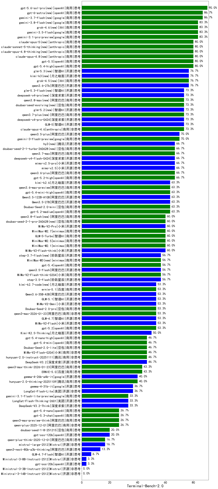

|类别|机构|大模型|【Terminal-Bench-2.0】准确率|平均耗时|平均消耗token|花费/千次（元）|排名（准确率）|
|---|---|-----|-------------------|-------|-----------|-----------|-----------|
|商用|openAI|gpt-5.6-sol-pro(new)|90.0%|291s|/|7480.7|1|
|商用|openAI|gpt-6-astra(new)|86.7%|175s|/|1945.8|2|
|商用|google|gemini-3.7-flash(new)|86.7%|262s|/|1516.8|3|
|商用|google|gemini-3.8-flash(new)|83.3%|402s|/|5040.5|4|
|商用|google|gemini-3.1-pro-preview|83.3%|329s|/|2507.0|5|
|商用|google|gemini-3.5-flash|83.3%|278s|/|3978.1|6|
|商用|XAI|grok-4.6(new)|83.3%|326s|/|1464.3|7|
|商用|openAI|gpt-5.5|80.0%|205s|/|2592.3|8|
|商用|anthropic|claude-opus-4.8(new)|80.0%|260s|/|9994.1|9|
|商用|openAI|gpt-5.4-high|80.0%|340s|/|2033.8|10|
|商用|anthropic|claude-sonnet-5-thinking(new)|80.0%|400s|/|5050.8|11|
|商用|anthropic|claude-opus-4.8-thinking(new)|80.0%|359s|/|6563.8|12|
|商用|anthropic|claude-opus-5(new)|80.0%|377s|/|3938.2|13|
|开源|月之暗面|kimi-k3(new)|76.7%|440s|/|841.8|14|
|商用|XAI|grok-4.5(new)|76.7%|317s|/|1347.2|15|
|开源|阿里巴巴|qwen3.6-27b|76.7%|465s|/|1023.0|16|
|开源|智谱AI|glm-5.3(new)|76.7%|506s|/|961.0|17|
|商用|阿里巴巴|qwen3.8-max(new)|73.3%|514s|/|1174.9|18|
|开源|深度求索|deepseek-v4-pro-0424|73.3%|535s|/|676.9|19|
|开源|智谱AI|GLM-5|73.3%|480s|/|300.3|20|
|商用|anthropic|claude-opus-4.6|73.3%|355s|/|5877.7|21|
|商用|阿里巴巴|qwen3.7-plus(new)|73.3%|460s|/|260.0|22|
|开源|深度求索|deepseek-v4-pro(new)|73.3%|469s|/|145.6|23|
|开源|智谱AI|glm-5.2(new)|73.3%|477s|/|1063.4|24|
|商用|豆包|doubao-seed-evolving(new)|73.3%|516s|/|1237.0|25|
|开源|智谱AI|glm-5.3-flash(new)|73.3%|397s|/|31.4|26|
|开源|阿里巴巴|qwen3.5-plus|70.0%|394s|/|334.5|27|
|商用|google|gemini-3-flash-preview|70.0%|271s|/|831.9|28|
|商用|阿里巴巴|qwen3.7-max|66.7%|418s|/|2077.0|29|
|商用|豆包|doubao-seed-2-1-turbo-260628(new)|66.7%|494s|/|547.0|30|
|开源|腾讯|hy3(new)|66.7%|429s|/|179.8|31|
|商用|openAI|gpt-5.2-high|66.7%|397s|/|2036.7|32|
|开源|深度求索|deepseek-v4-flash-0424|66.7%|521s|/|555.6|33|
|开源|小米|mimo-v2.5-pro|66.7%|478s|/|516.2|34|
|开源|小米|mimo-v2.5|66.7%|406s|/|618.2|35|
|商用|阿里巴巴|qwen3.6-plus|66.7%|457s|/|497.1|36|
|开源|阿里巴巴|Qwen3.5-27B|63.3%|424s|/|230.0|37|
|开源|阿里巴巴|Qwen3.5-122B-A10B|63.3%|1450s|/|312.5|38|
|商用|openAI|gpt-5.4-mini-high|63.3%|312s|/|1301.7|39|
|商用|豆包|Doubao-Seed-2.0-mini|63.3%|494s|/|79.6|40|
|商用|阿里巴巴|qwen3.6-max-preview|63.3%|1035s|/|3727.4|41|
|开源|月之暗面|kimi-k2.6|63.3%|540s|/|658.0|42|
|商用|openAI|gpt-5.2-medium|63.3%|379s|/|1911.8|43|
|商用|豆包|doubao-seed-2-1-pro-260628(new)|60.0%|564s|/|1002.1|44|
|开源|小米|MiMo-V2-Pro|60.0%|699s|/|981.3|45|
|商用|minimax|MiniMax-M2.7|60.0%|777s|/|245.9|46|
|商用|阿里巴巴|qwen3.8-flash(new)|60.0%|547s|/|67.1|47|
|商用|智谱AI|GLM-5-Turbo|60.0%|1092s|/|383.1|48|
|开源|小米|MiMo-V2-Flash-think|60.0%|517s|/|155.2|49|
|商用|minimax|MiniMax-M2.1|60.0%|444s|/|311.3|50|
|商用|minimax|MiniMax-M2.5|60.0%|792s|/|342.1|51|
|开源|阶跃星辰|step-3.5-flash|56.7%|514s|/|226.9|52|
|商用|小米|MiMo-V2-Flash-think-0204|56.7%|516s|/|161.3|53|
|商用|openAI|gpt-5.4|56.7%|337s|/|1286.4|54|
|开源|阿里巴巴|qwen3.5-flash|56.7%|1291s|/|175.5|55|
|开源|阶跃星辰|step-3.7-flash(new)|56.7%|461s|/|440.5|56|
|商用|minimax|MiniMax-M3(new)|56.7%|519s|/|877.2|57|
|开源|小米|MiMo-V2-Flash|53.3%|444s|/|123.3|58|
|开源|智谱AI|GLM-4.7|53.3%|394s|/|411.0|59|
|开源|月之暗面|kimi-k2.7-code(new)|53.3%|523s|/|585.7|60|
|商用|阿里巴巴|qwen3-max-2026-01-23|53.3%|428s|/|681.8|61|
|商用|百度|ernie-5.1|53.3%|459s|/|1059.0|62|
|商用|openAI|gpt-5.2|53.3%|359s|/|1977.4|63|
|商用|豆包|Doubao-Seed-2.0-pro|53.3%|392s|/|416.3|64|
|开源|阿里巴巴|Qwen3.6-35B-A3B|53.3%|383s|/|1451.9|65|
|开源|小米|MiMo-V2-Omni|53.3%|459s|/|808.5|66|
|开源|智谱AI|GLM-5.1|53.3%|567s|/|531.8|67|
|开源|月之暗面|Kimi-K2.5-Thinking|50.0%|924s|/|470.4|68|
|商用|小米|MiMo-V2-Flash-0204|46.7%|960s|/|242.8|69|
|商用|腾讯|hunyuan-2.0-instruct-20251111|46.7%|398s|/|3168.2|70|
|商用|豆包|Doubao-Seed-2.0-lite|46.7%|260s|/|129.4|71|
|商用|openAI|gpt-5.4-nano-high|46.7%|401s|/|339.3|72|
|商用|openAI|gpt-5.4-mini|46.7%|236s|/|601.1|73|
|开源|深度求索|DeepSeek-V3.2|46.7%|422s|/|77.2|74|
|商用|百度|ERNIE-5.0|43.3%|713s|/|1405.2|75|
|商用|阿里巴巴|qwen3-max-think-2026-01-23|43.3%|650s|/|241.0|76|
|开源|google|gemma-4-26b-a4b-it|40.0%|532s|/|177.1|77|
|商用|腾讯|hunyuan-2.0-thinking-20251109|40.0%|345s|/|1366.7|78|
|开源|美团|LongCat-Flash-Lite|36.7%|395s|/|0.0|79|
|开源|google|gemma-4-31b-it|36.7%|749s|/|70.3|80|
|开源|美团|LongCat-Flash-Thinking-2601|33.3%|794s|/|0.0|81|
|商用|google|gemini-3.1-flash-lite-preview|33.3%|462s|/|265.3|82|
|开源|深度求索|DeepSeek-V3.2-Think|33.3%|616s|/|104.8|83|
|商用|阿里巴巴|qwen3-max-preview-think|26.7%|564s|/|634.0|84|
|商用|openAI|gpt-5.3-chat|26.7%|140s|/|924.3|85|
|商用|openAI|gpt-5.4-nano|26.7%|320s|/|103.9|86|
|商用|阿里巴巴|qwen-plus-2025-12-01|26.7%|248s|/|140.6|87|
|开源|openAI|gpt-oss-120b|20.0%|173s|/|18.8|88|
|商用|豆包|doubao-seed-1-8-251215|20.0%|263s|/|94.6|89|
|商用|阿里巴巴|qwen-plus-think-2025-12-01|16.7%|395s|/|153.1|90|
|开源|Mistral|mistral-large-2512|16.7%|212s|/|228.6|91|
|开源|阿里巴巴|qwen3-next-80b-a3b-thinking|13.3%|305s|/|149.4|92|
|开源|智谱AI|GLM-4.7-Flash|6.7%|243s|/|0.0|93|
|开源|Mistral|Ministral-3-8B-Instruct-2512|3.3%|619s|/|3484.6|94|
|开源|openAI|gpt-oss-20b|3.3%|48s|/|2.8|95|
|开源|Mistral|Ministral-3-3B-Instruct-2512|0.0%|620s|/|2607.9|96|
|开源|Mistral|Ministral-3-14B-Instruct-2512|0.0%|23s|/|32.9|97|

