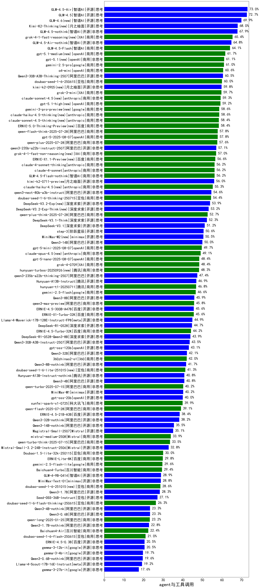

|类别|机构|大模型|【agent与工具调用】准确率|平均耗时|平均消耗token|花费/千次（元）|排名（准确率）|
|---|---|-----|-------------------|-------|-----------|-----------|-----------|
|开源|智谱AI|GLM-4.5-Air|73.0%|/|/|/|1|
|开源|智谱AI|GLM-4.5|72.7%|/|/|/|2|
|开源|智谱AI|GLM-4.6(new)|69.9%|/|/|/|3|
|开源|智谱AI|GLM-4.5-nothink|67.9%|/|/|/|4|
|开源|智谱AI|GLM-4.5-Air-nothink|64.8%|/|/|/|5|
|商用|智谱AI|GLM-4.5-Flash|64.1%|/|/|/|6|
|商用|google|gemini-2.5-pro|61.0%|/|/|/|7|
|商用|openAI|o4-mini|60.6%|/|/|/|8|
|开源|阿里巴巴|Qwen3-30B-A3B-Thinking-2507|60.5%|/|/|/|9|
|商用|豆包|doubao-seed-1-6-250615|60.0%|/|/|/|10|
|商用|XAI|grok-3-mini|59.7%|/|/|/|11|
|商用|阿里巴巴|qwen-flash-think-2025-07-28|57.8%|/|/|/|12|
|商用|openAI|gpt-5-2025-08-07|57.8%|/|/|/|13|
|商用|阿里巴巴|qwen-plus-2025-07-28|57.6%|/|/|/|14|
|开源|阿里巴巴|qwen3-235b-a22b-instruct-2507|57.1%|/|/|/|15|
|商用|anthropic|claude-4-sonnet|56.2%|/|/|/|16|
|商用|anthropic|claude-4-sonnet-thinking|56.2%|/|/|/|17|
|商用|智谱AI|GLM-4.5-Flash-nothink|56.2%|/|/|/|18|
|开源|月之暗面|kimi-k2-0711-preview|56.0%|/|/|/|19|
|开源|阿里巴巴|qwen3-next-80b-a3b-instruct(new)|54.6%|/|/|/|20|
|商用|豆包|doubao-seed-1-6-thinking-250715|54.4%|/|/|/|21|
|开源|深度求索|DeepSeek-V3.2-Exp(new)|53.9%|/|/|/|22|
|开源|深度求索|DeepSeek-V3.2-Exp-Think(new)|53.2%|/|/|/|23|
|商用|阿里巴巴|qwen-plus-think-2025-07-28|52.7%|/|/|/|24|
|开源|深度求索|DeepSeek-V3.1-Think|52.3%|/|/|/|25|
|开源|深度求索|DeepSeek-V3.1|51.2%|/|/|/|26|
|开源|阶跃星辰|step-3|50.6%|/|/|/|27|
|开源|minimax|MiniMax-M2(new)|50.5%|/|/|/|28|
|开源|阿里巴巴|Qwen3-14B|50.0%|/|/|/|29|
|商用|openAI|gpt-5-mini-2025-08-07|49.7%|/|/|/|30|
|商用|openAI|gpt-5-nano-2025-08-07|48.4%|/|/|/|31|
|商用|XAI|grok-4-0709|48.4%|/|/|/|32|
|商用|腾讯|hunyuan-turbos-20250926(new)|48.3%|/|/|/|33|
|开源|阿里巴巴|qwen3-235b-a22b-thinking-2507|47.4%|/|/|/|34|
|开源|腾讯|Hunyuan-A13B-Instruct|46.9%|/|/|/|35|
|商用|腾讯|hunyuan-t1-20250711|46.8%|/|/|/|36|
|商用|google|gemini-2.5-flash|46.6%|/|/|/|37|
|商用|阿里巴巴|qwen-turbo-think-2025-07-15|46.3%|/|/|/|38|
|开源|阿里巴巴|Qwen3-8B|45.9%|/|/|/|39|
|商用|阿里巴巴|qwen3-max-preview|45.8%|/|/|/|40|
|开源|百度|ERNIE-4.5-300B-A47B|45.6%|/|/|/|41|
|商用|百度|ERNIE-X1-Turbo-32K|45.6%|/|/|/|42|
|开源|meta|Llama-4-Maverick-17B-128E-Instruct-FP8|44.9%|/|/|/|43|
|开源|深度求索|DeepSeek-R1-0528|44.7%|/|/|/|44|
|商用|百度|ERNIE-4.5-Turbo-32K|44.2%|/|/|/|45|
|开源|深度求索|DeepSeek-R1-0528-Qwen3-8B|43.9%|/|/|/|46|
|开源|阿里巴巴|Qwen3-30B-A3B-Instruct-2507|43.5%|/|/|/|47|
|开源|openAI|gpt-oss-120b|43.1%|/|/|/|48|
|开源|阿里巴巴|Qwen3-32B|42.1%|/|/|/|49|
|商用|360|360zhinao2-o1|42.0%|/|/|/|50|
|开源|阿里巴巴|Qwen3-8B-nothink|41.7%|/|/|/|51|
|商用|豆包|doubao-seed-1-6-lite-251015(new)|41.3%|/|/|/|52|
|开源|腾讯|Hunyuan-A13B-Instruct-nothink|40.8%|/|/|/|53|
|开源|阿里巴巴|Qwen3-4B|40.8%|/|/|/|54|
|商用|阿里巴巴|qwen-turbo-2025-07-15|40.2%|/|/|/|55|
|开源|minimax|MiniMax-M1|40.2%|/|/|/|56|
|开源|openAI|gpt-oss-20b|40.0%|/|/|/|57|
|商用|科大讯飞|xunfei-spark-x1-0725|39.9%|/|/|/|58|
|商用|阿里巴巴|qwen-flash-2025-07-28|39.1%|/|/|/|59|
|开源|百度|ERNIE-4.5-21B-A3B|38.4%|/|/|/|60|
|开源|阿里巴巴|Qwen3-32B-nothink|38.2%|/|/|/|61|
|开源|阿里巴巴|Qwen3-14B-nothink|35.5%|/|/|/|62|
|开源|Mistral|Magistral-Small-2507|35.1%|/|/|/|63|
|商用|Mistral|mistral-medium-2508|33.9%|/|/|/|64|
|开源|Mistral|Mistral-Small-3.2-24B-Instruct-2506|32.8%|/|/|/|65|
|商用|豆包|Doubao-1.5-lite-32k-250115|30.0%|/|/|/|66|
|商用|百度|ERNIE-Lite-8K|29.8%|/|/|/|67|
|商用|google|gemini-2.5-flash-lite|29.6%|/|/|/|68|
|商用|百川智能|Baichuan4-Turbo|29.4%|/|/|/|69|
|开源|智谱AI|GLM-4-9B-0414|28.9%|/|/|/|70|
|开源|minimax|MiniMax-Text-01|28.8%|/|/|/|71|
|商用|豆包|doubao-seed-1-6-251015(new)|28.6%|/|/|/|72|
|开源|阿里巴巴|Qwen3-1.7B|28.3%|/|/|/|73|
|开源|豆包|Seed-OSS-36B-Instruct|27.1%|/|/|/|74|
|商用|豆包|doubao-seed-1-6-flash-thinking-250615|26.3%|/|/|/|75|
|开源|阿里巴巴|Qwen3-4B-nothink|23.3%|/|/|/|76|
|开源|阿里巴巴|Qwen3-0.6B|23.3%|/|/|/|77|
|商用|阿里巴巴|qwen-long-2025-01-25|23.2%|/|/|/|78|
|开源|阿里巴巴|Qwen3-1.7B-nothink|22.8%|/|/|/|79|
|商用|百川智能|Baichuan4-Air|22.4%|/|/|/|80|
|商用|豆包|doubao-seed-1-6-flash-250615|21.0%|/|/|/|81|
|开源|百度|ERNIE-4.5-0.3B|20.5%|/|/|/|82|
|开源|google|gemma-3-12b-it|20.5%|/|/|/|83|
|开源|google|gemma-3-4b-it|19.7%|/|/|/|84|
|开源|阿里巴巴|Qwen3-0.6B-nothink|19.6%|/|/|/|85|
|开源|meta|Llama-4-Scout-17B-16E-Instruct|19.2%|/|/|/|86|
|开源|google|gemma-3-27b-it|17.6%|/|/|/|87|

