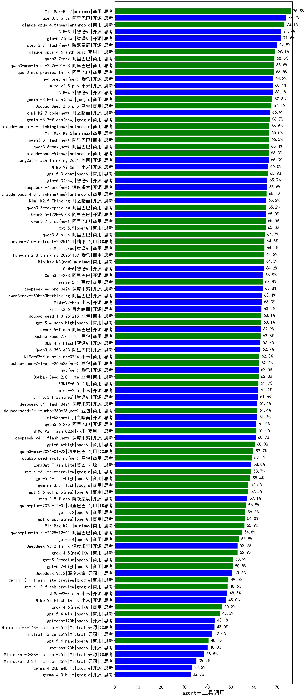

|类别|机构|大模型|【agent与工具调用】准确率|平均耗时|平均消耗token|花费/千次（元）|排名（准确率）|
|---|---|-----|-------------------|-------|-----------|-----------|-----------|
|商用|minimax|MiniMax-M2.7|75.8%|/|/|/|1|
|开源|阿里巴巴|qwen3.5-plus|73.7%|/|/|/|2|
|商用|anthropic|claude-opus-4.8(new)|73.1%|/|/|/|3|
|开源|智谱AI|GLM-5.1|71.7%|/|/|/|4|
|开源|智谱AI|glm-5.2(new)|71.6%|/|/|/|5|
|开源|阶跃星辰|step-3.7-flash(new)|69.9%|/|/|/|6|
|商用|anthropic|claude-opus-4.6|69.1%|/|/|/|7|
|商用|阿里巴巴|qwen3.7-max|68.8%|/|/|/|8|
|商用|阿里巴巴|qwen3-max-think-2026-01-23|68.6%|/|/|/|9|
|商用|阿里巴巴|qwen3-max-preview-think|68.5%|/|/|/|10|
|开源|小米|mimo-v2.5-pro|68.1%|/|/|/|11|
|开源|智谱AI|GLM-4.7|68.1%|/|/|/|12|
|商用|google|gemini-3.8-flash(new)|67.8%|/|/|/|13|
|商用|豆包|Doubao-Seed-2.0-pro|67.5%|/|/|/|14|
|开源|月之暗面|kimi-k2.7-code(new)|66.9%|/|/|/|15|
|商用|google|gemini-3.7-flash(new)|66.7%|/|/|/|16|
|商用|anthropic|claude-sonnet-5-thinking(new)|66.5%|/|/|/|17|
|商用|minimax|MiniMax-M2.5|66.5%|/|/|/|18|
|商用|阿里巴巴|qwen3.8-flash(new)|66.5%|/|/|/|19|
|商用|阿里巴巴|qwen3.8-max(new)|66.4%|/|/|/|20|
|商用|anthropic|claude-opus-5(new)|66.3%|/|/|/|21|
|开源|美团|LongCat-Flash-Thinking-2601|66.3%|/|/|/|22|
|开源|小米|MiMo-V2-Omni|66.0%|/|/|/|23|
|商用|openAI|gpt-5.3-chat|65.9%|/|/|/|24|
|开源|智谱AI|glm-5.3(new)|65.7%|/|/|/|25|
|开源|深度求索|deepseek-v4-pro(new)|65.6%|/|/|/|26|
|商用|anthropic|claude-opus-4.8-thinking(new)|65.4%|/|/|/|27|
|开源|月之暗面|Kimi-K2.5-Thinking|65.2%|/|/|/|28|
|商用|阿里巴巴|qwen3.6-max-preview|65.2%|/|/|/|29|
|开源|阿里巴巴|Qwen3.5-122B-A10B|65.0%|/|/|/|30|
|商用|阿里巴巴|qwen3.7-plus(new)|65.0%|/|/|/|31|
|商用|openAI|gpt-5.5|65.0%|/|/|/|32|
|商用|阿里巴巴|qwen3.6-plus|64.7%|/|/|/|33|
|商用|腾讯|hunyuan-2.0-instruct-20251111|64.5%|/|/|/|34|
|商用|智谱AI|GLM-5-Turbo|64.5%|/|/|/|35|
|商用|腾讯|hunyuan-2.0-thinking-20251109|64.3%|/|/|/|36|
|商用|minimax|MiniMax-M3(new)|64.3%|/|/|/|37|
|开源|智谱AI|GLM-5|64.2%|/|/|/|38|
|开源|阿里巴巴|Qwen3.5-27B|63.9%|/|/|/|39|
|商用|百度|ernie-5.1|63.8%|/|/|/|40|
|开源|深度求索|deepseek-v4-pro-0424|63.8%|/|/|/|41|
|开源|阿里巴巴|qwen3-next-80b-a3b-thinking|63.4%|/|/|/|42|
|开源|小米|MiMo-V2-Pro|63.3%|/|/|/|43|
|开源|月之暗面|kimi-k2.6|63.2%|/|/|/|44|
|商用|豆包|doubao-seed-1-8-251215|63.1%|/|/|/|45|
|商用|openAI|gpt-5.4-nano-high|63.1%|/|/|/|46|
|开源|阿里巴巴|qwen3.5-flash|62.9%|/|/|/|47|
|商用|豆包|Doubao-Seed-2.0-mini|62.8%|/|/|/|48|
|开源|智谱AI|GLM-4.7-Flash|62.7%|/|/|/|49|
|开源|阿里巴巴|Qwen3.6-35B-A3B|62.7%|/|/|/|50|
|商用|小米|MiMo-V2-Flash-think-0204|62.3%|/|/|/|51|
|商用|豆包|doubao-seed-2-1-pro-260628(new)|62.2%|/|/|/|52|
|开源|腾讯|hy3(new)|62.0%|/|/|/|53|
|商用|豆包|Doubao-Seed-2.0-lite|62.0%|/|/|/|54|
|商用|百度|ERNIE-5.0|61.9%|/|/|/|55|
|开源|小米|mimo-v2.5|61.9%|/|/|/|56|
|开源|智谱AI|glm-5.3-flash(new)|61.6%|/|/|/|57|
|开源|深度求索|deepseek-v4-flash-0424|61.4%|/|/|/|58|
|商用|豆包|doubao-seed-2-1-turbo-260628(new)|61.4%|/|/|/|59|
|开源|月之暗面|kimi-k3(new)|61.3%|/|/|/|60|
|开源|阿里巴巴|qwen3.6-27b|61.0%|/|/|/|61|
|商用|小米|MiMo-V2-Flash-0204|61.0%|/|/|/|62|
|商用|openAI|gpt-5.4-high|60.3%|/|/|/|63|
|商用|阿里巴巴|qwen3-max-2026-01-23|59.7%|/|/|/|64|
|商用|豆包|doubao-seed-evolving(new)|59.1%|/|/|/|65|
|开源|美团|LongCat-Flash-Lite|58.8%|/|/|/|66|
|商用|google|gemini-3.1-pro-preview|58.7%|/|/|/|67|
|商用|openAI|gpt-5.4-mini-high|58.4%|/|/|/|68|
|商用|google|gemini-3.5-flash|57.5%|/|/|/|69|
|商用|openAI|gpt-5.6-sol-pro(new)|57.5%|/|/|/|70|
|开源|阶跃星辰|step-3.5-flash|57.1%|/|/|/|71|
|商用|阿里巴巴|qwen-plus-2025-12-01|56.5%|/|/|/|72|
|商用|openAI|gpt-5.2|56.2%|/|/|/|73|
|商用|openAI|gpt-6-astra(new)|56.0%|/|/|/|74|
|商用|minimax|MiniMax-M2.1|55.9%|/|/|/|75|
|商用|阿里巴巴|qwen-plus-think-2025-12-01|54.8%|/|/|/|76|
|商用|openAI|gpt-5.4|53.5%|/|/|/|77|
|开源|深度求索|DeepSeek-V3.2-Think|52.9%|/|/|/|78|
|商用|XAI|grok-4.5(new)|52.9%|/|/|/|79|
|商用|openAI|gpt-5.2-medium|50.9%|/|/|/|80|
|商用|openAI|gpt-5.2-high|50.8%|/|/|/|81|
|开源|深度求索|DeepSeek-V3.2|50.6%|/|/|/|82|
|商用|google|gemini-3.1-flash-lite-preview|49.0%|/|/|/|83|
|商用|google|gemini-3-flash-preview|48.6%|/|/|/|84|
|开源|小米|MiMo-V2-Flash|48.5%|/|/|/|85|
|开源|小米|MiMo-V2-Flash-think|48.0%|/|/|/|86|
|商用|XAI|grok-4.6(new)|46.2%|/|/|/|87|
|商用|openAI|gpt-5.4-mini|45.3%|/|/|/|88|
|开源|openAI|gpt-oss-120b|43.1%|/|/|/|89|
|开源|Mistral|Ministral-3-14B-Instruct-2512|43.0%|/|/|/|90|
|开源|Mistral|mistral-large-2512|42.0%|/|/|/|91|
|商用|openAI|gpt-5.4-nano|40.4%|/|/|/|92|
|开源|openAI|gpt-oss-20b|40.0%|/|/|/|93|
|开源|Mistral|Ministral-3-8B-Instruct-2512|38.5%|/|/|/|94|
|开源|Mistral|Ministral-3-3B-Instruct-2512|35.2%|/|/|/|95|
|开源|google|gemma-4-26b-a4b-it|33.3%|/|/|/|96|
|开源|google|gemma-4-31b-it|32.7%|/|/|/|97|

