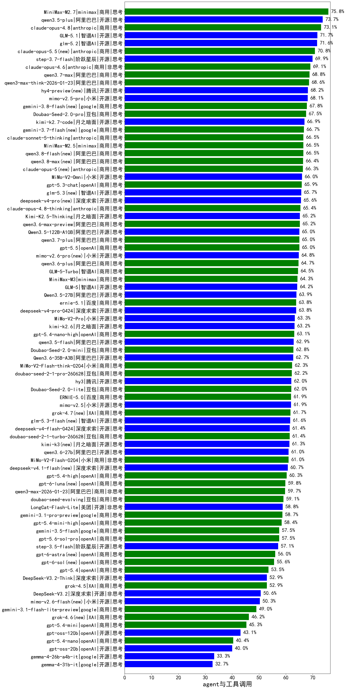

|类别|机构|大模型|【agent与工具调用】准确率|平均耗时|平均消耗token|花费/千次（元）|排名（准确率）|
|---|---|-----|-------------------|-------|-----------|-----------|-----------|
|商用|minimax|MiniMax-M2.7|75.8%|/|/|/|1|
|开源|阿里巴巴|qwen3.5-plus|73.7%|/|/|/|2|
|商用|anthropic|claude-opus-4.8|73.1%|/|/|/|3|
|开源|智谱AI|GLM-5.1|71.7%|/|/|/|4|
|开源|智谱AI|glm-5.2|71.6%|/|/|/|5|
|商用|anthropic|claude-opus-5.5(new)|70.8%|/|/|/|6|
|开源|阶跃星辰|step-3.7-flash|69.9%|/|/|/|7|
|商用|anthropic|claude-opus-4.6|69.1%|/|/|/|8|
|商用|阿里巴巴|qwen3.7-max|68.8%|/|/|/|9|
|商用|阿里巴巴|qwen3-max-think-2026-01-23|68.6%|/|/|/|10|
|开源|腾讯|hy4-preview(new)|68.2%|/|/|/|11|
|开源|小米|mimo-v2.5-pro|68.1%|/|/|/|12|
|商用|google|gemini-3.8-flash(new)|67.8%|/|/|/|13|
|商用|豆包|Doubao-Seed-2.0-pro|67.5%|/|/|/|14|
|开源|月之暗面|kimi-k2.7-code|66.9%|/|/|/|15|
|商用|google|gemini-3.7-flash(new)|66.7%|/|/|/|16|
|商用|anthropic|claude-sonnet-5-thinking|66.5%|/|/|/|17|
|商用|minimax|MiniMax-M2.5|66.5%|/|/|/|18|
|商用|阿里巴巴|qwen3.8-flash(new)|66.5%|/|/|/|19|
|商用|阿里巴巴|qwen3.8-max(new)|66.4%|/|/|/|20|
|商用|anthropic|claude-opus-5(new)|66.3%|/|/|/|21|
|开源|小米|MiMo-V2-Omni|66.0%|/|/|/|22|
|商用|openAI|gpt-5.3-chat|65.9%|/|/|/|23|
|开源|智谱AI|glm-5.3(new)|65.7%|/|/|/|24|
|开源|深度求索|deepseek-v4-pro(new)|65.6%|/|/|/|25|
|商用|anthropic|claude-opus-4.8-thinking|65.4%|/|/|/|26|
|开源|月之暗面|Kimi-K2.5-Thinking|65.2%|/|/|/|27|
|商用|阿里巴巴|qwen3.6-max-preview|65.2%|/|/|/|28|
|开源|阿里巴巴|Qwen3.5-122B-A10B|65.0%|/|/|/|29|
|商用|阿里巴巴|qwen3.7-plus|65.0%|/|/|/|30|
|商用|openAI|gpt-5.5|65.0%|/|/|/|31|
|开源|小米|mimo-v2.6-pro(new)|64.8%|/|/|/|32|
|商用|阿里巴巴|qwen3.6-plus|64.7%|/|/|/|33|
|商用|智谱AI|GLM-5-Turbo|64.5%|/|/|/|34|
|商用|minimax|MiniMax-M3|64.3%|/|/|/|35|
|开源|智谱AI|GLM-5|64.2%|/|/|/|36|
|开源|阿里巴巴|Qwen3.5-27B|63.9%|/|/|/|37|
|商用|百度|ernie-5.1|63.8%|/|/|/|38|
|开源|深度求索|deepseek-v4-pro-0424|63.8%|/|/|/|39|
|开源|小米|MiMo-V2-Pro|63.3%|/|/|/|40|
|开源|月之暗面|kimi-k2.6|63.2%|/|/|/|41|
|商用|openAI|gpt-5.4-nano-high|63.1%|/|/|/|42|
|开源|阿里巴巴|qwen3.5-flash|62.9%|/|/|/|43|
|商用|豆包|Doubao-Seed-2.0-mini|62.8%|/|/|/|44|
|开源|阿里巴巴|Qwen3.6-35B-A3B|62.7%|/|/|/|45|
|商用|小米|MiMo-V2-Flash-think-0204|62.3%|/|/|/|46|
|商用|豆包|doubao-seed-2-1-pro-260628|62.2%|/|/|/|47|
|开源|腾讯|hy3|62.0%|/|/|/|48|
|商用|豆包|Doubao-Seed-2.0-lite|62.0%|/|/|/|49|
|商用|百度|ERNIE-5.0|61.9%|/|/|/|50|
|开源|小米|mimo-v2.5|61.9%|/|/|/|51|
|商用|XAI|grok-4.7(new)|61.7%|/|/|/|52|
|开源|智谱AI|glm-5.3-flash(new)|61.6%|/|/|/|53|
|开源|深度求索|deepseek-v4-flash-0424|61.4%|/|/|/|54|
|商用|豆包|doubao-seed-2-1-turbo-260628|61.4%|/|/|/|55|
|开源|月之暗面|kimi-k3(new)|61.3%|/|/|/|56|
|开源|阿里巴巴|qwen3.6-27b|61.0%|/|/|/|57|
|商用|小米|MiMo-V2-Flash-0204|61.0%|/|/|/|58|
|开源|深度求索|deepseek-v4.1-flash(new)|60.7%|/|/|/|59|
|商用|openAI|gpt-5.4-high|60.3%|/|/|/|60|
|商用|openAI|gpt-6-luna(new)|59.8%|/|/|/|61|
|商用|阿里巴巴|qwen3-max-2026-01-23|59.7%|/|/|/|62|
|商用|豆包|doubao-seed-evolving|59.1%|/|/|/|63|
|开源|美团|LongCat-Flash-Lite|58.8%|/|/|/|64|
|商用|google|gemini-3.1-pro-preview|58.7%|/|/|/|65|
|商用|openAI|gpt-5.4-mini-high|58.4%|/|/|/|66|
|商用|google|gemini-3.5-flash|57.5%|/|/|/|67|
|商用|openAI|gpt-5.6-sol-pro|57.5%|/|/|/|68|
|开源|阶跃星辰|step-3.5-flash|57.1%|/|/|/|69|
|商用|openAI|gpt-6-astra(new)|56.0%|/|/|/|70|
|商用|openAI|gpt-6-sol(new)|55.6%|/|/|/|71|
|商用|openAI|gpt-5.4|53.5%|/|/|/|72|
|开源|深度求索|DeepSeek-V3.2-Think|52.9%|/|/|/|73|
|商用|XAI|grok-4.5|52.9%|/|/|/|74|
|开源|深度求索|DeepSeek-V3.2|50.6%|/|/|/|75|
|开源|小米|mimo-v2.6-flash(new)|50.3%|/|/|/|76|
|商用|google|gemini-3.1-flash-lite-preview|49.0%|/|/|/|77|
|商用|XAI|grok-4.6(new)|46.2%|/|/|/|78|
|商用|openAI|gpt-5.4-mini|45.3%|/|/|/|79|
|开源|openAI|gpt-oss-120b|43.1%|/|/|/|80|
|商用|openAI|gpt-5.4-nano|40.4%|/|/|/|81|
|开源|openAI|gpt-oss-20b|40.0%|/|/|/|82|
|开源|google|gemma-4-26b-a4b-it|33.3%|/|/|/|83|
|开源|google|gemma-4-31b-it|32.7%|/|/|/|84|

