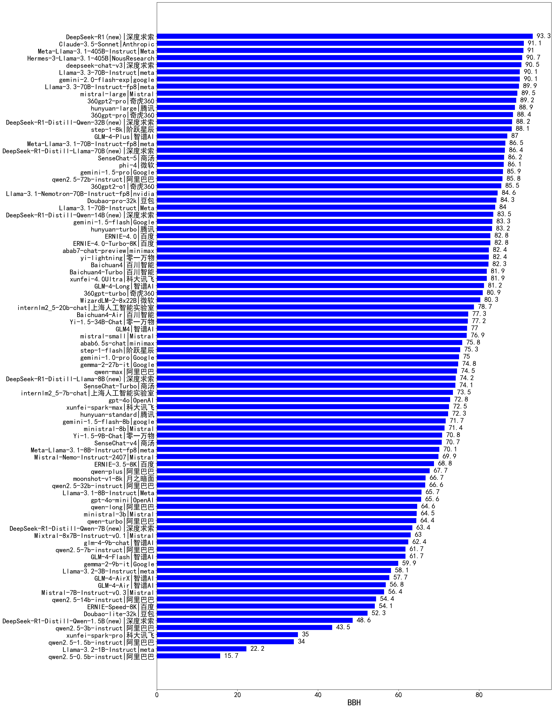

| 类别 | 大模型                         | 符号推理BBH | 排名 |
|-----|------------------------------|---------|----|
|商用|Claude-3.5-Sonnet(new)|91.1|1|
|开源|Meta-Llama-3.1-405B-Instruct(new)|91.0|2|
|开源|deepseek-chat-v3|90.5|3|
|商用|hunyuan-large|88.9|4|
|商用|GLM-4-Plus|87.0|5|
|商用|SenseChat-5|86.2|6|
|商用|gemini-1.5-pro|85.9|7|
|开源|qwen2.5-72b-instruct|85.8|8|
|商用|Doubao-pro-32k|84.3|9|
|开源|Llama-3.1-70B-Instruct|84.0|10|
|商用|gemini-1.5-flash|83.3|11|
|商用|hunyuan-turbo|83.2|12|
|商用|ERNIE-4.0|82.8|13|
|商用|ERNIE-4.0-Turbo-8K|82.8|14|
|商用|yi-lightning|82.4|15|
|商用|abab7-chat-preview|82.4|16|
|商用|Baichuan4|82.3|17|
|商用|xunfei-4.0Ultra|81.9|18|
|商用|Baichuan4-Turbo(new)|81.9|19|
|商用|GLM-4-Long|81.2|20|
|开源|internlm2_5-20b-chat|78.7|21|
|商用|Baichuan4-Air(new)|77.3|22|
|开源|Yi-1.5-34B-Chat|77.2|23|
|商用|GLM4|77.0|24|
|商用|abab6.5s-chat|75.8|25|
|商用|gemini-1.0-pro|75.0|26|
|开源|gemma-2-27b-it(new)|74.8|27|
|商用|qwen-max|74.5|28|
|商用|SenseChat-Turbo|74.1|29|
|开源|internlm2_5-7b-chat|73.5|30|
|商用|gpt-4o|72.8|31|
|商用|xunfei-spark-max|72.5|32|
|商用|hunyuan-standard|72.3|33|
|开源|Yi-1.5-9B-Chat|70.8|34|
|商用|SenseChat-v4|70.7|35|
|商用|ERNIE-3.5-8K|68.8|36|
|商用|qwen-plus|67.7|37|
|商用|moonshot-v1-8k|66.7|38|
|开源|qwen2.5-32b-instruct|66.6|39|
|开源|Llama-3.1-8B-Instruct|65.7|40|
|商用|gpt-4o-mini|65.6|41|
|商用|qwen-long|64.6|42|
|商用|qwen-turbo|64.4|43|
|商用|abab5.5-chat|64.2|44|
|开源|glm-4-9b-chat|62.4|45|
|商用|GLM-4-Flash|61.7|46|
|开源|qwen2.5-7b-instruct|61.7|47|
|开源|gemma-2-9b-it|59.9|48|
|商用|GLM-4-AirX|57.7|49|
|商用|GLM-4-Air|56.8|50|
|开源|qwen2.5-14b-instruct|54.4|51|
|商用|ERNIE-Speed-8K|54.1|52|
|商用|Doubao-lite-32k|52.3|53|
|开源|qwen2.5-3b-instruct|43.5|54|
|商用|xunfei-spark-pro|35.0|55|
|开源|qwen2.5-1.5b-instruct|34.0|56|
|开源|qwen2.5-0.5b-instruct|15.7|57|
|商用|abab5.5s-chat|8.6|58|
|开源|qwen2.5-math-72b-instruct|/|59|
|开源|qwq-32b-preview|/|60|

