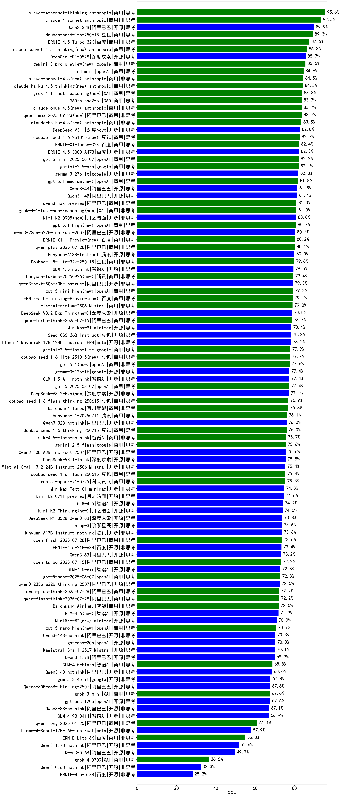

|类别|机构|大模型|【BBH】准确率|平均耗时|平均消耗token|花费/千次（元）|排名（准确率）|
|---|---|-----|-------------------|-------|-----------|-----------|-----------|
|商用|anthropic|claude-4-sonnet-thinking|95.6%|46s|1418|81.8|1|
|商用|anthropic|claude-4-sonnet|93.5%|42s|1066|43.5|2|
|开源|阿里巴巴|Qwen3-32B|89.9%|20s|1458|3.2|3|
|商用|豆包|doubao-seed-1-6-250615|89.3%|108s|1198|3.0|4|
|商用|百度|ERNIE-4.5-Turbo-32K|87.6%|11s|1146|1.5|5|
|开源|深度求索|DeepSeek-R1-0528|85.7%|217s|2658|32.6|6|
|商用|豆包|Doubao-1.5-pro-32k-250115|85.2%|5s|1104|1.1|7|
|商用|openAI|o4-mini|84.6%|31s|1470|27.2|8|
|商用|360|360zhinao2-o1|83.7%|/|/|/|9|
|开源|深度求索|DeepSeek-V3.1|82.8%|21s|1163|7.3|10|
|商用|豆包|doubao-seed-1-6-251015(new)|82.7%|45s|1862|8.3|11|
|商用|百度|ERNIE-X1-Turbo-32K|82.4%|60s|2298|6.5|12|
|开源|百度|ERNIE-4.5-300B-A47B|82.3%|80s|1169|3.8|13|
|商用|openAI|gpt-5-mini-2025-08-07|82.2%|67s|1386|9.7|14|
|商用|google|gemini-2.5-pro|82.1%|24s|2454|121.9|15|
|开源|google|gemma-3-27b-it|82.0%|/|/|/|16|
|商用|腾讯|hunyuan-turbos-20250716|81.6%|7s|1906|1.9|17|
|开源|阿里巴巴|Qwen3-4B|81.5%|15s|1673|2.7|18|
|开源|阿里巴巴|Qwen3-14B|81.4%|18s|1512|1.7|19|
|商用|阿里巴巴|qwen3-max-preview|81.0%|9s|1229|14.0|20|
|开源|阿里巴巴|qwen3-235b-a22b-instruct-2507|80.3%|14s|1401|6.0|21|
|商用|阿里巴巴|qwen-plus-2025-07-28|80.1%|16s|1407|1.8|22|
|开源|腾讯|Hunyuan-A13B-Instruct|80.0%|44s|1595|3.8|23|
|商用|豆包|Doubao-1.5-lite-32k-250115|79.8%|4s|1110|0.4|24|
|开源|智谱AI|GLM-4.5-nothink|79.5%|8s|1092|6.1|25|
|商用|腾讯|hunyuan-turbos-20250926(new)|79.4%|12s|2063|2.2|26|
|开源|阿里巴巴|qwen3-next-80b-a3b-instruct(new)|79.3%|12s|1394|3.0|27|
|商用|Mistral|mistral-medium-2508|79.0%|202s|1193|7.3|28|
|开源|深度求索|DeepSeek-V3.2-Exp-Think(new)|78.8%|335s|1709|4.3|29|
|商用|阿里巴巴|qwen-turbo-think-2025-07-15|78.7%|/|1958|3.5|30|
|开源|minimax|MiniMax-M1|78.4%|221s|4226|25.1|31|
|开源|豆包|Seed-OSS-36B-Instruct|78.2%|100s|2377|7.3|32|
|开源|meta|Llama-4-Maverick-17B-128E-Instruct-FP8|78.2%|4s|1176|2.7|33|
|商用|google|gemini-2.5-flash-lite|77.9%|5s|1295|1.8|34|
|商用|豆包|doubao-seed-1-6-lite-251015(new)|77.7%|109s|1791|2.4|35|
|开源|google|gemma-3-12b-it|77.4%|/|/|/|36|
|开源|智谱AI|GLM-4.5-Air-nothink|77.4%|4s|1103|2.3|37|
|商用|openAI|gpt-5-2025-08-07|77.4%|27s|1211|36.0|38|
|开源|深度求索|DeepSeek-V3.2-Exp(new)|77.1%|320s|1077|2.4|39|
|商用|豆包|doubao-seed-1-6-flash-thinking-250615|76.9%|22s|2535|2.5|40|
|商用|百川智能|Baichuan4-Turbo|76.8%|/|/|/|41|
|商用|腾讯|hunyuan-t1-20250711|76.1%|34s|3609|9.3|42|
|开源|阿里巴巴|Qwen3-32B-nothink|76.0%|43s|1132|1.9|43|
|商用|豆包|doubao-seed-1-6-thinking-250715|76.0%|33s|2500|13.6|44|
|商用|智谱AI|GLM-4.5-Flash-nothink|75.7%|7s|1024|0.0|45|
|商用|google|gemini-2.5-flash|75.6%|5s|1965|21.5|46|
|开源|阿里巴巴|Qwen3-30B-A3B-Instruct-2507|75.6%|5s|1364|2.2|47|
|开源|深度求索|DeepSeek-V3.1-Think|75.5%|44s|1644|13.1|48|
|商用|豆包|doubao-seed-1-6-flash-250615|75.4%|11s|1204|0.6|49|
|开源|Mistral|Mistral-Small-3.2-24B-Instruct-2506|75.4%|247s|1183|1.3|50|
|商用|科大讯飞|xunfei-spark-x1-0725|75.3%|/|2140|25.7|51|
|开源|minimax|MiniMax-Text-01|74.8%|8s|1669|13.4|52|
|开源|月之暗面|kimi-k2-0711-preview|74.6%|45s|1052|6.9|53|
|开源|智谱AI|GLM-4.5|74.2%|99s|2828|30.4|54|
|开源|深度求索|DeepSeek-R1-0528-Qwen3-8B|73.8%|265s|3378|0.0|55|
|开源|阶跃星辰|step-3|73.6%|115s|2962|9.8|56|
|开源|腾讯|Hunyuan-A13B-Instruct-nothink|73.6%|395s|1100|1.8|57|
|商用|阿里巴巴|qwen-flash-2025-07-28|73.6%|8s|1365|0.9|58|
|开源|百度|ERNIE-4.5-21B-A3B|73.4%|5s|1214|0.0|59|
|开源|阿里巴巴|Qwen3-8B|73.2%|27s|1641|0.0|60|
|商用|阿里巴巴|qwen-turbo-2025-07-15|73.2%|8s|1234|0.5|61|
|开源|智谱AI|GLM-4.5-Air|72.8%|38s|2920|13.2|62|
|商用|openAI|gpt-5-nano-2025-08-07|72.8%|48s|2136|4.1|63|
|开源|阿里巴巴|qwen3-235b-a22b-thinking-2507|72.5%|70s|3641|57.3|64|
|商用|阿里巴巴|qwen-plus-think-2025-07-28|72.2%|/|3660|23.1|65|
|商用|阿里巴巴|qwen-flash-think-2025-07-28|72.2%|24s|3199|3.6|66|
|商用|百川智能|Baichuan4-Air|72.0%|/|/|/|67|
|开源|智谱AI|GLM-4.6(new)|71.9%|37s|2502|25.9|68|
|开源|阿里巴巴|Qwen3-14B-nothink|70.3%|12s|1220|1.1|69|
|开源|openAI|gpt-oss-20b|70.3%|29s|1543|1.0|70|
|开源|Mistral|Magistral-Small-2507|70.1%|279s|9432|96.3|71|
|开源|阿里巴巴|Qwen3-1.7B|69.9%|16s|1958|3.5|72|
|商用|智谱AI|GLM-4.5-Flash|68.8%|37s|2995|0.0|73|
|开源|阿里巴巴|Qwen3-4B-nothink|68.6%|13s|1154|1.1|74|
|开源|google|gemma-3-4b-it|67.8%|/|/|/|75|
|开源|阿里巴巴|Qwen3-30B-A3B-Thinking-2507|67.6%|62s|3248|7.3|76|
|商用|XAI|grok-3-mini|67.6%|192s|1884|5.7|77|
|开源|openAI|gpt-oss-120b|67.6%|50s|1374|2.2|78|
|商用|Mistral|ministral-8b|67.1%|/|/|/|79|
|开源|阿里巴巴|Qwen3-8B-nothink|67.1%|22s|1197|0.0|80|
|开源|智谱AI|GLM-4-9B-0414|66.9%|9s|1125|0.0|81|
|商用|阿里巴巴|qwen-long-2025-01-25|61.1%|61s|1090|0.9|82|
|商用|Mistral|ministral-3b|60.5%|/|/|/|83|
|开源|meta|Llama-4-Scout-17B-16E-Instruct|57.9%|10s|1248|1.5|84|
|商用|百度|ERNIE-Lite-8K|55.0%|/|/|/|85|
|开源|阿里巴巴|Qwen3-1.7B-nothink|51.6%|10s|1295|1.5|86|
|开源|阿里巴巴|Qwen3-0.6B|49.7%|8s|1914|3.4|87|
|商用|XAI|grok-4-0709|36.5%|121s|2411|191.2|88|
|开源|阿里巴巴|Qwen3-0.6B-nothink|32.3%|8s|1088|0.9|89|
|开源|百度|ERNIE-4.5-0.3B|28.2%|2s|1128|0.0|90|

