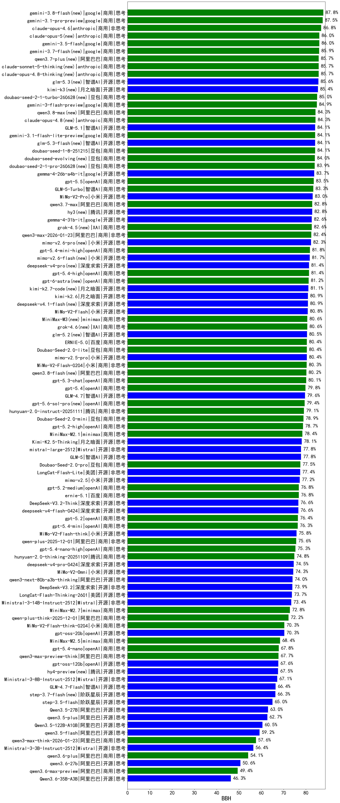

|类别|机构|大模型|【BBH】准确率|平均耗时|平均消耗token|花费/千次（元）|排名（准确率）|
|---|---|-----|-------------------|-------|-----------|-----------|-----------|
|商用|google|gemini-3.8-flash(new)|87.8%|15s|1410|37.0|1|
|商用|google|gemini-3.1-pro-preview|87.5%|32s|2267|130.6|2|
|商用|anthropic|claude-opus-4.6|86.8%|9s|1158|74.5|3|
|商用|anthropic|claude-opus-5(new)|86.0%|7s|1646|120.5|4|
|商用|google|gemini-3.5-flash|86.0%|8s|1792|66.6|5|
|商用|google|gemini-3.7-flash(new)|85.9%|9s|1327|16.3|6|
|商用|阿里巴巴|qwen3.7-plus(new)|85.7%|30s|2369|13.6|7|
|商用|anthropic|claude-sonnet-5-thinking(new)|85.7%|12s|1631|47.1|8|
|商用|anthropic|claude-opus-4.8-thinking(new)|85.7%|8s|1699|129.8|9|
|开源|智谱AI|glm-5.3(new)|85.6%|59s|1780|33.1|10|
|开源|月之暗面|kimi-k3(new)|85.4%|39s|1497|77.1|11|
|商用|豆包|doubao-seed-2-1-turbo-260628(new)|85.0%|150s|6413|85.1|12|
|商用|google|gemini-3-flash-preview|84.9%|70s|3651|62.1|13|
|商用|阿里巴巴|qwen3.8-max(new)|84.3%|35s|2225|57.9|14|
|商用|anthropic|claude-opus-4.8(new)|84.3%|6s|1502|95.3|15|
|开源|智谱AI|GLM-5.1|84.1%|142s|1874|30.0|16|
|商用|google|gemini-3.1-flash-lite-preview|84.1%|8s|1125|4.1|17|
|开源|智谱AI|glm-5.3-flash(new)|84.1%|36s|1557|2.7|18|
|商用|豆包|doubao-seed-1-8-251215|84.1%|28s|1616|6.2|19|
|商用|豆包|doubao-seed-evolving(new)|84.0%|303s|13058|369.5|20|
|商用|豆包|doubao-seed-2-1-pro-260628(new)|83.9%|299s|13052|369.3|21|
|开源|google|gemma-4-26b-a4b-it|83.7%|32s|1196|1.7|22|
|商用|openAI|gpt-5.5|83.5%|12s|1122|91.7|23|
|商用|智谱AI|GLM-5-Turbo|83.3%|24s|1611|21.3|24|
|开源|小米|MiMo-V2-Pro|83.0%|232s|1622|18.7|25|
|商用|阿里巴巴|qwen3.7-max|82.8%|31s|2380|64.4|26|
|开源|腾讯|hy3(new)|82.8%|53s|1081|1.8|27|
|开源|google|gemma-4-31b-it|82.6%|55s|1146|1.6|28|
|商用|XAI|grok-4.5(new)|82.6%|75s|2320|68.5|29|
|商用|阿里巴巴|qwen3-max-2026-01-23|82.4%|92s|1308|6.6|30|
|商用|openAI|gpt-5.4-mini-high|81.8%|62s|1344|20.8|31|
|开源|深度求索|deepseek-v4-pro(new)|81.4%|71s|2229|43.9|32|
|商用|openAI|gpt-5.4-high|81.4%|13s|1240|58.3|33|
|商用|openAI|gpt-6-astra(new)|81.2%|7s|/|79.5|34|
|开源|月之暗面|kimi-k2.7-code(new)|81.1%|25s|1531|24.3|35|
|开源|月之暗面|kimi-k2.6|80.9%|133s|2795|58.4|36|
|开源|小米|MiMo-V2-Flash|80.8%|58s|1352|0.0|37|
|商用|minimax|MiniMax-M3(new)|80.6%|22s|1627|14.9|38|
|商用|XAI|grok-4.6(new)|80.6%|104s|2265|66.2|39|
|开源|智谱AI|glm-5.2(new)|80.5%|34s|1871|35.6|40|
|商用|百度|ERNIE-5.0|80.4%|128s|2507|44.1|41|
|商用|豆包|Doubao-Seed-2.0-lite|80.4%|285s|2172|5.0|42|
|开源|小米|mimo-v2.5-pro|80.4%|21s|1989|26.3|43|
|商用|小米|MiMo-V2-Flash-0204|80.3%|150s|1276|1.4|44|
|商用|阿里巴巴|qwen3.8-flash(new)|80.2%|43s|2611|5.3|45|
|商用|openAI|gpt-5.3-chat|80.1%|17s|1092|36.6|46|
|商用|openAI|gpt-5.4|79.8%|5s|993|32.3|47|
|开源|智谱AI|GLM-4.7|79.6%|39s|2446|25.1|48|
|商用|openAI|gpt-5.6-sol-pro(new)|79.4%|21s|5760|292.1|49|
|商用|腾讯|hunyuan-2.0-instruct-20251111|79.1%|22s|1652|1.4|50|
|商用|豆包|Doubao-Seed-2.0-mini|78.9%|330s|2881|4.1|51|
|商用|openAI|gpt-5.2-high|78.7%|10s|1204|48.2|52|
|商用|minimax|MiniMax-M2.1|78.4%|71s|1860|10.2|53|
|开源|月之暗面|Kimi-K2.5-Thinking|78.1%|253s|2324|34.7|54|
|开源|Mistral|mistral-large-2512|77.8%|7s|1133|6.0|55|
|开源|智谱AI|GLM-5|77.8%|53s|2219|28.3|56|
|商用|豆包|Doubao-Seed-2.0-pro|77.5%|313s|2272|24.5|57|
|开源|美团|LongCat-Flash-Lite|77.4%|163s|1237|0.0|58|
|开源|小米|mimo-v2.5|77.2%|27s|2610|24.2|59|
|商用|openAI|gpt-5.2-medium|76.8%|7s|1148|42.6|60|
|商用|百度|ernie-5.1|76.8%|30s|1792|19.6|61|
|开源|深度求索|DeepSeek-V3.2-Think|76.6%|129s|2125|5.5|62|
|开源|深度求索|deepseek-v4-flash-0424|76.6%|26s|1578|2.3|63|
|商用|openAI|gpt-5.2|76.4%|5s|979|25.9|64|
|商用|openAI|gpt-5.4-mini|76.3%|25s|973|9.1|65|
|开源|小米|MiMo-V2-Flash-think|75.8%|92s|2611|0.0|66|
|商用|阿里巴巴|qwen-plus-2025-12-01|75.6%|17s|1532|2.0|67|
|商用|openAI|gpt-5.4-nano-high|75.3%|53s|1262|5.0|68|
|商用|腾讯|hunyuan-2.0-thinking-20251109|74.8%|36s|2762|7.9|69|
|开源|深度求索|deepseek-v4-pro-0424|74.5%|40s|1772|32.6|70|
|开源|小米|MiMo-V2-Omni|74.3%|269s|2422|21.6|71|
|开源|阿里巴巴|qwen3-next-80b-a3b-thinking|74.0%|79s|3813|12.7|72|
|开源|深度求索|DeepSeek-V3.2|73.9%|49s|1114|2.5|73|
|开源|美团|LongCat-Flash-Thinking-2601|73.7%|145s|3072|0.0|74|
|开源|Mistral|Ministral-3-14B-Instruct-2512|73.4%|9s|1278|1.8|75|
|商用|minimax|MiniMax-M2.7|72.8%|32s|2233|13.4|76|
|商用|阿里巴巴|qwen-plus-think-2025-12-01|72.2%|58s|3709|23.5|77|
|商用|小米|MiMo-V2-Flash-think-0204|70.3%|558s|2877|4.8|78|
|开源|openAI|gpt-oss-20b|70.3%|29s|1543|1.0|79|
|商用|minimax|MiniMax-M2.5|68.4%|26s|2156|12.7|80|
|商用|openAI|gpt-5.4-nano|67.8%|30s|992|2.6|81|
|商用|阿里巴巴|qwen3-max-preview-think|67.7%|143s|3266|62.9|82|
|开源|openAI|gpt-oss-120b|67.6%|50s|1374|2.2|83|
|开源|Mistral|Ministral-3-8B-Instruct-2512|67.1%|9s|1446|1.5|84|
|开源|智谱AI|GLM-4.7-Flash|66.4%|1185s|3108|0.0|85|
|开源|阶跃星辰|step-3.7-flash(new)|66.3%|62s|5283|37.2|86|
|开源|阶跃星辰|step-3.5-flash|65.0%|23s|3320|5.8|87|
|开源|阿里巴巴|Qwen3.5-27B|63.0%|205s|3306|12.1|88|
|开源|阿里巴巴|qwen3.5-plus|62.7%|31s|3147|11.6|89|
|开源|阿里巴巴|Qwen3.5-122B-A10B|60.5%|267s|3388|16.7|90|
|开源|阿里巴巴|qwen3.5-flash|59.2%|307s|3651|5.7|91|
|商用|阿里巴巴|qwen3-max-think-2026-01-23|57.6%|180s|3373|27.3|92|
|开源|Mistral|Ministral-3-3B-Instruct-2512|56.4%|8s|1264|0.9|93|
|商用|阿里巴巴|qwen3.6-plus|54.1%|62s|3509|33.2|94|
|开源|阿里巴巴|qwen3.6-27b|50.6%|38s|3450|48.8|95|
|商用|阿里巴巴|qwen3.6-max-preview|49.4%|73s|3164|131.0|96|
|开源|阿里巴巴|Qwen3.6-35B-A3B|46.3%|106s|3345|28.2|97|

