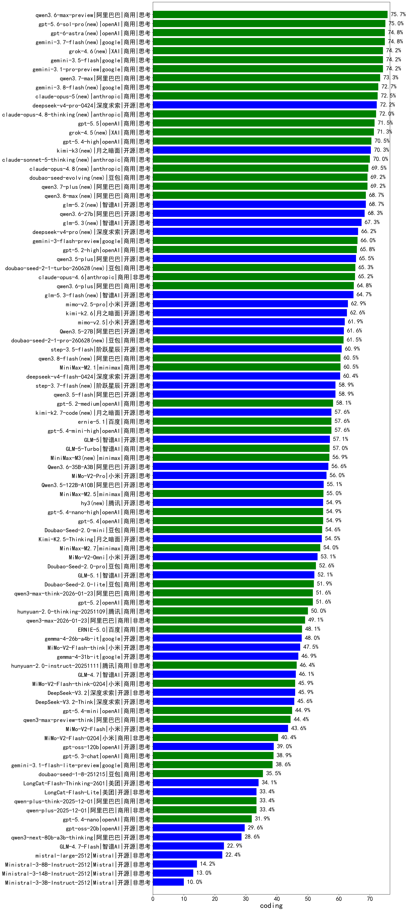

|类别|机构|大模型|【coding】准确率|平均耗时|平均消耗token|花费/千次（元）|排名（准确率）|
|---|---|-----|-------------------|-------|-----------|-----------|-----------|
|商用|阿里巴巴|qwen3.6-max-preview|75.7%|/|/|/|1|
|商用|openAI|gpt-5.6-sol-pro(new)|75.0%|/|/|/|2|
|商用|openAI|gpt-6-astra(new)|74.8%|/|/|/|3|
|商用|google|gemini-3.7-flash(new)|74.8%|/|/|/|4|
|商用|google|gemini-3.1-pro-preview|74.2%|/|/|/|5|
|商用|XAI|grok-4.6(new)|74.2%|/|/|/|6|
|商用|google|gemini-3.5-flash|74.2%|/|/|/|7|
|商用|阿里巴巴|qwen3.7-max|73.3%|/|/|/|8|
|商用|google|gemini-3.8-flash(new)|72.7%|/|/|/|9|
|商用|anthropic|claude-opus-5(new)|72.5%|/|/|/|10|
|开源|深度求索|deepseek-v4-pro-0424|72.2%|/|/|/|11|
|商用|anthropic|claude-opus-4.8-thinking(new)|72.0%|/|/|/|12|
|商用|openAI|gpt-5.5|71.5%|/|/|/|13|
|商用|XAI|grok-4.5(new)|71.3%|/|/|/|14|
|商用|openAI|gpt-5.4-high|70.5%|/|/|/|15|
|开源|月之暗面|kimi-k3(new)|70.3%|/|/|/|16|
|商用|anthropic|claude-sonnet-5-thinking(new)|70.0%|/|/|/|17|
|商用|anthropic|claude-opus-4.8(new)|69.5%|/|/|/|18|
|商用|阿里巴巴|qwen3.7-plus(new)|69.2%|/|/|/|19|
|商用|豆包|doubao-seed-evolving(new)|69.2%|/|/|/|20|
|开源|智谱AI|glm-5.2(new)|68.7%|/|/|/|21|
|商用|阿里巴巴|qwen3.8-max(new)|68.7%|/|/|/|22|
|开源|阿里巴巴|qwen3.6-27b|68.3%|/|/|/|23|
|开源|智谱AI|glm-5.3(new)|67.3%|/|/|/|24|
|开源|深度求索|deepseek-v4-pro(new)|66.2%|/|/|/|25|
|商用|google|gemini-3-flash-preview|66.0%|/|/|/|26|
|商用|openAI|gpt-5.2-high|65.8%|/|/|/|27|
|开源|阿里巴巴|qwen3.5-plus|65.5%|/|/|/|28|
|商用|豆包|doubao-seed-2-1-turbo-260628(new)|65.3%|/|/|/|29|
|商用|anthropic|claude-opus-4.6|65.2%|/|/|/|30|
|商用|阿里巴巴|qwen3.6-plus|64.8%|/|/|/|31|
|开源|智谱AI|glm-5.3-flash(new)|64.7%|/|/|/|32|
|开源|小米|mimo-v2.5-pro|62.9%|/|/|/|33|
|开源|月之暗面|kimi-k2.6|62.6%|/|/|/|34|
|开源|小米|mimo-v2.5|61.9%|/|/|/|35|
|开源|阿里巴巴|Qwen3.5-27B|61.6%|/|/|/|36|
|商用|豆包|doubao-seed-2-1-pro-260628(new)|61.5%|/|/|/|37|
|开源|阶跃星辰|step-3.5-flash|60.9%|/|/|/|38|
|商用|阿里巴巴|qwen3.8-flash(new)|60.5%|/|/|/|39|
|商用|minimax|MiniMax-M2.1|60.5%|/|/|/|40|
|开源|深度求索|deepseek-v4-flash-0424|60.4%|/|/|/|41|
|开源|阿里巴巴|qwen3.5-flash|58.9%|/|/|/|42|
|开源|阶跃星辰|step-3.7-flash(new)|58.9%|/|/|/|43|
|商用|openAI|gpt-5.2-medium|58.1%|/|/|/|44|
|商用|openAI|gpt-5.4-mini-high|57.6%|/|/|/|45|
|商用|百度|ernie-5.1|57.6%|/|/|/|46|
|开源|月之暗面|kimi-k2.7-code(new)|57.6%|/|/|/|47|
|开源|智谱AI|GLM-5|57.1%|/|/|/|48|
|商用|智谱AI|GLM-5-Turbo|57.0%|/|/|/|49|
|商用|minimax|MiniMax-M3(new)|56.9%|/|/|/|50|
|开源|阿里巴巴|Qwen3.6-35B-A3B|56.6%|/|/|/|51|
|开源|小米|MiMo-V2-Pro|56.0%|/|/|/|52|
|开源|阿里巴巴|Qwen3.5-122B-A10B|55.1%|/|/|/|53|
|商用|minimax|MiniMax-M2.5|55.0%|/|/|/|54|
|商用|openAI|gpt-5.4|54.9%|/|/|/|55|
|开源|腾讯|hy3(new)|54.9%|/|/|/|56|
|商用|openAI|gpt-5.4-nano-high|54.9%|/|/|/|57|
|商用|豆包|Doubao-Seed-2.0-mini|54.6%|/|/|/|58|
|开源|月之暗面|Kimi-K2.5-Thinking|54.5%|/|/|/|59|
|商用|minimax|MiniMax-M2.7|54.0%|/|/|/|60|
|开源|小米|MiMo-V2-Omni|53.1%|/|/|/|61|
|商用|豆包|Doubao-Seed-2.0-pro|52.6%|/|/|/|62|
|开源|智谱AI|GLM-5.1|52.1%|/|/|/|63|
|商用|豆包|Doubao-Seed-2.0-lite|51.9%|/|/|/|64|
|商用|openAI|gpt-5.2|51.6%|/|/|/|65|
|商用|阿里巴巴|qwen3-max-think-2026-01-23|51.6%|/|/|/|66|
|商用|腾讯|hunyuan-2.0-thinking-20251109|50.0%|/|/|/|67|
|商用|阿里巴巴|qwen3-max-2026-01-23|49.1%|/|/|/|68|
|商用|百度|ERNIE-5.0|48.1%|/|/|/|69|
|开源|google|gemma-4-26b-a4b-it|48.0%|/|/|/|70|
|开源|小米|MiMo-V2-Flash-think|47.5%|/|/|/|71|
|开源|google|gemma-4-31b-it|46.9%|/|/|/|72|
|商用|腾讯|hunyuan-2.0-instruct-20251111|46.4%|/|/|/|73|
|开源|智谱AI|GLM-4.7|46.1%|/|/|/|74|
|商用|小米|MiMo-V2-Flash-think-0204|45.9%|/|/|/|75|
|开源|深度求索|DeepSeek-V3.2|45.9%|/|/|/|76|
|开源|深度求索|DeepSeek-V3.2-Think|45.6%|/|/|/|77|
|商用|openAI|gpt-5.4-mini|44.9%|/|/|/|78|
|商用|阿里巴巴|qwen3-max-preview-think|44.4%|/|/|/|79|
|开源|小米|MiMo-V2-Flash|43.6%|/|/|/|80|
|商用|小米|MiMo-V2-Flash-0204|40.4%|/|/|/|81|
|开源|openAI|gpt-oss-120b|39.0%|/|/|/|82|
|商用|openAI|gpt-5.3-chat|38.9%|/|/|/|83|
|商用|google|gemini-3.1-flash-lite-preview|38.6%|/|/|/|84|
|商用|豆包|doubao-seed-1-8-251215|35.5%|/|/|/|85|
|开源|美团|LongCat-Flash-Thinking-2601|34.1%|/|/|/|86|
|商用|阿里巴巴|qwen-plus-think-2025-12-01|33.4%|/|/|/|87|
|商用|阿里巴巴|qwen-plus-2025-12-01|33.4%|/|/|/|88|
|开源|美团|LongCat-Flash-Lite|33.4%|/|/|/|89|
|商用|openAI|gpt-5.4-nano|31.9%|/|/|/|90|
|开源|openAI|gpt-oss-20b|29.6%|/|/|/|91|
|开源|阿里巴巴|qwen3-next-80b-a3b-thinking|28.6%|/|/|/|92|
|开源|智谱AI|GLM-4.7-Flash|22.9%|/|/|/|93|
|开源|Mistral|mistral-large-2512|22.4%|/|/|/|94|
|开源|Mistral|Ministral-3-8B-Instruct-2512|14.2%|/|/|/|95|
|开源|Mistral|Ministral-3-14B-Instruct-2512|13.0%|/|/|/|96|
|开源|Mistral|Ministral-3-3B-Instruct-2512|10.0%|/|/|/|97|

