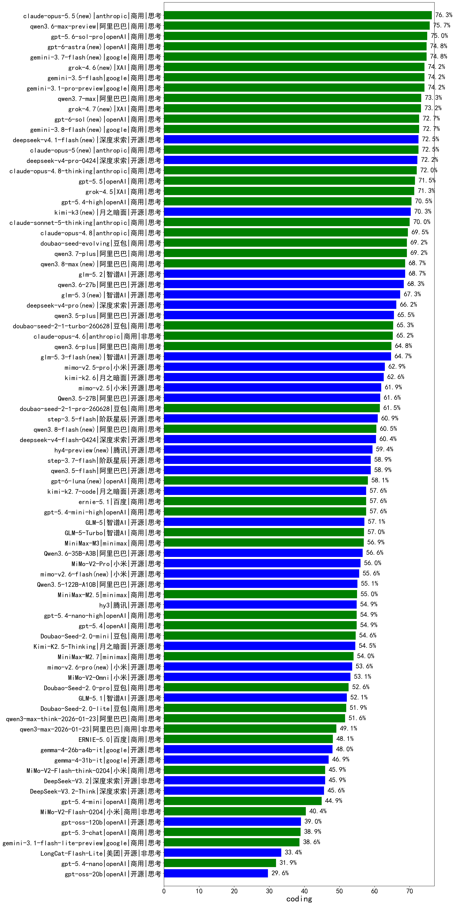

|类别|机构|大模型|【coding】准确率|平均耗时|平均消耗token|花费/千次（元）|排名（准确率）|
|---|---|-----|-------------------|-------|-----------|-----------|-----------|
|商用|anthropic|claude-opus-5.5(new)|76.3%|/|/|/|1|
|商用|阿里巴巴|qwen3.6-max-preview|75.7%|/|/|/|2|
|商用|openAI|gpt-5.6-sol-pro|75.0%|/|/|/|3|
|商用|google|gemini-3.7-flash(new)|74.8%|/|/|/|4|
|商用|openAI|gpt-6-astra(new)|74.8%|/|/|/|5|
|商用|XAI|grok-4.6(new)|74.2%|/|/|/|6|
|商用|google|gemini-3.1-pro-preview|74.2%|/|/|/|7|
|商用|google|gemini-3.5-flash|74.2%|/|/|/|8|
|商用|阿里巴巴|qwen3.7-max|73.3%|/|/|/|9|
|商用|XAI|grok-4.7(new)|73.2%|/|/|/|10|
|商用|google|gemini-3.8-flash(new)|72.7%|/|/|/|11|
|商用|openAI|gpt-6-sol(new)|72.7%|/|/|/|12|
|开源|深度求索|deepseek-v4.1-flash(new)|72.5%|/|/|/|13|
|商用|anthropic|claude-opus-5(new)|72.5%|/|/|/|14|
|开源|深度求索|deepseek-v4-pro-0424|72.2%|/|/|/|15|
|商用|anthropic|claude-opus-4.8-thinking|72.0%|/|/|/|16|
|商用|openAI|gpt-5.5|71.5%|/|/|/|17|
|商用|XAI|grok-4.5|71.3%|/|/|/|18|
|商用|openAI|gpt-5.4-high|70.5%|/|/|/|19|
|开源|月之暗面|kimi-k3(new)|70.3%|/|/|/|20|
|商用|anthropic|claude-sonnet-5-thinking|70.0%|/|/|/|21|
|商用|anthropic|claude-opus-4.8|69.5%|/|/|/|22|
|商用|阿里巴巴|qwen3.7-plus|69.2%|/|/|/|23|
|商用|豆包|doubao-seed-evolving|69.2%|/|/|/|24|
|开源|智谱AI|glm-5.2|68.7%|/|/|/|25|
|商用|阿里巴巴|qwen3.8-max(new)|68.7%|/|/|/|26|
|开源|阿里巴巴|qwen3.6-27b|68.3%|/|/|/|27|
|开源|智谱AI|glm-5.3(new)|67.3%|/|/|/|28|
|商用|豆包|doubao-seed-2-1-pro-260915(new)|66.5%|/|/|/|29|
|开源|深度求索|deepseek-v4-pro(new)|66.2%|/|/|/|30|
|开源|阿里巴巴|qwen3.5-plus|65.5%|/|/|/|31|
|商用|豆包|doubao-seed-2-1-lite-260915(new)|65.3%|/|/|/|32|
|商用|豆包|doubao-seed-2-1-turbo-260628|65.3%|/|/|/|33|
|商用|anthropic|claude-opus-4.6|65.2%|/|/|/|34|
|商用|阿里巴巴|qwen3.6-plus|64.8%|/|/|/|35|
|开源|智谱AI|glm-5.3-flash(new)|64.7%|/|/|/|36|
|开源|小米|mimo-v2.5-pro|62.9%|/|/|/|37|
|开源|月之暗面|kimi-k2.6|62.6%|/|/|/|38|
|开源|小米|mimo-v2.5|61.9%|/|/|/|39|
|开源|阿里巴巴|Qwen3.5-27B|61.6%|/|/|/|40|
|商用|豆包|doubao-seed-2-1-pro-260628|61.5%|/|/|/|41|
|开源|阶跃星辰|step-3.5-flash|60.9%|/|/|/|42|
|商用|阿里巴巴|qwen3.8-flash(new)|60.5%|/|/|/|43|
|开源|深度求索|deepseek-v4-flash-0424|60.4%|/|/|/|44|
|开源|腾讯|hy4-preview(new)|59.4%|/|/|/|45|
|开源|阶跃星辰|step-3.7-flash|58.9%|/|/|/|46|
|开源|阿里巴巴|qwen3.5-flash|58.9%|/|/|/|47|
|商用|openAI|gpt-6-luna(new)|58.1%|/|/|/|48|
|开源|月之暗面|kimi-k2.7-code|57.6%|/|/|/|49|
|商用|百度|ernie-5.1|57.6%|/|/|/|50|
|商用|openAI|gpt-5.4-mini-high|57.6%|/|/|/|51|
|开源|智谱AI|GLM-5|57.1%|/|/|/|52|
|商用|智谱AI|GLM-5-Turbo|57.0%|/|/|/|53|
|商用|minimax|MiniMax-M3|56.9%|/|/|/|54|
|开源|阿里巴巴|Qwen3.6-35B-A3B|56.6%|/|/|/|55|
|开源|小米|MiMo-V2-Pro|56.0%|/|/|/|56|
|开源|小米|mimo-v2.6-flash(new)|55.6%|/|/|/|57|
|开源|阿里巴巴|Qwen3.5-122B-A10B|55.1%|/|/|/|58|
|商用|minimax|MiniMax-M2.5|55.0%|/|/|/|59|
|商用|openAI|gpt-5.4|54.9%|/|/|/|60|
|开源|腾讯|hy3|54.9%|/|/|/|61|
|商用|openAI|gpt-5.4-nano-high|54.9%|/|/|/|62|
|商用|豆包|Doubao-Seed-2.0-mini|54.6%|/|/|/|63|
|开源|月之暗面|Kimi-K2.5-Thinking|54.5%|/|/|/|64|
|商用|minimax|MiniMax-M2.7|54.0%|/|/|/|65|
|开源|小米|mimo-v2.6-pro(new)|53.6%|/|/|/|66|
|开源|小米|MiMo-V2-Omni|53.1%|/|/|/|67|
|商用|豆包|Doubao-Seed-2.0-pro|52.6%|/|/|/|68|
|开源|智谱AI|GLM-5.1|52.1%|/|/|/|69|
|商用|豆包|Doubao-Seed-2.0-lite|51.9%|/|/|/|70|
|商用|阿里巴巴|qwen3-max-think-2026-01-23|51.6%|/|/|/|71|
|商用|阿里巴巴|qwen3-max-2026-01-23|49.1%|/|/|/|72|
|商用|百度|ERNIE-5.0|48.1%|/|/|/|73|
|开源|google|gemma-4-26b-a4b-it|48.0%|/|/|/|74|
|开源|google|gemma-4-31b-it|46.9%|/|/|/|75|
|商用|小米|MiMo-V2-Flash-think-0204|45.9%|/|/|/|76|
|开源|深度求索|DeepSeek-V3.2|45.9%|/|/|/|77|
|开源|深度求索|DeepSeek-V3.2-Think|45.6%|/|/|/|78|
|商用|openAI|gpt-5.4-mini|44.9%|/|/|/|79|
|商用|小米|MiMo-V2-Flash-0204|40.4%|/|/|/|80|
|开源|openAI|gpt-oss-120b|39.0%|/|/|/|81|
|商用|openAI|gpt-5.3-chat|38.9%|/|/|/|82|
|商用|google|gemini-3.1-flash-lite-preview|38.6%|/|/|/|83|
|开源|美团|LongCat-Flash-Lite|33.4%|/|/|/|84|
|商用|openAI|gpt-5.4-nano|31.9%|/|/|/|85|
|开源|openAI|gpt-oss-20b|29.6%|/|/|/|86|

