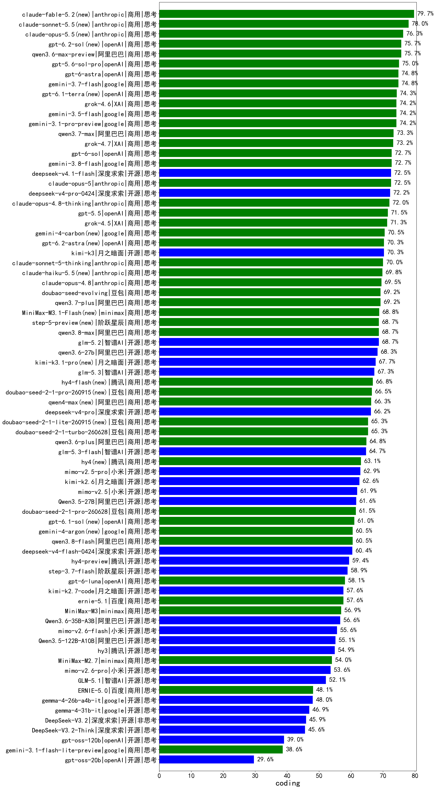

|类别|机构|大模型|【coding】准确率|平均耗时|平均消耗token|花费/千次（元）|排名（准确率）|
|---|---|-----|-------------------|-------|-----------|-----------|-----------|
|商用|anthropic|claude-fable-5.2(new)|79.7%|/|/|/|1|
|商用|anthropic|claude-sonnet-5.5(new)|78.0%|/|/|/|2|
|商用|anthropic|claude-opus-5.5(new)|76.3%|/|/|/|3|
|商用|openAI|gpt-6.2-sol(new)|75.7%|/|/|/|4|
|商用|阿里巴巴|qwen3.6-max-preview|75.7%|/|/|/|5|
|商用|openAI|gpt-5.6-sol-pro|75.0%|/|/|/|6|
|商用|google|gemini-3.7-flash|74.8%|/|/|/|7|
|商用|openAI|gpt-6-astra|74.8%|/|/|/|8|
|商用|openAI|gpt-6.1-terra(new)|74.3%|/|/|/|9|
|商用|XAI|grok-4.6|74.2%|/|/|/|10|
|商用|google|gemini-3.1-pro-preview|74.2%|/|/|/|11|
|商用|google|gemini-3.5-flash|74.2%|/|/|/|12|
|商用|阿里巴巴|qwen3.7-max|73.3%|/|/|/|13|
|商用|XAI|grok-4.7|73.2%|/|/|/|14|
|商用|openAI|gpt-6-sol|72.7%|/|/|/|15|
|商用|google|gemini-3.8-flash|72.7%|/|/|/|16|
|开源|深度求索|deepseek-v4.1-flash|72.5%|/|/|/|17|
|商用|anthropic|claude-opus-5|72.5%|/|/|/|18|
|开源|深度求索|deepseek-v4-pro-0424|72.2%|/|/|/|19|
|商用|anthropic|claude-opus-4.8-thinking|72.0%|/|/|/|20|
|商用|openAI|gpt-5.5|71.5%|/|/|/|21|
|商用|XAI|grok-4.5|71.3%|/|/|/|22|
|商用|google|gemini-4-carbon(new)|70.5%|/|/|/|23|
|开源|月之暗面|kimi-k3|70.3%|/|/|/|24|
|商用|openAI|gpt-6.2-astra(new)|70.3%|/|/|/|25|
|商用|anthropic|claude-sonnet-5-thinking|70.0%|/|/|/|26|
|商用|anthropic|claude-haiku-5.5(new)|69.8%|/|/|/|27|
|商用|anthropic|claude-opus-4.8|69.5%|/|/|/|28|
|商用|阿里巴巴|qwen3.7-plus|69.2%|/|/|/|29|
|商用|豆包|doubao-seed-evolving|69.2%|/|/|/|30|
|商用|minimax|MiniMax-M3.1-Flash(new)|68.8%|/|/|/|31|
|商用|阶跃星辰|step-5-preview(new)|68.7%|/|/|/|32|
|商用|阿里巴巴|qwen3.8-max|68.7%|/|/|/|33|
|开源|智谱AI|glm-5.2|68.7%|/|/|/|34|
|开源|阿里巴巴|qwen3.6-27b|68.3%|/|/|/|35|
|开源|月之暗面|kimi-k3.1-pro(new)|67.7%|/|/|/|36|
|开源|智谱AI|glm-5.3|67.3%|/|/|/|37|
|商用|腾讯|hy4-flash(new)|66.8%|/|/|/|38|
|商用|豆包|doubao-seed-2-1-pro-260915(new)|66.5%|/|/|/|39|
|商用|阿里巴巴|qwen4-max(new)|66.3%|/|/|/|40|
|开源|深度求索|deepseek-v4-pro|66.2%|/|/|/|41|
|商用|豆包|doubao-seed-2-1-lite-260915(new)|65.3%|/|/|/|42|
|商用|豆包|doubao-seed-2-1-turbo-260628|65.3%|/|/|/|43|
|商用|阿里巴巴|qwen3.6-plus|64.8%|/|/|/|44|
|开源|智谱AI|glm-5.3-flash|64.7%|/|/|/|45|
|商用|腾讯|hy4(new)|63.1%|/|/|/|46|
|开源|小米|mimo-v2.5-pro|62.9%|/|/|/|47|
|开源|月之暗面|kimi-k2.6|62.6%|/|/|/|48|
|开源|小米|mimo-v2.5|61.9%|/|/|/|49|
|开源|阿里巴巴|Qwen3.5-27B|61.6%|/|/|/|50|
|商用|豆包|doubao-seed-2-1-pro-260628|61.5%|/|/|/|51|
|商用|openAI|gpt-6.1-sol(new)|61.0%|/|/|/|52|
|商用|google|gemini-4-argon(new)|60.5%|/|/|/|53|
|商用|阿里巴巴|qwen3.8-flash|60.5%|/|/|/|54|
|开源|深度求索|deepseek-v4-flash-0424|60.4%|/|/|/|55|
|开源|腾讯|hy4-preview|59.4%|/|/|/|56|
|开源|阶跃星辰|step-3.7-flash|58.9%|/|/|/|57|
|商用|openAI|gpt-6-luna|58.1%|/|/|/|58|
|开源|月之暗面|kimi-k2.7-code|57.6%|/|/|/|59|
|商用|百度|ernie-5.1|57.6%|/|/|/|60|
|商用|minimax|MiniMax-M3|56.9%|/|/|/|61|
|开源|阿里巴巴|Qwen3.6-35B-A3B|56.6%|/|/|/|62|
|开源|小米|mimo-v2.6-flash|55.6%|/|/|/|63|
|开源|阿里巴巴|Qwen3.5-122B-A10B|55.1%|/|/|/|64|
|开源|腾讯|hy3|54.9%|/|/|/|65|
|商用|minimax|MiniMax-M2.7|54.0%|/|/|/|66|
|开源|小米|mimo-v2.6-pro|53.6%|/|/|/|67|
|开源|智谱AI|GLM-5.1|52.1%|/|/|/|68|
|商用|百度|ERNIE-5.0|48.1%|/|/|/|69|
|开源|google|gemma-4-26b-a4b-it|48.0%|/|/|/|70|
|开源|google|gemma-4-31b-it|46.9%|/|/|/|71|
|开源|深度求索|DeepSeek-V3.2|45.9%|/|/|/|72|
|开源|深度求索|DeepSeek-V3.2-Think|45.6%|/|/|/|73|
|开源|openAI|gpt-oss-120b|39.0%|/|/|/|74|
|商用|google|gemini-3.1-flash-lite-preview|38.6%|/|/|/|75|
|开源|openAI|gpt-oss-20b|29.6%|/|/|/|76|

