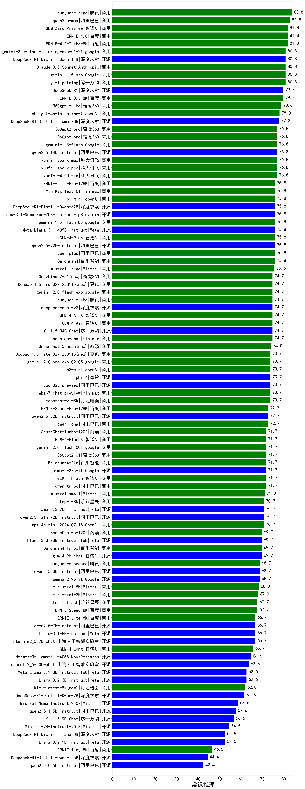

| 类别 | 大模型                         | 常识推理 | 排名 |
|-----|------------------------------|---------|----|
|商用|hunyuan-large|83.8|1|
|商用|qwen2.5-max|82.8|2|
|商用|ERNIE-4.0-Turbo-8K|81.8|3|
|商用|hunyuan-turbos-20250226(new)|81.8|4|
|商用|GLM-Zero-Preview|81.8|5|
|商用|ERNIE-4.0|81.8|6|
|商用|yi-lightning|80.8|7|
|商用|gemini-2.0-flash-thinking-exp-01-21|80.8|8|
|开源|qwq-32b(new)|80.8|9|
|商用|Claude-3.5-Sonnet|80.8|10|
|开源|DeepSeek-R1-Distill-Qwen-14B|80.8|11|
|商用|gemini-1.5-pro|80.8|12|
|商用|ERNIE-3.5-8K|79.8|13|
|开源|DeepSeek-R1|79.8|14|
|商用|360gpt-turbo|78.8|15|
|商用|chatgpt-4o-latest|78.0|16|
|开源|DeepSeek-R1-Distill-Llama-70B|77.8|17|
|商用|xunfei-4.0Ultra|76.8|18|
|商用|360gpt2-pro|76.8|19|
|商用|gemini-1.5-flash|76.8|20|
|开源|qwen2.5-14b-instruct|76.8|21|
|商用|xunfei-spark-max|76.8|22|
|商用|xunfei-spark-pro|76.8|23|
|商用|360gpt-pro|76.8|24|
|开源|Llama-3.1-Nemotron-70B-Instruct-fp8|75.8|25|
|开源|Meta-Llama-3.1-405B-Instruct|75.8|26|
|开源|qwen2.5-72b-instruct|75.8|27|
|商用|qwen-plus|75.8|28|
|商用|GLM-4-Plus|75.8|29|
|商用|Baichuan4|75.8|30|
|商用|ERNIE-Lite-Pro-128K|75.8|31|
|商用|MiniMax-Text-01|75.8|32|
|开源|DeepSeek-R1-Distill-Qwen-32B|75.8|33|
|商用|gemini-1.5-flash-8b|75.8|34|
|商用|o1-mini|75.8|35|
|商用|qwq-plus-2025-03-05(new)|75.8|36|
|商用|mistral-large|75.6|37|
|商用|abab6.5s-chat|74.7|38|
|开源|Yi-1.5-34B-Chat|74.7|39|
|商用|Doubao-1.5-pro-32k-250115|74.7|40|
|商用|gemini-2.0-flash-exp|74.7|41|
|商用|hunyuan-turbo|74.7|42|
|商用|360zhinao2-o1|74.7|43|
|商用|GLM-4-Air|74.7|44|
|商用|GLM-4-AirX|74.7|45|
|开源|deepseek-chat-v3|74.7|46|
|商用|SenseChat-5-beta|74.0|47|
|商用|gemini-2.0-pro-exp-02-05|73.7|48|
|商用|o3-mini|73.7|49|
|商用|abab7-chat-preview|73.7|50|
|商用|moonshot-v1-8k|73.7|51|
|开源|qwq-32b-preview|73.7|52|
|商用|step-2-mini(new)|73.7|53|
|商用|Doubao-1.5-lite-32k-250115|73.7|54|
|开源|phi-4|73.7|55|
|商用|qwen-long|72.7|56|
|开源|qwen2.5-32b-instruct|72.7|57|
|商用|ERNIE-Speed-Pro-128K|72.7|58|
|商用|360gpt2-o1|71.7|59|
|商用|Baichuan4-Air|71.7|60|
|开源|gemma-2-27b-it|71.7|61|
|商用|gemini-2.0-flash-001|71.7|62|
|商用|GLM-4-FlashX|71.7|63|
|商用|SenseChat-Turbo-1202|71.7|64|
|商用|GLM-4-Flash|71.7|65|
|商用|qwen-turbo|71.7|66|
|商用|mistral-small|71.0|67|
|开源|qwen2.5-math-72b-instruct|70.7|68|
|商用|gpt-4o-mini-2024-07-18|70.7|69|
|商用|step-1-8k|70.7|70|
|开源|Llama-3.3-70B-Instruct|70.7|71|
|开源|glm-4-9b-chat|69.7|72|
|商用|SenseChat-5-1202|69.7|73|
|商用|Baichuan4-Turbo|69.7|74|
|开源|Llama-3.3-70B-Instruct-fp8|69.7|75|
|开源|qwen2.5-3b-instruct|68.7|76|
|开源|gemma-2-9b-it|68.7|77|
|商用|hunyuan-standard|68.7|78|
|商用|ministral-8b|68.3|79|
|商用|ministral-3b|67.9|80|
|商用|ERNIE-Speed-8K|67.7|81|
|商用|step-1-flash|67.7|82|
|商用|ERNIE-Lite-8K|66.7|83|
|开源|internlm2_5-7b-chat|66.7|84|
|开源|qwen2.5-7b-instruct|66.7|85|
|开源|Llama-3.1-8B-Instruct|66.7|86|
|商用|GLM-4-Long|65.7|87|
|开源|Hermes-3-Llama-3.1-405B|64.6|88|
|开源|internlm2_5-20b-chat|63.6|89|
|开源|Meta-Llama-3.1-8B-Instruct-fp8|62.6|90|
|开源|Llama-3.2-3B-Instruct|62.6|91|
|商用|kimi-latest-8k|62.0|92|
|开源|DeepSeek-R1-Distill-Qwen-7B|61.6|93|
|开源|Mistral-Nemo-Instruct-2407|58.6|94|
|开源|qwen2.5-1.5b-instruct|57.6|95|
|开源|Yi-1.5-9B-Chat|56.6|96|
|开源|Mistral-7B-Instruct-v0.3|54.5|97|
|开源|DeepSeek-R1-Distill-Llama-8B|52.5|98|
|开源|Llama-3.2-1B-Instruct|52.5|99|
|商用|ERNIE-Tiny-8K|46.5|100|
|开源|DeepSeek-R1-Distill-Qwen-1.5B|44.4|101|
|开源|qwen2.5-0.5b-instruct|42.4|102|
|商用|xunfei-spark-lite(new)|42.4|103|

