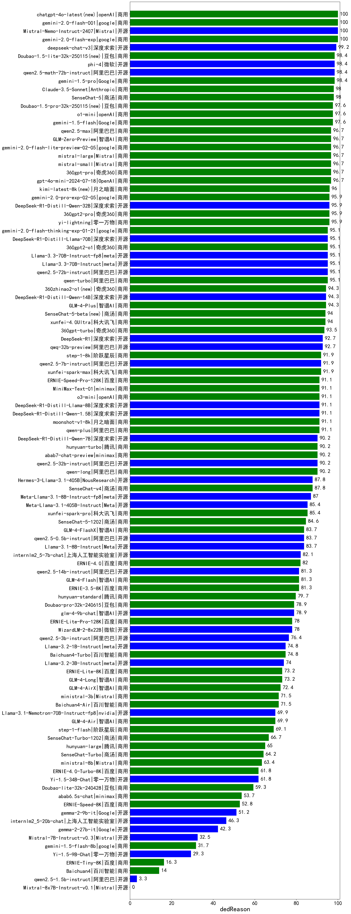

| 类别 | 大模型                         | 演绎推理 | 排名 |
|-----|------------------------------|---------|----|
|商用|chatgpt-4o-latest(new)|100.0|1|
|开源|Mistral-Nemo-Instruct-2407|100.0|2|
|商用|gemini-2.0-flash-exp|100.0|3|
|商用|gemini-2.0-flash-001|100.0|4|
|开源|deepseek-chat-v3|99.2|5|
|商用|Doubao-1.5-lite-32k-250115(new)|98.4|6|
|开源|phi-4|98.4|7|
|商用|gemini-1.5-pro|98.4|8|
|开源|qwen2.5-math-72b-instruct|98.4|9|
|商用|Claude-3.5-Sonnet|98.0|10|
|商用|SenseChat-5|98.0|11|
|商用|o1-mini|97.6|12|
|商用|Doubao-1.5-pro-32k-250115(new)|97.6|13|
|商用|gemini-1.5-flash|97.6|14|
|商用|mistral-small|96.7|15|
|商用|GLM-Zero-Preview|96.7|16|
|商用|360gpt-pro|96.7|17|
|商用|mistral-large|96.7|18|
|商用|gemini-2.0-flash-lite-preview-02-05|96.7|19|
|商用|gpt-4o-mini-2024-07-18|96.7|20|
|商用|qwen2.5-max|96.7|21|
|商用|kimi-latest-8k(new)|96.0|22|
|商用|yi-lightning|95.9|23|
|商用|gemini-2.0-pro-exp-02-05|95.9|24|
|商用|360gpt2-pro|95.9|25|
|开源|DeepSeek-R1-Distill-Qwen-32B|95.9|26|
|开源|DeepSeek-R1-Distill-Llama-70B|95.1|27|
|商用|360gpt2-o1|95.1|28|
|商用|gemini-2.0-flash-thinking-exp-01-21|95.1|29|
|商用|qwen-turbo|95.1|30|
|开源|qwen2.5-72b-instruct|95.1|31|
|开源|Llama-3.3-70B-Instruct|95.1|32|
|开源|Llama-3.3-70B-Instruct-fp8|95.1|33|
|商用|360zhinao2-o1(new)|94.3|34|
|开源|DeepSeek-R1-Distill-Qwen-14B|94.3|35|
|商用|GLM-4-Plus|94.3|36|
|商用|xunfei-4.0Ultra|94.0|37|
|商用|SenseChat-5-beta(new)|94.0|38|
|商用|360gpt-turbo|93.5|39|
|开源|DeepSeek-R1|92.7|40|
|开源|qwq-32b-preview|92.7|41|
|商用|xunfei-spark-max|91.9|42|
|开源|qwen2.5-7b-instruct|91.9|43|
|商用|step-1-8k|91.9|44|
|开源|DeepSeek-R1-Distill-Qwen-1.5B|91.1|45|
|开源|DeepSeek-R1-Distill-Llama-8B|91.1|46|
|商用|MiniMax-Text-01|91.1|47|
|商用|ERNIE-Speed-Pro-128K|91.1|48|
|商用|o3-mini|91.1|49|
|商用|moonshot-v1-8k|91.1|50|
|商用|qwen-plus|91.1|51|
|商用|abab7-chat-preview|90.2|52|
|开源|qwen2.5-32b-instruct|90.2|53|
|开源|DeepSeek-R1-Distill-Qwen-7B|90.2|54|
|商用|qwen-long|90.2|55|
|商用|hunyuan-turbo|90.2|56|
|开源|Hermes-3-Llama-3.1-405B|87.8|57|
|商用|SenseChat-v4|87.8|58|
|开源|Meta-Llama-3.1-8B-Instruct-fp8|87.0|59|
|开源|Meta-Llama-3.1-405B-Instruct|85.4|60|
|商用|xunfei-spark-pro|85.4|61|
|商用|SenseChat-5-1202|84.6|62|
|开源|qwen2.5-0.5b-instruct|83.7|63|
|商用|GLM-4-FlashX|83.7|64|
|开源|Llama-3.1-8B-Instruct|83.7|65|
|开源|internlm2_5-7b-chat|82.1|66|
|商用|ERNIE-4.0|82.0|67|
|开源|qwen2.5-14b-instruct|81.3|68|
|商用|ERNIE-3.5-8K|81.3|69|
|商用|GLM-4-Flash|81.3|70|
|商用|hunyuan-standard|79.7|71|
|开源|glm-4-9b-chat|78.9|72|
|商用|Doubao-pro-32k-240615|78.9|73|
|开源|WizardLM-2-8x22B|78.0|74|
|商用|ERNIE-Lite-Pro-128K|78.0|75|
|开源|qwen2.5-3b-instruct|76.4|76|
|商用|Baichuan4-Turbo|74.8|77|
|开源|Llama-3.2-1B-Instruct|74.8|78|
|开源|Llama-3.2-3B-Instruct|74.0|79|
|商用|ERNIE-Lite-8K|73.2|80|
|商用|GLM-4-Long|73.2|81|
|商用|GLM-4-AirX|72.4|82|
|商用|Baichuan4-Air|71.5|83|
|商用|ministral-3b|71.5|84|
|开源|Llama-3.1-Nemotron-70B-Instruct-fp8|69.9|85|
|商用|GLM-4-Air|69.9|86|
|商用|step-1-flash|69.1|87|
|商用|SenseChat-Turbo-1202|66.7|88|
|商用|hunyuan-large|65.0|89|
|商用|SenseChat-Turbo|64.2|90|
|商用|ministral-8b|63.4|91|
|商用|ERNIE-4.0-Turbo-8K|61.8|92|
|开源|Yi-1.5-34B-Chat|61.8|93|
|商用|Doubao-lite-32k-240428|59.3|94|
|商用|abab6.5s-chat|53.7|95|
|商用|ERNIE-Speed-8K|52.8|96|
|开源|gemma-2-9b-it|51.2|97|
|开源|internlm2_5-20b-chat|46.3|98|
|开源|gemma-2-27b-it|42.3|99|
|开源|Mistral-7B-Instruct-v0.3|32.5|100|
|商用|gemini-1.5-flash-8b|31.7|101|
|开源|Yi-1.5-9B-Chat|29.3|102|
|商用|ERNIE-Tiny-8K|16.3|103|
|商用|Baichuan4|14.0|104|
|开源|qwen2.5-1.5b-instruct|3.3|105|
|开源|Mixtral-8x7B-Instruct-v0.1|/|106|
|商用|o1-preview|/|107|

