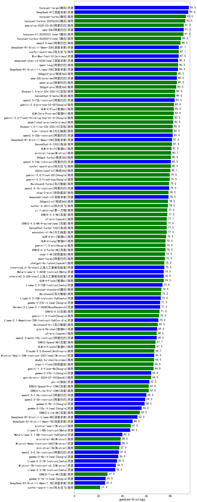

|类别|机构|大模型|【gaokao-biology】准确率|平均耗时|平均消耗token|花费/千次（元）|排名（准确率）|
|---|---|-----|-------------------|-------|-----------|-----------|-----------|
|商用|anthropic|claude-4-sonnet-thinking|100.0%|52s|1441|140.7|1|
|商用|openAI|o4-mini|100.0%|27s|872|24.6|2|
|开源|阿里巴巴|qwen3-235b-a22b-thinking-2507|97.0%|50s|2237|42.2|3|
|商用|百度|ERNIE-4.5-Turbo-32K|97.0%|314s|548|1.5|4|
|商用|阿里巴巴|qwen-plus-think-2025-07-28(new)|97.0%|/|2340|17.7|5|
|开源|阿里巴巴|qwen3-235b-a22b-instruct-2507|95.0%|24s|997|7.1|6|
|商用|阿里巴巴|qwen-plus-2025-07-14|95.0%|15s|981|1.8|7|
|商用|腾讯|hunyuan-t1-20250711|95.0%|31s|1900|7.1|8|
|商用|阿里巴巴|qwen-plus-2025-07-28(new)|95.0%|25s|943|1.7|9|
|商用|腾讯|hunyuan-turbos-20250716|95.0%|29s|1301|2.4|10|
|开源|深度求索|DeepSeek-V3.1-Think(new)|94.0%|62s|1248|14.0|11|
|商用|豆包|doubao-seed-1-6-flash-250615|94.0%|4s|437|0.5|12|
|商用|豆包|doubao-seed-1-6-thinking-250715|94.0%|13s|1429|10.5|13|
|商用|阿里巴巴|qwen-flash-think-2025-07-28|94.0%|22s|2197|3.1|14|
|开源|深度求索|DeepSeek-R1-0528|94.0%|268s|2162|33.2|15|
|开源|月之暗面|kimi-k2-0711-preview|94.0%|53s|881|12.6|16|
|商用|XAI|grok-4-0709|93.1%|302s|1815|185.7|17|
|商用|百度|ERNIE-X1-Turbo-32K|93.0%|284s|1623|6.2|18|
|商用|阿里巴巴|qwen-turbo-think-2025-07-15(new)|93.0%|/|2912|8.4|19|
|开源|智谱AI|GLM-4.5|93.0%|55s|2467|33.1|20|
|商用|google|gemini-2.5-pro|93.0%|32s|2855|198.5|21|
|开源|百度|ERNIE-4.5-300B-A47B|93.0%|213s|736|5.1|22|
|开源|minimax|MiniMax-M1|93.0%|43s|2452|18.2|23|
|商用|豆包|doubao-seed-1-6-flash-thinking-250615|93.0%|7s|850|1.1|24|
|开源|阶跃星辰|step-3|93.0%|117s|2332|9.0|25|
|开源|阿里巴巴|Qwen3-30B-A3B-Instruct-2507|92.0%|9s|988|2.6|26|
|商用|google|gemini-2.5-flash|92.0%|13s|2198|37.7|27|
|商用|豆包|doubao-seed-1-6-250615|92.0%|179s|435|2.5|28|
|商用|科大讯飞|xunfei-spark-x1-0725|92.0%|/|1961|23.5|29|
|开源|智谱AI|GLM-4.5-Air|92.0%|39s|2505|14.4|30|
|商用|阿里巴巴|qwen-flash-2025-07-28|92.0%|11s|1014|1.3|31|
|商用|阿里巴巴|qwen3-max-preview(new)|92.0%|18s|798|16.6|32|
|开源|豆包|Seed-OSS-36B-Instruct(new)|92.0%|116s|1915|7.3|33|
|开源|阿里巴巴|Qwen3-30B-A3B-Thinking-2507|92.0%|57s|2291|6.1|34|
|开源|腾讯|Hunyuan-A13B-Instruct|91.0%|196s|1394|5.2|35|
|开源|深度求索|DeepSeek-V3.1(new)|91.0%|26s|572|5.9|36|
|开源|阿里巴巴|Qwen3-32B|91.0%|280s|3907|15.2|37|
|商用|openAI|gpt-5-2025-08-07(new)|91.0%|33s|557|30.5|38|
|开源|阿里巴巴|Qwen3-14B|90.0%|291s|5488|10.8|39|
|商用|anthropic|claude-4-sonnet|90.0%|44s|722|62.5|40|
|商用|智谱AI|GLM-4.5-Flash|89.0%|45s|2465|0.0|41|
|开源|华为|pangu-pro-moe|89.0%|99s|2078|7.9|42|
|商用|XAI|grok-3-mini|88.0%|175s|1367|4.8|43|
|商用|阿里巴巴|qwen-turbo-2025-07-15|88.0%|12s|741|0.4|44|
|商用|科大讯飞|xunfei-spark-max|87.8%|11s|326|9.8|45|
|开源|minimax|MiniMax-Text-01|87.4%|8s|935|7.5|46|
|开源|深度求索|DeepSeek-R1-Distill-Qwen-32B|87.1%|30s|653|0.8|47|
|开源|百度|ERNIE-4.5-21B-A3B|87.0%|165s|776|0.0|48|
|商用|openAI|gpt-5-mini-2025-08-07(new)|87.0%|80s|1190|15.2|49|
|开源|智谱AI|GLM-4.5-nothink|87.0%|32s|1172|15.0|50|
|开源|深度求索|DeepSeek-R1-0528-Qwen3-8B|87.0%|330s|2301|0.0|51|
|商用|阿里巴巴|qwen-long-2025-01-25|86.4%|44s|458|0.8|52|
|开源|阿里巴巴|Qwen3-14B-nothink|86.0%|29s|844|1.5|53|
|商用|Mistral|mistral-medium-2508(new)|86.0%|26s|787|9.2|54|
|开源|阿里巴巴|Qwen3-8B|86.0%|774s|15228|0.0|55|
|商用|奇虎360|360gpt2-pro|85.4%|8s|368|1.5|56|
|开源|openAI|gpt-oss-120b(new)|85.0%|131s|1070|2.9|57|
|开源|meta|Llama-4-Maverick-17B-128E-Instruct-FP8|84.8%|9s|590|2.2|58|
|商用|豆包|Doubao-1.5-pro-32k-250115|84.4%|9s|480|0.8|59|
|开源|智谱AI|GLM-4.5-Air-nothink|84.0%|14s|1239|6.8|60|
|商用|openAI|gpt-5-nano-2025-08-07(new)|83.0%|31s|2791|7.7|61|
|开源|阿里巴巴|Qwen3-32B-nothink|83.0%|51s|801|2.8|62|
|开源|腾讯|Hunyuan-A13B-Instruct-nothink|83.0%|28s|566|1.9|63|
|开源|深度求索|deepseek-chat-v3-0324|83.0%|165s|507|3.5|64|
|商用|豆包|Doubao-1.5-lite-32k-250115|82.4%|4s|321|0.2|65|
|开源|Mistral|Magistral-Small-2507(new)|82.0%|66s|8056|86.3|66|
|开源|深度求索|DeepSeek-R1-Distill-Qwen-14B|81.9%|/|/|/|67|
|商用|月之暗面|kimi-latest-8k|81.8%|24s|593|7.1|68|
|商用|智谱AI|GLM-4.5-Flash-nothink|81.0%|46s|2627|0.0|69|
|开源|阿里巴巴|Qwen3-4B|81.0%|181s|2896|8.3|70|
|商用|奇虎360|360zhinao2-o1|80.7%|/|/|/|71|
|商用|科大讯飞|xunfei-spark-pro|80.4%|/|/|/|72|
|开源|智谱AI|GLM-Z1-32B-0414|80.0%|48s|989|3.6|73|
|开源|meta|Llama-4-Scout-17B-16E-Instruct|80.0%|11s|648|1.2|74|
|商用|百川智能|Baichuan4-Turbo|79.4%|/|/|/|75|
|商用|科大讯飞|xunfei-4.0Ultra|78.8%|8s|355|24.9|76|
|商用|奇虎360|360gpt2-o1|78.8%|24s|675|29.4|77|
|商用|阶跃星辰|step-2-mini|78.4%|3s|302|0.5|78|
|商用|google|gemini-2.5-flash-lite|78.0%|16s|4125|11.7|79|
|开源|Mistral|Mistral-Small-3.2-24B-Instruct-2506(new)|78.0%|14s|1123|2.2|80|
|开源|阿里巴巴|Qwen3-8B-nothink|78.0%|29s|799|0.0|81|
|商用|零一万物|yi-lightning|77.9%|/|/|/|82|
|商用|百度|ERNIE-3.5-8K|77.4%|14s|378|0.6|83|
|开源|openAI|gpt-oss-20b(new)|76.0%|152s|2077|2.2|84|
|开源|阿里巴巴|Qwen3-4B-nothink|73.0%|15s|731|1.8|85|
|开源|Google|gemma-3-27b-it|71.9%|/|/|/|86|
|商用|百川智能|Baichuan4-Air|69.8%|/|/|/|87|
|开源|智谱AI|GLM-4-9B-0414|68.0%|10s|625|0.0|88|
|商用|百度|ERNIE-Speed-8K|67.9%|/|/|/|89|
|开源|阿里巴巴|Qwen3-1.7B|66.0%|184s|3771|10.9|90|
|开源|Google|gemma-3-12b-it|56.3%|/|/|/|91|
|开源|阿里巴巴|Qwen3-1.7B-nothink|55.0%|16s|700|1.7|92|
|商用|百度|ERNIE-Lite-8K|54.8%|/|/|/|93|
|开源|智谱AI|GLM-4-32B-0414|54.0%|59s|671|1.3|94|
|开源|阿里巴巴|Qwen3-0.6B|44.0%|146s|2846|8.2|95|
|商用|Mistral|ministral-8b|38.7%|/|/|/|96|
|商用|Mistral|ministral-3b|37.7%|/|/|/|97|
|开源|Google|gemma-3-4b-it|36.7%|/|/|/|98|
|开源|阿里巴巴|Qwen3-0.6B-nothink|33.0%|6s|413|0.8|99|
|开源|智谱AI|GLM-Z1-9B-0414|33.0%|156s|3476|0.0|100|
|开源|百度|ERNIE-4.5-0.3B|33.0%|154s|534|0.0|101|
|商用|科大讯飞|xunfei-spark-lite|21.4%|/|/|/|102|

