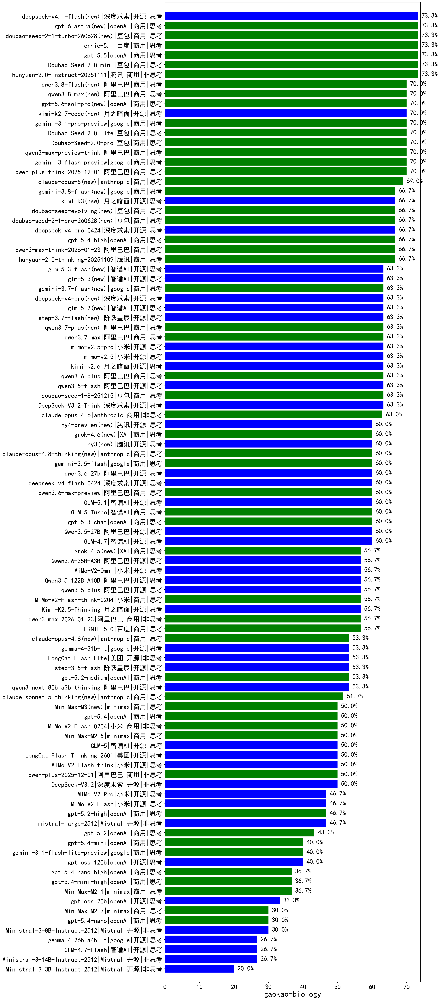

|类别|机构|大模型|【gaokao-biology】准确率|平均耗时|平均消耗token|花费/千次（元）|排名（准确率）|
|---|---|-----|-------------------|-------|-----------|-----------|-----------|
|商用|openAI|gpt-6-astra(new)|73.3%|13s|442|111.6|1|
|商用|腾讯|hunyuan-2.0-instruct-20251111|73.3%|26s|961|1.7|2|
|商用|openAI|gpt-5.5|73.3%|14s|972|177.2|3|
|商用|豆包|doubao-seed-2-1-turbo-260628(new)|73.3%|258s|9664|143.0|4|
|商用|豆包|Doubao-Seed-2.0-mini|73.3%|503s|3366|6.4|5|
|商用|百度|ernie-5.1|73.3%|76s|2538|44.0|6|
|商用|openAI|gpt-5.6-sol-pro(new)|70.0%|28s|5260|484.9|7|
|商用|阿里巴巴|qwen3.8-flash(new)|70.0%|75s|4060|10.6|8|
|商用|google|gemini-3.1-pro-preview|70.0%|54s|3385|278.3|9|
|商用|阿里巴巴|qwen3.8-max(new)|70.0%|100s|3977|139.3|10|
|商用|阿里巴巴|qwen-plus-think-2025-12-01|70.0%|103s|4494|35.0|11|
|商用|豆包|Doubao-Seed-2.0-pro|70.0%|268s|1278|18.4|12|
|商用|google|gemini-3-flash-preview|70.0%|129s|2555|51.9|13|
|开源|月之暗面|kimi-k2.7-code(new)|70.0%|64s|2513|65.3|14|
|商用|豆包|Doubao-Seed-2.0-lite|70.0%|328s|1496|4.9|15|
|商用|阿里巴巴|qwen3-max-preview-think|70.0%|301s|4237|99.2|16|
|商用|anthropic|claude-opus-5(new)|69.0%|48s|911|131.6|17|
|商用|openAI|gpt-5.4-high|66.7%|26s|1626|157.3|18|
|商用|google|gemini-3.8-flash(new)|66.7%|15s|1370|65.9|19|
|商用|阿里巴巴|qwen3-max-think-2026-01-23|66.7%|344s|5317|52.2|20|
|商用|豆包|doubao-seed-2-1-pro-260628(new)|66.7%|261s|11902|353.2|21|
|开源|月之暗面|kimi-k3(new)|66.7%|88s|1943|178.1|22|
|商用|豆包|doubao-seed-evolving(new)|66.7%|289s|11683|346.6|23|
|开源|深度求索|deepseek-v4-pro-0424|66.7%|102s|2736|64.3|24|
|商用|腾讯|hunyuan-2.0-thinking-20251109|66.7%|42s|1913|7.3|25|
|开源|月之暗面|kimi-k2.6|63.3%|191s|4881|125.0|26|
|开源|小米|mimo-v2.5-pro|63.3%|54s|2578|48.9|27|
|商用|阿里巴巴|qwen3.7-max|63.3%|60s|2723|95.1|28|
|开源|阿里巴巴|qwen3.5-flash|63.3%|511s|5458|10.7|29|
|开源|小米|mimo-v2.5|63.3%|61s|3107|39.3|30|
|开源|智谱AI|glm-5.2(new)|63.3%|130s|6351|175.3|31|
|开源|深度求索|deepseek-v4-pro(new)|63.3%|95s|3362|87.3|32|
|商用|google|gemini-3.7-flash(new)|63.3%|6s|1047|24.5|33|
|商用|阿里巴巴|qwen3.7-plus(new)|63.3%|85s|4656|36.5|34|
|开源|深度求索|DeepSeek-V3.2-Think|63.3%|246s|2866|8.5|35|
|开源|阶跃星辰|step-3.7-flash(new)|63.3%|48s|5263|41.8|36|
|开源|智谱AI|glm-5.3-flash(new)|63.3%|157s|4805|13.2|37|
|商用|阿里巴巴|qwen3.6-plus|63.3%|63s|2732|31.5|38|
|开源|智谱AI|glm-5.3(new)|63.3%|264s|4266|116.9|39|
|商用|豆包|doubao-seed-1-8-251215|63.3%|39s|1133|7.9|40|
|商用|anthropic|claude-opus-4.6|63.0%|17s|957|139.7|41|
|商用|XAI|grok-4.6(new)|60.0%|142s|3617|142.8|42|
|开源|深度求索|deepseek-v4-flash-0424|60.0%|69s|2434|4.8|43|
|商用|google|gemini-3.5-flash|60.0%|13s|2568|154.3|44|
|开源|腾讯|hy3(new)|60.0%|60s|499|1.6|45|
|商用|anthropic|claude-opus-4.8-thinking(new)|60.0%|24s|1937|310.7|46|
|商用|阿里巴巴|qwen3.6-max-preview|60.0%|82s|2634|136.6|47|
|开源|阿里巴巴|qwen3.6-27b|60.0%|47s|2902|50.4|48|
|开源|智谱AI|GLM-5.1|60.0%|230s|4616|108.6|49|
|商用|智谱AI|GLM-5-Turbo|60.0%|61s|4083|87.8|50|
|开源|智谱AI|GLM-4.7|60.0%|139s|4240|58.0|51|
|开源|阿里巴巴|Qwen3.5-27B|60.0%|528s|5225|24.6|52|
|商用|openAI|gpt-5.3-chat|60.0%|25s|719|57.2|53|
|开源|阿里巴巴|qwen3.5-plus|56.7%|66s|4981|23.4|54|
|商用|阿里巴巴|qwen3-max-2026-01-23|56.7%|45s|1617|15.2|55|
|开源|阿里巴巴|Qwen3.5-122B-A10B|56.7%|170s|5249|32.9|56|
|开源|阿里巴巴|Qwen3.6-35B-A3B|56.7%|16s|2562|26.6|57|
|开源|月之暗面|Kimi-K2.5-Thinking|56.7%|460s|5760|118.8|58|
|商用|百度|ERNIE-5.0|56.7%|354s|5540|131.0|59|
|开源|小米|MiMo-V2-Omni|56.7%|668s|3067|38.7|60|
|商用|XAI|grok-4.5(new)|56.7%|98s|5254|211.5|61|
|商用|小米|MiMo-V2-Flash-think-0204|56.7%|668s|3726|7.6|62|
|开源|google|gemma-4-31b-it|53.3%|145s|778|1.9|63|
|开源|美团|LongCat-Flash-Lite|53.3%|373s|1542|0.0|64|
|开源|阶跃星辰|step-3.5-flash|53.3%|46s|6100|12.6|65|
|商用|openAI|gpt-5.2-medium|53.3%|17s|872|73.3|66|
|开源|阿里巴巴|qwen3-next-80b-a3b-thinking|53.3%|47s|4552|17.8|67|
|商用|anthropic|claude-opus-4.8(new)|53.3%|9s|757|104.2|68|
|商用|anthropic|claude-sonnet-5-thinking(new)|51.7%|24s|1744|111.0|69|
|商用|小米|MiMo-V2-Flash-0204|50.0%|446s|1581|3.1|70|
|商用|minimax|MiniMax-M2.5|50.0%|66s|3356|27.3|71|
|开源|智谱AI|GLM-5|50.0%|211s|5075|89.6|72|
|开源|小米|MiMo-V2-Flash-think|50.0%|81s|3866|0.0|73|
|商用|openAI|gpt-5.4|50.0%|8s|525|41.7|74|
|商用|阿里巴巴|qwen-plus-2025-12-01|50.0%|41s|1676|3.2|75|
|开源|美团|LongCat-Flash-Thinking-2601|50.0%|297s|4151|0.0|76|
|开源|深度求索|DeepSeek-V3.2|50.0%|23s|772|2.2|77|
|商用|minimax|MiniMax-M3(new)|50.0%|92s|2987|46.6|78|
|商用|openAI|gpt-5.2-high|46.7%|28s|1283|114.2|79|
|开源|Mistral|mistral-large-2512|46.7%|18s|851|7.8|80|
|开源|小米|MiMo-V2-Flash|46.7%|124s|1779|0.0|81|
|开源|小米|MiMo-V2-Pro|46.7%|249s|1802|32.6|82|
|商用|openAI|gpt-5.2|43.3%|7s|442|30.6|83|
|开源|openAI|gpt-oss-120b|40.0%|229s|1070|2.9|84|
|商用|google|gemini-3.1-flash-lite-preview|40.0%|47s|596|5.0|85|
|商用|openAI|gpt-5.4-mini|40.0%|108s|422|9.3|86|
|商用|minimax|MiniMax-M2.1|36.7%|146s|2959|23.9|87|
|商用|openAI|gpt-5.4-nano-high|36.7%|122s|1589|12.8|88|
|商用|openAI|gpt-5.4-mini-high|36.7%|47s|2511|75.1|89|
|开源|openAI|gpt-oss-20b|33.3%|134s|2305|2.5|90|
|商用|openAI|gpt-5.4-nano|30.0%|27s|506|3.3|91|
|开源|Mistral|Ministral-3-8B-Instruct-2512|30.0%|16s|1239|1.3|92|
|商用|minimax|MiniMax-M2.7|30.0%|105s|4483|36.7|93|
|开源|智谱AI|GLM-4.7-Flash|26.7%|1274s|11405|0.0|94|
|开源|google|gemma-4-26b-a4b-it|26.7%|59s|1242|3.2|95|
|开源|Mistral|Ministral-3-14B-Instruct-2512|26.7%|24s|2149|3.1|96|
|开源|Mistral|Ministral-3-3B-Instruct-2512|20.0%|24s|3214|2.3|97|

