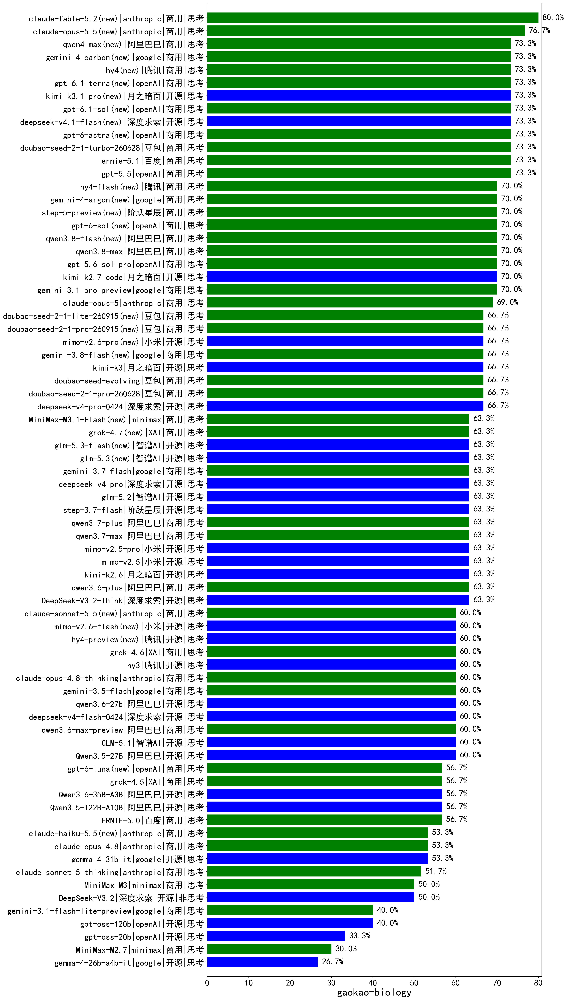

|类别|机构|大模型|【gaokao-biology】准确率|平均耗时|平均消耗token|花费/千次（元）|排名（准确率）|
|---|---|-----|-------------------|-------|-----------|-----------|-----------|
|商用|anthropic|claude-fable-5.2(new)|80.0%|24s|749|163.9|1|
|商用|anthropic|claude-opus-5.5(new)|76.7%|15s|840|94.6|2|
|商用|腾讯|hy4(new)|73.3%|109s|5565|98.6|3|
|开源|月之暗面|kimi-k3.1-pro(new)|73.3%|90s|3047|196.1|4|
|商用|豆包|doubao-seed-2-1-turbo-260628|73.3%|258s|9664|143.0|5|
|商用|openAI|gpt-6.1-terra(new)|73.3%|6s|485|12.7|6|
|商用|openAI|gpt-6-astra(new)|73.3%|13s|442|111.6|7|
|商用|openAI|gpt-5.5|73.3%|14s|972|177.2|8|
|商用|百度|ernie-5.1|73.3%|76s|2538|44.0|9|
|开源|深度求索|deepseek-v4.1-flash(new)|73.3%|36s|2010|15.2|10|
|商用|openAI|gpt-6.1-sol(new)|73.3%|8s|410|20.1|11|
|商用|google|gemini-4-carbon(new)|73.3%|25s|1194|148.7|12|
|商用|openAI|gpt-6-sol(new)|70.0%|222s|365|17.0|13|
|商用|阿里巴巴|qwen3.8-flash(new)|70.0%|75s|4060|10.6|14|
|商用|阶跃星辰|step-5-preview(new)|70.0%|48s|3412|66.7|15|
|商用|阿里巴巴|qwen3.8-max|70.0%|100s|3977|139.3|16|
|商用|openAI|gpt-5.6-sol-pro|70.0%|28s|5260|484.9|17|
|开源|月之暗面|kimi-k2.7-code|70.0%|64s|2513|65.3|18|
|商用|腾讯|hy4-flash(new)|70.0%|21s|2384|4.6|19|
|商用|google|gemini-4-argon(new)|70.0%|22s|679|76.4|20|
|商用|google|gemini-3.1-pro-preview|70.0%|54s|3385|278.3|21|
|商用|anthropic|claude-opus-5|69.0%|48s|911|131.6|22|
|开源|小米|mimo-v2.6-pro(new)|66.7%|85s|4061|24.0|23|
|商用|豆包|doubao-seed-evolving|66.7%|289s|11683|346.6|24|
|商用|豆包|doubao-seed-2-1-pro-260628|66.7%|261s|11902|353.2|25|
|商用|google|gemini-3.8-flash(new)|66.7%|15s|1370|65.9|26|
|开源|月之暗面|kimi-k3|66.7%|88s|1943|178.1|27|
|开源|深度求索|deepseek-v4-pro-0424|66.7%|102s|2736|64.3|28|
|商用|豆包|doubao-seed-2-1-pro-260915(new)|66.7%|127s|2180|61.5|29|
|商用|豆包|doubao-seed-2-1-lite-260915(new)|66.7%|57s|2545|6.6|30|
|商用|XAI|grok-4.7(new)|63.3%|163s|11167|430.9|31|
|开源|智谱AI|glm-5.3-flash(new)|63.3%|157s|4805|13.2|32|
|开源|智谱AI|glm-5.3(new)|63.3%|264s|4266|116.9|33|
|商用|google|gemini-3.7-flash|63.3%|6s|1047|24.5|34|
|开源|深度求索|deepseek-v4-pro|63.3%|95s|3362|87.3|35|
|开源|深度求索|DeepSeek-V3.2-Think|63.3%|246s|2866|8.5|36|
|商用|阿里巴巴|qwen3.6-plus|63.3%|63s|2732|31.5|37|
|开源|智谱AI|glm-5.2|63.3%|130s|6351|175.3|38|
|开源|阶跃星辰|step-3.7-flash|63.3%|48s|5263|41.8|39|
|商用|minimax|MiniMax-M3.1-Flash(new)|63.3%|35s|2367|8.5|40|
|开源|小米|mimo-v2.5-pro|63.3%|54s|2578|48.9|41|
|开源|小米|mimo-v2.5|63.3%|61s|3107|39.3|42|
|开源|月之暗面|kimi-k2.6|63.3%|191s|4881|125.0|43|
|商用|阿里巴巴|qwen3.7-plus|63.3%|85s|4656|36.5|44|
|商用|阿里巴巴|qwen3.7-max|63.3%|60s|2723|95.1|45|
|开源|智谱AI|GLM-5.1|60.0%|230s|4616|108.6|46|
|开源|阿里巴巴|Qwen3.5-27B|60.0%|528s|5225|24.6|47|
|开源|小米|mimo-v2.6-flash(new)|60.0%|397s|2268|4.4|48|
|开源|腾讯|hy4-preview(new)|60.0%|90s|5365|95.0|49|
|商用|anthropic|claude-opus-4.8-thinking|60.0%|24s|1937|310.7|50|
|开源|阿里巴巴|qwen3.6-27b|60.0%|47s|2902|50.4|51|
|商用|anthropic|claude-sonnet-5.5(new)|60.0%|8s|722|39.1|52|
|商用|XAI|grok-4.6|60.0%|142s|3617|142.8|53|
|商用|阿里巴巴|qwen3.6-max-preview|60.0%|82s|2634|136.6|54|
|开源|深度求索|deepseek-v4-flash-0424|60.0%|69s|2434|4.8|55|
|开源|腾讯|hy3|60.0%|60s|499|1.6|56|
|商用|google|gemini-3.5-flash|60.0%|13s|2568|154.3|57|
|商用|百度|ERNIE-5.0|56.7%|354s|5540|131.0|58|
|商用|XAI|grok-4.5|56.7%|98s|5254|211.5|59|
|商用|openAI|gpt-6-luna(new)|56.7%|367s|907|2.7|60|
|开源|阿里巴巴|Qwen3.6-35B-A3B|56.7%|16s|2562|26.6|61|
|开源|阿里巴巴|Qwen3.5-122B-A10B|56.7%|170s|5249|32.9|62|
|商用|anthropic|claude-opus-4.8|53.3%|9s|757|104.2|63|
|开源|google|gemma-4-31b-it|53.3%|145s|778|1.9|64|
|商用|anthropic|claude-haiku-5.5(new)|53.3%|13s|1159|3.5|65|
|商用|anthropic|claude-sonnet-5-thinking|51.7%|24s|1744|111.0|66|
|商用|minimax|MiniMax-M3|50.0%|92s|2987|46.6|67|
|开源|深度求索|DeepSeek-V3.2|50.0%|23s|772|2.2|68|
|商用|google|gemini-3.1-flash-lite-preview|40.0%|47s|596|5.0|69|
|开源|openAI|gpt-oss-120b|40.0%|229s|1070|2.9|70|
|开源|openAI|gpt-oss-20b|33.3%|134s|2305|2.5|71|
|商用|minimax|MiniMax-M2.7|30.0%|105s|4483|36.7|72|
|开源|google|gemma-4-26b-a4b-it|26.7%|59s|1242|3.2|73|

