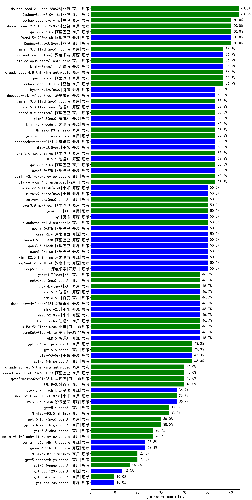

|类别|机构|大模型|【gaokao-chemistry】准确率|平均耗时|平均消耗token|花费/千次（元）|排名（准确率）|
|---|---|-----|-------------------|-------|-----------|-----------|-----------|
|商用|豆包|doubao-seed-2-1-pro-260628|63.3%|286s|11920|352.5|1|
|商用|豆包|Doubao-Seed-2.0-lite|63.3%|236s|1335|4.2|2|
|商用|豆包|Doubao-Seed-2.0-pro|60.0%|284s|1349|18.8|3|
|商用|阿里巴巴|qwen3.7-plus|60.0%|133s|7367|57.8|4|
|商用|豆包|doubao-seed-2-1-turbo-260628|60.0%|233s|9197|135.4|5|
|商用|豆包|doubao-seed-evolving|60.0%|256s|10758|317.7|6|
|开源|阿里巴巴|Qwen3.5-122B-A10B|60.0%|177s|6820|42.6|7|
|商用|google|gemini-3.7-flash(new)|56.7%|7s|1486|35.3|8|
|商用|anthropic|claude-opus-4.8-thinking|56.7%|29s|2604|410.1|9|
|开源|月之暗面|kimi-k3(new)|56.7%|197s|3738|353.5|10|
|商用|anthropic|claude-opus-5(new)|56.7%|16s|1319|185.2|11|
|开源|深度求索|deepseek-v4-pro(new)|56.7%|79s|3302|84.8|12|
|商用|豆包|Doubao-Seed-2.0-mini|56.7%|421s|3437|6.5|13|
|商用|阿里巴巴|qwen3.7-max|56.7%|59s|3351|116.2|14|
|商用|阿里巴巴|qwen3.8-flash(new)|53.3%|157s|10746|28.6|15|
|商用|google|gemini-3.5-flash|53.3%|23s|3367|202.9|16|
|开源|智谱AI|GLM-5.1|53.3%|371s|5767|135.1|17|
|商用|阿里巴巴|qwen3.6-max-preview|53.3%|188s|6414|337.9|18|
|开源|智谱AI|glm-5.3-flash(new)|53.3%|272s|9504|26.2|19|
|开源|腾讯|hy4-preview(new)|53.3%|121s|7601|134.7|20|
|开源|小米|mimo-v2.5-pro|53.3%|147s|8425|170.8|21|
|商用|anthropic|claude-opus-4.6|53.3%|19s|1169|163.6|22|
|开源|月之暗面|kimi-k2.7-code|53.3%|98s|4376|114.6|23|
|商用|minimax|MiniMax-M3|53.3%|204s|7366|119.6|24|
|开源|智谱AI|glm-5.3(new)|53.3%|165s|7113|195.4|25|
|开源|深度求索|deepseek-v4.1-flash(new)|53.3%|24s|4112|31.8|26|
|开源|阿里巴巴|Qwen3.5-27B|53.3%|654s|6737|31.5|27|
|开源|深度求索|deepseek-v4-pro-0424|53.3%|148s|5081|120.0|28|
|商用|google|gemini-3.1-pro-preview|53.3%|69s|4762|393.3|29|
|商用|google|gemini-3.8-flash(new)|53.3%|16s|1622|77.8|30|
|商用|阿里巴巴|qwen3.6-plus|53.3%|114s|6109|71.5|31|
|开源|深度求索|DeepSeek-V3.2|50.0%|37s|1278|3.7|32|
|开源|深度求索|DeepSeek-V3.2-Think|50.0%|276s|4018|11.9|33|
|商用|anthropic|claude-opus-4.8|50.0%|11s|948|120.3|34|
|开源|阿里巴巴|qwen3.6-27b|50.0%|81s|5361|93.7|35|
|开源|阿里巴巴|Qwen3.6-35B-A3B|50.0%|19s|3861|40.0|36|
|开源|腾讯|hy3|50.0%|113s|708|2.3|37|
|开源|小米|mimo-v2.6-flash(new)|50.0%|467s|4743|9.3|38|
|开源|小米|mimo-v2.6-pro(new)|50.0%|291s|9492|56.4|39|
|商用|XAI|grok-4.5|50.0%|101s|7451|302.2|40|
|开源|月之暗面|Kimi-K2.5-Thinking|50.0%|279s|8417|173.8|41|
|商用|阿里巴巴|qwen3.8-max(new)|50.0%|226s|9976|353.7|42|
|开源|阿里巴巴|qwen3.5-flash|50.0%|157s|6496|12.7|43|
|开源|阿里巴巴|qwen3.5-plus|50.0%|62s|5724|26.7|44|
|商用|openAI|gpt-6-astra(new)|50.0%|21s|642|167.7|45|
|开源|月之暗面|kimi-k2.6|50.0%|249s|6636|175.6|46|
|开源|智谱AI|glm-5.2|46.7%|134s|6514|178.6|47|
|商用|openAI|gpt-6-sol(new)|46.7%|236s|576|28.9|48|
|商用|XAI|grok-4.6(new)|46.7%|214s|6470|261.0|49|
|商用|XAI|grok-4.7(new)|46.7%|147s|10854|416.2|50|
|商用|百度|ernie-5.1|46.7%|88s|3541|61.3|51|
|开源|深度求索|deepseek-v4-flash-0424|46.7%|89s|4348|8.5|52|
|开源|小米|mimo-v2.5|46.7%|73s|4323|55.7|53|
|开源|智谱AI|GLM-5|46.7%|318s|7775|137.4|54|
|开源|美团|LongCat-Flash-Lite|46.7%|192s|2509|0.0|55|
|商用|小米|MiMo-V2-Flash-0204|46.7%|609s|2020|3.9|56|
|开源|小米|MiMo-V2-Omni|46.7%|585s|5022|65.4|57|
|商用|智谱AI|GLM-5-Turbo|46.7%|89s|6107|131.2|58|
|商用|openAI|gpt-5.6-sol-pro|43.3%|45s|8387|858.9|59|
|开源|小米|MiMo-V2-Pro|43.3%|313s|2740|51.4|60|
|商用|openAI|gpt-5.4-high|43.3%|52s|2991|296.2|61|
|商用|openAI|gpt-5.5|43.3%|33s|1733|328.3|62|
|商用|阿里巴巴|qwen3-max-think-2026-01-23|40.0%|446s|7489|73.4|63|
|商用|阿里巴巴|qwen3-max-2026-01-23|40.0%|39s|1739|15.9|64|
|商用|anthropic|claude-sonnet-5-thinking|40.0%|36s|3189|205.0|65|
|商用|百度|ERNIE-5.0|40.0%|412s|7324|172.7|66|
|商用|小米|MiMo-V2-Flash-think-0204|36.7%|829s|5477|11.2|67|
|开源|阶跃星辰|step-3.5-flash|36.7%|58s|8066|16.7|68|
|开源|阶跃星辰|step-3.7-flash|36.7%|123s|7874|62.6|69|
|商用|openAI|gpt-5.4|33.3%|11s|878|74.4|70|
|商用|minimax|MiniMax-M2.5|33.3%|100s|5696|46.6|71|
|商用|openAI|gpt-6-luna(new)|30.0%|201s|1843|5.9|72|
|商用|openAI|gpt-5.4-mini-high|30.0%|180s|3636|109.2|73|
|商用|openAI|gpt-5.3-chat|26.7%|13s|1074|87.8|74|
|商用|google|gemini-3.1-flash-lite-preview|26.7%|47s|886|7.8|75|
|开源|google|gemma-4-31b-it|23.3%|97s|1296|3.3|76|
|开源|google|gemma-4-26b-a4b-it|23.3%|141s|1468|3.8|77|
|商用|openAI|gpt-5.4-nano-high|20.0%|138s|3847|32.2|78|
|商用|minimax|MiniMax-M2.7|20.0%|189s|7837|64.6|79|
|商用|openAI|gpt-5.4-nano|16.7%|12s|896|6.3|80|
|开源|openAI|gpt-oss-120b|13.3%|151s|1864|5.4|81|
|开源|openAI|gpt-oss-20b|10.0%|183s|3744|4.1|82|
|商用|openAI|gpt-5.4-mini|10.0%|134s|629|14.5|83|

