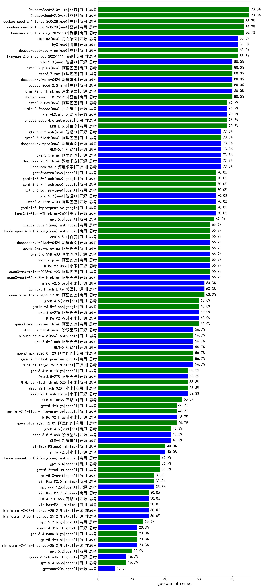

|类别|机构|大模型|【gaokao-chinese】准确率|平均耗时|平均消耗token|花费/千次（元）|排名（准确率）|
|---|---|-----|-------------------|-------|-----------|-----------|-----------|
|商用|豆包|Doubao-Seed-2.0-pro|90.0%|211s|1098|15.2|1|
|商用|豆包|Doubao-Seed-2.0-lite|90.0%|204s|1142|3.6|2|
|商用|豆包|doubao-seed-2-1-pro-260628(new)|86.7%|237s|10944|323.9|3|
|商用|豆包|doubao-seed-2-1-turbo-260628(new)|86.7%|204s|9104|134.4|4|
|商用|腾讯|hunyuan-2.0-thinking-20251109|86.7%|30s|1045|3.8|5|
|商用|腾讯|hunyuan-2.0-instruct-20251111|83.3%|22s|457|0.7|6|
|开源|腾讯|hy3(new)|83.3%|64s|551|1.8|7|
|商用|豆包|doubao-seed-evolving(new)|83.3%|339s|10074|297.8|8|
|开源|月之暗面|kimi-k3(new)|83.3%|186s|3463|329.9|9|
|开源|智谱AI|glm-5.3(new)|80.0%|282s|8998|249.0|10|
|商用|阿里巴巴|qwen3.7-plus(new)|80.0%|80s|4319|33.7|11|
|开源|深度求索|deepseek-v4-pro-0424|80.0%|78s|1864|43.1|12|
|商用|豆包|Doubao-Seed-2.0-mini|80.0%|85s|2269|4.2|13|
|商用|阿里巴巴|qwen3.7-max|80.0%|64s|2533|87.9|14|
|开源|月之暗面|Kimi-K2.5-Thinking|80.0%|645s|3406|69.4|15|
|商用|豆包|doubao-seed-1-8-251215|80.0%|38s|1023|6.9|16|
|商用|阿里巴巴|qwen3.8-max(new)|76.7%|88s|3929|137.2|17|
|商用|百度|ERNIE-5.0|76.7%|159s|2247|51.7|18|
|商用|anthropic|claude-opus-4.6|76.7%|28s|811|109.4|19|
|开源|月之暗面|kimi-k2.7-code(new)|76.7%|115s|3604|94.7|20|
|开源|月之暗面|kimi-k2.6|76.7%|170s|4522|115.5|21|
|开源|阿里巴巴|qwen3.5-plus|73.3%|54s|4416|20.6|22|
|商用|阿里巴巴|qwen3.8-flash(new)|73.3%|71s|5890|15.5|23|
|开源|智谱AI|glm-5.3-flash(new)|73.3%|207s|7825|21.6|24|
|开源|智谱AI|GLM-5.1|73.3%|286s|3907|91.3|25|
|开源|深度求索|DeepSeek-V3.2-Think|73.3%|97s|3098|9.2|26|
|开源|深度求索|DeepSeek-V3.2|73.3%|132s|528|1.5|27|
|开源|深度求索|deepseek-v4-pro(new)|73.3%|160s|4588|120.1|28|
|开源|智谱AI|glm-5.2(new)|70.0%|125s|6002|165.2|29|
|开源|阿里巴巴|Qwen3.5-122B-A10B|70.0%|155s|4791|29.9|30|
|商用|google|gemini-3.1-pro-preview|70.0%|59s|3345|274.2|31|
|商用|openAI|gpt-6-astra(new)|70.0%|19s|548|143.7|32|
|商用|google|gemini-3.8-flash(new)|70.0%|19s|1121|52.4|33|
|商用|google|gemini-3.7-flash(new)|70.0%|26s|917|20.9|34|
|开源|美团|LongCat-Flash-Thinking-2601|70.0%|111s|4750|0.0|35|
|商用|openAI|gpt-5.6-sol-pro(new)|70.0%|47s|6165|595.8|36|
|商用|openAI|gpt-5.5|69.0%|34s|1543|293.3|37|
|开源|阿里巴巴|Qwen3.6-35B-A3B|66.7%|15s|2737|28.3|38|
|商用|anthropic|claude-opus-5(new)|66.7%|18s|1113|162.6|39|
|商用|百度|ernie-5.1|66.7%|81s|3693|64.4|40|
|商用|anthropic|claude-opus-4.8-thinking(new)|66.7%|27s|1836|289.1|41|
|商用|阿里巴巴|qwen3.6-plus|66.7%|67s|2454|28.1|42|
|开源|小米|MiMo-V2-Omni|66.7%|607s|4651|60.7|43|
|商用|阿里巴巴|qwen3.6-max-preview|66.7%|83s|2685|138.8|44|
|开源|阿里巴巴|qwen3-next-80b-a3b-thinking|66.7%|264s|5804|22.8|45|
|商用|阿里巴巴|qwen3-max-think-2026-01-23|66.7%|446s|6449|63.4|46|
|开源|深度求索|deepseek-v4-flash-0424|66.7%|52s|2068|4.0|47|
|商用|阿里巴巴|qwen-plus-think-2025-12-01|63.3%|155s|4359|33.8|48|
|开源|小米|mimo-v2.5-pro|63.3%|50s|2547|48.0|49|
|开源|美团|LongCat-Flash-Lite|63.3%|401s|912|0.0|50|
|商用|XAI|grok-4.6(new)|60.0%|229s|6798|275.7|51|
|商用|阿里巴巴|qwen3-max-preview-think|60.0%|128s|4792|112.3|52|
|开源|阿里巴巴|qwen3.6-27b|60.0%|47s|2893|50.0|53|
|商用|google|gemini-3.5-flash|60.0%|20s|2647|158.8|54|
|开源|小米|MiMo-V2-Pro|60.0%|26s|1738|31.1|55|
|开源|Mistral|mistral-large-2512|56.7%|10s|478|3.7|56|
|开源|智谱AI|GLM-5|56.7%|171s|4669|82.1|57|
|商用|anthropic|claude-opus-4.8(new)|56.7%|14s|550|64.1|58|
|商用|google|gemini-3-flash-preview|56.7%|131s|3072|62.7|59|
|开源|阿里巴巴|qwen3.5-flash|56.7%|172s|5988|11.7|60|
|商用|阿里巴巴|qwen3-max-2026-01-23|56.7%|29s|1164|10.5|61|
|开源|阶跃星辰|step-3.7-flash(new)|56.7%|54s|4365|34.4|62|
|商用|openAI|gpt-5.4-mini-high|53.3%|119s|2957|88.6|63|
|开源|小米|MiMo-V2-Flash-think|53.3%|86s|4143|0.0|64|
|开源|阿里巴巴|Qwen3.5-27B|53.3%|587s|5171|24.2|65|
|商用|小米|MiMo-V2-Flash-think-0204|53.3%|311s|3767|7.7|66|
|商用|小米|MiMo-V2-Flash-0204|53.3%|77s|756|1.4|67|
|商用|智谱AI|GLM-5-Turbo|50.0%|88s|5393|116.3|68|
|商用|google|gemini-3.1-flash-lite-preview|46.7%|9s|522|4.1|69|
|商用|阿里巴巴|qwen-plus-2025-12-01|46.7%|39s|1756|3.3|70|
|开源|小米|MiMo-V2-Flash|46.7%|24s|644|0.0|71|
|商用|openAI|gpt-5.4-high|46.7%|52s|2125|207.7|72|
|开源|智谱AI|GLM-4.7|43.3%|163s|4438|60.6|73|
|商用|XAI|grok-4.5(new)|43.3%|140s|9769|400.4|74|
|开源|阶跃星辰|step-3.5-flash|43.3%|48s|5764|11.9|75|
|开源|小米|mimo-v2.5|40.0%|48s|4356|56.6|76|
|商用|minimax|MiniMax-M3(new)|40.0%|266s|7083|111.4|77|
|商用|openAI|gpt-5.2-medium|36.7%|21s|873|71.7|78|
|商用|anthropic|claude-sonnet-5-thinking(new)|36.7%|24s|1707|106.6|79|
|商用|openAI|gpt-5.4|36.7%|5s|423|29.3|80|
|商用|openAI|gpt-5.3-chat|33.3%|10s|689|52.7|81|
|开源|openAI|gpt-oss-120b|33.3%|122s|1152|3.2|82|
|商用|minimax|MiniMax-M2.5|33.3%|66s|3213|26.0|83|
|开源|智谱AI|GLM-4.7-Flash|30.0%|1204s|14870|0.0|84|
|商用|minimax|MiniMax-M2.1|30.0%|203s|5695|46.8|85|
|商用|minimax|MiniMax-M2.7|30.0%|120s|4994|40.9|86|
|开源|Mistral|Ministral-3-3B-Instruct-2512|30.0%|16s|2830|2.0|87|
|开源|Mistral|Ministral-3-8B-Instruct-2512|30.0%|8s|1085|1.2|88|
|商用|openAI|gpt-5.2-high|26.7%|28s|1234|107.7|89|
|商用|openAI|gpt-5.4-mini|23.3%|4s|364|6.9|90|
|开源|google|gemma-4-31b-it|23.3%|75s|632|1.5|91|
|开源|Mistral|Ministral-3-14B-Instruct-2512|23.3%|14s|668|1.0|92|
|商用|openAI|gpt-5.4-nano-high|23.3%|16s|1759|14.1|93|
|商用|openAI|gpt-5.2|20.0%|8s|351|19.9|94|
|开源|google|gemma-4-26b-a4b-it|16.7%|43s|724|1.7|95|
|商用|openAI|gpt-5.4-nano|16.7%|93s|405|2.3|96|
|开源|openAI|gpt-oss-20b|10.0%|140s|2640|2.9|97|

