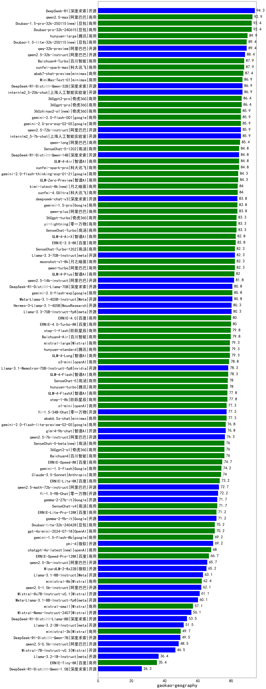

| 类别 | 大模型                         | gaokao-geography | 排名 |
|-----|------------------------------|---------|----|
|开源|DeepSeek-R1|90.8|1|
|商用|qwq-plus-2025-03-05|86.0|2|
|商用|hunyuan-turbo|85.0|3|
|商用|ERNIE-4.5-8K-Preview|85.0|4|
|开源|qwq-32b|84.3|5|
|商用|xunfei-spark-max|82.4|6|
|商用|kimi-latest-8k|82.0|7|
|开源|Llama-4-Maverick-17B-128E-Instruct-FP8(new)|82.0|8|
|商用|xunfei-4.0Ultra|82.0|9|
|开源|Qwen3-235B-A22B(new)|80.0|10|
|商用|ERNIE-X1-32K-Preview(new)|80.0|11|
|商用|hunyuan-turbos-20250226|79.5|12|
|商用|360zhinao2-o1|79.0|13|
|开源|deepseek-chat-v3-0324|79.0|14|
|开源|DeepSeek-R1-Distill-Qwen-32B|78.2|15|
|商用|Doubao-1.5-pro-32k-250115|78.0|16|
|开源|qwen2.5-72b-instruct|77.3|17|
|商用|hunyuan-t1-20250321|76.9|18|
|开源|Qwen3-30B-A3B(new)|76.7|19|
|开源|Qwen3-14B(new)|76.7|20|
|商用|GLM-Z1-Air(new)|76.0|21|
|商用|qwen2.5-max|75.5|22|
|商用|SenseChat-5-beta|75.0|23|
|商用|hunyuan-turbos-20250313|75.0|24|
|商用|SenseChat-5-1202|74.8|25|
|商用|360gpt2-pro|74.0|26|
|商用|360gpt2-o1|74.0|27|
|开源|hunyuan-large|74.0|28|
|开源|Qwen3-32B(new)|73.3|29|
|开源|MiniMax-Text-01|72.5|30|
|商用|GLM-4-Plus|72.0|31|
|商用|360gpt-turbo|70.0|32|
|开源|Qwen3-4B(new)|70.0|33|
|商用|gemini-2.0-flash-thinking-exp-01-21|70.0|34|
|开源|DeepSeek-R1-Distill-Qwen-14B|70.0|35|
|开源|Qwen3-8B(new)|70.0|36|
|商用|xunfei-spark-pro|70.0|37|
|商用|Baichuan4-Turbo|69.0|38|
|开源|qwen2.5-32b-instruct|69.0|39|
|开源|DeepSeek-R1-Distill-Llama-70B|68.9|40|
|商用|mistral-large|68.6|41|
|商用|gemini-2.0-flash-001|67.5|42|
|商用|qwen-long|67.5|43|
|商用|o3-mini|67.2|44|
|开源|Meta-Llama-3.1-405B-Instruct|67.0|45|
|开源|GLM-Z1-32B-0414(new)|66.7|46|
|商用|yi-lightning|66.5|47|
|商用|qwen-plus|66.5|48|
|商用|Doubao-1.5-lite-32k-250115|66.5|49|
|商用|moonshot-v1-8k|66.5|50|
|开源|qwen2.5-14b-instruct|66.0|51|
|商用|gemini-1.5-pro|66.0|52|
|商用|chatgpt-4o-latest|66.0|53|
|开源|Llama-3.3-70B-Instruct|65.5|54|
|开源|Llama-4-Scout-17B-16E-Instruct(new)|65.5|55|
|开源|internlm2_5-7b-chat|65.0|56|
|开源|Mistral-Small-3.1-24B-Instruct-2503(new)|64.5|57|
|商用|GLM-4-Air|64.5|58|
|商用|ERNIE-3.5-8K|64.0|59|
|商用|SenseChat-Turbo-1202|63.0|60|
|商用|hunyuan-standard|63.0|61|
|商用|qwen-turbo|63.0|62|
|商用|GLM-Z1-FlashX(new)|62.0|63|
|开源|internlm2_5-20b-chat|61.0|64|
|商用|ERNIE-4.0-Turbo-8K|61.0|65|
|商用|step-2-mini|61.0|66|
|商用|Baichuan4-Air|60.5|67|
|商用|GLM-4-AirX|60.5|68|
|商用|gemini-2.5-pro-preview-03-25(new)|60.0|69|
|开源|GLM-4-32B-0414(new)|60.0|70|
|开源|qwen2.5-7b-instruct|60.0|71|
|开源|Hermes-3-Llama-3.1-405B|59.5|72|
|开源|Llama-3.3-70B-Instruct-fp8|59.0|73|
|商用|Claude-3.5-Sonnet|58.6|74|
|商用|step-1-8k|58.0|75|
|商用|GLM-4-Long|57.0|76|
|开源|GLM-4-9B-0414(new)|57.0|77|
|开源|Mistral-Small-24B-Instruct-2501|56.5|78|
|开源|glm-4-9b-chat|56.0|79|
|商用|gemini-1.5-flash|56.0|80|
|商用|gpt-4o-mini|55.0|81|
|商用|GLM-4-FlashX|54.5|82|
|商用|abab6.5s-chat|54.5|83|
|商用|ERNIE-Lite-8K|54.0|84|
|开源|Qwen3-1.7B(new)|53.3|85|
|商用|ERNIE-Lite-Pro-128K|52.0|86|
|开源|gemma-3-12b-it|50.0|87|
|开源|gemma-3-27b-it|50.0|88|
|商用|gemini-1.5-flash-8b|50.0|89|
|商用|GLM-4-Flash|49.6|90|
|商用|GLM-Z1-Flash(new)|48.0|91|
|商用|mistral-small|48.0|92|
|开源|phi-4|47.5|93|
|开源|qwen2.5-3b-instruct|47.0|94|
|商用|ERNIE-Speed-8K|46.7|95|
|商用|ERNIE-Speed-Pro-128K|46.0|96|
|开源|DeepSeek-R1-Distill-Llama-8B|45.0|97|
|开源|gemma-3-4b-it|44.0|98|
|开源|Llama-3.1-8B-Instruct|43.5|99|
|商用|ministral-8b|42.5|100|
|开源|qwen2.5-1.5b-instruct|41.0|101|
|开源|GLM-Z1-Rumination-32B-0414(new)|40.0|102|
|开源|qwen2.5-0.5b-instruct|39.5|103|
|开源|Meta-Llama-3.1-8B-Instruct-fp8|39.5|104|
|商用|gemini-2.5-flash-preview-04-17(new)|36.7|105|
|开源|DeepSeek-R1-Distill-Qwen-7B|35.0|106|
|开源|Llama-3.2-3B-Instruct|34.5|107|
|商用|ministral-3b|34.0|108|
|开源|Qwen3-0.6B(new)|33.3|109|
|开源|GLM-Z1-9B-0414(new)|32.0|110|
|开源|Llama-3.2-1B-Instruct|31.0|111|
|开源|gemma-3-1b-it|28.0|112|
|商用|ERNIE-Tiny-8K|27.5|113|
|开源|DeepSeek-R1-Distill-Qwen-1.5B|23.0|114|
|商用|xunfei-spark-lite|22.4|115|
|商用|GLM-Z1-AirX(new)|10.0|116|

