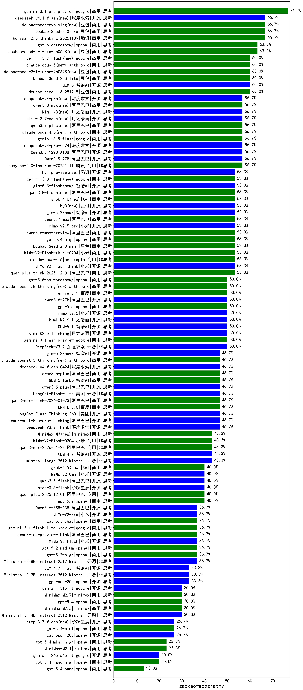

|类别|机构|大模型|【gaokao-geography】准确率|平均耗时|平均消耗token|花费/千次（元）|排名（准确率）|
|---|---|-----|-------------------|-------|-----------|-----------|-----------|
|商用|google|gemini-3.1-pro-preview|76.7%|65s|2910|237.8|1|
|商用|豆包|Doubao-Seed-2.0-pro|66.7%|276s|1433|20.7|2|
|商用|豆包|doubao-seed-evolving|66.7%|410s|12994|385.7|3|
|开源|深度求索|deepseek-v4.1-flash(new)|66.7%|18s|2569|19.7|4|
|商用|openAI|gpt-6-astra(new)|63.3%|17s|390|92.1|5|
|商用|豆包|doubao-seed-2-1-pro-260628|63.3%|293s|12093|358.7|6|
|商用|豆包|doubao-seed-2-1-turbo-260628|60.0%|363s|13260|196.8|7|
|商用|anthropic|claude-opus-5(new)|60.0%|14s|854|119.9|8|
|开源|智谱AI|GLM-5|60.0%|125s|3026|52.7|9|
|商用|豆包|Doubao-Seed-2.0-lite|60.0%|254s|1236|3.9|10|
|商用|google|gemini-3.7-flash(new)|60.0%|6s|859|19.5|11|
|开源|阿里巴巴|Qwen3.5-122B-A10B|56.7%|541s|4595|28.7|12|
|开源|阿里巴巴|Qwen3.5-27B|56.7%|554s|4754|22.3|13|
|开源|月之暗面|kimi-k3(new)|56.7%|154s|2388|222.9|14|
|商用|anthropic|claude-opus-4.8|56.7%|11s|690|91.3|15|
|商用|阿里巴巴|qwen3.7-plus|56.7%|109s|5486|43.1|16|
|开源|月之暗面|kimi-k2.7-code|56.7%|76s|2829|73.9|17|
|开源|深度求索|deepseek-v4-pro(new)|56.7%|80s|1846|46.2|18|
|商用|google|gemini-3.5-flash|56.7%|13s|2336|139.6|19|
|商用|阿里巴巴|qwen3.8-max(new)|56.7%|93s|3576|124.6|20|
|开源|深度求索|deepseek-v4-pro-0424|56.7%|55s|1592|36.7|21|
|商用|阿里巴巴|qwen3.7-max|53.3%|37s|1512|51.2|22|
|开源|腾讯|hy3|53.3%|47s|335|0.9|23|
|商用|XAI|grok-4.6(new)|53.3%|115s|4011|159.1|24|
|商用|阿里巴巴|qwen3.8-flash(new)|53.3%|140s|7025|18.6|25|
|开源|智谱AI|glm-5.3-flash(new)|53.3%|110s|3959|10.8|26|
|商用|google|gemini-3.8-flash(new)|53.3%|20s|1161|54.9|27|
|开源|腾讯|hy4-preview(new)|53.3%|150s|6837|121.4|28|
|商用|openAI|gpt-5.4-high|53.3%|23s|1207|112.9|29|
|商用|豆包|Doubao-Seed-2.0-mini|53.3%|514s|3374|6.4|30|
|商用|小米|MiMo-V2-Flash-think-0204|53.3%|767s|2989|6.1|31|
|开源|小米|mimo-v2.5-pro|53.3%|51s|2210|41.0|32|
|商用|anthropic|claude-opus-4.6|53.3%|16s|892|126.5|33|
|商用|openAI|gpt-6-sol(new)|53.3%|157s|389|18.4|34|
|开源|智谱AI|glm-5.2|53.3%|62s|2730|73.7|35|
|商用|阿里巴巴|qwen3.6-max-preview|53.3%|111s|2071|105.8|36|
|商用|openAI|gpt-5.6-sol-pro|50.0%|25s|4406|383.0|37|
|开源|小米|mimo-v2.5|50.0%|36s|1908|22.5|38|
|商用|百度|ernie-5.1|50.0%|40s|1478|24.7|39|
|开源|月之暗面|kimi-k2.6|50.0%|217s|3759|99.0|40|
|开源|智谱AI|GLM-5.1|50.0%|147s|2230|51.3|41|
|开源|阿里巴巴|qwen3.6-27b|50.0%|36s|2123|36.2|42|
|开源|小米|mimo-v2.6-pro(new)|50.0%|109s|5021|29.7|43|
|商用|anthropic|claude-opus-4.8-thinking|50.0%|16s|1070|157.7|44|
|开源|月之暗面|Kimi-K2.5-Thinking|50.0%|257s|4513|92.7|45|
|开源|深度求索|DeepSeek-V3.2|50.0%|123s|562|1.6|46|
|商用|openAI|gpt-5.5|50.0%|15s|887|158.6|47|
|开源|智谱AI|glm-5.3(new)|46.7%|264s|5513|151.7|48|
|开源|深度求索|deepseek-v4-flash-0424|46.7%|58s|1948|3.8|49|
|商用|阿里巴巴|qwen3.6-plus|46.7%|57s|1924|21.7|50|
|商用|智谱AI|GLM-5-Turbo|46.7%|48s|1902|39.7|51|
|开源|阿里巴巴|qwen3.5-plus|46.7%|49s|3918|18.3|52|
|开源|美团|LongCat-Flash-Lite|46.7%|367s|688|0.0|53|
|商用|openAI|gpt-6-luna(new)|46.7%|150s|741|2.1|54|
|商用|阿里巴巴|qwen3-max-think-2026-01-23|46.7%|128s|4102|40.0|55|
|商用|百度|ERNIE-5.0|46.7%|239s|2967|69.0|56|
|开源|深度求索|DeepSeek-V3.2-Think|46.7%|233s|1884|5.5|57|
|商用|anthropic|claude-sonnet-5-thinking|46.7%|17s|1092|64.6|58|
|商用|minimax|MiniMax-M3|43.3%|59s|1434|20.4|59|
|商用|小米|MiMo-V2-Flash-0204|43.3%|415s|784|1.4|60|
|商用|阿里巴巴|qwen3-max-2026-01-23|43.3%|175s|762|6.6|61|
|商用|XAI|grok-4.5|40.0%|80s|3425|134.4|62|
|商用|XAI|grok-4.7(new)|40.0%|138s|10047|383.5|63|
|开源|阶跃星辰|step-3.5-flash|40.0%|39s|3523|7.2|64|
|开源|小米|MiMo-V2-Omni|40.0%|17s|2066|24.6|65|
|开源|阿里巴巴|qwen3.5-flash|40.0%|541s|4610|9.0|66|
|商用|google|gemini-3.1-flash-lite-preview|36.7%|6s|594|5.0|67|
|开源|阿里巴巴|Qwen3.6-35B-A3B|36.7%|150s|2075|21.2|68|
|开源|小米|MiMo-V2-Pro|36.7%|27s|1704|30.4|69|
|开源|小米|mimo-v2.6-flash(new)|36.7%|76s|1828|3.5|70|
|商用|openAI|gpt-5.3-chat|36.7%|6s|506|36.0|71|
|开源|openAI|gpt-oss-20b|33.3%|208s|1131|1.1|72|
|开源|google|gemma-4-31b-it|30.0%|97s|740|1.8|73|
|商用|minimax|MiniMax-M2.7|30.0%|58s|2314|18.5|74|
|商用|minimax|MiniMax-M2.5|30.0%|49s|2261|18.0|75|
|商用|openAI|gpt-5.4|30.0%|6s|379|25.9|76|
|开源|阶跃星辰|step-3.7-flash|26.7%|98s|3586|28.2|77|
|开源|openAI|gpt-oss-120b|26.7%|203s|701|1.7|78|
|商用|openAI|gpt-5.4-mini|26.7%|8s|341|6.6|79|
|商用|openAI|gpt-5.4-mini-high|23.3%|122s|1960|57.6|80|
|商用|openAI|gpt-5.4-nano-high|20.0%|18s|753|5.4|81|
|开源|google|gemma-4-26b-a4b-it|20.0%|30s|816|2.0|82|
|商用|openAI|gpt-5.4-nano|13.3%|33s|343|1.8|83|

