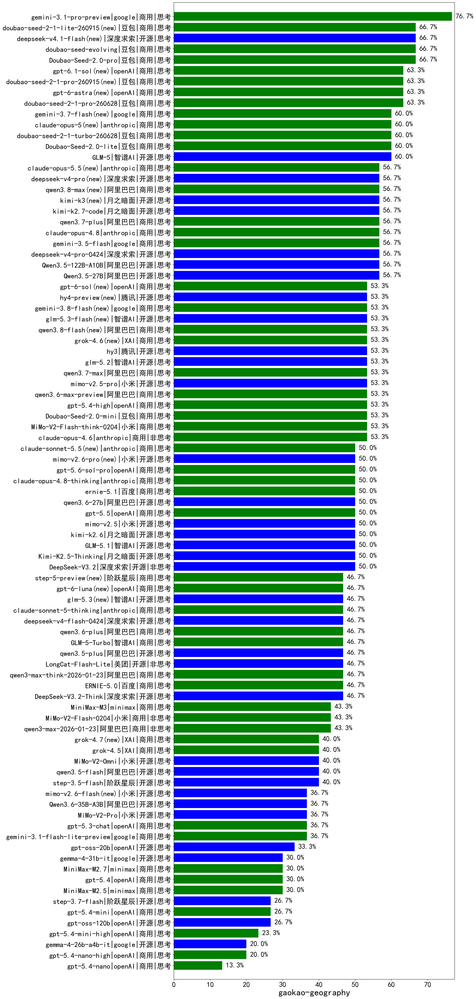

|类别|机构|大模型|【gaokao-geography】准确率|平均耗时|平均消耗token|花费/千次（元）|排名（准确率）|
|---|---|-----|-------------------|-------|-----------|-----------|-----------|
|商用|google|gemini-3.1-pro-preview|76.7%|65s|2910|237.8|1|
|商用|google|gemini-4-argon(new)|73.3%|21s|651|72.6|2|
|开源|月之暗面|kimi-k3.1-pro(new)|70.0%|134s|4186|273.7|3|
|商用|豆包|doubao-seed-2-1-lite-260915(new)|66.7%|85s|3716|9.7|4|
|开源|深度求索|deepseek-v4.1-flash(new)|66.7%|18s|2569|19.7|5|
|商用|豆包|doubao-seed-evolving|66.7%|410s|12994|385.7|6|
|商用|豆包|doubao-seed-2-1-pro-260628|63.3%|293s|12093|358.7|7|
|商用|openAI|gpt-6.1-sol(new)|63.3%|7s|364|16.6|8|
|商用|豆包|doubao-seed-2-1-pro-260915(new)|63.3%|80s|2434|68.9|9|
|商用|openAI|gpt-6-astra(new)|63.3%|17s|390|92.1|10|
|商用|google|gemini-3.7-flash|60.0%|6s|859|19.5|11|
|商用|anthropic|claude-opus-5|60.0%|14s|854|119.9|12|
|商用|豆包|doubao-seed-2-1-turbo-260628|60.0%|363s|13260|196.8|13|
|开源|月之暗面|kimi-k3|56.7%|154s|2388|222.9|14|
|商用|anthropic|claude-opus-5.5(new)|56.7%|16s|802|88.5|15|
|开源|深度求索|deepseek-v4-pro|56.7%|80s|1846|46.2|16|
|开源|月之暗面|kimi-k2.7-code|56.7%|76s|2829|73.9|17|
|开源|阿里巴巴|Qwen3.5-122B-A10B|56.7%|541s|4595|28.7|18|
|商用|阿里巴巴|qwen3.7-plus|56.7%|109s|5486|43.1|19|
|商用|google|gemini-3.5-flash|56.7%|13s|2336|139.6|20|
|商用|anthropic|claude-opus-4.8|56.7%|11s|690|91.3|21|
|开源|深度求索|deepseek-v4-pro-0424|56.7%|55s|1592|36.7|22|
|开源|阿里巴巴|Qwen3.5-27B|56.7%|554s|4754|22.3|23|
|商用|阿里巴巴|qwen3.8-max|56.7%|93s|3576|124.6|24|
|商用|阿里巴巴|qwen3.7-max|53.3%|37s|1512|51.2|25|
|开源|腾讯|hy4-preview(new)|53.3%|150s|6837|121.4|26|
|开源|小米|mimo-v2.5-pro|53.3%|51s|2210|41.0|27|
|商用|openAI|gpt-6-sol(new)|53.3%|157s|389|18.4|28|
|开源|智谱AI|glm-5.2|53.3%|62s|2730|73.7|29|
|开源|智谱AI|glm-5.3-flash(new)|53.3%|110s|3959|10.8|30|
|商用|阿里巴巴|qwen3.8-flash(new)|53.3%|140s|7025|18.6|31|
|商用|XAI|grok-4.6|53.3%|115s|4011|159.1|32|
|商用|阿里巴巴|qwen3.6-max-preview|53.3%|111s|2071|105.8|33|
|开源|腾讯|hy3|53.3%|47s|335|0.9|34|
|商用|google|gemini-3.8-flash(new)|53.3%|20s|1161|54.9|35|
|开源|小米|mimo-v2.6-pro(new)|50.0%|109s|5021|29.7|36|
|商用|openAI|gpt-5.6-sol-pro|50.0%|25s|4406|383.0|37|
|商用|anthropic|claude-sonnet-5.5(new)|50.0%|15s|748|40.4|38|
|开源|深度求索|DeepSeek-V3.2|50.0%|123s|562|1.6|39|
|开源|智谱AI|GLM-5.1|50.0%|147s|2230|51.3|40|
|商用|anthropic|claude-opus-4.8-thinking|50.0%|16s|1070|157.7|41|
|开源|月之暗面|kimi-k2.6|50.0%|217s|3759|99.0|42|
|开源|阿里巴巴|qwen3.6-27b|50.0%|36s|2123|36.2|43|
|商用|百度|ernie-5.1|50.0%|40s|1478|24.7|44|
|开源|小米|mimo-v2.5|50.0%|36s|1908|22.5|45|
|商用|openAI|gpt-5.5|50.0%|15s|887|158.6|46|
|开源|智谱AI|glm-5.3(new)|46.7%|264s|5513|151.7|47|
|商用|minimax|MiniMax-M3.1-Flash(new)|46.7%|55s|3594|13.4|48|
|开源|深度求索|DeepSeek-V3.2-Think|46.7%|233s|1884|5.5|49|
|开源|深度求索|deepseek-v4-flash-0424|46.7%|58s|1948|3.8|50|
|商用|阶跃星辰|step-5-preview(new)|46.7%|85s|4904|96.4|51|
|商用|百度|ERNIE-5.0|46.7%|239s|2967|69.0|52|
|商用|anthropic|claude-sonnet-5-thinking|46.7%|17s|1092|64.6|53|
|商用|阿里巴巴|qwen3.6-plus|46.7%|57s|1924|21.7|54|
|商用|openAI|gpt-6-luna(new)|46.7%|150s|741|2.1|55|
|商用|minimax|MiniMax-M3|43.3%|59s|1434|20.4|56|
|商用|XAI|grok-4.5|40.0%|80s|3425|134.4|57|
|商用|XAI|grok-4.7(new)|40.0%|138s|10047|383.5|58|
|开源|阿里巴巴|Qwen3.6-35B-A3B|36.7%|150s|2075|21.2|59|
|开源|小米|mimo-v2.6-flash(new)|36.7%|76s|1828|3.5|60|
|商用|google|gemini-3.1-flash-lite-preview|36.7%|6s|594|5.0|61|
|开源|openAI|gpt-oss-20b|33.3%|208s|1131|1.1|62|
|商用|minimax|MiniMax-M2.7|30.0%|58s|2314|18.5|63|
|开源|google|gemma-4-31b-it|30.0%|97s|740|1.8|64|
|开源|阶跃星辰|step-3.7-flash|26.7%|98s|3586|28.2|65|
|开源|openAI|gpt-oss-120b|26.7%|203s|701|1.7|66|
|商用|anthropic|claude-haiku-5.5(new)|23.3%|14s|1049|3.1|67|
|开源|google|gemma-4-26b-a4b-it|20.0%|30s|816|2.0|68|

