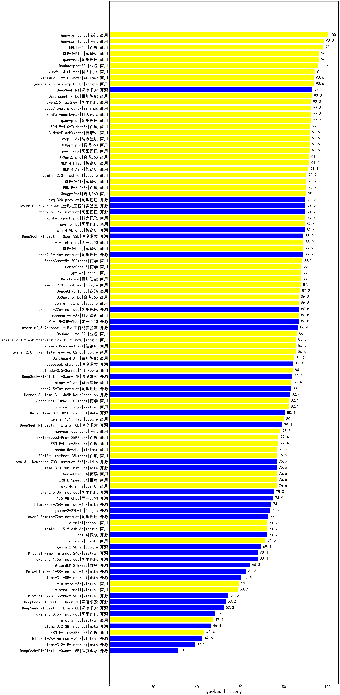

|类别|机构|大模型|【gaokao-history】准确率|平均耗时|平均消耗token|花费/千次（元）|排名（准确率）|
|---|---|-----|-------------------|-------|-----------|-----------|-----------|
|商用|anthropic|claude-4-sonnet-thinking|100.0%|51s|1132|112.7|1|
|商用|百度|ERNIE-4.5-Turbo-32K|97.0%|275s|480|1.3|2|
|开源|百度|ERNIE-4.5-300B-A47B|97.0%|234s|347|2.2|3|
|商用|豆包|doubao-seed-1-6-thinking-250715|96.0%|15s|916|6.7|4|
|商用|腾讯|hunyuan-turbos-20250716|96.0%|11s|612|1.1|5|
|开源|豆包|Seed-OSS-36B-Instruct(new)|96.0%|107s|1264|4.8|6|
|商用|腾讯|hunyuan-t1-20250711|95.0%|16s|970|3.5|7|
|开源|阿里巴巴|qwen3-235b-a22b-instruct-2507|95.0%|13s|548|3.8|8|
|商用|百度|ERNIE-X1-Turbo-32K|95.0%|254s|1610|6.2|9|
|商用|google|gemini-2.5-pro|94.0%|29s|2269|158.5|10|
|开源|月之暗面|kimi-k2-0711-preview|94.0%|30s|533|7.6|11|
|开源|智谱AI|GLM-Z1-32B-0414|93.3%|77s|1498|5.8|12|
|开源|百度|ERNIE-4.5-21B-A3B|93.0%|172s|365|0.0|13|
|商用|阿里巴巴|qwen-plus-2025-07-28(new)|93.0%|15s|551|1.0|14|
|商用|豆包|doubao-seed-1-6-flash-thinking-250615|92.0%|6s|590|0.7|15|
|商用|科大讯飞|xunfei-spark-x1-0725|91.6%|/|995|11.3|16|
|商用|豆包|doubao-seed-1-6-flash-250615|91.0%|5s|372|0.4|17|
|商用|豆包|doubao-seed-1-6-250615|91.0%|92s|161|0.3|18|
|商用|阿里巴巴|qwen3-max-preview(new)|91.0%|10s|482|9.6|19|
|商用|阿里巴巴|qwen-plus-think-2025-07-28(new)|90.0%|43s|2138|16.1|20|
|商用|openAI|o4-mini|90.0%|26s|832|24.5|21|
|开源|深度求索|deepseek-chat-v3-0324|90.0%|102s|337|2.3|22|
|开源|阿里巴巴|qwen3-235b-a22b-thinking-2507|90.0%|54s|2257|42.6|23|
|开源|华为|pangu-pro-moe|90.0%|70s|1229|4.6|24|
|商用|anthropic|claude-4-sonnet|90.0%|46s|545|48.9|25|
|开源|深度求索|DeepSeek-V3.1(new)|89.0%|18s|314|3.1|26|
|商用|月之暗面|kimi-latest-8k|89.0%|17s|429|5.2|27|
|开源|阿里巴巴|Qwen3-32B|89.0%|223s|2340|9.1|28|
|开源|深度求索|DeepSeek-R1-0528|88.0%|267s|1760|27.2|29|
|开源|阿里巴巴|Qwen3-32B-nothink|88.0%|44s|535|1.9|30|
|开源|深度求索|DeepSeek-V3.1-Think(new)|88.0%|42s|832|9.4|31|
|商用|XAI|grok-4-0709|87.5%|381s|1087|110.3|32|
|开源|阿里巴巴|qwen3-next-80b-a3b-instruct(new)|87.0%|7s|583|2.0|33|
|开源|阶跃星辰|step-3|87.0%|90s|1749|6.8|34|
|开源|腾讯|Hunyuan-A13B-Instruct|87.0%|210s|860|3.2|35|
|开源|minimax|MiniMax-M1|87.0%|216s|2775|21.1|36|
|商用|阿里巴巴|qwen-turbo-think-2025-07-15(new)|87.0%|/|1937|5.5|37|
|开源|阿里巴巴|Qwen3-30B-A3B-Thinking-2507|86.0%|73s|2338|6.3|38|
|商用|openAI|gpt-5-2025-08-07(new)|85.0%|24s|290|14.9|39|
|商用|google|gemini-2.5-flash|85.0%|12s|1746|30.1|40|
|商用|Mistral|mistral-medium-2508(new)|83.0%|25s|406|4.6|41|
|开源|阿里巴巴|Qwen3-14B|83.0%|249s|3527|6.9|42|
|商用|智谱AI|GLM-4.5-Flash|83.0%|31s|1557|0.0|43|
|商用|阿里巴巴|qwen-turbo-2025-07-15|82.0%|8s|394|0.2|44|
|开源|智谱AI|GLM-4.5-Air|82.0%|25s|1609|8.9|45|
|商用|阿里巴巴|qwen-flash-think-2025-07-28|82.0%|20s|2233|3.2|46|
|开源|智谱AI|GLM-4.5-nothink|82.0%|28s|899|11.3|47|
|商用|阿里巴巴|qwen-flash-2025-07-28|82.0%|12s|580|0.7|48|
|商用|豆包|Doubao-1.5-pro-32k-250115|81.5%|9s|469|0.8|49|
|开源|阿里巴巴|Qwen3-14B-nothink|81.0%|10s|541|0.9|50|
|商用|百川智能|Baichuan4-Turbo|80.5%|/|/|/|51|
|商用|奇虎360|360zhinao2-o1|80.0%|/|/|/|52|
|开源|深度求索|DeepSeek-R1-Distill-Qwen-32B|79.8%|42s|748|0.9|53|
|开源|阿里巴巴|Qwen3-8B|78.0%|100s|2772|0.0|54|
|开源|meta|Llama-4-Maverick-17B-128E-Instruct-FP8|78.0%|9s|598|2.3|55|
|开源|智谱AI|GLM-4.5|78.0%|60s|1624|20.5|56|
|开源|阿里巴巴|Qwen3-8B-nothink|78.0%|19s|470|0.0|57|
|开源|阿里巴巴|Qwen3-30B-A3B-Instruct-2507|78.0%|6s|593|1.5|58|
|开源|腾讯|Hunyuan-A13B-Instruct-nothink|77.0%|26s|444|1.5|59|
|商用|XAI|grok-3-mini|77.0%|151s|1076|3.8|60|
|商用|豆包|Doubao-1.5-lite-32k-250115|75.5%|4s|284|0.1|61|
|开源|Mistral|Mistral-Small-3.2-24B-Instruct-2506|75.0%|17s|479|0.9|62|
|开源|深度求索|DeepSeek-R1-Distill-Qwen-14B|74.0%|/|/|/|63|
|开源|Mistral|Magistral-Small-2507|74.0%|54s|4253|45.4|64|
|开源|深度求索|DeepSeek-R1-0528-Qwen3-8B|74.0%|351s|1510|0.0|65|
|商用|openAI|gpt-5-mini-2025-08-07(new)|73.0%|39s|885|11.5|66|
|商用|智谱AI|GLM-4.5-Flash-nothink|72.0%|19s|888|0.0|67|
|开源|智谱AI|GLM-4-9B-0414|71.0%|10s|508|0.0|68|
|商用|google|gemini-2.5-flash-lite|70.0%|13s|1277|3.5|69|
|开源|阿里巴巴|Qwen3-4B|69.0%|162s|2000|5.7|70|
|开源|智谱AI|GLM-4.5-Air-nothink|69.0%|12s|916|4.7|71|
|开源|openAI|gpt-oss-120b(new)|69.0%|13s|666|1.8|72|
|开源|minimax|MiniMax-Text-01|68.5%|7s|898|7.2|73|
|开源|meta|Llama-4-Scout-17B-16E-Instruct|68.0%|15s|557|1.1|74|
|商用|百川智能|Baichuan4-Air|68.0%|/|/|/|75|
|商用|openAI|gpt-5-nano-2025-08-07(new)|65.0%|37s|1831|5.1|76|
|商用|阶跃星辰|step-2-mini|64.5%|6s|303|0.5|77|
|商用|阿里巴巴|qwen-long-2025-01-25|64.5%|11s|369|0.6|78|
|开源|阿里巴巴|Qwen3-4B-nothink|63.0%|18s|460|1.1|79|
|开源|智谱AI|GLM-Z1-9B-0414|60.0%|44s|2243|0.0|80|
|开源|openAI|gpt-oss-20b(new)|59.0%|10s|1308|1.4|81|
|商用|百度|ERNIE-Speed-8K|58.3%|/|/|/|82|
|商用|百度|ERNIE-Lite-8K|55.0%|/|/|/|83|
|开源|Google|gemma-3-12b-it|54.5%|/|/|/|84|
|开源|阿里巴巴|Qwen3-1.7B-nothink|53.0%|7s|466|1.1|85|
|开源|Google|gemma-3-27b-it|50.5%|/|/|/|86|
|开源|智谱AI|GLM-4-32B-0414|50.0%|55s|386|0.7|87|
|开源|阿里巴巴|Qwen3-1.7B|50.0%|183s|2459|7.1|88|
|商用|Mistral|ministral-8b|41.5%|/|/|/|89|
|商用|Mistral|ministral-3b|39.0%|/|/|/|90|
|开源|阿里巴巴|Qwen3-0.6B-nothink|39.0%|5s|267|0.5|91|
|开源|Google|gemma-3-4b-it|35.5%|/|/|/|92|
|开源|阿里巴巴|Qwen3-0.6B|35.0%|155s|1532|4.3|93|
|开源|百度|ERNIE-4.5-0.3B|32.0%|163s|384|0.0|94|
|商用|科大讯飞|xunfei-spark-lite|29.5%|/|/|/|95|

