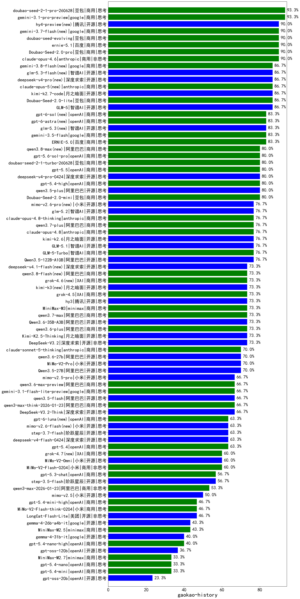

|类别|机构|大模型|【gaokao-history】准确率|平均耗时|平均消耗token|花费/千次（元）|排名（准确率）|
|---|---|-----|-------------------|-------|-----------|-----------|-----------|
|商用|豆包|doubao-seed-2-1-pro-260628|93.3%|216s|7628|225.1|1|
|商用|google|gemini-3.1-pro-preview|93.3%|84s|1767|141.5|2|
|商用|google|gemini-3.7-flash(new)|90.0%|5s|838|19.3|3|
|开源|腾讯|hy4-preview(new)|90.0%|131s|5786|102.7|4|
|商用|豆包|doubao-seed-evolving|90.0%|207s|8347|246.6|5|
|商用|百度|ernie-5.1|90.0%|33s|1104|18.3|6|
|商用|anthropic|claude-opus-4.6|90.0%|30s|759|107.9|7|
|商用|豆包|Doubao-Seed-2.0-pro|90.0%|212s|1114|15.8|8|
|开源|智谱AI|glm-5.3-flash(new)|86.7%|83s|3227|8.8|9|
|商用|google|gemini-3.8-flash(new)|86.7%|10s|924|43.2|10|
|商用|anthropic|claude-opus-5(new)|86.7%|13s|749|106.2|11|
|开源|深度求索|deepseek-v4-pro(new)|86.7%|102s|1574|39.2|12|
|商用|豆包|Doubao-Seed-2.0-lite|86.7%|198s|999|3.1|13|
|开源|智谱AI|GLM-5|86.7%|126s|2490|43.3|14|
|开源|月之暗面|kimi-k2.7-code|86.7%|43s|1613|40.0|15|
|商用|openAI|gpt-6-astra(new)|83.3%|12s|382|95.8|16|
|开源|智谱AI|glm-5.3(new)|83.3%|-43s|2586|70.1|17|
|商用|google|gemini-3.5-flash|83.3%|16s|1901|113.1|18|
|商用|百度|ERNIE-5.0|83.3%|72s|1474|33.5|19|
|商用|openAI|gpt-6-sol(new)|83.3%|99s|333|15.8|20|
|开源|深度求索|deepseek-v4-pro-0424|80.0%|51s|1496|34.7|21|
|商用|阿里巴巴|qwen3.8-max(new)|80.0%|85s|3264|113.8|22|
|商用|豆包|doubao-seed-2-1-turbo-260628|80.0%|167s|7840|115.7|23|
|商用|openAI|gpt-5.4-high|80.0%|34s|855|77.9|24|
|商用|openAI|gpt-5.6-sol-pro|80.0%|21s|4038|336.9|25|
|商用|openAI|gpt-5.5|80.0%|28s|641|110.9|26|
|开源|阿里巴巴|qwen3.5-plus|80.0%|45s|3669|17.1|27|
|商用|豆包|Doubao-Seed-2.0-mini|80.0%|491s|2209|4.1|28|
|商用|anthropic|claude-opus-4.8|76.7%|11s|671|92.7|29|
|开源|智谱AI|GLM-5.1|76.7%|241s|1929|44.3|30|
|开源|智谱AI|glm-5.2|76.7%|56s|2570|69.6|31|
|商用|anthropic|claude-opus-4.8-thinking|76.7%|13s|903|133.2|32|
|商用|阿里巴巴|qwen3.7-plus|76.7%|39s|1805|13.7|33|
|开源|月之暗面|kimi-k2.6|76.7%|163s|2590|65.4|34|
|开源|阿里巴巴|Qwen3.5-122B-A10B|76.7%|506s|4151|25.9|35|
|商用|智谱AI|GLM-5-Turbo|76.7%|37s|1667|34.8|36|
|开源|小米|mimo-v2.6-pro(new)|76.7%|32s|1374|7.9|37|
|商用|XAI|grok-4.6(new)|73.3%|159s|2420|92.7|38|
|开源|腾讯|hy3|73.3%|54s|294|0.8|39|
|开源|深度求索|DeepSeek-V3.2|73.3%|11s|395|1.1|40|
|开源|月之暗面|Kimi-K2.5-Thinking|73.3%|161s|3044|62.1|41|
|商用|minimax|MiniMax-M3|73.3%|35s|1025|13.8|42|
|开源|深度求索|deepseek-v4.1-flash(new)|73.3%|18s|1556|11.7|43|
|商用|阿里巴巴|qwen3.7-max|73.3%|27s|1445|49.3|44|
|商用|阿里巴巴|qwen3.6-plus|73.3%|51s|1872|21.3|45|
|商用|XAI|grok-4.5|73.3%|74s|2512|96.6|46|
|开源|阿里巴巴|Qwen3.6-35B-A3B|73.3%|157s|2143|22.1|47|
|开源|月之暗面|kimi-k3(new)|73.3%|67s|1260|107.7|48|
|商用|阿里巴巴|qwen3.8-flash(new)|73.3%|20s|1452|3.6|49|
|开源|阿里巴巴|Qwen3.5-27B|70.0%|130s|3850|18.0|50|
|开源|小米|MiMo-V2-Pro|70.0%|481s|1266|21.5|51|
|商用|anthropic|claude-sonnet-5-thinking|70.0%|23s|750|42.6|52|
|开源|阿里巴巴|qwen3.6-27b|70.0%|35s|1925|32.9|53|
|商用|google|gemini-3.1-flash-lite-preview|66.7%|9s|571|4.9|54|
|开源|深度求索|DeepSeek-V3.2-Think|66.7%|199s|1474|4.3|55|
|商用|阿里巴巴|qwen3-max-think-2026-01-23|66.7%|107s|3713|36.2|56|
|开源|阿里巴巴|qwen3.5-flash|66.7%|525s|4410|8.6|57|
|商用|阿里巴巴|qwen3.6-max-preview|66.7%|98s|1928|99.0|58|
|开源|小米|mimo-v2.5-pro|66.7%|37s|1795|32.6|59|
|商用|openAI|gpt-6-luna(new)|63.3%|336s|604|1.7|60|
|开源|阶跃星辰|step-3.7-flash|63.3%|32s|2751|21.5|61|
|商用|openAI|gpt-5.4|63.3%|6s|368|26.8|62|
|开源|深度求索|deepseek-v4-flash-0424|63.3%|45s|1207|2.3|63|
|开源|小米|mimo-v2.6-flash(new)|63.3%|46s|1199|2.3|64|
|商用|XAI|grok-4.7(new)|60.0%|136s|9207|348.9|65|
|开源|小米|MiMo-V2-Omni|60.0%|588s|1651|19.0|66|
|商用|小米|MiMo-V2-Flash-0204|60.0%|74s|675|1.2|67|
|开源|阶跃星辰|step-3.5-flash|56.7%|28s|2770|5.7|68|
|商用|openAI|gpt-5.3-chat|56.7%|13s|459|33.4|69|
|商用|阿里巴巴|qwen3-max-2026-01-23|53.3%|179s|665|5.7|70|
|开源|小米|mimo-v2.5|50.0%|28s|1618|18.6|71|
|开源|美团|LongCat-Flash-Lite|46.7%|111s|605|0.0|72|
|商用|openAI|gpt-5.4-mini-high|46.7%|20s|1696|49.9|73|
|商用|小米|MiMo-V2-Flash-think-0204|46.7%|642s|2049|4.1|74|
|开源|google|gemma-4-26b-a4b-it|43.3%|33s|754|1.9|75|
|商用|minimax|MiniMax-M2.5|43.3%|33s|1710|13.5|76|
|开源|google|gemma-4-31b-it|40.0%|128s|692|1.7|77|
|商用|openAI|gpt-5.4-nano-high|40.0%|32s|610|4.3|78|
|开源|openAI|gpt-oss-120b|36.7%|104s|676|1.8|79|
|商用|openAI|gpt-5.4-nano|33.3%|3s|288|1.5|80|
|商用|minimax|MiniMax-M2.7|33.3%|54s|2079|16.6|81|
|商用|openAI|gpt-5.4-mini|33.3%|34s|334|7.0|82|
|开源|openAI|gpt-oss-20b|23.3%|101s|1299|1.4|83|

