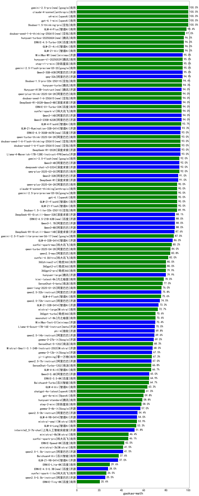

|类别|机构|大模型|【gaokao-math】准确率|平均耗时|平均消耗token|花费/千次（元）|排名（准确率）|
|---|---|-----|-------------------|-------|-----------|-----------|-----------|
|商用|anthropic|claude-4-sonnet|100.0%|35s|868|84.0|1|
|商用|openAI|o4-mini|100.0%|29s|1112|32.8|2|
|商用|openAI|gpt-4.1-mini|100.0%|15s|997|10.6|3|
|商用|智谱AI|GLM-4-Plus|98.4%|14s|678|3.4|4|
|商用|google|gemini-2.5-pro|97.0%|66s|6741|482.3|5|
|开源|阿里巴巴|qwen3-235b-a22b-thinking-2507(new)|97.0%|62s|3282|63.6|6|
|商用|豆包|doubao-seed-1-6-thinking-250715(new)|97.0%|34s|2871|22.2|7|
|商用|XAI|grok-4-0709|96.1%|291s|3216|341.0|8|
|商用|百度|ERNIE-4.5-Turbo-32K|96.0%|165s|1215|3.7|9|
|商用|智谱AI|GLM-Z1-Air|96.0%|47s|2337|1.2|10|
|商用|智谱AI|GLM-Z1-AirX|96.0%|35s|3385|22.2|11|
|商用|阿里巴巴|qwen-plus-2025-07-14(new)|96.0%|22s|1624|3.1|12|
|开源|阿里巴巴|qwen3-235b-a22b-instruct-2507(new)|96.0%|39s|1711|13.0|13|
|开源|月之暗面|kimi-k2-0711-preview(new)|96.0%|85s|1227|18.4|14|
|商用|腾讯|hunyuan-t1-20250711(new)|96.0%|67s|4434|17.3|15|
|开源|阿里巴巴|Qwen3-30B-A3B-Instruct-2507(new)|96.0%|14s|1618|4.6|16|
|开源|智谱AI|GLM-4.5(new)|96.0%|184s|6953|95.2|17|
|商用|腾讯|hunyuan-turbos-20250604|96.0%|144s|1682|3.2|18|
|商用|阶跃星辰|step-r1-v-mini|95.0%|112s|4509|35.4|19|
|商用|智谱AI|GLM-4.5-Flash(new)|95.0%|114s|7513|0.0|20|
|开源|openAI|gpt-oss-20b(new)|95.0%|125s|2225|2.4|21|
|开源|openAI|gpt-oss-120b(new)|95.0%|126s|1429|4.2|22|
|开源|阶跃星辰|step-3(new)|95.0%|387s|7512|29.8|23|
|商用|科大讯飞|xunfei-spark-x1-0725(new)|95.0%|/|5306|63.7|24|
|开源|阿里巴巴|Qwen3-30B-A3B|95.0%|867s|12758|35.5|25|
|开源|minimax|MiniMax-M1|95.0%|407s|6835|53.5|26|
|开源|阿里巴巴|qwq-32b|94.9%|84s|5023|29.7|27|
|商用|豆包|Doubao-1.5-pro-32k-250115|94.4%|14s|860|1.6|28|
|商用|XAI|grok-3-mini|94.0%|221s|2243|8.0|29|
|开源|腾讯|Hunyuan-A13B-Instruct|94.0%|264s|2410|9.3|30|
|商用|百度|ERNIE-X1-Turbo-32K|94.0%|366s|4939|19.5|31|
|开源|智谱AI|GLM-4.5-Air(new)|94.0%|93s|7272|43.1|32|
|开源|深度求索|DeepSeek-R1-0528-Qwen3-8B|94.0%|424s|6921|0.0|33|
|开源|阿里巴巴|Qwen3-235B-A22B|94.0%|270s|6004|59.2|34|
|开源|阿里巴巴|Qwen3-14B|94.0%|371s|13142|26.1|35|
|商用|豆包|doubao-seed-1-6-250615|94.0%|113s|919|6.3|36|
|商用|阿里巴巴|qwen-plus-think-2025-04-28|94.0%|330s|4719|36.9|37|
|开源|阿里巴巴|Qwen3-30B-A3B-Thinking-2507(new)|94.0%|71s|3174|8.6|38|
|商用|智谱AI|GLM-4-FlashX|93.7%|27s|1413|0.1|39|
|开源|智谱AI|GLM-Z1-Rumination-32B-0414|93.3%|166s|5826|21.6|40|
|商用|豆包|doubao-seed-1-6-flash-250615|93.0%|15s|1026|1.4|41|
|开源|百度|ERNIE-4.5-300B-A47B|93.0%|262s|1445|10.9|42|
|商用|豆包|doubao-seed-1-6-flash-thinking-250615|93.0%|55s|2512|3.5|43|
|开源|深度求索|DeepSeek-R1-0528|93.0%|395s|6643|105.1|44|
|开源|腾讯|Hunyuan-A13B-Instruct-nothink(new)|93.0%|56s|901|3.3|45|
|商用|阿里巴巴|qwen-turbo-think-2025-04-28|93.0%|237s|6011|17.7|46|
|开源|meta|Llama-4-Maverick-17B-128E-Instruct-FP8|93.0%|15s|820|3.3|47|
|商用|阿里巴巴|qwq-plus-2025-03-05|92.0%|115s|4935|19.5|48|
|开源|深度求索|deepseek-chat-v3-0324|92.0%|205s|2029|15.6|49|
|商用|google|gemini-2.5-flash|92.0%|22s|5016|89.3|50|
|商用|阿里巴巴|qwen-turbo-2025-07-15(new)|92.0%|20s|1239|0.7|51|
|开源|智谱AI|GLM-4.5-nothink|92.0%|69s|2471|33.4|52|
|开源|阿里巴巴|Qwen3-4B|92.0%|212s|4638|13.6|53|
|开源|华为|pangu-pro-moe(new)|91.0%|155s|4049|15.8|54|
|开源|阿里巴巴|Qwen3-32B|91.0%|369s|9613|38.1|55|
|商用|anthropic|claude-4-sonnet-thinking|90.0%|114s|1704|174.9|56|
|商用|openAI|gpt-4.1|90.0%|15s|1085|58.0|57|
|商用|智谱AI|GLM-Z1-Flash|90.0%|30s|3488|0.0|58|
|商用|智谱AI|GLM-Z1-FlashX|90.0%|28s|2249|0.5|59|
|开源|阿里巴巴|Qwen3-30B-A3B-nothink|90.0%|48s|1499|3.9|60|
|开源|智谱AI|GLM-4.5-Air-nothink|90.0%|48s|3595|21.0|61|
|商用|豆包|Doubao-1.5-lite-32k-250115|89.9%|7s|669|0.4|62|
|开源|阿里巴巴|Qwen3-235B-A22B-nothink|89.6%|45s|1290|12.0|63|
|商用|智谱AI|GLM-4.5-Flash-nothink|89.0%|30s|1654|0.0|64|
|开源|深度求索|DeepSeek-R1-Distill-Qwen-32B|88.1%|212s|2387|3.0|65|
|开源|阿里巴巴|Qwen3-1.7B|88.0%|188s|6294|18.6|66|
|开源|阿里巴巴|Qwen3-8B|88.0%|358s|10938|0.0|67|
|开源|百度|ERNIE-4.5-21B-A3B|88.0%|106s|1321|0.0|68|
|开源|深度求索|DeepSeek-R1-Distill-Qwen-14B|87.6%|/|/|/|69|
|开源|阿里巴巴|Qwen3-32B-nothink|87.0%|60s|1537|5.8|70|
|商用|google|gemini-2.5-flash-lite-preview-06-17|87.0%|8s|2757|7.8|71|
|开源|智谱AI|GLM-4-32B-0414|86.0%|46s|1481|2.8|72|
|商用|科大讯飞|xunfei-spark-max|85.2%|38s|849|25.5|73|
|开源|阿里巴巴|Qwen3-14B-nothink|84.0%|42s|1469|2.8|74|
|商用|阿里巴巴|qwen2.5-max|83.8%|22s|877|7.6|75|
|开源|阿里巴巴|Qwen3-4B-nothink|83.0%|26s|1249|3.4|76|
|商用|科大讯飞|xunfei-4.0Ultra|82.0%|27s|864|60.5|77|
|开源|阿里巴巴|Qwen3-8B-nothink|82.0%|94s|1486|0.0|78|
|商用|奇虎360|360zhinao2-o1|80.0%|/|/|/|79|
|商用|奇虎360|360gpt2-o1|80.0%|61s|1632|77.8|80|
|商用|奇虎360|360gpt2-pro|79.9%|43s|775|3.5|81|
|开源|腾讯|hunyuan-large|79.9%|14s|627|6.3|82|
|商用|月之暗面|kimi-latest-8k|78.0%|30s|855|10.3|83|
|商用|阿里巴巴|qwen-long-2025-01-25|76.0%|23s|994|1.8|84|
|开源|阿里巴巴|qwen2.5-32b-instruct|75.8%|17s|650|3.5|85|
|开源|阿里巴巴|qwen2.5-72b-instruct|74.5%|29s|694|7.5|86|
|开源|智谱AI|GLM-Z1-32B-0414|73.3%|327s|4951|19.5|87|
|商用|Mistral|mistral-large|72.7%|/|/|/|88|
|商用|奇虎360|360gpt-turbo|70.6%|/|/|/|89|
|开源|minimax|MiniMax-Text-01|70.4%|19s|1275|10.2|90|
|开源|meta|Llama-4-Scout-17B-16E-Instruct|70.0%|35s|1052|2.1|91|
|开源|微软|phi-4|69.8%|/|/|/|92|
|开源|阿里巴巴|qwen2.5-14b-instruct|69.6%|23s|702|1.9|93|
|开源|Google|gemma-3-27b-it|69.0%|/|/|/|94|
|商用|商汤|SenseChat-5-1202|68.3%|/|/|/|95|
|开源|Mistral|Mistral-Small-3.1-24B-Instruct-2503|68.0%|/|/|/|96|
|开源|Google|gemma-3-12b-it|67.5%|/|/|/|97|
|商用|零一万物|yi-lightning|67.3%|/|/|/|98|
|开源|阿里巴巴|qwen2.5-7b-instruct|67.0%|27s|731|0.7|99|
|开源|阿里巴巴|Qwen3-1.7B-nothink|67.0%|13s|1212|3.3|100|
|商用|智谱AI|GLM-4-AirX|66.7%|11s|855|7.8|101|
|开源|阿里巴巴|Qwen3-0.6B|65.0%|143s|5317|15.6|102|
|商用|百度|ERNIE-3.5-8K|64.9%|37s|836|1.5|103|
|商用|百川智能|Baichuan4-Turbo|64.7%|/|/|/|104|
|商用|openAI|chatgpt-4o-latest|61.0%|/|/|/|105|
|商用|OpenAI|gpt-4o-mini|59.8%|/|/|/|106|
|商用|腾讯|hunyuan-standard|58.8%|/|/|/|107|
|商用|阶跃星辰|step-2-mini|58.0%|10s|821|1.5|108|
|开源|Google|gemma-3-4b-it|57.0%|/|/|/|109|
|开源|阿里巴巴|qwen2.5-3b-instruct|54.4%|29s|657|0.5|110|
|开源|智谱AI|GLM-4-9B-0414|54.0%|27s|1176|0.0|111|
|商用|Mistral|mistral-small|53.9%|/|/|/|112|
|商用|智谱AI|GLM-4-Long|53.3%|23s|1003|1.0|113|
|开源|上海人工智能实验室|internlm2_5-7b-chat|51.8%|/|/|/|114|
|商用|Mistral|ministral-8b|46.4%|/|/|/|115|
|商用|科大讯飞|xunfei-spark-pro|46.1%|/|/|/|116|
|开源|阿里巴巴|Qwen3-0.6B-nothink|45.0%|7s|806|2.1|117|
|商用|百度|ERNIE-Speed-8K|42.5%|/|/|/|118|
|开源|阿里巴巴|qwen2.5-1.5b-instruct|41.5%|10s|573|0.0|119|
|商用|Mistral|ministral-3b|41.5%|/|/|/|120|
|商用|百川智能|Baichuan4-Air|37.6%|/|/|/|121|
|开源|智谱AI|GLM-Z1-9B-0414|37.0%|210s|5897|0.0|122|
|商用|百度|ERNIE-Lite-8K|29.6%|/|/|/|123|
|开源|百度|ERNIE-4.5-0.3B|28.0%|143s|889|0.0|124|
|商用|科大讯飞|xunfei-spark-lite|26.5%|/|/|/|125|
|开源|阿里巴巴|qwen2.5-0.5b-instruct|25.5%|7s|605|0.0|126|
|商用|百度|ERNIE-Tiny-8K|20.6%|/|/|/|127|

