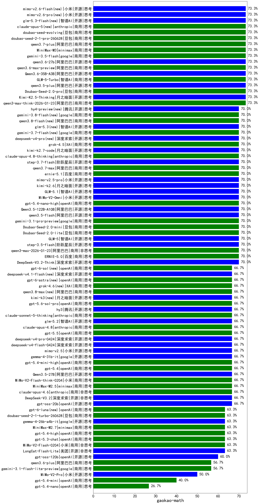

|类别|机构|大模型|【gaokao-math】准确率|平均耗时|平均消耗token|花费/千次（元）|排名（准确率）|
|---|---|-----|-------------------|-------|-----------|-----------|-----------|
|商用|智谱AI|GLM-5-Turbo|73.3%|93s|6254|135.2|1|
|商用|anthropic|claude-opus-5(new)|73.3%|11s|999|144.1|2|
|开源|阿里巴巴|qwen3.6-27b|73.3%|138s|9586|170.3|3|
|商用|google|gemini-3.5-flash|73.3%|22s|3367|204.8|4|
|商用|minimax|MiniMax-M3(new)|73.3%|151s|6218|100.7|5|
|商用|阿里巴巴|qwen3.7-plus(new)|73.3%|125s|6563|51.6|6|
|开源|阿里巴巴|qwen3.5-plus|73.3%|103s|9478|44.9|7|
|商用|豆包|Doubao-Seed-2.0-pro|73.3%|407s|2007|29.7|8|
|商用|豆包|doubao-seed-2-1-pro-260628(new)|73.3%|468s|17929|533.5|9|
|商用|阿里巴巴|qwen3.6-max-preview|73.3%|237s|6758|358.1|10|
|开源|月之暗面|Kimi-K2.5-Thinking|73.3%|277s|8428|174.6|11|
|商用|阿里巴巴|qwen3-max-think-2026-01-23|73.3%|443s|6952|68.3|12|
|商用|google|gemini-3-flash-preview|73.3%|165s|8207|172.3|13|
|商用|豆包|doubao-seed-evolving(new)|73.3%|327s|16614|494.0|14|
|开源|阿里巴巴|Qwen3.6-35B-A3B|73.3%|181s|6177|65.3|15|
|开源|智谱AI|glm-5.3-flash(new)|73.3%|146s|4357|11.9|16|
|商用|anthropic|claude-opus-4.8-thinking(new)|70.0%|15s|1339|203.6|17|
|商用|豆包|Doubao-Seed-2.0-mini|70.0%|662s|5070|9.8|18|
|开源|智谱AI|glm-5.3(new)|70.0%|322s|7033|193.9|19|
|商用|google|gemini-3.1-pro-preview|70.0%|76s|5727|478.1|20|
|开源|阿里巴巴|qwen3.5-flash|70.0%|596s|11000|21.7|21|
|开源|阶跃星辰|step-3.7-flash(new)|70.0%|71s|8023|64.0|22|
|开源|阿里巴巴|Qwen3.5-122B-A10B|70.0%|563s|12485|79.0|23|
|商用|阿里巴巴|qwen3.8-flash(new)|70.0%|98s|6622|17.5|24|
|商用|阿里巴巴|qwen3.7-max|70.0%|84s|4548|160.1|25|
|开源|深度求索|DeepSeek-V3.2-Think|70.0%|278s|4416|13.1|26|
|商用|百度|ernie-5.1|70.0%|100s|3756|65.7|27|
|商用|google|gemini-3.8-flash(new)|70.0%|18s|1930|95.5|28|
|商用|openAI|gpt-5.4-nano-high|70.0%|202s|3318|27.9|29|
|开源|小米|MiMo-V2-Omni|70.0%|29s|4752|62.1|30|
|开源|小米|mimo-v2.5-pro|70.0%|77s|4618|91.4|31|
|开源|月之暗面|kimi-k2.6|70.0%|347s|6361|168.9|32|
|开源|智谱AI|GLM-5.1|70.0%|418s|7429|175.7|33|
|商用|google|gemini-3.7-flash(new)|70.0%|7s|1592|38.9|34|
|商用|阿里巴巴|qwen-plus-think-2025-12-01|70.0%|111s|6482|50.7|35|
|开源|月之暗面|kimi-k2.7-code(new)|70.0%|61s|2519|65.2|36|
|商用|阿里巴巴|qwen3-max-2026-01-23|70.0%|65s|2937|28.2|37|
|商用|豆包|doubao-seed-1-8-251215|70.0%|64s|2057|15.1|38|
|开源|小米|MiMo-V2-Flash-think|70.0%|112s|6943|0.0|39|
|商用|XAI|grok-4.5(new)|70.0%|74s|5174|207.5|40|
|商用|minimax|MiniMax-M2.1|70.0%|126s|9386|77.8|41|
|商用|阿里巴巴|qwen3-max-preview-think|70.0%|383s|6187|145.7|42|
|商用|百度|ERNIE-5.0|70.0%|390s|10757|255.8|43|
|商用|豆包|Doubao-Seed-2.0-lite|70.0%|508s|2307|7.8|44|
|开源|深度求索|deepseek-v4-pro(new)|70.0%|172s|3478|90.1|45|
|开源|阶跃星辰|step-3.5-flash|70.0%|70s|11438|23.8|46|
|商用|腾讯|hunyuan-2.0-thinking-20251109|70.0%|63s|5140|20.2|47|
|商用|腾讯|hunyuan-2.0-instruct-20251111|70.0%|39s|1975|3.7|48|
|开源|智谱AI|GLM-5|70.0%|235s|7774|137.9|49|
|开源|智谱AI|glm-5.2(new)|66.7%|173s|7841|216.6|50|
|商用|anthropic|claude-sonnet-5-thinking(new)|66.7%|38s|2680|175.7|51|
|商用|openAI|gpt-5.5|66.7%|25s|1160|217.2|52|
|商用|anthropic|claude-opus-4.8(new)|66.7%|8s|694|90.9|53|
|开源|深度求索|deepseek-v4-pro-0424|66.7%|116s|3869|91.3|54|
|开源|深度求索|deepseek-v4-flash-0424|66.7%|67s|3159|6.2|55|
|商用|XAI|grok-4.6(new)|66.7%|109s|4429|176.3|56|
|商用|openAI|gpt-5.6-sol-pro(new)|66.7%|32s|6101|582.1|57|
|开源|小米|mimo-v2.5|66.7%|62s|5008|65.7|58|
|开源|月之暗面|kimi-k3(new)|66.7%|109s|2478|230.4|59|
|商用|阿里巴巴|qwen3.8-max(new)|66.7%|105s|4997|175.3|60|
|开源|腾讯|hy3(new)|66.7%|81s|847|3.0|61|
|商用|openAI|gpt-6-astra(new)|66.7%|17s|577|159.7|62|
|商用|minimax|MiniMax-M2.5|66.7%|91s|6008|49.4|63|
|开源|openAI|gpt-oss-20b|66.7%|250s|3001|3.3|64|
|商用|anthropic|claude-opus-4.6|66.7%|14s|1129|169.8|65|
|开源|美团|LongCat-Flash-Thinking-2601|66.7%|377s|10212|0.0|66|
|商用|小米|MiMo-V2-Flash-think-0204|66.7%|221s|7276|15.0|67|
|开源|阿里巴巴|Qwen3.5-27B|66.7%|218s|12908|61.3|68|
|开源|智谱AI|GLM-4.7|66.7%|131s|5687|78.1|69|
|商用|openAI|gpt-5.4|66.7%|42s|795|70.2|70|
|开源|小米|MiMo-V2-Flash|66.7%|36s|2836|0.0|71|
|商用|openAI|gpt-5.2-medium|66.7%|34s|1950|180.7|72|
|商用|openAI|gpt-5.4-mini-high|66.7%|52s|3116|94.2|73|
|商用|openAI|gpt-5.2-high|66.7%|41s|2120|197.6|74|
|商用|阿里巴巴|qwen-plus-2025-12-01|66.7%|78s|3502|6.8|75|
|开源|阿里巴巴|qwen3-next-80b-a3b-thinking|66.7%|236s|6001|23.5|76|
|开源|深度求索|DeepSeek-V3.2|66.7%|158s|1969|5.8|77|
|开源|google|gemma-4-31b-it|66.7%|166s|1070|2.7|78|
|商用|豆包|doubao-seed-2-1-turbo-260628(new)|63.3%|311s|13925|206.7|79|
|开源|智谱AI|GLM-4.7-Flash|63.3%|780s|14147|0.0|80|
|开源|google|gemma-4-26b-a4b-it|63.3%|172s|1585|4.2|81|
|开源|美团|LongCat-Flash-Lite|63.3%|358s|2741|0.0|82|
|商用|小米|MiMo-V2-Flash-0204|63.3%|589s|2715|5.5|83|
|商用|openAI|gpt-5.3-chat|63.3%|23s|1249|109.5|84|
|商用|openAI|gpt-5.4-high|63.3%|32s|1977|194.5|85|
|商用|minimax|MiniMax-M2.7|63.3%|150s|7103|58.6|86|
|开源|Mistral|mistral-large-2512|60.0%|35s|1913|19.4|87|
|开源|openAI|gpt-oss-120b|60.0%|253s|1855|5.6|88|
|商用|google|gemini-3.1-flash-lite-preview|56.7%|4s|880|8.0|89|
|商用|阿里巴巴|qwen3.6-plus|56.7%|187s|11308|134.4|90|
|商用|openAI|gpt-5.2|53.3%|8s|678|54.2|91|
|开源|小米|MiMo-V2-Pro|50.0%|49s|3532|68.6|92|
|开源|Mistral|Ministral-3-14B-Instruct-2512|43.3%|60s|6390|9.1|93|
|商用|openAI|gpt-5.4-mini|40.0%|125s|662|16.9|94|
|开源|Mistral|Ministral-3-8B-Instruct-2512|40.0%|50s|4752|5.1|95|
|开源|Mistral|Ministral-3-3B-Instruct-2512|33.3%|25s|3543|2.5|96|
|商用|openAI|gpt-5.4-nano|26.7%|10s|890|6.7|97|

