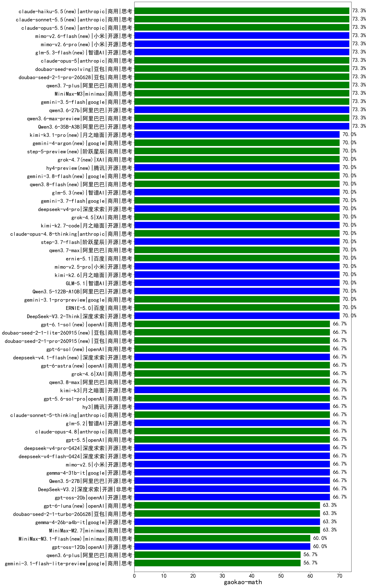

|类别|机构|大模型|【gaokao-math】准确率|平均耗时|平均消耗token|花费/千次（元）|排名（准确率）|
|---|---|-----|-------------------|-------|-----------|-----------|-----------|
|商用|豆包|doubao-seed-2-1-pro-260628|73.3%|468s|17929|533.5|1|
|开源|智谱AI|glm-5.3-flash(new)|73.3%|146s|4357|11.9|2|
|商用|google|gemini-3.5-flash|73.3%|22s|3367|204.8|3|
|开源|阿里巴巴|qwen3.6-27b|73.3%|138s|9586|170.3|4|
|商用|anthropic|claude-sonnet-5.5(new)|73.3%|6s|726|38.5|5|
|商用|豆包|doubao-seed-evolving|73.3%|327s|16614|494.0|6|
|商用|anthropic|claude-opus-5|73.3%|11s|999|144.1|7|
|商用|阿里巴巴|qwen3.6-max-preview|73.3%|237s|6758|358.1|8|
|开源|阿里巴巴|Qwen3.6-35B-A3B|73.3%|181s|6177|65.3|9|
|商用|minimax|MiniMax-M3|73.3%|151s|6218|100.7|10|
|商用|阿里巴巴|qwen3.7-plus|73.3%|125s|6563|51.6|11|
|商用|anthropic|claude-haiku-5.5(new)|73.3%|8s|1406|4.3|12|
|开源|小米|mimo-v2.6-pro(new)|73.3%|263s|8051|47.8|13|
|开源|小米|mimo-v2.6-flash(new)|73.3%|177s|4027|7.9|14|
|商用|anthropic|claude-opus-5.5(new)|73.3%|20s|974|111.7|15|
|商用|阿里巴巴|qwen3.8-flash(new)|70.0%|98s|6622|17.5|16|
|开源|智谱AI|glm-5.3(new)|70.0%|322s|7033|193.9|17|
|商用|google|gemini-3.8-flash(new)|70.0%|18s|1930|95.5|18|
|开源|腾讯|hy4-preview(new)|70.0%|91s|4623|81.5|19|
|开源|深度求索|deepseek-v4-pro|70.0%|172s|3478|90.1|20|
|商用|XAI|grok-4.5|70.0%|74s|5174|207.5|21|
|商用|XAI|grok-4.7(new)|70.0%|114s|9011|339.7|22|
|商用|anthropic|claude-opus-4.8-thinking|70.0%|15s|1339|203.6|23|
|开源|阶跃星辰|step-3.7-flash|70.0%|71s|8023|64.0|24|
|商用|阶跃星辰|step-5-preview(new)|70.0%|45s|3800|74.2|25|
|商用|google|gemini-3.7-flash|70.0%|7s|1592|38.9|26|
|开源|月之暗面|kimi-k2.7-code|70.0%|61s|2519|65.2|27|
|开源|智谱AI|GLM-5.1|70.0%|418s|7429|175.7|28|
|商用|百度|ERNIE-5.0|70.0%|390s|10757|255.8|29|
|开源|月之暗面|kimi-k2.6|70.0%|347s|6361|168.9|30|
|商用|google|gemini-4-argon(new)|70.0%|26s|1172|145.2|31|
|开源|阿里巴巴|Qwen3.5-122B-A10B|70.0%|563s|12485|79.0|32|
|开源|小米|mimo-v2.5-pro|70.0%|77s|4618|91.4|33|
|商用|阿里巴巴|qwen3.7-max|70.0%|84s|4548|160.1|34|
|商用|google|gemini-3.1-pro-preview|70.0%|76s|5727|478.1|35|
|开源|深度求索|DeepSeek-V3.2-Think|70.0%|278s|4416|13.1|36|
|商用|百度|ernie-5.1|70.0%|100s|3756|65.7|37|
|商用|openAI|gpt-6-sol(new)|66.7%|159s|591|33.0|38|
|开源|阿里巴巴|Qwen3.5-27B|66.7%|218s|12908|61.3|39|
|商用|豆包|doubao-seed-2-1-pro-260915(new)|66.7%|48s|1664|45.5|40|
|商用|豆包|doubao-seed-2-1-lite-260915(new)|66.7%|49s|2435|6.3|41|
|开源|深度求索|deepseek-v4.1-flash(new)|66.7%|20s|2545|19.4|42|
|商用|openAI|gpt-6-astra(new)|66.7%|17s|577|159.7|43|
|开源|深度求索|DeepSeek-V3.2|66.7%|158s|1969|5.8|44|
|开源|google|gemma-4-31b-it|66.7%|166s|1070|2.7|45|
|商用|anthropic|claude-opus-4.8|66.7%|8s|694|90.9|46|
|商用|anthropic|claude-sonnet-5-thinking|66.7%|38s|2680|175.7|47|
|商用|XAI|grok-4.6|66.7%|109s|4429|176.3|48|
|商用|openAI|gpt-5.5|66.7%|25s|1160|217.2|49|
|开源|深度求索|deepseek-v4-pro-0424|66.7%|116s|3869|91.3|50|
|开源|智谱AI|glm-5.2|66.7%|173s|7841|216.6|51|
|开源|openAI|gpt-oss-20b|66.7%|250s|3001|3.3|52|
|开源|深度求索|deepseek-v4-flash-0424|66.7%|67s|3159|6.2|53|
|商用|openAI|gpt-6.1-sol(new)|66.7%|9s|553|30.3|54|
|开源|腾讯|hy3|66.7%|81s|847|3.0|55|
|商用|openAI|gpt-5.6-sol-pro|66.7%|32s|6101|582.1|56|
|开源|月之暗面|kimi-k3|66.7%|109s|2478|230.4|57|
|开源|小米|mimo-v2.5|66.7%|62s|5008|65.7|58|
|商用|阿里巴巴|qwen3.8-max|66.7%|105s|4997|175.3|59|
|商用|openAI|gpt-6-luna(new)|63.3%|329s|1236|3.9|60|
|商用|豆包|doubao-seed-2-1-turbo-260628|63.3%|311s|13925|206.7|61|
|商用|minimax|MiniMax-M2.7|63.3%|150s|7103|58.6|62|
|开源|google|gemma-4-26b-a4b-it|63.3%|172s|1585|4.2|63|
|开源|openAI|gpt-oss-120b|60.0%|253s|1855|5.6|64|
|商用|minimax|MiniMax-M3.1-Flash(new)|60.0%|33s|2412|8.7|65|
|商用|阿里巴巴|qwen3.6-plus|56.7%|187s|11308|134.4|66|
|商用|google|gemini-3.1-flash-lite-preview|56.7%|4s|880|8.0|67|

