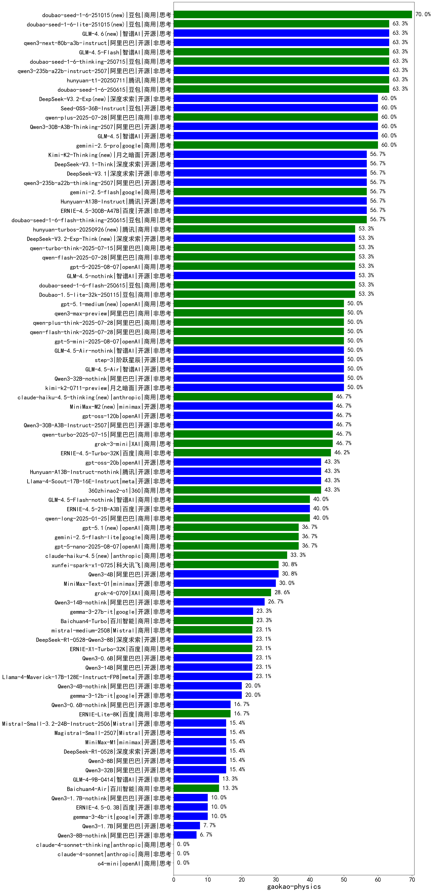

|类别|机构|大模型|【gaokao-physics】准确率|平均耗时|平均消耗token|花费/千次（元）|排名（准确率）|
|---|---|-----|-------------------|-------|-----------|-----------|-----------|
|商用|XAI|grok-4-0709|92.2%|259s|2977|311.1|1|
|商用|腾讯|hunyuan-t1-20250711|92.0%|50s|3033|11.6|2|
|商用|腾讯|hunyuan-turbos-20250716|92.0%|59s|2791|5.4|3|
|商用|百度|ERNIE-4.5-Turbo-32K|91.0%|292s|1079|3.1|4|
|商用|科大讯飞|xunfei-spark-x1-0725|91.0%|/|3329|39.9|5|
|商用|豆包|doubao-seed-1-6-thinking-250715|91.0%|18s|2268|17.0|6|
|开源|阿里巴巴|qwen3-235b-a22b-instruct-2507|91.0%|30s|1319|9.6|7|
|开源|深度求索|DeepSeek-V3.1(new)|91.0%|35s|791|8.4|8|
|商用|阿里巴巴|qwen-plus-2025-07-28(new)|91.0%|31s|1240|2.3|9|
|开源|阿里巴巴|qwen3-235b-a22b-thinking-2507|90.0%|69s|2867|54.4|10|
|开源|深度求索|DeepSeek-V3.1-Think(new)|90.0%|80s|1693|19.2|11|
|开源|百度|ERNIE-4.5-300B-A47B|90.0%|292s|1489|11.0|12|
|商用|阿里巴巴|qwen-plus-2025-07-14|90.0%|29s|1238|2.3|13|
|开源|智谱AI|GLM-4.5|90.0%|100s|4746|64.2|14|
|商用|anthropic|claude-4-sonnet-thinking|90.0%|49s|1312|123.6|15|
|商用|anthropic|claude-4-sonnet|90.0%|42s|694|56.3|16|
|商用|阿里巴巴|qwen3-max-preview(new)|90.0%|19s|960|20.1|17|
|开源|豆包|Seed-OSS-36B-Instruct(new)|90.0%|177s|2706|10.4|18|
|开源|阿里巴巴|Qwen3-30B-A3B-Instruct-2507|90.0%|13s|1342|3.7|19|
|商用|阿里巴巴|qwen-plus-think-2025-07-28(new)|89.0%|/|2797|21.2|20|
|商用|openAI|gpt-5-2025-08-07(new)|89.0%|30s|697|40.2|21|
|开源|阿里巴巴|Qwen3-30B-A3B-Thinking-2507|89.0%|72s|2990|8.0|22|
|商用|阿里巴巴|qwen-flash-2025-07-28|89.0%|12s|1290|1.7|23|
|商用|阿里巴巴|qwen-flash-think-2025-07-28|89.0%|27s|2504|3.5|24|
|商用|google|gemini-2.5-flash|89.0%|15s|3069|53.2|25|
|商用|百度|ERNIE-X1-Turbo-32K|89.0%|333s|3528|13.7|26|
|商用|阿里巴巴|qwen-turbo-2025-07-15|89.0%|12s|903|0.5|27|
|开源|阶跃星辰|step-3|88.0%|258s|5108|20.1|28|
|开源|深度求索|DeepSeek-R1-0528|88.0%|344s|4570|71.5|29|
|开源|腾讯|Hunyuan-A13B-Instruct|88.0%|246s|1673|6.2|30|
|开源|阿里巴巴|Qwen3-14B|88.0%|439s|13103|26.0|31|
|商用|豆包|doubao-seed-1-6-250615|88.0%|164s|739|4.6|32|
|开源|阿里巴巴|Qwen3-32B|88.0%|411s|9789|38.7|33|
|商用|google|gemini-2.5-pro|87.0%|45s|4329|304.2|34|
|开源|深度求索|deepseek-chat-v3-0324|87.0%|182s|1125|8.0|35|
|开源|阿里巴巴|Qwen3-4B|87.0%|256s|5307|15.5|36|
|开源|minimax|MiniMax-M1|87.0%|197s|6560|51.0|37|
|开源|深度求索|DeepSeek-R1-0528-Qwen3-8B|87.0%|429s|5219|0.0|38|
|商用|阿里巴巴|qwen-turbo-think-2025-07-15(new)|87.0%|/|4308|12.5|39|
|开源|openAI|gpt-oss-120b(new)|87.0%|10s|1229|3.4|40|
|开源|华为|pangu-pro-moe|86.0%|114s|2412|9.2|41|
|商用|智谱AI|GLM-4.5-Flash|86.0%|72s|4716|0.0|42|
|开源|智谱AI|GLM-4.5-Air|86.0%|64s|4942|28.6|43|
|开源|月之暗面|kimi-k2-0711-preview|86.0%|90s|1282|18.8|44|
|商用|智谱AI|GLM-4.5-Flash-nothink|86.0%|33s|1861|0.0|45|
|商用|openAI|gpt-5-mini-2025-08-07(new)|85.0%|35s|1269|16.3|46|
|开源|智谱AI|GLM-4.5-nothink|85.0%|66s|2196|29.1|47|
|开源|智谱AI|GLM-4.5-Air-nothink|84.0%|51s|3774|21.9|48|
|开源|百度|ERNIE-4.5-21B-A3B|83.0%|49s|1404|0.0|49|
|商用|豆包|Doubao-1.5-pro-32k-250115|83.0%|12s|748|1.3|50|
|商用|豆包|doubao-seed-1-6-flash-thinking-250615|83.0%|13s|1806|2.4|51|
|开源|智谱AI|GLM-4-32B-0414|82.0%|43s|1452|2.7|52|
|开源|腾讯|Hunyuan-A13B-Instruct-nothink|82.0%|335s|836|2.9|53|
|商用|XAI|grok-3-mini|82.0%|227s|1634|5.7|54|
|开源|阿里巴巴|Qwen3-32B-nothink|82.0%|50s|975|3.4|55|
|商用|豆包|doubao-seed-1-6-flash-250615|81.0%|11s|748|0.9|56|
|商用|Mistral|mistral-medium-2508(new)|81.0%|304s|823|9.8|57|
|商用|openAI|gpt-5-nano-2025-08-07(new)|80.0%|83s|2816|7.7|58|
|商用|openAI|o4-mini|80.0%|33s|823|22.0|59|
|开源|阿里巴巴|Qwen3-8B|80.0%|509s|16548|0.0|60|
|商用|豆包|Doubao-1.5-lite-32k-250115|79.5%|5s|525|0.3|61|
|开源|Mistral|Magistral-Small-2507(new)|79.0%|415s|9158|98.3|62|
|开源|openAI|gpt-oss-20b(new)|79.0%|145s|1685|1.8|63|
|开源|meta|Llama-4-Maverick-17B-128E-Instruct-FP8|79.0%|10s|697|2.5|64|
|开源|阿里巴巴|Qwen3-14B-nothink|79.0%|17s|1072|1.9|65|
|开源|深度求索|DeepSeek-R1-Distill-Qwen-32B|77.6%|115s|1285|1.6|66|
|开源|智谱AI|GLM-Z1-32B-0414|76.7%|89s|1810|6.7|67|
|商用|奇虎360|360zhinao2-o1|75.9%|/|/|/|68|
|商用|google|gemini-2.5-flash-lite|74.0%|25s|5233|14.8|69|
|商用|奇虎360|360gpt2-pro|71.5%|11s|595|2.3|70|
|开源|深度求索|DeepSeek-R1-Distill-Qwen-14B|70.0%|/|/|/|71|
|开源|Mistral|Mistral-Small-3.2-24B-Instruct-2506(new)|70.0%|24s|1756|3.6|72|
|开源|meta|Llama-4-Scout-17B-16E-Instruct|70.0%|11s|712|1.3|73|
|商用|奇虎360|360gpt2-o1|70.0%|49s|1331|61.4|74|
|商用|阿里巴巴|qwen-long-2025-01-25|69.5%|104s|754|1.2|75|
|商用|科大讯飞|xunfei-spark-max|68.2%|16s|611|18.4|76|
|商用|百度|ERNIE-3.5-8K|66.0%|22s|541|0.9|77|
|开源|minimax|MiniMax-Text-01|65.5%|9s|1059|8.5|78|
|开源|阿里巴巴|Qwen3-8B-nothink|65.0%|42s|1102|0.0|79|
|商用|月之暗面|kimi-latest-8k|64.0%|31s|742|8.9|80|
|开源|阿里巴巴|Qwen3-4B-nothink|64.0%|17s|911|2.3|81|
|开源|智谱AI|GLM-4-9B-0414|63.0%|23s|967|0.0|82|
|开源|阿里巴巴|Qwen3-1.7B|62.0%|237s|5914|17.3|83|
|商用|科大讯飞|xunfei-spark-pro|62.0%|/|/|/|84|
|商用|零一万物|yi-lightning|61.0%|/|/|/|85|
|商用|科大讯飞|xunfei-4.0Ultra|60.0%|14s|575|40.3|86|
|商用|百川智能|Baichuan4-Turbo|57.0%|/|/|/|87|
|商用|阶跃星辰|step-2-mini|50.0%|10s|698|1.2|88|
|开源|Google|gemma-3-27b-it|49.0%|/|/|/|89|
|开源|Google|gemma-3-12b-it|45.0%|/|/|/|90|
|商用|百川智能|Baichuan4-Air|45.0%|/|/|/|91|
|开源|阿里巴巴|Qwen3-0.6B|43.0%|199s|4978|14.5|92|
|开源|阿里巴巴|Qwen3-1.7B-nothink|43.0%|18s|972|2.5|93|
|商用|百度|ERNIE-Speed-8K|39.2%|/|/|/|94|
|商用|百度|ERNIE-Lite-8K|31.5%|/|/|/|95|
|开源|Google|gemma-3-4b-it|28.0%|/|/|/|96|
|开源|智谱AI|GLM-Z1-9B-0414|28.0%|190s|4284|0.0|97|
|商用|Mistral|ministral-8b|27.0%|/|/|/|98|
|开源|阿里巴巴|Qwen3-0.6B-nothink|24.0%|14s|559|1.2|99|
|商用|Mistral|ministral-3b|23.0%|/|/|/|100|
|开源|百度|ERNIE-4.5-0.3B|23.0%|96s|858|0.0|101|
|商用|科大讯飞|xunfei-spark-lite|14.5%|/|/|/|102|

