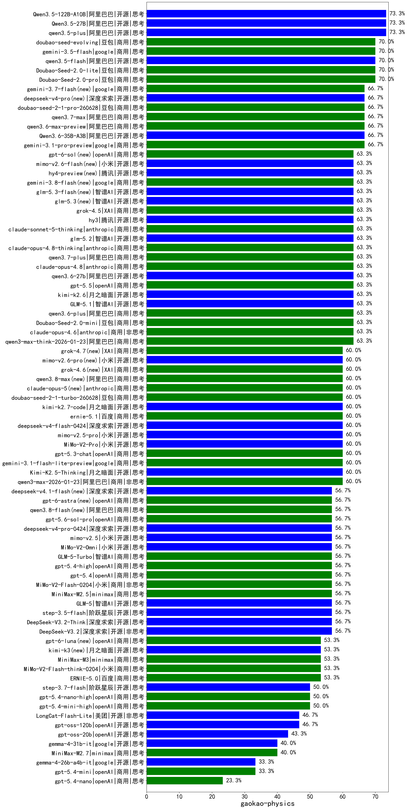

|类别|机构|大模型|【gaokao-physics】准确率|平均耗时|平均消耗token|花费/千次（元）|排名（准确率）|
|---|---|-----|-------------------|-------|-----------|-----------|-----------|
|开源|阿里巴巴|Qwen3.5-122B-A10B|73.3%|639s|6170|38.6|1|
|开源|阿里巴巴|Qwen3.5-27B|73.3%|187s|6751|31.7|2|
|开源|阿里巴巴|qwen3.5-plus|73.3%|68s|6294|29.6|3|
|商用|豆包|doubao-seed-evolving(new)|70.0%|376s|16122|478.9|4|
|开源|阿里巴巴|qwen3.5-flash|70.0%|640s|6629|13.0|5|
|商用|google|gemini-3.5-flash|70.0%|21s|3208|193.7|6|
|商用|豆包|Doubao-Seed-2.0-lite|70.0%|368s|1711|5.6|7|
|商用|豆包|Doubao-Seed-2.0-pro|70.0%|427s|1787|26.0|8|
|商用|google|gemini-3.7-flash(new)|66.7%|22s|1380|32.9|9|
|商用|阿里巴巴|qwen3.7-max|66.7%|50s|2923|101.4|10|
|商用|豆包|doubao-seed-1-8-251215|66.7%|46s|1372|9.5|11|
|开源|阿里巴巴|Qwen3.6-35B-A3B|66.7%|19s|3740|39.0|12|
|商用|豆包|doubao-seed-2-1-pro-260628(new)|66.7%|309s|15232|452.2|13|
|商用|google|gemini-3.1-pro-preview|66.7%|101s|3296|269.6|14|
|商用|阿里巴巴|qwen3.6-max-preview|66.7%|110s|3507|182.2|15|
|开源|深度求索|deepseek-v4-pro(new)|66.7%|50s|2611|66.5|16|
|商用|anthropic|claude-opus-4.6|63.3%|19s|1060|151.0|17|
|商用|anthropic|claude-opus-4.8-thinking(new)|63.3%|20s|1705|262.4|18|
|开源|阿里巴巴|qwen3.6-27b|63.3%|59s|3866|67.2|19|
|商用|openAI|gpt-5.5|63.3%|25s|1069|192.8|20|
|商用|阿里巴巴|qwen3.6-plus|63.3%|112s|5516|64.6|21|
|商用|阿里巴巴|qwen3.7-plus(new)|63.3%|71s|3817|29.6|22|
|商用|anthropic|claude-opus-4.8(new)|63.3%|16s|929|126.5|23|
|商用|阿里巴巴|qwen3-max-think-2026-01-23|63.3%|363s|6040|59.1|24|
|开源|智谱AI|glm-5.2(new)|63.3%|127s|5864|160.9|25|
|商用|google|gemini-3-flash-preview|63.3%|127s|3389|69.4|26|
|商用|anthropic|claude-sonnet-5-thinking(new)|63.3%|26s|2312|147.4|27|
|开源|腾讯|hy3(new)|63.3%|49s|602|2.0|28|
|商用|XAI|grok-4.5(new)|63.3%|82s|3641|142.8|29|
|开源|月之暗面|kimi-k2.6|63.3%|259s|5160|136.3|30|
|开源|智谱AI|glm-5.3(new)|63.3%|335s|4202|114.4|31|
|开源|智谱AI|GLM-5.1|63.3%|346s|4907|114.9|32|
|开源|智谱AI|glm-5.3-flash(new)|63.3%|101s|4208|11.5|33|
|商用|google|gemini-3.8-flash(new)|63.3%|20s|1684|81.8|34|
|商用|豆包|Doubao-Seed-2.0-mini|63.3%|161s|4682|9.0|35|
|商用|google|gemini-3.1-flash-lite-preview|60.0%|17s|762|6.6|36|
|商用|openAI|gpt-5.3-chat|60.0%|15s|892|71.9|37|
|开源|深度求索|deepseek-v4-flash-0424|60.0%|90s|2796|5.4|38|
|开源|小米|mimo-v2.5-pro|60.0%|73s|3803|74.1|39|
|开源|小米|MiMo-V2-Pro|60.0%|52s|3582|69.5|40|
|商用|百度|ernie-5.1|60.0%|86s|3670|63.8|41|
|开源|月之暗面|Kimi-K2.5-Thinking|60.0%|626s|6507|134.1|42|
|商用|阿里巴巴|qwen3-max-2026-01-23|60.0%|177s|2071|19.4|43|
|开源|美团|LongCat-Flash-Thinking-2601|60.0%|99s|7292|0.0|44|
|商用|阿里巴巴|qwen3-max-preview-think|60.0%|103s|4483|104.5|45|
|开源|月之暗面|kimi-k2.7-code(new)|60.0%|55s|2193|56.2|46|
|商用|豆包|doubao-seed-2-1-turbo-260628(new)|60.0%|275s|12575|186.3|47|
|商用|anthropic|claude-opus-5(new)|60.0%|13s|979|135.2|48|
|商用|阿里巴巴|qwen3.8-max(new)|60.0%|93s|3971|138.2|49|
|商用|XAI|grok-4.6(new)|60.0%|87s|3332|129.8|50|
|开源|深度求索|deepseek-v4-pro-0424|56.7%|106s|3107|72.8|51|
|商用|openAI|gpt-5.6-sol-pro(new)|56.7%|25s|5288|469.5|52|
|开源|小米|mimo-v2.5|56.7%|62s|3468|44.0|53|
|商用|阿里巴巴|qwen3.8-flash(new)|56.7%|106s|7342|19.4|54|
|商用|智谱AI|GLM-5-Turbo|56.7%|94s|7189|155.5|55|
|商用|openAI|gpt-6-astra(new)|56.7%|17s|548|140.9|56|
|开源|小米|MiMo-V2-Omni|56.7%|724s|3789|48.4|57|
|商用|openAI|gpt-5.4-high|56.7%|31s|1487|140.3|58|
|商用|阿里巴巴|qwen-plus-2025-12-01|56.7%|65s|2678|5.2|59|
|开源|阶跃星辰|step-3.5-flash|56.7%|77s|12760|26.6|60|
|开源|智谱AI|GLM-5|56.7%|188s|5574|98.1|61|
|商用|minimax|MiniMax-M2.5|56.7%|86s|4794|39.1|62|
|商用|阿里巴巴|qwen-plus-think-2025-12-01|56.7%|93s|4972|38.5|63|
|商用|小米|MiMo-V2-Flash-0204|56.7%|537s|2162|4.3|64|
|商用|openAI|gpt-5.4|56.7%|8s|715|59.2|65|
|商用|腾讯|hunyuan-2.0-thinking-20251109|56.7%|44s|3774|14.7|66|
|商用|openAI|gpt-5.2-high|56.7%|24s|1395|122.9|67|
|开源|阿里巴巴|qwen3-next-80b-a3b-thinking|56.7%|50s|5422|21.2|68|
|开源|深度求索|DeepSeek-V3.2-Think|56.7%|285s|4639|13.8|69|
|开源|深度求索|DeepSeek-V3.2|56.7%|41s|1342|3.9|70|
|开源|月之暗面|kimi-k3(new)|53.3%|130s|1713|153.1|71|
|商用|openAI|gpt-5.2-medium|53.3%|26s|1201|103.6|72|
|开源|小米|MiMo-V2-Flash|53.3%|28s|2202|0.0|73|
|开源|小米|MiMo-V2-Flash-think|53.3%|101s|6590|0.0|74|
|开源|智谱AI|GLM-4.7|53.3%|128s|5273|72.1|75|
|商用|百度|ERNIE-5.0|53.3%|432s|6628|156.5|76|
|商用|小米|MiMo-V2-Flash-think-0204|53.3%|739s|5455|11.2|77|
|商用|minimax|MiniMax-M3(new)|53.3%|175s|6457|104.5|78|
|开源|阶跃星辰|step-3.7-flash(new)|50.0%|101s|10914|87.4|79|
|商用|openAI|gpt-5.4-nano-high|50.0%|115s|2245|18.3|80|
|商用|openAI|gpt-5.4-mini-high|50.0%|149s|2192|64.3|81|
|商用|腾讯|hunyuan-2.0-instruct-20251111|50.0%|27s|1521|2.8|82|
|开源|Mistral|mistral-large-2512|46.7%|21s|1110|10.5|83|
|开源|openAI|gpt-oss-120b|46.7%|18s|1443|4.1|84|
|开源|美团|LongCat-Flash-Lite|46.7%|235s|2325|0.0|85|
|商用|minimax|MiniMax-M2.1|43.3%|90s|6214|51.1|86|
|商用|openAI|gpt-5.2|43.3%|12s|612|45.1|87|
|开源|openAI|gpt-oss-20b|43.3%|208s|1854|2.0|88|
|开源|google|gemma-4-31b-it|40.0%|115s|916|2.3|89|
|开源|Mistral|Ministral-3-3B-Instruct-2512|40.0%|18s|3602|2.6|90|
|商用|minimax|MiniMax-M2.7|40.0%|122s|5248|43.0|91|
|开源|Mistral|Ministral-3-14B-Instruct-2512|36.7%|29s|3511|5.0|92|
|商用|openAI|gpt-5.4-mini|33.3%|99s|551|12.6|93|
|开源|google|gemma-4-26b-a4b-it|33.3%|148s|1601|4.2|94|
|开源|智谱AI|GLM-4.7-Flash|33.3%|1934s|13054|0.0|95|
|商用|openAI|gpt-5.4-nano|23.3%|30s|768|5.4|96|
|开源|Mistral|Ministral-3-8B-Instruct-2512|16.7%|23s|3430|3.7|97|

