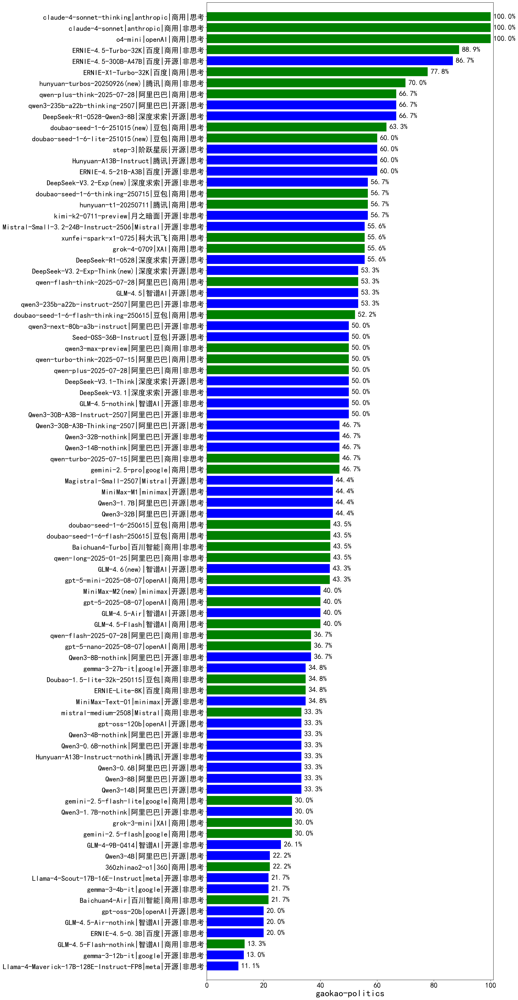

|类别|机构|大模型|【gaokao-politics】准确率|平均耗时|平均消耗token|花费/千次（元）|排名（准确率）|
|---|---|-----|-------------------|-------|-----------|-----------|-----------|
|商用|anthropic|claude-4-sonnet|100.0%|41s|850|68.8|1|
|商用|openAI|gpt-4.1|100.0%|11s|463|19.2|2|
|商用|anthropic|claude-4-sonnet-thinking|100.0%|53s|1471|136.3|3|
|开源|阿里巴巴|qwen3-235b-a22b-thinking-2507(new)|98.0%|46s|2235|42.0|4|
|开源|腾讯|hunyuan-large|98.0%|9s|2024|10.9|5|
|商用|智谱AI|GLM-4-FlashX|97.0%|3s|296|0.0|6|
|商用|豆包|doubao-seed-1-6-flash-thinking-250615|97.0%|9s|822|1.0|7|
|开源|百度|ERNIE-4.5-300B-A47B(new)|97.0%|236s|350|2.0|8|
|商用|腾讯|hunyuan-turbos-20250604|97.0%|103s|518|0.8|9|
|开源|阿里巴巴|Qwen3-235B-A22B|96.0%|80s|2086|19.7|10|
|商用|豆包|doubao-seed-1-6-thinking-250615|96.0%|17s|1026|7.2|11|
|商用|阿里巴巴|qwen-plus-think-2025-04-28|96.0%|42s|1714|12.6|12|
|开源|月之暗面|kimi-k2-0711-preview(new)|96.0%|28s|492|6.4|13|
|商用|百度|ERNIE-X1-Turbo-32K|96.0%|186s|1282|4.8|14|
|开源|阿里巴巴|qwen3-235b-a22b-instruct-2507(new)|95.0%|14s|634|4.2|15|
|商用|阿里巴巴|qwen-plus-2025-04-28|95.0%|91s|553|0.9|16|
|商用|百度|ERNIE-4.5-Turbo-32K|95.0%|144s|524|1.4|17|
|商用|腾讯|hunyuan-t1-20250711(new)|95.0%|14s|936|3.2|18|
|商用|智谱AI|GLM-4-Plus|95.0%|8s|353|1.8|19|
|商用|豆包|doubao-seed-1-6-thinking-250715(new)|95.0%|17s|986|6.9|20|
|商用|商汤|SenseChat-5-beta|94.0%|17s|387|6.1|21|
|开源|阿里巴巴|Qwen3-235B-A22B-nothink|93.9%|19s|563|4.5|22|
|商用|智谱AI|GLM-4-Long|93.3%|3s|283|0.3|23|
|商用|阿里巴巴|qwen-turbo-think-2025-04-28|93.0%|111s|2460|7.0|24|
|开源|深度求索|DeepSeek-R1-0528|93.0%|259s|1855|28.2|25|
|商用|阿里巴巴|qwen-plus-2025-07-14(new)|93.0%|16s|657|1.1|26|
|商用|月之暗面|kimi-latest-8k|93.0%|15s|526|6.3|27|
|开源|深度求索|deepseek-chat-v3-0324|92.0%|132s|466|3.0|28|
|商用|阿里巴巴|qwen-turbo-2025-04-28|92.0%|8s|566|0.3|29|
|商用|google|gemini-2.5-pro(new)|92.0%|30s|2537|174.7|30|
|开源|百度|ERNIE-4.5-21B-A3B(new)|92.0%|139s|363|0.0|31|
|开源|腾讯|Hunyuan-A13B-Instruct(new)|92.0%|206s|955|3.4|32|
|商用|豆包|doubao-seed-1-6-250615|92.0%|151s|200|0.4|33|
|商用|豆包|doubao-seed-1-6-flash-250615|92.0%|4s|382|0.4|34|
|开源|华为|pangu-pro-moe(new)|92.0%|86s|1821|6.9|35|
|商用|腾讯|hunyuan-standard|91.5%|/|/|/|36|
|开源|阿里巴巴|Qwen3-32B|91.0%|210s|2849|10.9|37|
|开源|阿里巴巴|Qwen3-30B-A3B|91.0%|310s|3458|9.4|38|
|商用|阿里巴巴|qwq-plus-2025-03-05|91.0%|40s|2158|8.3|39|
|商用|科大讯飞|xunfei-spark-x1-0725(new)|90.7%|/|1140|13.7|40|
|开源|深度求索|DeepSeek-R1-0528-Qwen3-8B|90.0%|340s|1969|0.0|41|
|商用|阿里巴巴|qwen2.5-max|90.0%|19s|583|4.5|42|
|商用|阿里巴巴|qwen-long-2025-01-25|90.0%|10s|526|0.8|43|
|开源|阿里巴巴|qwen2.5-72b-instruct|90.0%|12s|384|3.4|44|
|开源|阿里巴巴|Qwen3-14B|90.0%|230s|4207|8.2|45|
|开源|阿里巴巴|Qwen3-32B-nothink|90.0%|43s|600|1.9|46|
|开源|智谱AI|GLM-4.5-Air(new)|90.0%|33s|2045|11.4|47|
|开源|智谱AI|GLM-Z1-32B-0414|90.0%|99s|2232|8.5|48|
|商用|智谱AI|GLM-4-Flash|89.8%|6s|317|0.0|49|
|开源|阿里巴巴|qwq-32b|89.5%|36s|2616|15.1|50|
|商用|豆包|Doubao-1.5-pro-32k-250115|89.0%|8s|494|0.8|51|
|商用|奇虎360|360gpt2-pro|89.0%|5s|356|1.3|52|
|开源|阿里巴巴|Qwen3-30B-A3B-nothink|89.0%|26s|587|1.3|53|
|商用|豆包|Doubao-1.5-lite-32k-250115|88.5%|2s|315|0.1|54|
|商用|XAI|grok-4-0709(new)|88.3%|190s|1242|122.8|55|
|开源|minimax|MiniMax-M1(new)|88.0%|221s|4643|35.8|56|
|开源|阿里巴巴|Qwen3-14B-nothink|88.0%|21s|647|1.1|57|
|商用|智谱AI|GLM-Z1-Air|88.0%|54s|1621|0.8|58|
|开源|深度求索|DeepSeek-R1-Distill-Qwen-32B|87.0%|47s|798|1.0|59|
|商用|阿里巴巴|qwen-turbo-2025-07-15(new)|87.0%|7s|514|0.3|60|
|商用|智谱AI|GLM-4-AirX|86.7%|2s|328|3.3|61|
|商用|智谱AI|GLM-4-Air|86.7%|4s|333|0.2|62|
|开源|阿里巴巴|qwen2.5-32b-instruct|86.5%|5s|343|1.5|63|
|商用|智谱AI|GLM-Z1-AirX|86.0%|33s|2258|14.0|64|
|商用|智谱AI|GLM-4.5-Flash(new)|86.0%|31s|2060|0.0|65|
|商用|google|gemini-2.5-flash(new)|86.0%|16s|2890|50.1|66|
|开源|阿里巴巴|Qwen3-8B-nothink|85.0%|24s|666|0.0|67|
|商用|商汤|SenseChat-5-1202|85.0%|/|/|/|68|
|商用|百川智能|Baichuan4-Turbo|85.0%|/|/|/|69|
|开源|深度求索|DeepSeek-R1-Distill-Qwen-14B|85.0%|/|/|/|70|
|开源|阿里巴巴|Qwen3-8B|85.0%|152s|4300|0.0|71|
|开源|minimax|MiniMax-Text-01|84.5%|8s|962|7.7|72|
|开源|阿里巴巴|qwen2.5-14b-instruct|84.5%|6s|367|0.8|73|
|商用|智谱AI|GLM-Z1-Flash|84.0%|27s|2691|0.0|74|
|商用|百度|ERNIE-3.5-8K|84.0%|21s|490|0.8|75|
|商用|奇虎360|360gpt-turbo|84.0%|/|/|/|76|
|开源|腾讯|Hunyuan-A13B-Instruct-nothink(new)|84.0%|18s|488|1.5|77|
|商用|奇虎360|360gpt2-o1|84.0%|24s|668|28.6|78|
|商用|商汤|SenseChat-Turbo-1202|83.5%|/|/|/|79|
|商用|科大讯飞|xunfei-spark-max|83.0%|5s|272|8.2|80|
|开源|上海人工智能实验室|internlm2_5-7b-chat|81.5%|/|/|/|81|
|商用|科大讯飞|xunfei-4.0Ultra|81.0%|5s|267|18.7|82|
|开源|智谱AI|GLM-4-9B-0414|80.0%|8s|508|0.0|83|
|商用|openAI|gpt-4.1-mini|80.0%|9s|490|4.2|84|
|商用|openAI|chatgpt-4o-latest|80.0%|/|/|/|85|
|商用|零一万物|yi-lightning|79.5%|/|/|/|86|
|开源|meta|Llama-4-Scout-17B-16E-Instruct|79.0%|11s|716|1.3|87|
|开源|meta|Llama-4-Maverick-17B-128E-Instruct-FP8|79.0%|10s|720|2.7|88|
|开源|阿里巴巴|Qwen3-1.7B|78.0%|139s|2770|7.9|89|
|商用|百度|ERNIE-Speed-8K|77.1%|/|/|/|90|
|开源|智谱AI|GLM-Z1-9B-0414|77.0%|91s|3664|0.0|91|
|商用|奇虎360|360zhinao2-o1|76.0%|/|/|/|92|
|商用|百川智能|Baichuan4-Air|76.0%|/|/|/|93|
|商用|百度|ERNIE-Lite-8K|76.0%|/|/|/|94|
|开源|智谱AI|GLM-4-32B-0414|76.0%|50s|454|0.9|95|
|开源|阿里巴巴|Qwen3-4B|76.0%|148s|2868|8.2|96|
|商用|google|gemini-2.5-flash-lite-preview-06-17(new)|76.0%|3s|814|2.0|97|
|商用|科大讯飞|xunfei-spark-pro|75.5%|/|/|/|98|
|开源|阿里巴巴|qwen2.5-7b-instruct|75.5%|4s|406|0.3|99|
|开源|阿里巴巴|Qwen3-4B-nothink|75.0%|11s|569|1.3|100|
|商用|XAI|grok-3-mini(new)|75.0%|189s|1048|3.6|101|
|商用|阶跃星辰|step-2-mini|74.5%|4s|369|0.6|102|
|商用|科大讯飞|xunfei-spark-x1|74.0%|53s|1432|17.2|103|
|商用|阶跃星辰|step-r1-v-mini|74.0%|22s|1721|12.9|104|
|开源|Mistral|Mistral-Small-3.1-24B-Instruct-2503|73.0%|/|/|/|105|
|商用|Mistral|mistral-large|72.0%|/|/|/|106|
|开源|Google|gemma-3-27b-it|70.5%|/|/|/|107|
|开源|阿里巴巴|qwen2.5-3b-instruct|70.5%|4s|416|0.3|108|
|开源|智谱AI|GLM-Z1-Rumination-32B-0414|70.0%|46s|1925|5.9|109|
|开源|阿里巴巴|Qwen3-1.7B-nothink|68.0%|16s|673|1.6|110|
|开源|阿里巴巴|qwen2.5-1.5b-instruct|67.0%|3s|314|0.0|111|
|商用|智谱AI|GLM-Z1-FlashX|66.7%|24s|1697|0.3|112|
|商用|Mistral|mistral-small|66.5%|/|/|/|113|
|商用|OpenAI|gpt-4o-mini|64.0%|/|/|/|114|
|开源|Google|gemma-3-12b-it|61.0%|/|/|/|115|
|商用|openAI|o4-mini|60.0%|33s|998|27.7|116|
|开源|微软|phi-4|59.5%|/|/|/|117|
|商用|Mistral|ministral-8b|48.0%|/|/|/|118|
|开源|阿里巴巴|Qwen3-0.6B|41.0%|115s|2097|5.9|119|
|商用|Mistral|ministral-3b|40.0%|/|/|/|120|
|开源|Google|gemma-3-4b-it|39.5%|/|/|/|121|
|开源|阿里巴巴|Qwen3-0.6B-nothink|37.0%|11s|342|0.6|122|
|开源|阿里巴巴|qwen2.5-0.5b-instruct|36.5%|3s|426|0.0|123|
|商用|科大讯飞|xunfei-spark-lite|36.0%|/|/|/|124|
|商用|百度|ERNIE-Tiny-8K|32.0%|/|/|/|125|
|开源|百度|ERNIE-4.5-0.3B(new)|29.0%|179s|361|0.0|126|

