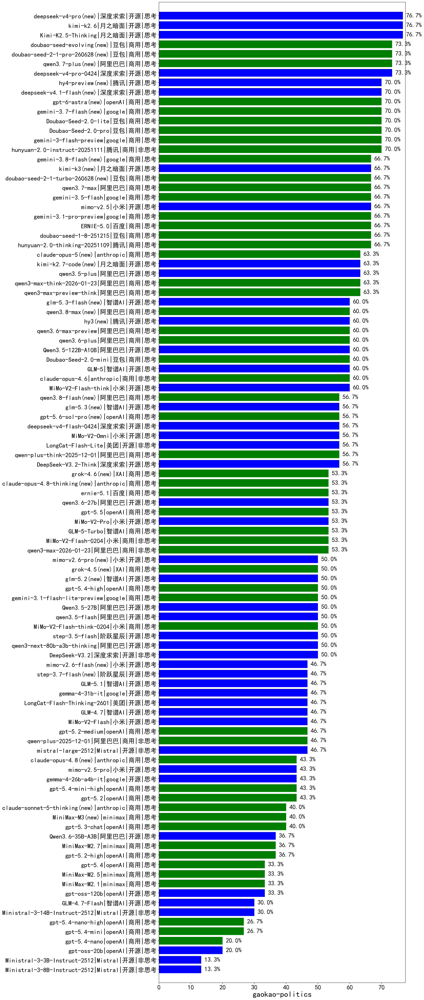

|类别|机构|大模型|【gaokao-politics】准确率|平均耗时|平均消耗token|花费/千次（元）|排名（准确率）|
|---|---|-----|-------------------|-------|-----------|-----------|-----------|
|开源|深度求索|deepseek-v4-pro(new)|76.7%|106s|2136|54.1|1|
|开源|月之暗面|kimi-k2.6|76.7%|128s|2434|63.3|2|
|开源|月之暗面|Kimi-K2.5-Thinking|76.7%|146s|3341|68.2|3|
|商用|豆包|doubao-seed-evolving(new)|73.3%|189s|7086|208.5|4|
|商用|阿里巴巴|qwen3.7-plus(new)|73.3%|42s|2254|17.2|5|
|商用|豆包|doubao-seed-2-1-pro-260628(new)|73.3%|308s|8596|253.8|6|
|开源|深度求索|deepseek-v4-pro-0424|73.3%|53s|1565|36.1|7|
|商用|openAI|gpt-6-astra(new)|70.0%|16s|401|97.1|8|
|商用|豆包|Doubao-Seed-2.0-lite|70.0%|197s|1124|3.5|9|
|商用|google|gemini-3.7-flash(new)|70.0%|5s|808|18.3|10|
|商用|google|gemini-3-flash-preview|70.0%|129s|2111|42.5|11|
|商用|豆包|Doubao-Seed-2.0-pro|70.0%|243s|1170|16.5|12|
|商用|腾讯|hunyuan-2.0-instruct-20251111|70.0%|28s|993|1.8|13|
|开源|深度求索|deepseek-v4.1-flash(new)|70.0%|35s|1841|13.9|14|
|开源|腾讯|hy4-preview(new)|70.0%|102s|6306|111.9|15|
|商用|腾讯|hunyuan-2.0-thinking-20251109|66.7%|27s|978|3.6|16|
|商用|google|gemini-3.8-flash(new)|66.7%|13s|926|42.8|17|
|开源|小米|mimo-v2.5|66.7%|42s|1972|23.3|18|
|商用|豆包|doubao-seed-1-8-251215|66.7%|34s|927|6.2|19|
|开源|月之暗面|kimi-k3(new)|66.7%|52s|1288|113.1|20|
|商用|google|gemini-3.5-flash|66.7%|15s|1837|108.5|21|
|商用|阿里巴巴|qwen3.7-max|66.7%|38s|2092|72.1|22|
|商用|google|gemini-3.1-pro-preview|66.7%|46s|2751|224.6|23|
|商用|豆包|doubao-seed-2-1-turbo-260628(new)|66.7%|172s|7213|106.1|24|
|商用|百度|ERNIE-5.0|66.7%|177s|1519|34.4|25|
|商用|anthropic|claude-opus-5(new)|63.3%|15s|914|131.3|26|
|开源|阿里巴巴|qwen3.5-plus|63.3%|46s|3991|18.6|27|
|开源|月之暗面|kimi-k2.7-code(new)|63.3%|40s|1499|38.1|28|
|商用|阿里巴巴|qwen3-max-think-2026-01-23|63.3%|263s|4356|42.5|29|
|商用|阿里巴巴|qwen3-max-preview-think|63.3%|317s|3248|75.4|30|
|商用|anthropic|claude-opus-4.6|60.0%|16s|854|120.5|31|
|开源|智谱AI|GLM-5|60.0%|112s|3032|52.8|32|
|商用|阿里巴巴|qwen3.6-max-preview|60.0%|65s|2062|105.3|33|
|开源|腾讯|hy3(new)|60.0%|47s|378|1.1|34|
|商用|阿里巴巴|qwen3.6-plus|60.0%|47s|2059|23.3|35|
|商用|豆包|Doubao-Seed-2.0-mini|60.0%|471s|2662|5.0|36|
|开源|小米|MiMo-V2-Flash-think|60.0%|113s|3030|0.0|37|
|商用|阿里巴巴|qwen3.8-max(new)|60.0%|72s|3148|109.2|38|
|开源|智谱AI|glm-5.3-flash(new)|60.0%|93s|3668|10.0|39|
|开源|阿里巴巴|Qwen3.5-122B-A10B|60.0%|526s|4354|27.1|40|
|开源|深度求索|DeepSeek-V3.2-Think|56.7%|210s|1681|4.9|41|
|开源|深度求索|deepseek-v4-flash-0424|56.7%|38s|1276|2.4|42|
|商用|阿里巴巴|qwen-plus-think-2025-12-01|56.7%|88s|3783|29.2|43|
|开源|小米|MiMo-V2-Omni|56.7%|293s|2067|24.6|44|
|商用|openAI|gpt-5.6-sol-pro(new)|56.7%|23s|4467|383.9|45|
|开源|智谱AI|glm-5.3(new)|56.7%|109s|4147|113.5|46|
|商用|阿里巴巴|qwen3.8-flash(new)|56.7%|26s|1609|4.0|47|
|开源|美团|LongCat-Flash-Lite|56.7%|126s|676|0.0|48|
|商用|XAI|grok-4.6(new)|53.3%|420s|3115|121.4|49|
|商用|anthropic|claude-opus-4.8-thinking(new)|53.3%|15s|1082|160.6|50|
|商用|智谱AI|GLM-5-Turbo|53.3%|46s|1733|36.0|51|
|开源|小米|MiMo-V2-Pro|53.3%|51s|1613|28.5|52|
|商用|百度|ernie-5.1|53.3%|31s|1042|16.9|53|
|开源|阿里巴巴|qwen3.6-27b|53.3%|36s|2261|38.7|54|
|商用|openAI|gpt-5.5|53.3%|21s|927|167.7|55|
|商用|小米|MiMo-V2-Flash-0204|53.3%|385s|804|1.5|56|
|商用|阿里巴巴|qwen3-max-2026-01-23|53.3%|25s|853|7.5|57|
|商用|google|gemini-3.1-flash-lite-preview|50.0%|3s|531|4.4|58|
|开源|深度求索|DeepSeek-V3.2|50.0%|117s|474|1.3|59|
|开源|阿里巴巴|qwen3-next-80b-a3b-thinking|50.0%|47s|4922|19.3|60|
|开源|小米|mimo-v2.6-pro(new)|50.0%|137s|3536|20.8|61|
|商用|小米|MiMo-V2-Flash-think-0204|50.0%|747s|2637|5.3|62|
|商用|XAI|grok-4.5(new)|50.0%|110s|3834|151.6|63|
|开源|智谱AI|glm-5.2(new)|50.0%|108s|5166|142.0|64|
|开源|阶跃星辰|step-3.5-flash|50.0%|42s|3918|8.0|65|
|开源|阿里巴巴|qwen3.5-flash|50.0%|549s|4632|9.0|66|
|开源|阿里巴巴|Qwen3.5-27B|50.0%|520s|4305|20.1|67|
|商用|openAI|gpt-5.4-high|50.0%|20s|1175|109.9|68|
|开源|小米|MiMo-V2-Flash|46.7%|17s|728|0.0|69|
|商用|openAI|gpt-5.2-medium|46.7%|11s|591|45.3|70|
|开源|智谱AI|GLM-5.1|46.7%|69s|1993|45.6|71|
|商用|阿里巴巴|qwen-plus-2025-12-01|46.7%|30s|1292|2.4|72|
|开源|google|gemma-4-31b-it|46.7%|70s|704|1.7|73|
|开源|美团|LongCat-Flash-Thinking-2601|46.7%|109s|4753|0.0|74|
|开源|Mistral|mistral-large-2512|46.7%|13s|594|5.0|75|
|开源|智谱AI|GLM-4.7|46.7%|80s|3083|41.8|76|
|开源|阶跃星辰|step-3.7-flash(new)|46.7%|39s|3165|24.8|77|
|开源|小米|mimo-v2.6-flash(new)|46.7%|67s|1717|3.3|78|
|商用|openAI|gpt-5.4-mini-high|43.3%|101s|1773|51.8|79|
|开源|小米|mimo-v2.5-pro|43.3%|46s|1949|35.5|80|
|开源|google|gemma-4-26b-a4b-it|43.3%|132s|814|2.0|81|
|商用|openAI|gpt-5.2|43.3%|9s|350|21.3|82|
|商用|anthropic|claude-opus-4.8(new)|43.3%|9s|659|86.7|83|
|商用|minimax|MiniMax-M3(new)|40.0%|59s|1459|20.9|84|
|商用|openAI|gpt-5.3-chat|40.0%|19s|521|37.9|85|
|商用|anthropic|claude-sonnet-5-thinking(new)|40.0%|16s|1120|66.9|86|
|开源|阿里巴巴|Qwen3.6-35B-A3B|36.7%|151s|2238|23.0|87|
|商用|minimax|MiniMax-M2.7|36.7%|71s|2863|23.1|88|
|商用|openAI|gpt-5.2-high|36.7%|18s|726|58.8|89|
|商用|minimax|MiniMax-M2.1|33.3%|130s|1914|15.1|90|
|商用|minimax|MiniMax-M2.5|33.3%|44s|2286|18.3|91|
|商用|openAI|gpt-5.4|33.3%|5s|407|29.2|92|
|开源|openAI|gpt-oss-120b|33.3%|204s|838|2.2|93|
|开源|智谱AI|GLM-4.7-Flash|30.0%|424s|4608|0.0|94|
|开源|Mistral|Ministral-3-14B-Instruct-2512|30.0%|17s|964|1.4|95|
|商用|openAI|gpt-5.4-mini|26.7%|13s|355|7.1|96|
|商用|openAI|gpt-5.4-nano-high|26.7%|16s|838|6.2|97|
|开源|openAI|gpt-oss-20b|20.0%|103s|1611|1.7|98|
|商用|openAI|gpt-5.4-nano|20.0%|40s|359|2.0|99|
|开源|Mistral|Ministral-3-3B-Instruct-2512|13.3%|22s|2672|1.9|100|
|开源|Mistral|Ministral-3-8B-Instruct-2512|13.3%|15s|877|0.9|101|

