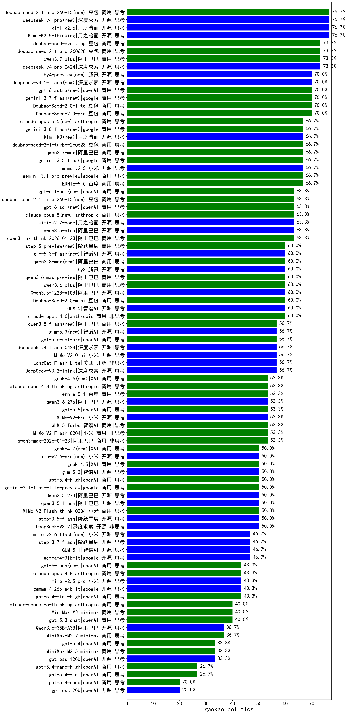

|类别|机构|大模型|【gaokao-politics】准确率|平均耗时|平均消耗token|花费/千次（元）|排名（准确率）|
|---|---|-----|-------------------|-------|-----------|-----------|-----------|
|商用|google|gemini-4-argon(new)|76.7%|22s|519|54.6|1|
|商用|豆包|doubao-seed-2-1-pro-260915(new)|76.7%|158s|2426|68.7|2|
|开源|月之暗面|kimi-k2.6|76.7%|128s|2434|63.3|3|
|开源|深度求索|deepseek-v4-pro|76.7%|106s|2136|54.1|4|
|开源|月之暗面|kimi-k3.1-pro(new)|73.3%|96s|3170|204.8|5|
|开源|深度求索|deepseek-v4-pro-0424|73.3%|53s|1565|36.1|6|
|商用|阿里巴巴|qwen3.7-plus|73.3%|42s|2254|17.2|7|
|商用|豆包|doubao-seed-2-1-pro-260628|73.3%|308s|8596|253.8|8|
|商用|豆包|doubao-seed-evolving|73.3%|189s|7086|208.5|9|
|商用|google|gemini-3.7-flash|70.0%|5s|808|18.3|10|
|商用|openAI|gpt-6-astra(new)|70.0%|16s|401|97.1|11|
|开源|深度求索|deepseek-v4.1-flash(new)|70.0%|35s|1841|13.9|12|
|开源|腾讯|hy4-preview(new)|70.0%|102s|6306|111.9|13|
|商用|google|gemini-3.8-flash(new)|66.7%|13s|926|42.8|14|
|开源|月之暗面|kimi-k3|66.7%|52s|1288|113.1|15|
|商用|阿里巴巴|qwen3.7-max|66.7%|38s|2092|72.1|16|
|商用|anthropic|claude-opus-5.5(new)|66.7%|15s|789|87.3|17|
|商用|google|gemini-3.5-flash|66.7%|15s|1837|108.5|18|
|商用|豆包|doubao-seed-2-1-turbo-260628|66.7%|172s|7213|106.1|19|
|商用|google|gemini-3.1-pro-preview|66.7%|46s|2751|224.6|20|
|商用|百度|ERNIE-5.0|66.7%|177s|1519|34.4|21|
|开源|小米|mimo-v2.5|66.7%|42s|1972|23.3|22|
|商用|openAI|gpt-6-sol(new)|63.3%|173s|399|19.3|23|
|商用|豆包|doubao-seed-2-1-lite-260915(new)|63.3%|97s|4823|12.7|24|
|开源|月之暗面|kimi-k2.7-code|63.3%|40s|1499|38.1|25|
|商用|anthropic|claude-opus-5|63.3%|15s|914|131.3|26|
|商用|openAI|gpt-6.1-sol(new)|63.3%|8s|365|16.9|27|
|商用|阿里巴巴|qwen3.6-max-preview|60.0%|65s|2062|105.3|28|
|商用|阶跃星辰|step-5-preview(new)|60.0%|55s|3809|74.5|29|
|开源|阿里巴巴|Qwen3.5-122B-A10B|60.0%|526s|4354|27.1|30|
|开源|智谱AI|glm-5.3-flash(new)|60.0%|93s|3668|10.0|31|
|商用|阿里巴巴|qwen3.8-max|60.0%|72s|3148|109.2|32|
|开源|腾讯|hy3|60.0%|47s|378|1.1|33|
|商用|阿里巴巴|qwen3.6-plus|60.0%|47s|2059|23.3|34|
|开源|深度求索|DeepSeek-V3.2-Think|56.7%|210s|1681|4.9|35|
|商用|openAI|gpt-5.6-sol-pro|56.7%|23s|4467|383.9|36|
|商用|anthropic|claude-sonnet-5.5(new)|56.7%|8s|704|37.7|37|
|商用|阿里巴巴|qwen3.8-flash(new)|56.7%|26s|1609|4.0|38|
|开源|智谱AI|glm-5.3(new)|56.7%|109s|4147|113.5|39|
|开源|深度求索|deepseek-v4-flash-0424|56.7%|38s|1276|2.4|40|
|商用|openAI|gpt-5.5|53.3%|21s|927|167.7|41|
|商用|XAI|grok-4.6|53.3%|420s|3115|121.4|42|
|开源|阿里巴巴|qwen3.6-27b|53.3%|36s|2261|38.7|43|
|商用|百度|ernie-5.1|53.3%|31s|1042|16.9|44|
|商用|anthropic|claude-opus-4.8-thinking|53.3%|15s|1082|160.6|45|
|商用|XAI|grok-4.5|50.0%|110s|3834|151.6|46|
|开源|深度求索|DeepSeek-V3.2|50.0%|117s|474|1.3|47|
|商用|XAI|grok-4.7(new)|50.0%|102s|7184|263.4|48|
|商用|google|gemini-3.1-flash-lite-preview|50.0%|3s|531|4.4|49|
|开源|智谱AI|glm-5.2|50.0%|108s|5166|142.0|50|
|开源|阿里巴巴|Qwen3.5-27B|50.0%|520s|4305|20.1|51|
|开源|小米|mimo-v2.6-pro(new)|50.0%|137s|3536|20.8|52|
|开源|google|gemma-4-31b-it|46.7%|70s|704|1.7|53|
|开源|阶跃星辰|step-3.7-flash|46.7%|39s|3165|24.8|54|
|开源|小米|mimo-v2.6-flash(new)|46.7%|67s|1717|3.3|55|
|开源|智谱AI|GLM-5.1|46.7%|69s|1993|45.6|56|
|商用|openAI|gpt-6-luna(new)|43.3%|133s|680|1.9|57|
|商用|anthropic|claude-opus-4.8|43.3%|9s|659|86.7|58|
|开源|google|gemma-4-26b-a4b-it|43.3%|132s|814|2.0|59|
|开源|小米|mimo-v2.5-pro|43.3%|46s|1949|35.5|60|
|商用|minimax|MiniMax-M3|40.0%|59s|1459|20.9|61|
|商用|anthropic|claude-sonnet-5-thinking|40.0%|16s|1120|66.9|62|
|开源|阿里巴巴|Qwen3.6-35B-A3B|36.7%|151s|2238|23.0|63|
|商用|minimax|MiniMax-M2.7|36.7%|71s|2863|23.1|64|
|商用|minimax|MiniMax-M3.1-Flash(new)|36.7%|37s|2220|7.9|65|
|开源|openAI|gpt-oss-120b|33.3%|204s|838|2.2|66|
|商用|anthropic|claude-haiku-5.5(new)|30.0%|8s|1039|3.1|67|
|开源|openAI|gpt-oss-20b|20.0%|103s|1611|1.7|68|

