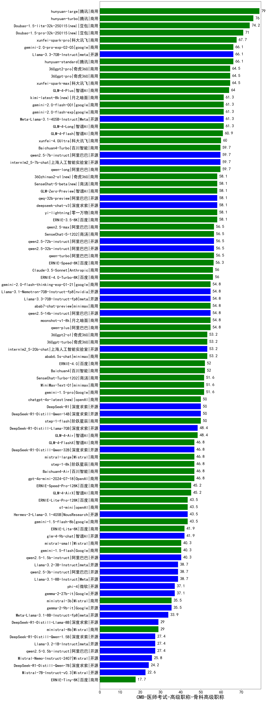

| 类别 | 大模型                         | CMB-医师考试-高级职称-骨科高级职称 | 排名 |
|-----|------------------------------|---------|----|
|商用|hunyuan-large|79.0|1|
|商用|hunyuan-turbo|76.0|2|
|商用|Doubao-1.5-lite-32k-250115(new)|74.2|3|
|商用|Doubao-1.5-pro-32k-250115(new)|71.0|4|
|商用|xunfei-spark-pro|67.7|5|
|商用|hunyuan-standard|66.1|6|
|商用|gemini-2.0-pro-exp-02-05|66.1|7|
|开源|Llama-3.3-70B-Instruct|66.1|8|
|商用|360gpt-pro|64.5|9|
|商用|360gpt2-pro|64.5|10|
|商用|xunfei-spark-max|64.5|11|
|商用|GLM-4-Plus|64.0|12|
|商用|kimi-latest-8k(new)|61.3|13|
|商用|GLM-4-Long|61.3|14|
|开源|Meta-Llama-3.1-405B-Instruct|61.3|15|
|商用|gemini-2.0-flash-exp|61.3|16|
|商用|gemini-2.0-flash-001|61.3|17|
|商用|GLM-4-Flash|60.9|18|
|商用|xunfei-4.0Ultra|60.0|19|
|商用|Baichuan4-Turbo|59.7|20|
|开源|internlm2_5-7b-chat|59.7|21|
|开源|qwen2.5-7b-instruct|59.7|22|
|商用|qwen-long|59.7|23|
|商用|ERNIE-3.5-8K|58.1|24|
|商用|yi-lightning|58.1|25|
|商用|SenseChat-5-beta(new)|58.1|26|
|开源|deepseek-chat-v3|58.1|27|
|商用|GLM-Zero-Preview|58.1|28|
|商用|360zhinao2-o1(new)|58.1|29|
|开源|qwq-32b-preview|58.1|30|
|开源|qwen2.5-72b-instruct|56.5|31|
|开源|qwen2.5-32b-instruct|56.5|32|
|商用|SenseChat-5-1202|56.5|33|
|商用|qwen-turbo|56.5|34|
|商用|qwen2.5-max|56.5|35|
|商用|ERNIE-Speed-8K|56.3|36|
|商用|ERNIE-4.0-Turbo-8K|56.0|37|
|商用|Claude-3.5-Sonnet|56.0|38|
|开源|Llama-3.1-Nemotron-70B-Instruct-fp8|54.8|39|
|商用|qwen-plus|54.8|40|
|商用|moonshot-v1-8k|54.8|41|
|开源|qwen2.5-14b-instruct|54.8|42|
|开源|Llama-3.3-70B-Instruct-fp8|54.8|43|
|商用|gemini-2.0-flash-thinking-exp-01-21|54.8|44|
|商用|abab7-chat-preview|54.8|45|
|商用|abab6.5s-chat|53.2|46|
|商用|360gpt2-o1|53.2|47|
|商用|360gpt-turbo|53.2|48|
|开源|internlm2_5-20b-chat|53.2|49|
|商用|Baichuan4|52.0|50|
|商用|ERNIE-4.0|52.0|51|
|商用|gemini-1.5-pro|51.6|52|
|商用|MiniMax-Text-01|51.6|53|
|商用|SenseChat-Turbo-1202|51.6|54|
|商用|chatgpt-4o-latest(new)|50.0|55|
|商用|step-1-flash|50.0|56|
|开源|DeepSeek-R1|50.0|57|
|开源|DeepSeek-R1-Distill-Qwen-14B|50.0|58|
|开源|DeepSeek-R1-Distill-Llama-70B|48.4|59|
|商用|GLM-4-Air|48.4|60|
|商用|gpt-4o-mini-2024-07-18|46.8|61|
|商用|step-1-8k|46.8|62|
|商用|Baichuan4-Air|46.8|63|
|开源|DeepSeek-R1-Distill-Qwen-32B|46.8|64|
|商用|GLM-4-FlashX|46.8|65|
|商用|mistral-large|46.8|66|
|商用|ERNIE-Speed-Pro-128K|45.2|67|
|商用|GLM-4-AirX|45.2|68|
|商用|ERNIE-Lite-Pro-128K|43.5|69|
|商用|gemini-1.5-flash-8b|43.5|70|
|开源|Hermes-3-Llama-3.1-405B|43.5|71|
|商用|o1-mini|43.5|72|
|开源|glm-4-9b-chat|41.9|73|
|商用|ERNIE-Lite-8K|41.9|74|
|商用|mistral-small|40.3|75|
|开源|qwen2.5-1.5b-instruct|40.3|76|
|商用|gemini-1.5-flash|40.3|77|
|开源|Llama-3.2-3B-Instruct|38.7|78|
|开源|qwen2.5-3b-instruct|38.7|79|
|开源|Llama-3.1-8B-Instruct|38.7|80|
|开源|gemma-2-27b-it|37.1|81|
|开源|phi-4|37.1|82|
|商用|ministral-3b|35.5|83|
|开源|gemma-2-9b-it|35.5|84|
|开源|Meta-Llama-3.1-8B-Instruct-fp8|33.9|85|
|商用|ministral-8b|29.0|86|
|开源|DeepSeek-R1-Distill-Llama-8B|29.0|87|
|开源|DeepSeek-R1-Distill-Qwen-1.5B|27.4|88|
|开源|qwen2.5-0.5b-instruct|27.4|89|
|开源|Llama-3.2-1B-Instruct|27.4|90|
|开源|Mistral-Nemo-Instruct-2407|25.8|91|
|开源|DeepSeek-R1-Distill-Qwen-7B|24.2|92|
|开源|Mistral-7B-Instruct-v0.3|22.6|93|
|商用|ERNIE-Tiny-8K|17.7|94|
|开源|Yi-1.5-9B-Chat|/|95|
|开源|Yi-1.5-34B-Chat|/|96|
|开源|qwen2.5-math-72b-instruct|/|97|
|商用|o3-mini|/|98|

