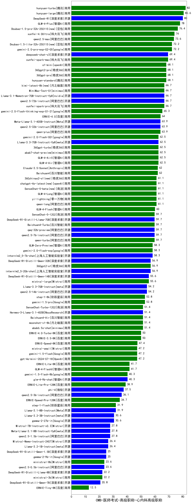

| 类别 | 大模型                         | CMB-医师考试-高级职称-心内科高级职称 | 排名 |
|-----|------------------------------|---------|----|
|商用|hunyuan-turbo|82.0|1|
|商用|hunyuan-large|80.6|2|
|开源|DeepSeek-R1|80.0|3|
|商用|GLM-4-Plus|78.0|4|
|商用|Doubao-1.5-pro-32k-250115(new)|76.4|5|
|商用|xunfei-4.0Ultra|74.0|6|
|商用|qwen2.5-max|73.6|7|
|商用|gemini-2.0-pro-exp-02-05|72.2|8|
|商用|Doubao-1.5-lite-32k-250115(new)|72.2|9|
|开源|deepseek-chat-v3|69.4|10|
|商用|xunfei-spark-max|69.4|11|
|商用|360gpt2-pro|68.1|12|
|商用|hunyuan-standard|68.1|13|
|商用|o1-mini|68.1|14|
|商用|360gpt-pro|68.1|15|
|商用|xunfei-spark-pro|66.7|16|
|商用|MiniMax-Text-01|66.7|17|
|开源|qwen2.5-72b-instruct|66.7|18|
|开源|Llama-3.1-Nemotron-70B-Instruct-fp8|66.7|19|
|商用|kimi-latest-8k(new)|66.7|20|
|商用|gemini-2.0-flash-thinking-exp-01-21|65.3|21|
|商用|ERNIE-4.0|64.0|22|
|开源|qwen2.5-32b-instruct|63.9|23|
|商用|qwen-plus|63.9|24|
|开源|Meta-Llama-3.1-405B-Instruct|63.9|25|
|商用|GLM-4-Air|62.5|26|
|商用|360gpt-turbo|62.5|27|
|商用|abab7-chat-preview|62.5|28|
|开源|Llama-3.3-70B-Instruct-fp8|62.5|29|
|商用|gemini-2.0-flash-001|62.5|30|
|商用|GLM-4-AirX|62.5|31|
|商用|Claude-3.5-Sonnet|62.0|32|
|商用|Baichuan4|62.0|33|
|商用|qwen-long|61.1|34|
|商用|SenseChat-5-beta(new)|61.1|35|
|商用|GLM-4-Long|61.1|36|
|商用|360zhinao2-o1(new)|61.1|37|
|商用|chatgpt-4o-latest(new)|61.1|38|
|商用|yi-lightning|61.1|39|
|商用|GLM-4-Flash|60.0|40|
|开源|qwen2.5-7b-instruct|59.7|41|
|商用|qwen-turbo|59.7|42|
|商用|Baichuan4-Turbo|59.7|43|
|商用|SenseChat-5-1202|59.7|44|
|开源|qwq-32b-preview|59.7|45|
|开源|DeepSeek-R1-Distill-Llama-70B|59.7|46|
|商用|GLM-Zero-Preview|58.3|47|
|商用|gemini-2.0-flash-exp|58.3|48|
|开源|internlm2_5-7b-chat|58.3|49|
|商用|360gpt2-o1|56.9|50|
|开源|DeepSeek-R1-Distill-Qwen-32B|56.9|51|
|开源|internlm2_5-20b-chat|56.9|52|
|开源|DeepSeek-R1-Distill-Qwen-14B|55.6|53|
|商用|mistral-large|55.6|54|
|开源|qwen2.5-14b-instruct|54.2|55|
|开源|Llama-3.3-70B-Instruct|54.2|56|
|商用|step-1-8k|52.8|57|
|商用|gemini-1.5-pro|52.8|58|
|商用|Baichuan4-Air|51.4|59|
|商用|SenseChat-Turbo-1202|51.4|60|
|商用|moonshot-v1-8k|51.4|61|
|开源|Hermes-3-Llama-3.1-405B|51.4|62|
|商用|abab6.5s-chat|51.4|63|
|商用|ERNIE-3.5-8K|50.0|64|
|商用|ERNIE-4.0-Turbo-8K|50.0|65|
|商用|ERNIE-Speed-8K|47.4|66|
|商用|gpt-4o-mini-2024-07-18|47.2|67|
|商用|gemini-1.5-flash|47.2|68|
|商用|mistral-small|47.2|69|
|商用|GLM-4-FlashX|41.7|70|
|商用|ERNIE-Lite-8K|41.7|71|
|商用|gemini-1.5-flash-8b|40.3|72|
|开源|glm-4-9b-chat|40.3|73|
|商用|ERNIE-Lite-Pro-128K|38.9|74|
|开源|phi-4|37.5|75|
|开源|qwen2.5-3b-instruct|36.1|76|
|商用|ERNIE-Speed-Pro-128K|34.7|77|
|商用|step-1-flash|31.9|78|
|开源|Llama-3.1-8B-Instruct|31.9|79|
|开源|gemma-2-27b-it|30.6|80|
|开源|Llama-3.2-3B-Instruct|30.6|81|
|开源|qwen2.5-1.5b-instruct|27.8|82|
|开源|Mistral-7B-Instruct-v0.3|27.8|83|
|开源|Meta-Llama-3.1-8B-Instruct-fp8|27.8|84|
|开源|Llama-3.2-1B-Instruct|26.4|85|
|开源|Mistral-Nemo-Instruct-2407|26.4|86|
|开源|DeepSeek-R1-Distill-Qwen-1.5B|25.0|87|
|开源|gemma-2-9b-it|25.0|88|
|开源|qwen2.5-0.5b-instruct|23.6|89|
|商用|ministral-8b|23.6|90|
|开源|DeepSeek-R1-Distill-Llama-8B|22.2|91|
|商用|ministral-3b|22.2|92|
|开源|DeepSeek-R1-Distill-Qwen-7B|20.8|93|
|商用|ERNIE-Tiny-8K|12.5|94|
|开源|Yi-1.5-9B-Chat|/|95|
|开源|Yi-1.5-34B-Chat|/|96|
|开源|qwen2.5-math-72b-instruct|/|97|
|商用|o3-mini|/|98|

