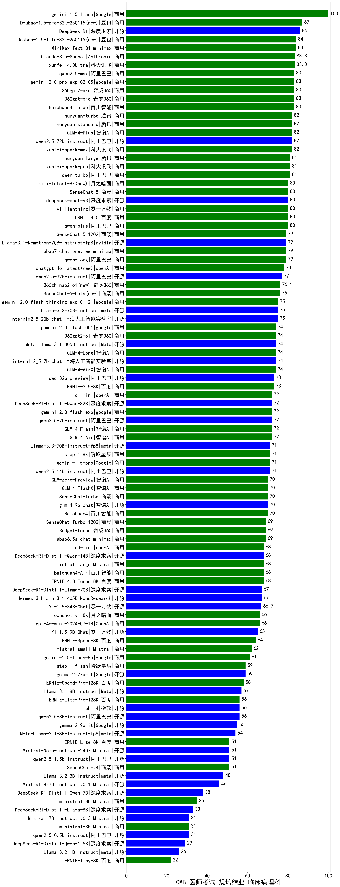

| 类别 | 大模型                         | CMB-医师考试-规培结业-临床病理科 | 排名 |
|-----|------------------------------|---------|----|
|商用|gemini-1.5-flash|100.0|1|
|商用|Doubao-1.5-pro-32k-250115(new)|87.0|2|
|开源|DeepSeek-R1|86.0|3|
|商用|Doubao-1.5-lite-32k-250115(new)|84.0|4|
|商用|MiniMax-Text-01|84.0|5|
|商用|xunfei-4.0Ultra|83.3|6|
|商用|Claude-3.5-Sonnet|83.3|7|
|商用|360gpt-pro|83.0|8|
|商用|Baichuan4-Turbo|83.0|9|
|商用|360gpt2-pro|83.0|10|
|商用|qwen2.5-max|83.0|11|
|商用|gemini-2.0-pro-exp-02-05|83.0|12|
|商用|hunyuan-turbo|82.0|13|
|商用|hunyuan-standard|82.0|14|
|商用|xunfei-spark-max|82.0|15|
|开源|qwen2.5-72b-instruct|82.0|16|
|商用|GLM-4-Plus|82.0|17|
|商用|hunyuan-large|81.0|18|
|商用|xunfei-spark-pro|81.0|19|
|商用|qwen-turbo|81.0|20|
|商用|ERNIE-4.0|80.0|21|
|商用|yi-lightning|80.0|22|
|开源|deepseek-chat-v3|80.0|23|
|商用|SenseChat-5|80.0|24|
|商用|kimi-latest-8k(new)|80.0|25|
|商用|qwen-plus|80.0|26|
|商用|qwen-long|79.0|27|
|商用|abab7-chat-preview|79.0|28|
|开源|Llama-3.1-Nemotron-70B-Instruct-fp8|79.0|29|
|商用|SenseChat-5-1202|79.0|30|
|商用|chatgpt-4o-latest(new)|78.0|31|
|开源|qwen2.5-32b-instruct|77.0|32|
|商用|360zhinao2-o1(new)|76.1|33|
|商用|SenseChat-5-beta(new)|76.0|34|
|开源|Llama-3.3-70B-Instruct|75.0|35|
|商用|gemini-2.0-flash-thinking-exp-01-21|75.0|36|
|开源|internlm2_5-20b-chat|75.0|37|
|商用|GLM-4-Long|74.0|38|
|开源|Meta-Llama-3.1-405B-Instruct|74.0|39|
|商用|360gpt2-o1|74.0|40|
|商用|gemini-2.0-flash-001|74.0|41|
|商用|GLM-4-AirX|74.0|42|
|开源|internlm2_5-7b-chat|74.0|43|
|商用|ERNIE-3.5-8K|73.0|44|
|开源|qwq-32b-preview|73.0|45|
|开源|qwen2.5-7b-instruct|72.0|46|
|商用|o1-mini|72.0|47|
|开源|DeepSeek-R1-Distill-Qwen-32B|72.0|48|
|商用|GLM-4-Flash|72.0|49|
|商用|GLM-4-Air|72.0|50|
|商用|gemini-2.0-flash-exp|72.0|51|
|商用|gemini-1.5-pro|71.0|52|
|商用|step-1-8k|71.0|53|
|开源|Llama-3.3-70B-Instruct-fp8|71.0|54|
|开源|qwen2.5-14b-instruct|71.0|55|
|商用|GLM-Zero-Preview|70.0|56|
|商用|GLM-4-FlashX|70.0|57|
|商用|Baichuan4|70.0|58|
|商用|SenseChat-Turbo|70.0|59|
|开源|glm-4-9b-chat|70.0|60|
|商用|360gpt-turbo|69.0|61|
|商用|SenseChat-Turbo-1202|69.0|62|
|商用|abab6.5s-chat|69.0|63|
|商用|o3-mini|68.0|64|
|开源|DeepSeek-R1-Distill-Qwen-14B|68.0|65|
|商用|ERNIE-4.0-Turbo-8K|68.0|66|
|商用|Baichuan4-Air|68.0|67|
|商用|mistral-large|68.0|68|
|开源|Hermes-3-Llama-3.1-405B|67.0|69|
|开源|DeepSeek-R1-Distill-Llama-70B|67.0|70|
|开源|Yi-1.5-34B-Chat|66.7|71|
|商用|gpt-4o-mini-2024-07-18|66.0|72|
|商用|moonshot-v1-8k|66.0|73|
|开源|Yi-1.5-9B-Chat|65.0|74|
|商用|ERNIE-Speed-8K|64.0|75|
|商用|mistral-small|62.0|76|
|商用|gemini-1.5-flash-8b|61.0|77|
|开源|gemma-2-27b-it|59.0|78|
|商用|step-1-flash|59.0|79|
|商用|ERNIE-Speed-Pro-128K|58.0|80|
|开源|Llama-3.1-8B-Instruct|57.0|81|
|商用|ERNIE-Lite-Pro-128K|56.0|82|
|开源|qwen2.5-3b-instruct|56.0|83|
|开源|phi-4|56.0|84|
|开源|gemma-2-9b-it|55.0|85|
|开源|Meta-Llama-3.1-8B-Instruct-fp8|54.0|86|
|开源|Mistral-Nemo-Instruct-2407|51.0|87|
|开源|qwen2.5-1.5b-instruct|51.0|88|
|商用|SenseChat-v4|51.0|89|
|商用|ERNIE-Lite-8K|51.0|90|
|开源|Llama-3.2-3B-Instruct|48.0|91|
|开源|Mixtral-8x7B-Instruct-v0.1|46.0|92|
|开源|DeepSeek-R1-Distill-Qwen-7B|38.0|93|
|商用|ministral-8b|35.0|94|
|开源|DeepSeek-R1-Distill-Llama-8B|33.0|95|
|开源|qwen2.5-0.5b-instruct|31.0|96|
|开源|Mistral-7B-Instruct-v0.3|31.0|97|
|商用|ministral-3b|31.0|98|
|开源|DeepSeek-R1-Distill-Qwen-1.5B|29.0|99|
|开源|Llama-3.2-1B-Instruct|26.0|100|
|商用|ERNIE-Tiny-8K|22.0|101|
|开源|qwen2.5-math-72b-instruct|/|102|

