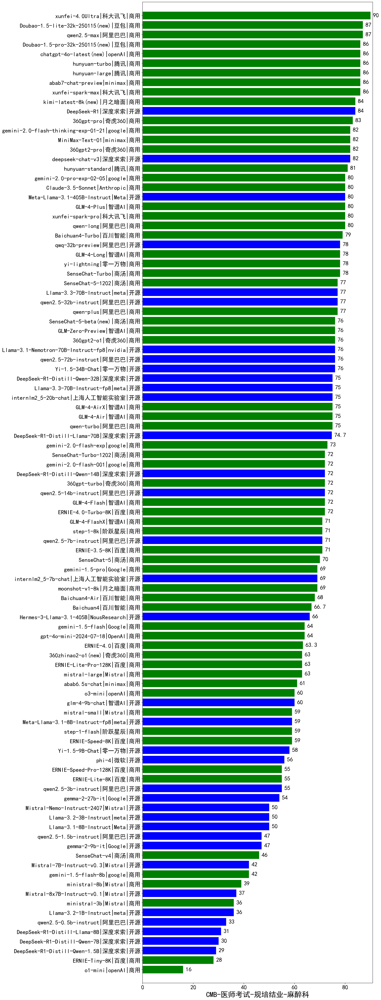

| 类别 | 大模型                         | CMB-医师考试-规培结业-麻醉科 | 排名 |
|-----|------------------------------|---------|----|
|商用|xunfei-4.0Ultra|90.0|1|
|商用|Doubao-1.5-lite-32k-250115(new)|87.0|2|
|商用|qwen2.5-max|87.0|3|
|商用|hunyuan-turbo|86.0|4|
|商用|hunyuan-large|86.0|5|
|商用|Doubao-1.5-pro-32k-250115(new)|86.0|6|
|商用|chatgpt-4o-latest(new)|86.0|7|
|商用|abab7-chat-preview|86.0|8|
|商用|xunfei-spark-max|86.0|9|
|开源|DeepSeek-R1|84.0|10|
|商用|kimi-latest-8k(new)|84.0|11|
|商用|360gpt-pro|83.0|12|
|商用|MiniMax-Text-01|82.0|13|
|商用|gemini-2.0-flash-thinking-exp-01-21|82.0|14|
|开源|deepseek-chat-v3|82.0|15|
|商用|360gpt2-pro|82.0|16|
|商用|hunyuan-standard|81.0|17|
|商用|qwen-long|80.0|18|
|商用|GLM-4-Plus|80.0|19|
|商用|xunfei-spark-pro|80.0|20|
|商用|Claude-3.5-Sonnet|80.0|21|
|开源|Meta-Llama-3.1-405B-Instruct|80.0|22|
|商用|gemini-2.0-pro-exp-02-05|80.0|23|
|商用|Baichuan4-Turbo|79.0|24|
|商用|yi-lightning|78.0|25|
|开源|qwq-32b-preview|78.0|26|
|商用|GLM-4-Long|78.0|27|
|商用|SenseChat-5-1202|77.0|28|
|开源|Llama-3.3-70B-Instruct|77.0|29|
|商用|qwen-plus|77.0|30|
|开源|qwen2.5-32b-instruct|77.0|31|
|开源|Yi-1.5-34B-Chat|76.0|32|
|开源|qwen2.5-72b-instruct|76.0|33|
|商用|SenseChat-5-beta(new)|76.0|34|
|开源|Llama-3.1-Nemotron-70B-Instruct-fp8|76.0|35|
|商用|360gpt2-o1|76.0|36|
|商用|GLM-Zero-Preview|76.0|37|
|商用|GLM-4-AirX|75.0|38|
|开源|DeepSeek-R1-Distill-Qwen-32B|75.0|39|
|商用|GLM-4-Air|75.0|40|
|开源|internlm2_5-20b-chat|75.0|41|
|商用|qwen-turbo|75.0|42|
|开源|Llama-3.3-70B-Instruct-fp8|75.0|43|
|开源|DeepSeek-R1-Distill-Llama-70B|74.7|44|
|商用|gemini-2.0-flash-exp|73.0|45|
|商用|SenseChat-Turbo-1202|72.0|46|
|商用|ERNIE-4.0-Turbo-8K|72.0|47|
|商用|gemini-2.0-flash-001|72.0|48|
|商用|360gpt-turbo|72.0|49|
|开源|DeepSeek-R1-Distill-Qwen-14B|72.0|50|
|开源|qwen2.5-14b-instruct|72.0|51|
|商用|GLM-4-Flash|72.0|52|
|开源|qwen2.5-7b-instruct|71.0|53|
|商用|ERNIE-3.5-8K|71.0|54|
|商用|GLM-4-FlashX|71.0|55|
|商用|step-1-8k|71.0|56|
|开源|internlm2_5-7b-chat|69.0|57|
|商用|moonshot-v1-8k|69.0|58|
|商用|gemini-1.5-pro|69.0|59|
|商用|Baichuan4-Air|68.0|60|
|商用|Baichuan4|66.7|61|
|开源|Hermes-3-Llama-3.1-405B|66.0|62|
|商用|gpt-4o-mini-2024-07-18|64.0|63|
|商用|gemini-1.5-flash|64.0|64|
|商用|ERNIE-4.0|63.3|65|
|商用|360zhinao2-o1(new)|63.0|66|
|商用|mistral-large|63.0|67|
|商用|ERNIE-Lite-Pro-128K|63.0|68|
|商用|abab6.5s-chat|61.0|69|
|商用|o3-mini|60.0|70|
|开源|glm-4-9b-chat|60.0|71|
|商用|mistral-small|59.0|72|
|商用|ERNIE-Speed-8K|59.0|73|
|开源|Meta-Llama-3.1-8B-Instruct-fp8|59.0|74|
|商用|step-1-flash|59.0|75|
|开源|Yi-1.5-9B-Chat|58.0|76|
|开源|phi-4|56.0|77|
|商用|ERNIE-Speed-Pro-128K|55.0|78|
|开源|qwen2.5-3b-instruct|55.0|79|
|商用|ERNIE-Lite-8K|55.0|80|
|开源|gemma-2-27b-it|54.0|81|
|开源|Llama-3.1-8B-Instruct|50.0|82|
|开源|Llama-3.2-3B-Instruct|50.0|83|
|开源|Mistral-Nemo-Instruct-2407|50.0|84|
|开源|gemma-2-9b-it|47.0|85|
|开源|qwen2.5-1.5b-instruct|47.0|86|
|商用|gemini-1.5-flash-8b|42.0|87|
|开源|Mistral-7B-Instruct-v0.3|42.0|88|
|商用|ministral-8b|39.0|89|
|开源|Llama-3.2-1B-Instruct|36.0|90|
|商用|ministral-3b|36.0|91|
|开源|qwen2.5-0.5b-instruct|33.0|92|
|开源|DeepSeek-R1-Distill-Llama-8B|31.0|93|
|开源|DeepSeek-R1-Distill-Qwen-7B|30.0|94|
|开源|DeepSeek-R1-Distill-Qwen-1.5B|29.0|95|
|商用|ERNIE-Tiny-8K|28.0|96|
|商用|o1-mini|16.0|97|
|开源|qwen2.5-math-72b-instruct|/|98|

