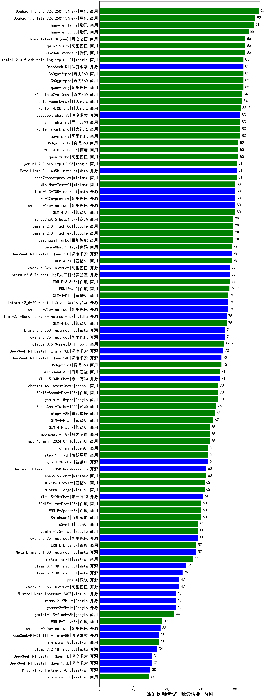

| 类别 | 大模型                         | CMB-医师考试-规培结业-内科 | 排名 |
|-----|------------------------------|---------|----|
|商用|Doubao-1.5-pro-32k-250115(new)|94.0|1|
|商用|Doubao-1.5-lite-32k-250115(new)|92.0|2|
|商用|hunyuan-large|91.0|3|
|商用|hunyuan-turbo|88.0|4|
|商用|qwen2.5-max|86.0|5|
|商用|kimi-latest-8k(new)|86.0|6|
|商用|hunyuan-standard|86.0|7|
|商用|360gpt2-pro|85.0|8|
|开源|DeepSeek-R1|85.0|9|
|商用|360gpt-pro|85.0|10|
|商用|qwen-long|85.0|11|
|商用|gemini-2.0-flash-thinking-exp-01-21|85.0|12|
|商用|360zhinao2-o1(new)|84.1|13|
|商用|xunfei-spark-max|84.0|14|
|商用|xunfei-4.0Ultra|83.3|15|
|商用|yi-lightning|83.0|16|
|商用|xunfei-spark-pro|83.0|17|
|商用|qwen-plus|83.0|18|
|开源|deepseek-chat-v3|83.0|19|
|商用|qwen-turbo|82.0|20|
|商用|360gpt-turbo|82.0|21|
|商用|ERNIE-4.0-Turbo-8K|82.0|22|
|商用|abab7-chat-preview|81.0|23|
|开源|Meta-Llama-3.1-405B-Instruct|81.0|24|
|商用|gemini-2.0-pro-exp-02-05|81.0|25|
|商用|GLM-4-AirX|80.0|26|
|商用|MiniMax-Text-01|80.0|27|
|开源|qwq-32b-preview|80.0|28|
|开源|Llama-3.3-70B-Instruct|80.0|29|
|开源|qwen2.5-14b-instruct|80.0|30|
|商用|Baichuan4-Turbo|79.0|31|
|商用|SenseChat-5-beta(new)|79.0|32|
|商用|gemini-2.0-flash-001|79.0|33|
|商用|gemini-2.0-flash-exp|79.0|34|
|开源|DeepSeek-R1-Distill-Qwen-32B|78.0|35|
|商用|SenseChat-5-1202|78.0|36|
|商用|GLM-4-Air|78.0|37|
|开源|qwen2.5-32b-instruct|77.0|38|
|商用|ERNIE-3.5-8K|77.0|39|
|开源|internlm2_5-7b-chat|77.0|40|
|商用|ERNIE-4.0|76.7|41|
|开源|qwen2.5-72b-instruct|76.0|42|
|商用|GLM-4-Plus|76.0|43|
|开源|internlm2_5-20b-chat|76.0|44|
|开源|Llama-3.1-Nemotron-70B-Instruct-fp8|75.0|45|
|商用|GLM-4-Long|75.0|46|
|开源|qwen2.5-7b-instruct|74.0|47|
|开源|Llama-3.3-70B-Instruct-fp8|74.0|48|
|商用|Claude-3.5-Sonnet|73.3|49|
|开源|DeepSeek-R1-Distill-Llama-70B|73.0|50|
|开源|DeepSeek-R1-Distill-Qwen-14B|72.0|51|
|商用|360gpt2-o1|72.0|52|
|商用|Baichuan4-Air|71.0|53|
|开源|Yi-1.5-34B-Chat|71.0|54|
|商用|ERNIE-Speed-Pro-128K|70.0|55|
|商用|chatgpt-4o-latest(new)|70.0|56|
|商用|gemini-1.5-pro|70.0|57|
|商用|SenseChat-Turbo-1202|69.0|58|
|商用|step-1-8k|68.0|59|
|商用|GLM-4-Flash|67.0|60|
|商用|gpt-4o-mini-2024-07-18|65.0|61|
|商用|moonshot-v1-8k|65.0|62|
|商用|GLM-4-FlashX|65.0|63|
|商用|o1-mini|64.0|64|
|开源|glm-4-9b-chat|64.0|65|
|商用|step-1-flash|64.0|66|
|开源|Hermes-3-Llama-3.1-405B|63.0|67|
|商用|abab6.5s-chat|63.0|68|
|商用|mistral-large|62.0|69|
|商用|GLM-Zero-Preview|62.0|70|
|开源|Yi-1.5-9B-Chat|61.0|71|
|商用|ERNIE-Lite-Pro-128K|60.0|72|
|商用|ERNIE-Speed-8K|60.0|73|
|商用|Baichuan4|60.0|74|
|商用|gemini-1.5-flash|58.0|75|
|开源|qwen2.5-3b-instruct|58.0|76|
|商用|o3-mini|58.0|77|
|开源|Meta-Llama-3.1-8B-Instruct-fp8|57.0|78|
|商用|ERNIE-Lite-8K|57.0|79|
|商用|mistral-small|55.0|80|
|开源|Llama-3.1-8B-Instruct|51.0|81|
|开源|Llama-3.2-3B-Instruct|49.0|82|
|开源|qwen2.5-1.5b-instruct|47.0|83|
|开源|phi-4|47.0|84|
|开源|gemma-2-27b-it|45.0|85|
|开源|gemma-2-9b-it|45.0|86|
|开源|Mistral-Nemo-Instruct-2407|45.0|87|
|商用|gemini-1.5-flash-8b|44.0|88|
|商用|ERNIE-Tiny-8K|37.0|89|
|开源|qwen2.5-0.5b-instruct|36.0|90|
|商用|ministral-8b|35.0|91|
|开源|DeepSeek-R1-Distill-Llama-8B|35.0|92|
|开源|Llama-3.2-1B-Instruct|34.0|93|
|开源|DeepSeek-R1-Distill-Qwen-7B|31.0|94|
|开源|DeepSeek-R1-Distill-Qwen-1.5B|31.0|95|
|开源|Mistral-7B-Instruct-v0.3|30.0|96|
|商用|ministral-3b|29.0|97|
|开源|qwen2.5-math-72b-instruct|/|98|

