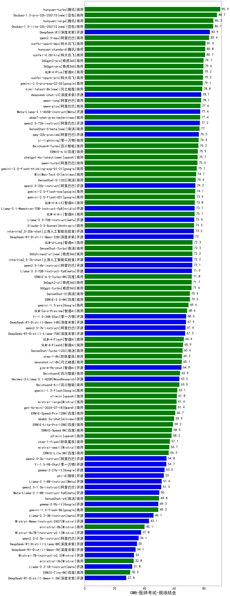

| 类别 | 大模型                         | CMB-医师考试-规培结业 | 排名 |
|-----|------------------------------|---------|----|
|商用|hunyuan-turbo|90.9|1|
|商用|Doubao-1.5-pro-32k-250115(new)|88.7|2|
|商用|hunyuan-large|86.3|3|
|商用|Doubao-1.5-lite-32k-250115(new)|86.1|4|
|开源|DeepSeek-R1|83.9|5|
|商用|qwen2.5-max|83.4|6|
|商用|xunfei-spark-max|81.0|7|
|商用|hunyuan-standard|80.8|8|
|商用|xunfei-4.0Ultra|80.7|9|
|商用|360gpt2-pro|79.7|10|
|商用|360gpt-pro|79.6|11|
|商用|xunfei-spark-pro|79.3|12|
|商用|GLM-4-Plus|79.3|13|
|商用|gemini-2.0-pro-exp-02-05|79.1|14|
|商用|kimi-latest-8k(new)|78.8|15|
|开源|deepseek-chat-v3|78.1|16|
|商用|qwen-long|78.1|17|
|商用|qwen-plus|77.6|18|
|商用|abab7-chat-preview|77.4|19|
|开源|Meta-Llama-3.1-405B-Instruct|77.4|20|
|开源|qwen2.5-72b-instruct|77.2|21|
|商用|SenseChat-5-beta(new)|77.0|22|
|开源|qwq-32b-preview|76.5|23|
|商用|yi-lightning|76.4|24|
|商用|Baichuan4-Turbo|76.2|25|
|商用|ERNIE-4.0|75.9|26|
|商用|chatgpt-4o-latest(new)|75.7|27|
|商用|qwen-turbo|75.6|28|
|商用|gemini-2.0-flash-thinking-exp-01-21|75.1|29|
|商用|MiniMax-Text-01|74.7|30|
|商用|SenseChat-5-1202|74.4|31|
|开源|qwen2.5-32b-instruct|74.2|32|
|商用|gemini-2.0-flash-exp|74.1|33|
|商用|gemini-2.0-flash-001|73.9|34|
|商用|GLM-4-AirX|73.8|35|
|开源|Llama-3.1-Nemotron-70B-Instruct-fp8|73.7|36|
|商用|GLM-4-Air|73.7|37|
|开源|Llama-3.3-70B-Instruct|73.4|38|
|商用|Claude-3.5-Sonnet|73.3|39|
|开源|internlm2_5-20b-chat|73.2|40|
|开源|DeepSeek-R1-Distill-Qwen-32B|73.0|41|
|商用|GLM-4-Long|72.3|42|
|商用|360zhinao2-o1(new)|72.2|43|
|开源|internlm2_5-7b-chat|72.2|44|
|开源|qwen2.5-14b-instruct|72.1|45|
|开源|Llama-3.3-70B-Instruct-fp8|71.9|46|
|商用|ERNIE-4.0-Turbo-8K|71.8|47|
|商用|360gpt2-o1|71.7|48|
|商用|360gpt-turbo|71.6|49|
|商用|ERNIE-3.5-8K|70.5|50|
|商用|gemini-1.5-pro|69.6|51|
|商用|GLM-Zero-Preview|68.6|52|
|开源|Yi-1.5-34B-Chat|68.0|53|
|开源|DeepSeek-R1-Distill-Qwen-14B|67.9|54|
|开源|qwen2.5-7b-instruct|67.6|55|
|开源|DeepSeek-R1-Distill-Llama-70B|67.3|56|
|商用|GLM-4-Flash|66.4|57|
|商用|GLM-4-FlashX|65.9|58|
|商用|SenseChat-Turbo-1202|65.6|59|
|商用|step-1-8k|65.2|60|
|商用|moonshot-v1-8k|65.1|61|
|开源|glm-4-9b-chat|64.9|62|
|商用|Baichuan4|63.9|63|
|开源|Hermes-3-Llama-3.1-405B|63.5|64|
|商用|Baichuan4-Air|63.5|65|
|商用|gemini-1.5-flash|62.1|66|
|商用|o1-mini|61.8|67|
|商用|mistral-large|61.6|68|
|商用|gpt-4o-mini-2024-07-18|61.4|69|
|商用|ERNIE-Speed-Pro-128K|60.7|70|
|商用|abab6.5s-chat|59.9|71|
|商用|ERNIE-Lite-Pro-128K|59.2|72|
|商用|ERNIE-Speed-8K|58.5|73|
|商用|o3-mini|58.2|74|
|商用|step-1-flash|57.1|75|
|商用|mistral-small|56.7|76|
|商用|ERNIE-Lite-8K|56.3|77|
|开源|qwen2.5-3b-instruct|54.8|78|
|开源|Yi-1.5-9B-Chat|54.7|79|
|开源|gemma-2-27b-it|53.5|80|
|开源|phi-4|53.0|81|
|开源|Llama-3.1-8B-Instruct|51.6|82|
|开源|qwen2.5-1.5b-instruct|51.3|83|
|开源|Meta-Llama-3.1-8B-Instruct-fp8|50.0|84|
|开源|gemma-2-9b-it|49.3|85|
|商用|gemini-1.5-flash-8b|49.3|86|
|开源|Llama-3.2-3B-Instruct|46.1|87|
|开源|Mistral-Nemo-Instruct-2407|43.1|88|
|商用|ministral-8b|40.1|89|
|开源|qwen2.5-0.5b-instruct|36.1|90|
|开源|DeepSeek-R1-Distill-Llama-8B|35.0|91|
|开源|DeepSeek-R1-Distill-Qwen-7B|34.1|92|
|开源|Mistral-7B-Instruct-v0.3|33.0|93|
|商用|ministral-3b|32.8|94|
|开源|Llama-3.2-1B-Instruct|31.8|95|
|商用|ERNIE-Tiny-8K|30.5|96|
|开源|DeepSeek-R1-Distill-Qwen-1.5B|27.8|97|
|开源|qwen2.5-math-72b-instruct|/|98|

