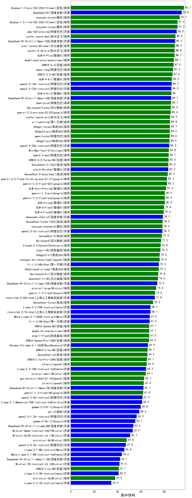

| 类别 | 大模型                         | 高中学科 | 排名 |
|-----|------------------------------|---------|----|
|商用|Doubao-1.5-pro-32k-250115(new)|96.7|1|
|开源|DeepSeek-R1|94.8|2|
|商用|hunyuan-turbo|93.1|3|
|商用|Doubao-1.5-lite-32k-250115(new)|91.2|4|
|商用|hunyuan-large|91.2|5|
|开源|qwq-32b-preview|90.5|6|
|商用|xunfei-spark-max|89.5|7|
|开源|DeepSeek-R1-Distill-Qwen-32B|89.2|8|
|商用|kimi-latest-8k(new)|88.9|9|
|商用|xunfei-4.0Ultra|88.8|10|
|商用|GLM-4-Plus|88.7|11|
|商用|abab7-chat-preview|88.1|12|
|商用|ERNIE-4.0|87.9|13|
|商用|qwen-long|87.4|14|
|商用|ERNIE-3.5-8K|87.0|15|
|商用|GLM-4-Air|86.5|16|
|开源|qwen2.5-14b-instruct|86.2|17|
|开源|qwen2.5-72b-instruct|86.0|18|
|商用|GLM-4-AirX|86.0|19|
|开源|DeepSeek-R1-Distill-Qwen-14B|85.7|20|
|商用|qwen-plus|85.7|21|
|商用|Baichuan4-Turbo|85.5|22|
|商用|gemini-2.0-pro-exp-02-05|85.4|23|
|商用|xunfei-spark-pro|84.9|24|
|商用|yi-lightning|84.8|25|
|商用|360gpt-turbo|84.7|26|
|商用|360gpt2-pro|84.6|27|
|商用|qwen-turbo|84.6|28|
|商用|360gpt-pro|84.4|29|
|开源|qwen2.5-32b-instruct|84.2|30|
|商用|MiniMax-Text-01|83.8|31|
|商用|qwen2.5-max|83.7|32|
|商用|ERNIE-4.0-Turbo-8K|83.6|33|
|商用|SenseChat-5-1202|83.4|34|
|开源|glm-4-9b-chat|83.3|35|
|商用|SenseChat-5-beta(new)|82.9|36|
|商用|gemini-2.0-flash-thinking-exp-01-21|82.2|37|
|商用|gemini-2.0-flash-001|82.2|38|
|商用|GLM-Zero-Preview|81.4|39|
|商用|gemini-1.5-pro|80.4|40|
|商用|gemini-2.0-flash-exp|80.4|41|
|商用|GLM-4-Long|80.4|42|
|商用|GLM-4-Flash|79.8|43|
|商用|GLM-4-FlashX|79.4|44|
|开源|deepseek-chat-v3|78.7|45|
|商用|SenseChat-Turbo-1202|78.5|46|
|商用|hunyuan-standard|78.4|47|
|开源|qwen2.5-7b-instruct|78.3|48|
|商用|Baichuan4|77.2|49|
|商用|Claude-3.5-Sonnet|76.8|50|
|商用|step-1-8k|76.6|51|
|商用|360gpt2-o1|76.0|52|
|商用|chatgpt-4o-latest(new)|76.0|53|
|开源|Yi-1.5-34B-Chat|75.3|54|
|商用|360zhinao2-o1(new)|75.2|55|
|商用|Baichuan4-Air|74.8|56|
|商用|moonshot-v1-8k|74.5|57|
|开源|DeepSeek-R1-Distill-Llama-70B|73.9|58|
|商用|mistral-large|73.0|59|
|商用|gemini-1.5-flash|72.0|60|
|开源|internlm2_5-20b-chat|71.8|61|
|开源|internlm2_5-7b-chat|68.1|62|
|开源|Llama-3.3-70B-Instruct|68.1|63|
|开源|Meta-Llama-3.1-405B-Instruct|67.5|64|
|开源|Yi-1.5-9B-Chat|67.4|65|
|商用|ERNIE-Speed-8K|67.1|66|
|商用|abab6.5s-chat|67.1|67|
|商用|step-1-flash|67.0|68|
|商用|ERNIE-Speed-Pro-128K|66.9|69|
|开源|Hermes-3-Llama-3.1-405B|65.9|70|
|商用|ERNIE-Lite-8K|65.7|71|
|商用|ERNIE-Lite-Pro-128K|65.1|72|
|商用|o3-mini|64.9|73|
|开源|Llama-3.3-70B-Instruct-fp8|64.3|74|
|商用|mistral-small|64.1|75|
|商用|gpt-4o-mini-2024-07-18|62.7|76|
|商用|o1-mini|62.4|77|
|开源|DeepSeek-R1-Distill-Qwen-7B|62.1|78|
|商用|gemini-1.5-flash-8b|61.8|79|
|开源|qwen2.5-3b-instruct|61.3|80|
|开源|Llama-3.1-Nemotron-70B-Instruct-fp8|60.9|81|
|开源|gemma-2-27b-it|59.8|82|
|开源|phi-4|58.5|83|
|开源|qwen2.5-1.5b-instruct|56.3|84|
|开源|gemma-2-9b-it|55.1|85|
|开源|DeepSeek-R1-Distill-Llama-8B|53.4|86|
|开源|Mistral-Nemo-Instruct-2407|52.9|87|
|商用|ministral-8b|47.8|88|
|开源|qwen2.5-0.5b-instruct|47.0|89|
|开源|Llama-3.1-8B-Instruct|45.8|90|
|开源|Meta-Llama-3.1-8B-Instruct-fp8|43.6|91|
|开源|DeepSeek-R1-Distill-Qwen-1.5B|42.1|92|
|开源|Mistral-7B-Instruct-v0.3|41.6|93|
|商用|ERNIE-Tiny-8K|41.1|94|
|开源|Llama-3.2-3B-Instruct|40.9|95|
|商用|ministral-3b|37.9|96|
|开源|Llama-3.2-1B-Instruct|34.6|97|
|开源|qwen2.5-math-72b-instruct|/|98|

